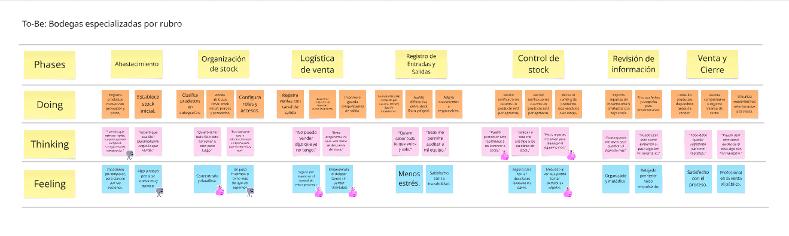
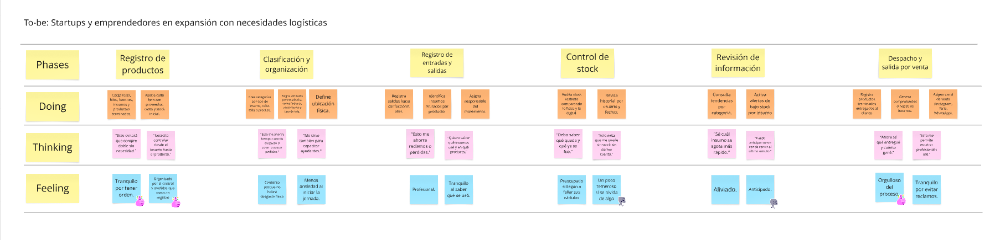

# 
COURSE PROJECT

    <strong>Universidad Peruana de Ciencias Aplicadas</strong> 
    </img> 
    <strong>Ingeniería de Software - 2025-1</strong> 
    <strong>Aplicaciones Web - 4366</strong> 
    <strong>Profesor: Alex Humberto Sánchez Ponce</strong> 
     <strong>Informe del Trabajo Final</strong>

    <strong>Startup: AyniTech</strong> 
    <strong>Producto:  </strong>

    <h3>Team Members:</h3>
    <table align="center">
        <tr>
            <th style="text-align:center;">Member</th>
            <th style="text-align:center;">Code</th>
        </tr>
        <tr>
            <td>Jocelyn Damaly Almerco Rojas</td>
            <td>U20221g068</td>
        </tr>
        <tr>
            <td>Sanchez Rios, Camila Cristina</td>
            <td>U202210973</td>
        </tr>
        <tr>
            <td>Henry Kalet Esteban Roman</td>
            <td>U202310210</td>
        </tr>
        <tr>
            <td>Maria Fernanda Peña Riofrio</td>
            <td>U202113279</td>
        </tr>
        <tr>
            <td>Fabiola Del Rocio Saldaña Ayala</td>
            <td>U202313773</td>
        </tr>
    </table>

    <strong>Abril, 2025</strong>

 

<h1 align="center">Registro de versiones del Informe</h1>
 
<table>
        <thead>
            <tr>
                <th>Versión</th>
                <th>Fecha</th>
                <th>Autor</th>
                <th>Descripción de modificaciones</th>
            </tr>
        </thead>
        <tbody>
            <tr>
                <th>TB1</th>
                <td>07/04/2025</td>
                <td>
                    <ul>
          <li>..</li>
          <li>Camila Sanchez</li>
          <li>..</li>
          <li>..</li>
                    <ul>
           </td>
      <td>            
             <ul>
          <li>Capítulo I: Introducción</li>
          <li>Capítulo II: Requirements Elicitation & Analysis</li>
          <li>Capítulo III: Requirements Specification</li>
          <li>Capítulo IV: Product Design</li>
          <li>Avance del Capítulo V: Product Implementation, Validation & Deployment hasta el punto 5.2.1.8</li>
          <li>Avance de Conclusiones, Bibliografía y Anexos</li>
        </ul>
      </td>
  </tr>
</tbody>
</table>

# Project Report Collaboration Insights
[Link de repositorio del reporte:](https://github.com/upc-pre-202510-1asi0730-4366-AyniTech/Report): https://github.com/upc-pre-202510-1asi0730-4366-AyniTech/Report

# Contenido
[Student Outcome](#student-outcome)

[Capítulo I: Introducción](#capítulo-i-introducción)
- [1.1. Startup Profile](#11-startup-profile)
  - [1.1.1. Descripción de la Startup](#111-descripción-de-la-startup)
  - [1.1.2. Perfiles de integrantes del equipo](#112-perfiles-de-integrantes-del-equipo)
- [1.2. Solution Profile](#12-solution-profile)
  - [1.2.1 Antecedentes y problemática](#121-antecedentes-y-problemática)
  - [1.2.2 Lean UX Process](#122-lean-ux-process)
    - [1.2.2.1. Lean UX Problem Statements](#1221-lean-ux-problem-statements)
    - [1.2.2.2. Lean UX Assumptions](#1222-lean-ux-assumptions)
    - [1.2.2.3. Lean UX Hypothesis Statements](#1223-lean-ux-hypothesis-statements)
    - [1.2.2.4. Lean UX Canvas](#1224-lean-ux-canvas)
- [1.3. Segmentos objetivo](#13-segmentos-objetivo)

[Capítulo II: Requirements Elicitation & Analysis](#capítulo-ii-requirements-elicitation--analysis)
- [COURSE PROJECT](#course-project)
- [Project Report Collaboration Insights](#project-report-collaboration-insights)
- [Contenido](#contenido)
- [Student Outcome](#student-outcome)
- [Capítulo I: Introducción](#capítulo-i-introducción)
  - [1.1. Startup Profile](#11-startup-profile)
    - [1.1.1. Descripción de la Startup](#111-descripción-de-la-startup)
    - [1.1.2. Perfiles de integrantes del equipo](#112-perfiles-de-integrantes-del-equipo)
  - [1.2. Solution Profile](#12-solution-profile)
    - [1.2.1 Antecedentes y problemática](#121-antecedentes-y-problemática)
    - [1.2.2 Lean UX Process](#122-lean-ux-process)
      - [1.2.2.1. Lean UX Problem Statements](#1221-lean-ux-problem-statements)
      - [1.2.2.2. Lean UX Assumptions](#1222-lean-ux-assumptions)
      - [1.2.2.3. Lean UX Hypothesis Statements](#1223-lean-ux-hypothesis-statements)
      - [1.2.2.4. Lean UX Canvas](#1224-lean-ux-canvas)
  - [1.3. Segmentos objetivo](#13-segmentos-objetivo)
- [Capítulo II: Requirements Elicitation \& Analysis](#capítulo-ii-requirements-elicitation--analysis)
  - [2.1. Competidores](#21-competidores)
    - [2.1.1. Análisis competitivo](#211-análisis-competitivo)
    - [2.1.2. Estrategias y tácticas frente a competidores](#212-estrategias-y-tácticas-frente-a-competidores)
  - [2.2. Entrevistas](#22-entrevistas)
    - [2.2.1. Diseño de entrevistas](#221-diseño-de-entrevistas)
    - [2.2.2. Registro de entrevistas](#222-registro-de-entrevistas)
    - [2.2.3. Análisis de entrevistas](#223-análisis-de-entrevistas)
  - [2.3. Needfinding](#23-needfinding)
    - [2.3.1. User Personas](#231-user-personas)
    - [2.3.2. User Task Matrix](#232-user-task-matrix)
    - [2.3.3. User Journey Mapping](#233-user-journey-mapping)
    - [2.3.4. Empathy Mapping](#234-empathy-mapping)
    - [2.3.5. As-is Scenario Mapping](#235-as-is-scenario-mapping)
  - [2.4. Ubiquitous Language](#24-ubiquitous-language)
- [Capítulo III: Requirements Specification](#capítulo-iii-requirements-specification)
  - [3.1. To-Be Scenario Mapping](#31-to-be-scenario-mapping)
  - [3.2. User Stories](#32-user-stories)
    - [Technical Stories](#technical-stories)
  - [3.3. Impact Mapping](#33-impact-mapping)
    - [Segmento Objetivo 1: Bodegas especializadas por rubro](#segmento-objetivo-1-bodegas-especializadas-por-rubro)
    - [Segmento Objetivo 2: Startups y emprendedores en expansión con necesidades logísticas](#segmento-objetivo-2-startups-y-emprendedores-en-expansión-con-necesidades-logísticas)
  - [3.4. Product Backlog](#34-product-backlog)
- [Capítulo IV: Product Design](#capítulo-iv-product-design)
  - [4.1. Style Guidelines](#41-style-guidelines)
    - [4.1.1. General Style Guidelines](#411-general-style-guidelines)
    - [4.1.2. Web Style Guidelines](#412-web-style-guidelines)
  - [4.2. Information Architecture](#42-information-architecture)
    - [4.2.1. Organization Systems.](#421-organization-systems)
    - [4.2.2. Labeling Systems.](#422-labeling-systems)
    - [4.2.3. SEO Tags and Meta Tags](#423-seo-tags-and-meta-tags)
    - [4.2.4. Searching Systems.](#424-searching-systems)
    - [4.2.5. Navigation Systems.](#425-navigation-systems)
  - [4.3. Landing Page UI Design.](#43-landing-page-ui-design)
    - [4.3.1. Landing Page Wireframe.](#431-landing-page-wireframe)
    - [4.3.2. Landing Page Mock-up.](#432-landing-page-mock-up)
  - [4.4. Web Applications UX/UI Design.](#44-web-applications-uxui-design)
    - [4.4.1. Web Applications Wireframes.](#441-web-applications-wireframes)
    - [4.4.2. Web Applications Wireflow Diagrams.](#442-web-applications-wireflow-diagrams)
    - [4.4.2. Web Applications Mock-ups.](#442-web-applications-mock-ups)
    - [4.4.3. Web Applications User Flow Diagrams.](#443-web-applications-user-flow-diagrams)
  - [4.5. Web Applications Prototyping.](#45-web-applications-prototyping)
  - [4.6. Domain-Driven Software Architecture.](#46-domain-driven-software-architecture)
    - [4.6.1. Software Architecture Context Diagram.](#461-software-architecture-context-diagram)
    - [4.6.2. Software Architecture Container Diagrams.](#462-software-architecture-container-diagrams)
    - [4.6.3. Software Architecture Components Diagrams.](#463-software-architecture-components-diagrams)
  - [4.7. Software Object-Oriented Design.](#47-software-object-oriented-design)
    - [4.7.1. Class Diagrams.](#471-class-diagrams)
    - [4.7.2. Class Dictionary.](#472-class-dictionary)
  - [4.8. Database Design.](#48-database-design)
    - [4.8.1. Database Diagram.](#481-database-diagram)
- [Capítulo V: Product Implementation, Validation \& Deployment](#capítulo-v-product-implementation-validation--deployment)
  - [5.1. Software Configuration Management.](#51-software-configuration-management)
    - [5.1.1. Software Development Environment Configuration.](#511-software-development-environment-configuration)
    - [5.1.2. Source Code Management.](#512-source-code-management)
    - [5.1.3. Source Code Style Guide \& Conventions.](#513-source-code-style-guide--conventions)
    - [5.1.4. Software Deployment Configuration.](#514-software-deployment-configuration)
  - [5.2. Landing Page, Services \& Applications Implementation](#52-landing-page-services--applications-implementation)
    - [5.2.1. Sprint 1](#521-sprint-1)
      - [5.2.1.1. Sprint Planning 1](#5211-sprint-planning-1)
      - [5.2.1.2. Aspect Leaders and Collaborators.](#5212-aspect-leaders-and-collaborators)
      - [5.2.1.3. Sprint Backlog n.](#5213-sprint-backlog-n)
      - [5.2.1.4. Development Evidence for Sprint Review.](#5214-development-evidence-for-sprint-review)
      - [5.2.1.5. Execution Evidence for Sprint Review.](#5215-execution-evidence-for-sprint-review)
      - [5.2.1.6. Services Documentation Evidence for Sprint Review.](#5216-services-documentation-evidence-for-sprint-review)
      - [5.2.1.7. Software Deployment Evidence for Sprint Review.](#5217-software-deployment-evidence-for-sprint-review)
      - [5.2.1.8. Team Collaboration Insights during Sprint.](#5218-team-collaboration-insights-during-sprint)
  - [5.3. Validation Interviews.](#53-validation-interviews)
    - [5.3.1. Diseño de Entrevistas.](#531-diseño-de-entrevistas)
    - [5.3.2. Registro de Entrevistas.](#532-registro-de-entrevistas)
    - [5.3.3. Evaluaciones según heurísticas.](#533-evaluaciones-según-heurísticas)
  - [5.4. Video About-the-Product.](#54-video-about-the-product)
- [Conclusiones](#conclusiones)
  - [Conclusiones y recomendaciones.](#conclusiones-y-recomendaciones)
- [Video About-the-Team.](#video-about-the-team)
- [Bibliografía](#bibliografía)
- [Anexos](#anexos)

[Capítulo III: Requirements Specification](#capítulo-iii-requirements-specification)
- [3.1. To-Be Scenario Mapping](#31-to-be-scenario-mapping)
- [3.2. User Stories](#32-user-stories)
- [3.3. Impact Mapping](#33-impact-mapping)
- [3.4. Product Backlog](#34-product-backlog)

[Capítulo IV: Product Design](#capítulo-iv-product-design)
- [COURSE PROJECT](#course-project)
- [Project Report Collaboration Insights](#project-report-collaboration-insights)
- [Contenido](#contenido)
- [Student Outcome](#student-outcome)
- [Capítulo I: Introducción](#capítulo-i-introducción)
  - [1.1. Startup Profile](#11-startup-profile)
    - [1.1.1. Descripción de la Startup](#111-descripción-de-la-startup)
    - [1.1.2. Perfiles de integrantes del equipo](#112-perfiles-de-integrantes-del-equipo)
  - [1.2. Solution Profile](#12-solution-profile)
    - [1.2.1 Antecedentes y problemática](#121-antecedentes-y-problemática)
    - [1.2.2 Lean UX Process](#122-lean-ux-process)
      - [1.2.2.1. Lean UX Problem Statements](#1221-lean-ux-problem-statements)
      - [1.2.2.2. Lean UX Assumptions](#1222-lean-ux-assumptions)
      - [1.2.2.3. Lean UX Hypothesis Statements](#1223-lean-ux-hypothesis-statements)
      - [1.2.2.4. Lean UX Canvas](#1224-lean-ux-canvas)
  - [1.3. Segmentos objetivo](#13-segmentos-objetivo)
- [Capítulo II: Requirements Elicitation \& Analysis](#capítulo-ii-requirements-elicitation--analysis)
  - [2.1. Competidores](#21-competidores)
    - [2.1.1. Análisis competitivo](#211-análisis-competitivo)
    - [2.1.2. Estrategias y tácticas frente a competidores](#212-estrategias-y-tácticas-frente-a-competidores)
  - [2.2. Entrevistas](#22-entrevistas)
    - [2.2.1. Diseño de entrevistas](#221-diseño-de-entrevistas)
    - [2.2.2. Registro de entrevistas](#222-registro-de-entrevistas)
    - [2.2.3. Análisis de entrevistas](#223-análisis-de-entrevistas)
  - [2.3. Needfinding](#23-needfinding)
    - [2.3.1. User Personas](#231-user-personas)
    - [2.3.2. User Task Matrix](#232-user-task-matrix)
    - [2.3.3. User Journey Mapping](#233-user-journey-mapping)
    - [2.3.4. Empathy Mapping](#234-empathy-mapping)
    - [2.3.5. As-is Scenario Mapping](#235-as-is-scenario-mapping)
  - [2.4. Ubiquitous Language](#24-ubiquitous-language)
- [Capítulo III: Requirements Specification](#capítulo-iii-requirements-specification)
  - [3.1. To-Be Scenario Mapping](#31-to-be-scenario-mapping)
  - [3.2. User Stories](#32-user-stories)
    - [Technical Stories](#technical-stories)
  - [3.3. Impact Mapping](#33-impact-mapping)
    - [Segmento Objetivo 1: Bodegas especializadas por rubro](#segmento-objetivo-1-bodegas-especializadas-por-rubro)
    - [Segmento Objetivo 2: Startups y emprendedores en expansión con necesidades logísticas](#segmento-objetivo-2-startups-y-emprendedores-en-expansión-con-necesidades-logísticas)
  - [3.4. Product Backlog](#34-product-backlog)
- [Capítulo IV: Product Design](#capítulo-iv-product-design)
  - [4.1. Style Guidelines](#41-style-guidelines)
    - [4.1.1. General Style Guidelines](#411-general-style-guidelines)
    - [4.1.2. Web Style Guidelines](#412-web-style-guidelines)
  - [4.2. Information Architecture](#42-information-architecture)
    - [4.2.1. Organization Systems.](#421-organization-systems)
    - [4.2.2. Labeling Systems.](#422-labeling-systems)
    - [4.2.3. SEO Tags and Meta Tags](#423-seo-tags-and-meta-tags)
    - [4.2.4. Searching Systems.](#424-searching-systems)
    - [4.2.5. Navigation Systems.](#425-navigation-systems)
  - [4.3. Landing Page UI Design.](#43-landing-page-ui-design)
    - [4.3.1. Landing Page Wireframe.](#431-landing-page-wireframe)
    - [4.3.2. Landing Page Mock-up.](#432-landing-page-mock-up)
  - [4.4. Web Applications UX/UI Design.](#44-web-applications-uxui-design)
    - [4.4.1. Web Applications Wireframes.](#441-web-applications-wireframes)
    - [4.4.2. Web Applications Wireflow Diagrams.](#442-web-applications-wireflow-diagrams)
    - [4.4.2. Web Applications Mock-ups.](#442-web-applications-mock-ups)
    - [4.4.3. Web Applications User Flow Diagrams.](#443-web-applications-user-flow-diagrams)
  - [4.5. Web Applications Prototyping.](#45-web-applications-prototyping)
  - [4.6. Domain-Driven Software Architecture.](#46-domain-driven-software-architecture)
    - [4.6.1. Software Architecture Context Diagram.](#461-software-architecture-context-diagram)
    - [4.6.2. Software Architecture Container Diagrams.](#462-software-architecture-container-diagrams)
    - [4.6.3. Software Architecture Components Diagrams.](#463-software-architecture-components-diagrams)
  - [4.7. Software Object-Oriented Design.](#47-software-object-oriented-design)
    - [4.7.1. Class Diagrams.](#471-class-diagrams)
    - [4.7.2. Class Dictionary.](#472-class-dictionary)
  - [4.8. Database Design.](#48-database-design)
    - [4.8.1. Database Diagram.](#481-database-diagram)
- [Capítulo V: Product Implementation, Validation \& Deployment](#capítulo-v-product-implementation-validation--deployment)
  - [5.1. Software Configuration Management.](#51-software-configuration-management)
    - [5.1.1. Software Development Environment Configuration.](#511-software-development-environment-configuration)
    - [5.1.2. Source Code Management.](#512-source-code-management)
    - [5.1.3. Source Code Style Guide \& Conventions.](#513-source-code-style-guide--conventions)
    - [5.1.4. Software Deployment Configuration.](#514-software-deployment-configuration)
  - [5.2. Landing Page, Services \& Applications Implementation](#52-landing-page-services--applications-implementation)
    - [5.2.1. Sprint 1](#521-sprint-1)
      - [5.2.1.1. Sprint Planning 1](#5211-sprint-planning-1)
      - [5.2.1.2. Aspect Leaders and Collaborators.](#5212-aspect-leaders-and-collaborators)
      - [5.2.1.3. Sprint Backlog n.](#5213-sprint-backlog-n)
      - [5.2.1.4. Development Evidence for Sprint Review.](#5214-development-evidence-for-sprint-review)
      - [5.2.1.5. Execution Evidence for Sprint Review.](#5215-execution-evidence-for-sprint-review)
      - [5.2.1.6. Services Documentation Evidence for Sprint Review.](#5216-services-documentation-evidence-for-sprint-review)
      - [5.2.1.7. Software Deployment Evidence for Sprint Review.](#5217-software-deployment-evidence-for-sprint-review)
      - [5.2.1.8. Team Collaboration Insights during Sprint.](#5218-team-collaboration-insights-during-sprint)
  - [5.3. Validation Interviews.](#53-validation-interviews)
    - [5.3.1. Diseño de Entrevistas.](#531-diseño-de-entrevistas)
    - [5.3.2. Registro de Entrevistas.](#532-registro-de-entrevistas)
    - [5.3.3. Evaluaciones según heurísticas.](#533-evaluaciones-según-heurísticas)
  - [5.4. Video About-the-Product.](#54-video-about-the-product)
- [Conclusiones](#conclusiones)
  - [Conclusiones y recomendaciones.](#conclusiones-y-recomendaciones)
- [Video About-the-Team.](#video-about-the-team)
- [Bibliografía](#bibliografía)
- [Anexos](#anexos)

[Capítulo V: Product Implementation, Validation & Deployment](#capítulo-v-product-implementation-validation--deployment)
- [COURSE PROJECT](#course-project)
- [Project Report Collaboration Insights](#project-report-collaboration-insights)
- [Contenido](#contenido)
- [Student Outcome](#student-outcome)
- [Capítulo I: Introducción](#capítulo-i-introducción)
  - [1.1. Startup Profile](#11-startup-profile)
    - [1.1.1. Descripción de la Startup](#111-descripción-de-la-startup)
    - [1.1.2. Perfiles de integrantes del equipo](#112-perfiles-de-integrantes-del-equipo)
  - [1.2. Solution Profile](#12-solution-profile)
    - [1.2.1 Antecedentes y problemática](#121-antecedentes-y-problemática)
    - [1.2.2 Lean UX Process](#122-lean-ux-process)
      - [1.2.2.1. Lean UX Problem Statements](#1221-lean-ux-problem-statements)
      - [1.2.2.2. Lean UX Assumptions](#1222-lean-ux-assumptions)
      - [1.2.2.3. Lean UX Hypothesis Statements](#1223-lean-ux-hypothesis-statements)
      - [1.2.2.4. Lean UX Canvas](#1224-lean-ux-canvas)
  - [1.3. Segmentos objetivo](#13-segmentos-objetivo)
- [Capítulo II: Requirements Elicitation \& Analysis](#capítulo-ii-requirements-elicitation--analysis)
  - [2.1. Competidores](#21-competidores)
    - [2.1.1. Análisis competitivo](#211-análisis-competitivo)
    - [2.1.2. Estrategias y tácticas frente a competidores](#212-estrategias-y-tácticas-frente-a-competidores)
  - [2.2. Entrevistas](#22-entrevistas)
    - [2.2.1. Diseño de entrevistas](#221-diseño-de-entrevistas)
    - [2.2.2. Registro de entrevistas](#222-registro-de-entrevistas)
    - [2.2.3. Análisis de entrevistas](#223-análisis-de-entrevistas)
  - [2.3. Needfinding](#23-needfinding)
    - [2.3.1. User Personas](#231-user-personas)
    - [2.3.2. User Task Matrix](#232-user-task-matrix)
    - [2.3.3. User Journey Mapping](#233-user-journey-mapping)
    - [2.3.4. Empathy Mapping](#234-empathy-mapping)
    - [2.3.5. As-is Scenario Mapping](#235-as-is-scenario-mapping)
  - [2.4. Ubiquitous Language](#24-ubiquitous-language)
- [Capítulo III: Requirements Specification](#capítulo-iii-requirements-specification)
  - [3.1. To-Be Scenario Mapping](#31-to-be-scenario-mapping)
  - [3.2. User Stories](#32-user-stories)
    - [Technical Stories](#technical-stories)
  - [3.3. Impact Mapping](#33-impact-mapping)
    - [Segmento Objetivo 1: Bodegas especializadas por rubro](#segmento-objetivo-1-bodegas-especializadas-por-rubro)
    - [Segmento Objetivo 2: Startups y emprendedores en expansión con necesidades logísticas](#segmento-objetivo-2-startups-y-emprendedores-en-expansión-con-necesidades-logísticas)
  - [3.4. Product Backlog](#34-product-backlog)
- [Capítulo IV: Product Design](#capítulo-iv-product-design)
  - [4.1. Style Guidelines](#41-style-guidelines)
    - [4.1.1. General Style Guidelines](#411-general-style-guidelines)
    - [4.1.2. Web Style Guidelines](#412-web-style-guidelines)
  - [4.2. Information Architecture](#42-information-architecture)
    - [4.2.1. Organization Systems.](#421-organization-systems)
    - [4.2.2. Labeling Systems.](#422-labeling-systems)
    - [4.2.3. SEO Tags and Meta Tags](#423-seo-tags-and-meta-tags)
    - [4.2.4. Searching Systems.](#424-searching-systems)
    - [4.2.5. Navigation Systems.](#425-navigation-systems)
  - [4.3. Landing Page UI Design.](#43-landing-page-ui-design)
    - [4.3.1. Landing Page Wireframe.](#431-landing-page-wireframe)
    - [4.3.2. Landing Page Mock-up.](#432-landing-page-mock-up)
  - [4.4. Web Applications UX/UI Design.](#44-web-applications-uxui-design)
    - [4.4.1. Web Applications Wireframes.](#441-web-applications-wireframes)
    - [4.4.2. Web Applications Wireflow Diagrams.](#442-web-applications-wireflow-diagrams)
    - [4.4.2. Web Applications Mock-ups.](#442-web-applications-mock-ups)
    - [4.4.3. Web Applications User Flow Diagrams.](#443-web-applications-user-flow-diagrams)
  - [4.5. Web Applications Prototyping.](#45-web-applications-prototyping)
  - [4.6. Domain-Driven Software Architecture.](#46-domain-driven-software-architecture)
    - [4.6.1. Software Architecture Context Diagram.](#461-software-architecture-context-diagram)
    - [4.6.2. Software Architecture Container Diagrams.](#462-software-architecture-container-diagrams)
    - [4.6.3. Software Architecture Components Diagrams.](#463-software-architecture-components-diagrams)
  - [4.7. Software Object-Oriented Design.](#47-software-object-oriented-design)
    - [4.7.1. Class Diagrams.](#471-class-diagrams)
    - [4.7.2. Class Dictionary.](#472-class-dictionary)
  - [4.8. Database Design.](#48-database-design)
    - [4.8.1. Database Diagram.](#481-database-diagram)
- [Capítulo V: Product Implementation, Validation \& Deployment](#capítulo-v-product-implementation-validation--deployment)
  - [5.1. Software Configuration Management.](#51-software-configuration-management)
    - [5.1.1. Software Development Environment Configuration.](#511-software-development-environment-configuration)
    - [5.1.2. Source Code Management.](#512-source-code-management)
    - [5.1.3. Source Code Style Guide \& Conventions.](#513-source-code-style-guide--conventions)
    - [5.1.4. Software Deployment Configuration.](#514-software-deployment-configuration)
  - [5.2. Landing Page, Services \& Applications Implementation](#52-landing-page-services--applications-implementation)
    - [5.2.1. Sprint 1](#521-sprint-1)
      - [5.2.1.1. Sprint Planning 1](#5211-sprint-planning-1)
      - [5.2.1.2. Aspect Leaders and Collaborators.](#5212-aspect-leaders-and-collaborators)
      - [5.2.1.3. Sprint Backlog n.](#5213-sprint-backlog-n)
      - [5.2.1.4. Development Evidence for Sprint Review.](#5214-development-evidence-for-sprint-review)
      - [5.2.1.5. Execution Evidence for Sprint Review.](#5215-execution-evidence-for-sprint-review)
      - [5.2.1.6. Services Documentation Evidence for Sprint Review.](#5216-services-documentation-evidence-for-sprint-review)
      - [5.2.1.7. Software Deployment Evidence for Sprint Review.](#5217-software-deployment-evidence-for-sprint-review)
      - [5.2.1.8. Team Collaboration Insights during Sprint.](#5218-team-collaboration-insights-during-sprint)
  - [5.3. Validation Interviews.](#53-validation-interviews)
    - [5.3.1. Diseño de Entrevistas.](#531-diseño-de-entrevistas)
    - [5.3.2. Registro de Entrevistas.](#532-registro-de-entrevistas)
    - [5.3.3. Evaluaciones según heurísticas.](#533-evaluaciones-según-heurísticas)
  - [5.4. Video About-the-Product.](#54-video-about-the-product)
- [Conclusiones](#conclusiones)
  - [Conclusiones y recomendaciones.](#conclusiones-y-recomendaciones)
- [Video About-the-Team.](#video-about-the-team)
- [Bibliografía](#bibliografía)
- [Anexos](#anexos)

[Conclusiones](#conclusiones)
- [Conclusiones y recomendaciones](#conclusiones-y-recomendaciones)
- [Video About-the-Team](#video-about-the-team)

[Bibliografía](#bibliografía)

[Anexos](#anexos)

# Student Outcome

ABET – EAC - Student Outcome 5

Criterio: La capacidad de funcionar efectivamente en un equipo cuyos miembros juntos proporcionan liderazgo, crean un entorno de colaboración e inclusivo, establecen objetivos, planifican tareas y cumplen objetivos.

<table>
  <tr>
    <td><b>Criterio específico</b></td>
    <td><b>Acciones realizadas</b></td>
    <td><b>Conclusiones</b></td>
  </tr>
    </thead>
  <tbody>
    <tr>
      <td><b>Comunica oralmente con
efectividad a diferentes rangos
de audiencia.</b></td>
      <td>
        
<b>name  </b>

        
<b>TB1:</b>

        
..

        
<b>TP1:</b>

        
,..

        
<b>TB2:</b>

        
.

        
<b>TF:</b>

        
.

        
<b>name</b>

       
<b>TB1:</b>

        

        
<b>TP1:</b>

        

        
<b>TB2:</b>

        

        
<b>TF:</b>

        
.

        
<b>name</b>

        
<b>TB1:</b>

        
     
        

        
<b>TP1:</b>

        
.

        
<b>TB2:</b>

        

        
<b>TF:</b>

        
.

        
<b></b>

       
<b>TB1:</b>

        

        
<b>TP1:</b>

        

        
<b>TB2:</b>

        

        
<b>TF:</b>

        

      </td>
      <td>
        
<strong>TB1:</strong>

        

        
<strong>TP1:</strong>

        
.

        
<strong>TB2:</strong>

        

        
<strong>TF:</strong>

        

      </td>
    </tr>
    <tr>
      <td>Comunica por escrito con
efectividad a diferentes rangos
de audiencia.</td>
      <td>
        
<b>name  </b>

        
<b>TB1:</b>

        
..

        
<b>TP1:</b>

        
..

        
<b>TB2:</b>

        
..

        
<b>TF:</b>

        
..

        
<b>name</b>

       
<b>TB1:</b>

        
..

        
<b>TP1:</b>

        
..

        
<b>TB2:</b>

        
...

        
<b>TF:</b>

        
.

        
<b>name</b>

        
<b>TB1:</b>

        
..
        

        
<b>TP1:</b>

        
..

        
<b>TB2:</b>

        
...

        
<b>TF:</b>

        
.

        
<b>name</b>

       
<b>TB1:</b>

        
...

        
<b>TP1:</b>

        
...

        
<b>TB2:</b>

        
...

        
<b>TF:</b>

        
...

      </td>
       <td>
        
<strong>TB1:</strong>

        
..

        
<strong>TP1:</strong>

        
...

        
<strong>TB2:</strong>

        
..

        
<strong>TF:</strong>

        
...

      </td>
    </tr>
  </tbody>
</table>

# Capítulo I: Introducción
## 1.1. Startup Profile
### 1.1.1. Descripción de la Startup
### 1.1.2. Perfiles de integrantes del equipo

## 1.2. Solution Profile
### 1.2.1 Antecedentes y problemática
### 1.2.2 Lean UX Process
#### 1.2.2.1. Lean UX Problem Statements
#### 1.2.2.2. Lean UX Assumptions
#### 1.2.2.3. Lean UX Hypothesis Statements
#### 1.2.2.4. Lean UX Canvas
## 1.3. Segmentos objetivo

# Capítulo II: Requirements Elicitation & Analysis

## 2.1. Competidores
### 2.1.1. Análisis competitivo
### 2.1.2. Estrategias y tácticas frente a competidores
## 2.2. Entrevistas
### 2.2.1. Diseño de entrevistas
### 2.2.2. Registro de entrevistas 
### 2.2.3. Análisis de entrevistas
## 2.3. Needfinding
### 2.3.1. User Personas
### 2.3.2. User Task Matrix
### 2.3.3. User Journey Mapping
### 2.3.4. Empathy Mapping
### 2.3.5. As-is Scenario Mapping
## 2.4. Ubiquitous Language

# Capítulo III: Requirements Specification

## 3.1. To-Be Scenario Mapping
**Segmento 1: Bodegas especializadas por rubro**

<a href="https://miro.com/welcomeonboard/aDlWMVF5ZmljQnhsTnBqVXV3aHgxck5BVUhWZTJudkNLKzJuZEJNUnEyYXd2RFBkdjhuSzVzYU44RWl6YU94ZC9DbWhZUWJTWU1Xck84R1cxekFSNVZXMGkwRHlXNHlQbkZyb2NyeWVYZVRGYytiNEppeE9JK1hjV0d1cEhxM1FhWWluRVAxeXRuUUgwWDl3Mk1qRGVRPT0hdjE=?share_link_id=354513357599" target="_blank" style="color: skye blue; text-decoration: underline;">
Enlace para acceder al Miro
</a>

*Imagen (N°10). Elaboración propia. Realizado en LucidChart*

**Segmento 2: Startups y emprendedores en expansión con necesidades logísticas**

<a href="https://miro.com/welcomeonboard/aDlWMVF5ZmljQnhsTnBqVXV3aHgxck5BVUhWZTJudkNLKzJuZEJNUnEyYXd2RFBkdjhuSzVzYU44RWl6YU94ZC9DbWhZUWJTWU1Xck84R1cxekFSNVZXMGkwRHlXNHlQbkZyb2NyeWVYZVRGYytiNEppeE9JK1hjV0d1cEhxM1FhWWluRVAxeXRuUUgwWDl3Mk1qRGVRPT0hdjE=?share_link_id=354513357599" target="_blank" style="color: skye blue; text-decoration: underline;">
Enlace para acceder al Miro
</a>

*Imagen (N°11). Elaboración propia. Realizado en LucidChart*
  <!-- Esto agrega espacio visual en algunas plataformas -->
  <!-- Esto agrega espacio visual en algunas plataformas -->
## 3.2. User Stories

### Technical Stories
<table border="1" cellspacing="0" cellpadding="8">
  <thead>
    <tr>
      <th>Story ID</th>
      <th>Título</th>
      <th>Descripción técnica</th>
      <th>Criterios de Aceptación</th>
      <th>Relacionado con (Epic ID)</th>
    </tr>
  </thead>
  <tbody>
    <tr>
      <td>TUS01</td>
      <td>API para registrar productos</td>
      <td>Como desarrollador, quiero crear un endpoint para registrar productos, para almacenar productos nuevos en la base de datos.</td>
      <td>
        <strong>Escenario 1: Registro exitoso de producto</strong> 
        Dado que tengo un producto con todos los campos obligatorios, 
        Cuando envío una solicitud POST a <code>/productos</code>, 
        Entonces el sistema guarda el producto y retorna un código 201.  
        <strong>Escenario 2: Validación de campos</strong> 
        Dado que falta un campo obligatorio, 
        Cuando intento registrar el producto, 
        Entonces recibo un error 400 con mensaje de validación.
      </td>
      <td>US01</td>
    </tr>
    <tr>
      <td>TUS02</td>
      <td>Actualizar producto existente</td>
      <td>Como desarrollador, quiero crear un endpoint para editar productos, para permitir la actualización de datos existentes.</td>
      <td>
        <strong>Escenario 1: Edición exitosa</strong> 
        Dado que existe un producto, 
        Cuando envío una solicitud PUT con datos válidos, 
        Entonces el sistema actualiza el producto y retorna código 200.  
        <strong>Escenario 2: Datos inválidos</strong> 
        Dado que el campo de precio contiene texto, 
        Cuando intento actualizar, 
        Entonces recibo error de validación.
      </td>
      <td>US02</td>
    </tr>
    <tr>
      <td>TUS03</td>
      <td>Registrar salida de stock</td>
      <td>Como desarrollador, quiero implementar la lógica para registrar salidas de stock, para mantener actualizado el inventario.</td>
      <td>
        <strong>Escenario 1: Salida válida</strong> 
        Dado que hay suficiente stock, 
        Cuando registro una salida, 
        Entonces se descuenta correctamente y se guarda el movimiento.  
        <strong>Escenario 2: Stock insuficiente</strong> 
        Dado que el stock es menor que la cantidad solicitada, 
        Cuando intento registrar la salida, 
        Entonces el sistema muestra un mensaje de error.
      </td>
      <td>US03</td>
    </tr>
    <tr>
      <td>TUS04</td>
      <td>Listar historial de movimientos</td>
      <td>Como desarrollador, quiero listar los movimientos de un producto, para que el usuario vea su historial.</td>
      <td>
        <strong>Escenario 1: Producto con movimientos</strong> 
        Dado que el producto tiene movimientos, 
        Cuando accedo al endpoint de historial, 
        Entonces se muestra la lista cronológica.  
        <strong>Escenario 2: Sin movimientos</strong> 
        Dado que no hay movimientos, 
        Cuando accedo al historial, 
        Entonces el sistema muestra un mensaje informativo.
      </td>
      <td>US04</td>
    </tr>
    <tr>
      <td>TUS05</td>
      <td>Alertas de stock bajo</td>
      <td>Como desarrollador, quiero implementar alertas cuando el stock sea inferior al mínimo, para advertir al usuario.</td>
      <td>
        <strong>Escenario 1: Stock bajo</strong> 
        Dado que el stock es menor al mínimo configurado, 
        Cuando se consulta el producto, 
        Entonces se muestra una alerta visual.  
        <strong>Escenario 2: Configuración de mínimos</strong> 
        Dado que soy administrador, 
        Cuando configuro un nuevo valor mínimo, 
        Entonces el sistema lo usa como referencia para futuras alertas.
      </td>
      <td>US05</td>
    </tr>
    <tr>
      <td>TUS06</td>
      <td>Registrar entrada de stock</td>
      <td>Como desarrollador, quiero registrar entradas de stock, para reflejar nuevos ingresos de productos.</td>
      <td>
        <strong>Escenario 1: Entrada válida</strong> 
        Dado que recibo una nueva carga de productos, 
        Cuando registro la entrada con cantidad y fecha, 
        Entonces el stock se incrementa correctamente.  
        <strong>Escenario 2: Datos incompletos</strong> 
        Dado que falta la cantidad, 
        Cuando intento registrar la entrada, 
        Entonces el sistema lanza un mensaje de error.
      </td>
      <td>US06</td>
    </tr>
    <tr>
      <td>TUS07</td>
      <td>Eliminar producto</td>
      <td>Como desarrollador, quiero permitir eliminar productos, para mantener el catálogo actualizado.</td>
      <td>
        <strong>Escenario 1: Eliminación exitosa</strong> 
        Dado que el producto no tiene movimientos, 
        Cuando envío una solicitud DELETE, 
        Entonces el producto se elimina correctamente.  
        <strong>Escenario 2: Producto con historial</strong> 
        Dado que el producto tiene historial de movimientos, 
        Cuando intento eliminarlo, 
        Entonces el sistema no permite eliminar y muestra una advertencia.
      </td>
      <td>US07</td>
    </tr>
    <tr>
      <td>TUS08</td>
      <td>Buscar productos por nombre o código</td>
      <td>Como desarrollador, quiero implementar búsqueda por nombre o código, para facilitar el acceso rápido a productos.</td>
      <td>
        <strong>Escenario 1: Búsqueda por nombre</strong> 
        Dado que ingreso un texto parcial del nombre, 
        Cuando hago la búsqueda, 
        Entonces se muestran los productos que coincidan.  
        <strong>Escenario 2: Búsqueda exacta por código</strong> 
        Dado que ingreso el código exacto, 
        Cuando presiono buscar, 
        Entonces el sistema muestra el producto correspondiente.
      </td>
      <td>US08</td>
    </tr>
    <tr>
      <td>TUS09</td>
      <td>Paginar resultados de productos</td>
      <td>Como desarrollador, quiero paginar la lista de productos, para mejorar el rendimiento y usabilidad del sistema.</td>
      <td>
        <strong>Escenario 1: Página de resultados</strong> 
        Dado que hay más de 10 productos, 
        Cuando accedo a la lista, 
        Entonces se muestran solo 10 por página con botones de navegación.  
        <strong>Escenario 2: Filtro + paginación</strong> 
        Dado que uso un filtro de categoría, 
        Cuando navego por páginas, 
        Entonces solo se muestran los productos filtrados.
      </td>
      <td>US09</td>
    </tr>
    <tr>
      <td>TUS10</td>
      <td>Generar reportes PDF</td>
      <td>Como desarrollador, quiero generar reportes PDF del inventario, para facilitar su exportación y respaldo.</td>
      <td>
        <strong>Escenario 1: Reporte completo</strong> 
        Dado que presiono "Exportar", 
        Cuando genero un PDF, 
        Entonces el archivo incluye todos los productos y sus cantidades.  
        <strong>Escenario 2: Reporte filtrado</strong> 
        Dado que aplico un filtro por fecha o categoría, 
        Cuando exporto el reporte, 
        Entonces solo se incluyen los productos filtrados.
      </td>
      <td>US10</td>
    </tr>
    <tr>
      <td>TUS11</td>
      <td>Login de usuarios</td>
      <td>Como desarrollador, quiero implementar el login de usuarios, para que accedan de forma segura al sistema.</td>
      <td>
        <strong>Escenario 1: Login exitoso</strong> 
        Dado que el usuario ingresa credenciales válidas, 
        Cuando hace clic en “Iniciar sesión”, 
        Entonces accede al sistema.  
        <strong>Escenario 2: Credenciales inválidas</strong> 
        Dado que las credenciales son incorrectas, 
        Cuando intenta ingresar, 
        Entonces el sistema muestra un mensaje de error.
      </td>
      <td>US11</td>
    </tr>
    <tr>
      <td>TUS12</td>
      <td>Registro de usuarios</td>
      <td>Como desarrollador, quiero permitir el registro de nuevos usuarios, para que puedan acceder al sistema.</td>
      <td>
        <strong>Escenario 1: Registro válido</strong> 
        Dado que el formulario está completo, 
        Cuando se envía, 
        Entonces se crea un nuevo usuario.  
        <strong>Escenario 2: Campos incompletos</strong> 
        Dado que falta información, 
        Cuando se intenta registrar, 
        Entonces se muestra un mensaje de error.
      </td>
      <td>US12</td>
    </tr>
    <tr>
      <td>TUS13</td>
      <td>Gestión de roles</td>
      <td>Como desarrollador, quiero asignar roles a los usuarios, para controlar sus permisos en el sistema.</td>
      <td>
        <strong>Escenario 1: Asignación de rol</strong> 
        Dado que soy administrador, 
        Cuando selecciono un usuario, 
        Entonces puedo asignarle un rol.  
        <strong>Escenario 2: Acceso restringido</strong> 
        Dado que un usuario tiene rol básico, 
        Cuando intenta acceder al panel de administración, 
        Entonces se deniega el acceso.
      </td>
      <td>US13</td>
    </tr>
    <tr>
      <td>TUS14</td>
      <td>Auditoría de acciones</td>
      <td>Como desarrollador, quiero registrar las acciones importantes, para tener trazabilidad de lo que ocurre en el sistema.</td>
      <td>
        <strong>Escenario 1: Registro automático</strong> 
        Dado que un usuario crea o edita un producto, 
        Cuando se guarda la acción, 
        Entonces se genera un log en el historial de auditoría.  
        <strong>Escenario 2: Revisión de auditoría</strong> 
        Dado que soy un auditor, 
        Cuando ingreso al módulo de auditoría, 
        Entonces puedo ver todas las acciones con fecha y usuario.
      </td>
      <td>US14</td>
    </tr>
    <tr>
      <td>TUS15</td>
      <td>Gestión de categorías</td>
      <td>Como desarrollador, quiero crear, editar y eliminar categorías, para organizar los productos eficientemente.</td>
      <td>
        <strong>Escenario 1: Crear categoría</strong> 
        Dado que ingreso un nombre de categoría, 
        Cuando presiono guardar, 
        Entonces la nueva categoría se almacena.  
        <strong>Escenario 2: Evitar duplicados</strong> 
        Dado que ya existe una categoría con ese nombre, 
        Cuando intento crearla de nuevo, 
        Entonces el sistema muestra un error.
      </td>
      <td>US15</td>
    </tr>
    <tr>
      <td>TUS16</td>
      <td>Filtrar productos por categoría</td>
      <td>Como desarrollador, quiero filtrar productos por categoría, para facilitar la búsqueda específica.</td>
      <td>
        <strong>Escenario 1: Filtrado correcto</strong> 
        Dado que selecciono una categoría, 
        Cuando se actualiza la lista, 
        Entonces solo se muestran productos de esa categoría.  
        <strong>Escenario 2: Categoría sin productos</strong> 
        Dado que no hay productos en la categoría, 
        Cuando la selecciono, 
        Entonces el sistema muestra un mensaje indicando que no hay resultados.
      </td>
      <td>US16</td>
    </tr>
    <tr>
      <td>TUS17</td>
      <td>Control de caducidad</td>
      <td>Como desarrollador, quiero controlar la fecha de caducidad de productos, para evitar ventas de productos vencidos.</td>
      <td>
        <strong>Escenario 1: Alerta de vencimiento próximo</strong> 
        Dado que un producto vencerá en menos de 30 días, 
        Cuando accedo a su información, 
        Entonces el sistema muestra una alerta.  
        <strong>Escenario 2: Producto vencido</strong> 
        Dado que la fecha de hoy es posterior a la de caducidad, 
        Cuando consulto el inventario, 
        Entonces el sistema indica que el producto está vencido.
      </td>
      <td>US17</td>
    </tr>
    <tr>
      <td>TUS18</td>
      <td>Reportes por rango de fechas</td>
      <td>Como desarrollador, quiero generar reportes filtrados por fechas, para análisis temporales del inventario.</td>
      <td>
        <strong>Escenario 1: Filtro de fechas válido</strong> 
        Dado que ingreso un rango válido, 
        Cuando genero el reporte, 
        Entonces se incluyen solo los movimientos dentro de ese rango.  
        <strong>Escenario 2: Rango vacío</strong> 
        Dado que el rango no contiene movimientos, 
        Cuando genero el reporte, 
        Entonces el sistema indica que no hay datos disponibles.
      </td>
      <td>US18</td>
    </tr>
    <tr>
      <td>TUS19</td>
      <td>Dashboard de indicadores</td>
      <td>Como desarrollador, quiero crear un dashboard con KPIs, para mostrar métricas clave del inventario.</td>
      <td>
        <strong>Escenario 1: Visualización de métricas</strong> 
        Dado que accedo al dashboard, 
        Cuando se cargan los datos, 
        Entonces veo indicadores como stock total, productos con stock bajo, productos vencidos.  
        <strong>Escenario 2: Indicadores actualizados</strong> 
        Dado que cambia el inventario, 
        Cuando recargo el dashboard, 
        Entonces los datos reflejan la situación actual.
      </td>
      <td>US19</td>
    </tr>
    <tr>
      <td>TUS20</td>
      <td>Exportar a Excel</td>
      <td>Como desarrollador, quiero exportar el inventario a Excel, para facilitar el análisis externo de los datos.</td>
      <td>
        <strong>Escenario 1: Exportación completa</strong> 
        Dado que presiono el botón “Exportar a Excel”, 
        Cuando el sistema genera el archivo, 
        Entonces contiene todos los productos y detalles.  
        <strong>Escenario 2: Exportación filtrada</strong> 
        Dado que aplico un filtro, 
        Cuando exporto, 
        Entonces solo se exportan los datos visibles.
      </td>
      <td>US20</td>
    </tr>
    <tr>
      <td>TUS21</td>
      <td>Backup automático</td>
      <td>Como desarrollador, quiero implementar backups automáticos, para proteger la información del inventario.</td>
      <td>
        <strong>Escenario 1: Backup diario</strong> 
        Dado que el sistema está configurado, 
        Cuando llega la hora programada, 
        Entonces se genera un archivo de respaldo.  
        <strong>Escenario 2: Restauración de backup</strong> 
        Dado que tengo un backup, 
        Cuando lo restauro, 
        Entonces el sistema recupera los datos correctamente.
      </td>
      <td>US21</td>
    </tr>
    <tr>
      <td>TUS22</td>
      <td>Notificaciones por email</td>
      <td>Como desarrollador, quiero enviar correos automáticos por alertas, para informar a los usuarios de eventos importantes.</td>
      <td>
        <strong>Escenario 1: Stock crítico</strong> 
        Dado que el stock de un producto es crítico, 
        Cuando se detecta esta situación, 
        Entonces se envía un correo al responsable.  
        <strong>Escenario 2: Producto vencido</strong> 
        Dado que un producto ha caducado, 
        Cuando ocurre, 
        Entonces se notifica por email.
      </td>
      <td>US22</td>
    </tr>
    <tr>
      <td>TUS23</td>
      <td>Soporte para código de barras</td>
      <td>Como desarrollador, quiero permitir escaneo de códigos de barras, para agilizar la búsqueda y registro de productos.</td>
      <td>
        <strong>Escenario 1: Escaneo exitoso</strong> 
        Dado que escaneo un producto con lector, 
        Cuando se detecta el código, 
        Entonces el sistema carga automáticamente el producto.  
        <strong>Escenario 2: Código no registrado</strong> 
        Dado que el código no existe, 
        Cuando lo escaneo, 
        Entonces se muestra un mensaje de error.
      </td>
      <td>US23</td>
    </tr>
    <tr>
      <td>TUS24</td>
      <td>Interfaz responsiva</td>
      <td>Como desarrollador, quiero que la interfaz sea responsiva, para que funcione en dispositivos móviles y de escritorio.</td>
      <td>
        <strong>Escenario 1: Visualización en móvil</strong> 
        Dado que accedo desde un celular, 
        Cuando ingreso al sistema, 
        Entonces se adapta correctamente al tamaño de pantalla.  
        <strong>Escenario 2: Navegación fluida</strong> 
        Dado que uso el sistema en tablet, 
        Cuando navego entre módulos, 
        Entonces la experiencia es fluida y sin errores visuales.
      </td>
      <td>US24</td>
    </tr>
    <tr>
      <td>TUS25</td>
      <td>Accesibilidad</td>
      <td>Como desarrollador, quiero que el sistema cumpla estándares de accesibilidad, para que sea usable por personas con discapacidades.</td>
      <td>
        <strong>Escenario 1: Compatibilidad con lectores de pantalla</strong> 
        Dado que uso un lector de pantalla, 
        Cuando navego por la app, 
        Entonces los elementos son anunciados correctamente.  
        <strong>Escenario 2: Teclado como único medio</strong> 
        Dado que no uso mouse, 
        Cuando navego solo con el teclado, 
        Entonces puedo acceder a todas las funciones.
      </td>
      <td>US25</td>
    </tr>
  </tbody>
</table>

## 3.3. Impact Mapping
### Segmento Objetivo 1: Bodegas especializadas por rubro

*Imagen (N°12). Elaboración propia. Realizado en UXPRESSIA*

### Segmento Objetivo 2: Startups y emprendedores en expansión con necesidades logísticas

*Imagen (N°13). Elaboración propia. Realizado en UXPRESSIA*

## 3.4. Product Backlog
<table>
  <thead>
    <tr>
      <th>#</th>
      <th>User Story ID</th>
      <th>Título</th>
      <th>Descripción</th>
      <th>Story Points</th>
    </tr>
  </thead>
  <tbody>
    <tr><td>1</td><td>US01</td><td>Registra producto nuevo</td><td>Como usuario, quiero registrar un nuevo producto en mi inventario, para tener un control detallado desde el inicio</td><td>5</td></tr>
    <tr><td>2</td><td>US03</td><td>Registrar salida de producto</td><td>Como usuario, quiero registrar la salida de productos, para mantener actualizado el stock en tiempo real</td><td>3</td></tr>
    <tr><td>3</td><td>US05</td><td>Generar alertas por bajo stock</td><td>Como usuario, quiero recibir alertas por bajo stock, para reabastecerme a tiempo</td><td>5</td></tr>
    <tr><td>4</td><td>US02</td><td>Editar información de producto</td><td>Como usuario, quiero editar la información de un producto registrado, para corregir o actualizar datos</td><td>3</td></tr>
    <tr><td>5</td><td>US04</td><td>Ver historial de movimientos</td><td>Como usuario, quiero ver el historial de movimientos, para rastrear los cambios en el inventario</td><td>3</td></tr>
    <tr><td>6</td><td>US12</td><td>Generar reportes de inventario</td><td>Como usuario, quiero generar reportes detallados del inventario para tomar decisiones informadas</td><td>3</td></tr>
    <tr><td>7</td><td>US13</td><td>Controlar productos caducados</td><td>Como usuario, quiero identificar productos caducados para evitar pérdidas</td><td>3</td></tr>
    <tr><td>8</td><td>US06</td><td>Buscar productos en inventario</td><td>Como usuario, quiero buscar productos por nombre o categoría, para encontrarlos rápidamente</td><td>3</td></tr>
    <tr><td>9</td><td>US07</td><td>Añadir etiquetas para productos</td><td>Como usuario, quiero clasificar productos con etiquetas, para organizar el stock y facilitar búsquedas</td><td>5</td></tr>
    <tr><td>10</td><td>US18</td><td>Registrar precios de compra y venta</td><td>Como usuario, quiero registrar precios para calcular márgenes de ganancia</td><td>3</td></tr>
    <tr><td>11</td><td>US08</td><td>Estadística de productos más vendidos</td><td>Como usuario, quiero ver los productos más vendidos para identificar los de mayor demanda</td><td>5</td></tr>
    <tr><td>12</td><td>US09</td><td>Estadística de categoría más vendida</td><td>Como usuario, quiero saber qué categorías son las más vendidas para tomar decisiones comerciales</td><td>5</td></tr>
    <tr><td>13</td><td>US11</td><td>Estadística de stock promedio</td><td>Como usuario, quiero ver el stock promedio para detectar quiebres o sobrestock</td><td>5</td></tr>
    <tr><td>14</td><td>US10</td><td>Ticket promedio</td><td>Como usuario, quiero conocer el ticket promedio para evaluar efectividad de precios</td><td>3</td></tr>
    <tr><td>15</td><td>US14</td><td>Registrar devolución de productos</td><td>Como usuario, quiero registrar devoluciones al inventario para mantener el stock actualizado</td><td>3</td></tr>
    <tr><td>16</td><td>US16</td><td>Gestionar proveedores</td><td>Como usuario, quiero registrar y gestionar proveedores para facilitar la reposición de productos</td><td>3</td></tr>
    <tr><td>17</td><td>US17</td><td>Registrar lote de productos</td><td>Como usuario, quiero registrar productos por lote para facilitar el control masivo</td><td>5</td></tr>
    <tr><td>18</td><td>US15</td><td>Configurar roles y permisos</td><td>Como administrador, quiero definir roles y permisos para proteger la información del sistema</td><td>5</td></tr>
    <tr><td>19</td><td>US20</td><td>Crear kits o combos de productos</td><td>Como usuario, quiero agrupar productos en kits para venderlos como un solo paquete</td><td>5</td></tr>
    <tr><td>20</td><td>US19</td><td>Registrar unidades de medida</td><td>Como usuario, quiero definir unidades de medida para cada producto</td><td>3</td></tr>
    <tr><td>21</td><td>US21</td><td>Agregar ubicación de producto</td><td>Como usuario, quiero registrar la ubicación del producto para facilitar su localización</td><td>3</td></tr>
    <tr><td>22</td><td>US25</td><td>Ver inventario por estantería</td><td>Como usuario, quiero ver inventario por ubicación física para facilitar el control por zonas</td><td>3</td></tr>
    <tr><td>23</td><td>US22</td><td>Personalizar columnas en inventario</td><td>Como usuario, quiero personalizar la vista del inventario según mis necesidades</td><td>3</td></tr>
    <tr><td>24</td><td>US23</td><td>Duplicar ficha de producto</td><td>Como usuario, quiero duplicar productos para registrar variantes fácilmente</td><td>3</td></tr>
    <tr><td>25</td><td>US24</td><td>Añadir notas internas a productos</td><td>Como usuario, quiero añadir comentarios internos para registrar incidencias sin mostrarlas al cliente</td><td>2</td></tr>
  </tbody>
</table>

# Capítulo IV: Product Design

## 4.1. Style Guidelines
### 4.1.1. General Style Guidelines
### 4.1.2. Web Style Guidelines
## 4.2. Information Architecture
### 4.2.1. Organization Systems.
### 4.2.2. Labeling Systems.
### 4.2.3. SEO Tags and Meta Tags
### 4.2.4. Searching Systems.
### 4.2.5. Navigation Systems.
## 4.3. Landing Page UI Design.
### 4.3.1. Landing Page Wireframe.
### 4.3.2. Landing Page Mock-up.
## 4.4. Web Applications UX/UI Design.
### 4.4.1. Web Applications Wireframes.
### 4.4.2. Web Applications Wireflow Diagrams.
### 4.4.2. Web Applications Mock-ups.
### 4.4.3. Web Applications User Flow Diagrams.
## 4.5. Web Applications Prototyping.
## 4.6. Domain-Driven Software Architecture.
### 4.6.1. Software Architecture Context Diagram.
### 4.6.2. Software Architecture Container Diagrams.
### 4.6.3. Software Architecture Components Diagrams.
## 4.7. Software Object-Oriented Design.
### 4.7.1. Class Diagrams.
### 4.7.2. Class Dictionary.
## 4.8. Database Design.
### 4.8.1. Database Diagram.

# Capítulo V: Product Implementation, Validation & Deployment

## 5.1. Software Configuration Management.
### 5.1.1. Software Development Environment Configuration.
### 5.1.2. Source Code Management.
### 5.1.3. Source Code Style Guide & Conventions.
### 5.1.4. Software Deployment Configuration.
## 5.2. Landing Page, Services & Applications Implementation
### 5.2.1. Sprint 1
#### 5.2.1.1. Sprint Planning 1
#### 5.2.1.2. Aspect Leaders and Collaborators.
#### 5.2.1.3. Sprint Backlog n.
#### 5.2.1.4. Development Evidence for Sprint Review.
#### 5.2.1.5. Execution Evidence for Sprint Review.
#### 5.2.1.6. Services Documentation Evidence for Sprint Review.
#### 5.2.1.7. Software Deployment Evidence for Sprint Review.
#### 5.2.1.8. Team Collaboration Insights during Sprint.
## 5.3. Validation Interviews.
### 5.3.1. Diseño de Entrevistas.
### 5.3.2. Registro de Entrevistas.
### 5.3.3. Evaluaciones según heurísticas.

## 5.4. Video About-the-Product.

# Conclusiones
## Conclusiones y recomendaciones.
# Video About-the-Team.
# Bibliografía
# Anexos