# <center>COURSE PROJECT</center>

<p align="center">
    <strong>Universidad Peruana de Ciencias Aplicadas</strong><br>
    </img><br>
    <strong>Ingeniería de Software - 2025-1</strong><br>
    <strong>Aplicaciones Web - 4366</strong><br>
    <strong>Profesor: Alex Humberto Sánchez Ponce</strong><br>
    <br><strong>Informe del Trabajo Final</strong>
</p>

</p>

<p align="center">
    <strong>Startup: AyniTech</strong><br>
    <strong>Producto:  </strong>
</p>

<div style="text-align:center;">
    <h3>Team Members:</h3>
    <table align="center">
        <tr>
            <th style="text-align:center;">Member</th>
            <th style="text-align:center;">Code</th>
        </tr>
        <tr>
            <td>Jocelyn Damaly Almerco Rojas</td>
            <td>U20221g068</td>
        </tr>
        <tr>
            <td>Sanchez Rios, Camila Cristina</td>
            <td>U202210973</td>
        </tr>
        <tr>
            <td>Henry Kalet Esteban Roman</td>
            <td>U202310210</td>
        </tr>
        <tr>
            <td>Maria Fernanda Peña Riofrio</td>
            <td>U202113279</td>
        </tr>
        <tr>
            <td>Fabiola Del Rocio Saldaña Ayala</td>
            <td>U202313773</td>
        </tr>
    </table>
</div>

<p align="center">
    <strong>Abril, 2025</strong>
</p>
<br>

<h1 align="center">Registro de versiones del Informe</h1>
</br>
<table>
        <thead>
            <tr>
                <th>Versión</th>
                <th>Fecha</th>
                <th>Autor</th>
                <th>Descripción de modificaciones</th>
            </tr>
        </thead>
        <tbody>
            <tr>
                <th>TB1</th>
                <td>07/04/2025</td>
                <td>
                    <ul>
          <li>..</li>
          <li>Camila Sanchez</li>
          <li>..</li>
          <li>..</li>
                    <ul>
           </td>
      <td>            
             <ul>
          <li>Capítulo I: Introducción</li>
          <li>Capítulo II: Requirements Elicitation & Analysis</li>
          <li>Capítulo III: Requirements Specification</li>
          <li>Capítulo IV: Product Design</li>
          <li>Avance del Capítulo V: Product Implementation, Validation & Deployment hasta el punto 5.2.1.8</li>
          <li>Avance de Conclusiones, Bibliografía y Anexos</li>
        </ul>
      </td>
  </tr>
</tbody>
</table>

# Project Report Collaboration Insights
[Link de repositorio del reporte:](https://github.com/upc-pre-202510-1asi0730-4366-AyniTech/Report): https://github.com/upc-pre-202510-1asi0730-4366-AyniTech/Report

# Contenido
[Student Outcome](#student-outcome)

[Capítulo I: Introducción](#capítulo-i-introducción)
- [1.1. Startup Profile](#11-startup-profile)
  - [1.1.1. Descripción de la Startup](#111-descripción-de-la-startup)
  - [1.1.2. Perfiles de integrantes del equipo](#112-perfiles-de-integrantes-del-equipo)
- [1.2. Solution Profile](#12-solution-profile)
  - [1.2.1 Antecedentes y problemática](#121-antecedentes-y-problemática)
  - [1.2.2 Lean UX Process](#122-lean-ux-process)
    - [1.2.2.1. Lean UX Problem Statements](#1221-lean-ux-problem-statements)
    - [1.2.2.2. Lean UX Assumptions](#1222-lean-ux-assumptions)
    - [1.2.2.3. Lean UX Hypothesis Statements](#1223-lean-ux-hypothesis-statements)
    - [1.2.2.4. Lean UX Canvas](#1224-lean-ux-canvas)
- [1.3. Segmentos objetivo](#13-segmentos-objetivo)

[Capítulo II: Requirements Elicitation & Analysis](#capítulo-ii-requirements-elicitation--analysis)
- [COURSE PROJECT](#course-project)
- [Project Report Collaboration Insights](#project-report-collaboration-insights)
- [Contenido](#contenido)
- [Student Outcome](#student-outcome)
- [Capítulo I: Introducción](#capítulo-i-introducción)
  - [1.1. Startup Profile](#11-startup-profile)
    - [1.1.1. Descripción de la Startup](#111-descripción-de-la-startup)
    - [1.1.2. Perfiles de integrantes del equipo](#112-perfiles-de-integrantes-del-equipo)
  - [1.2. Solution Profile](#12-solution-profile)
    - [1.2.1 Antecedentes y problemática](#121-antecedentes-y-problemática)
    - [1.2.2 Lean UX Process](#122-lean-ux-process)
      - [1.2.2.1. Lean UX Problem Statements](#1221-lean-ux-problem-statements)
      - [1.2.2.2. Lean UX Assumptions](#1222-lean-ux-assumptions)
      - [1.2.2.3. Lean UX Hypothesis Statements](#1223-lean-ux-hypothesis-statements)
      - [1.2.2.4. Lean UX Canvas](#1224-lean-ux-canvas)
  - [1.3. Segmentos objetivo](#13-segmentos-objetivo)
- [Capítulo II: Requirements Elicitation \& Analysis](#capítulo-ii-requirements-elicitation--analysis)
  - [2.1. Competidores](#21-competidores)
    - [2.1.1. Análisis competitivo](#211-análisis-competitivo)
    - [2.1.2. Estrategias y tácticas frente a competidores](#212-estrategias-y-tácticas-frente-a-competidores)
  - [2.2. Entrevistas](#22-entrevistas)
    - [2.2.1. Diseño de entrevistas](#221-diseño-de-entrevistas)
    - [2.2.2. Registro de entrevistas](#222-registro-de-entrevistas)
    - [2.2.3. Análisis de entrevistas](#223-análisis-de-entrevistas)
  - [2.3. Needfinding](#23-needfinding)
    - [2.3.1. User Personas](#231-user-personas)
    - [2.3.2. User Task Matrix](#232-user-task-matrix)
    - [2.3.3. User Journey Mapping](#233-user-journey-mapping)
    - [2.3.4. Empathy Mapping](#234-empathy-mapping)
    - [2.3.5. As-is Scenario Mapping](#235-as-is-scenario-mapping)
  - [2.4. Ubiquitous Language](#24-ubiquitous-language)
- [Capítulo III: Requirements Specification](#capítulo-iii-requirements-specification)
  - [3.1. To-Be Scenario Mapping](#31-to-be-scenario-mapping)
  - [3.2. User Stories](#32-user-stories)
  - [3.3. Impact Mapping](#33-impact-mapping)
  - [3.4. Product Backlog](#34-product-backlog)
- [Capítulo IV: Product Design](#capítulo-iv-product-design)
  - [4.1. Style Guidelines](#41-style-guidelines)
    - [4.1.1. General Style Guidelines](#411-general-style-guidelines)
    - [4.1.2. Web Style Guidelines](#412-web-style-guidelines)
  - [4.2. Information Architecture](#42-information-architecture)
    - [4.2.1. Organization Systems.](#421-organization-systems)
    - [4.2.2. Labeling Systems.](#422-labeling-systems)
    - [4.2.3. SEO Tags and Meta Tags](#423-seo-tags-and-meta-tags)
    - [4.2.4. Searching Systems.](#424-searching-systems)
    - [4.2.5. Navigation Systems.](#425-navigation-systems)
  - [4.3. Landing Page UI Design.](#43-landing-page-ui-design)
    - [4.3.1. Landing Page Wireframe.](#431-landing-page-wireframe)
    - [4.3.2. Landing Page Mock-up.](#432-landing-page-mock-up)
  - [4.4. Web Applications UX/UI Design.](#44-web-applications-uxui-design)
    - [4.4.1. Web Applications Wireframes.](#441-web-applications-wireframes)
    - [4.4.2. Web Applications Wireflow Diagrams.](#442-web-applications-wireflow-diagrams)
    - [4.4.2. Web Applications Mock-ups.](#442-web-applications-mock-ups)
    - [4.4.3. Web Applications User Flow Diagrams.](#443-web-applications-user-flow-diagrams)
  - [4.5. Web Applications Prototyping.](#45-web-applications-prototyping)
  - [4.6. Domain-Driven Software Architecture.](#46-domain-driven-software-architecture)
    - [4.6.1. Software Architecture Context Diagram.](#461-software-architecture-context-diagram)
    - [4.6.2. Software Architecture Container Diagrams.](#462-software-architecture-container-diagrams)
    - [4.6.3. Software Architecture Components Diagrams.](#463-software-architecture-components-diagrams)
  - [4.7. Software Object-Oriented Design.](#47-software-object-oriented-design)
    - [4.7.1. Class Diagrams.](#471-class-diagrams)
    - [4.7.2. Class Dictionary.](#472-class-dictionary)
  - [4.8. Database Design.](#48-database-design)
    - [4.8.1. Database Diagram.](#481-database-diagram)
- [Capítulo V: Product Implementation, Validation \& Deployment](#capítulo-v-product-implementation-validation--deployment)
  - [5.1. Software Configuration Management.](#51-software-configuration-management)
    - [5.1.1. Software Development Environment Configuration](#511-software-development-environment-configuration)
    - [5.1.2. Source Code Management.](#512-source-code-management)
    - [5.1.3. Source Code Style Guide \& Conventions.](#513-source-code-style-guide--conventions)
    - [5.1.4. Software Deployment Configuration.](#514-software-deployment-configuration)
  - [5.2. Landing Page, Services \& Applications Implementation](#52-landing-page-services--applications-implementation)
    - [5.2.1. Sprint 1](#521-sprint-1)
      - [5.2.1.1. Sprint Planning 1](#5211-sprint-planning-1)
      - [5.2.1.2. Aspect Leaders and Collaborators.](#5212-aspect-leaders-and-collaborators)
      - [5.2.1.3. Sprint Backlog n.](#5213-sprint-backlog-n)
      - [5.2.1.4. Development Evidence for Sprint Review.](#5214-development-evidence-for-sprint-review)
      - [5.2.1.5. Execution Evidence for Sprint Review.](#5215-execution-evidence-for-sprint-review)
      - [5.2.1.6. Services Documentation Evidence for Sprint Review.](#5216-services-documentation-evidence-for-sprint-review)
      - [5.2.1.7. Software Deployment Evidence for Sprint Review.](#5217-software-deployment-evidence-for-sprint-review)
      - [5.2.1.8. Team Collaboration Insights during Sprint.](#5218-team-collaboration-insights-during-sprint)
    - [5.2.2. Sprint 2](#522-sprint-2)
      - [5.2.2.1. Sprint Planning 2](#5221-sprint-planning-2)
      - [5.2.2.2. Aspect Leaders and Collaborators.](#5222-aspect-leaders-and-collaborators)
      - [5.2.2.3. Sprint Backlog 2.](#5223-sprint-backlog-2)
      - [5.2.2.4. Development Evidence for Sprint Review.](#5224-development-evidence-for-sprint-review)
      - [5.2.2.5. Execution Evidence for Sprint Review.](#5225-execution-evidence-for-sprint-review)
      - [5.2.2.6. Services Documentation Evidence for Sprint Review.](#5226-services-documentation-evidence-for-sprint-review)
      - [5.2.2.7. Software Deployment Evidence for Sprint Review.](#5227-software-deployment-evidence-for-sprint-review)
      - [5.2.2.8. Team Collaboration Insights during Sprint.](#5228-team-collaboration-insights-during-sprint)
    - [5.2.3. Sprint 3.](#523-sprint-3)
      - [5.2.3.1. Sprint Planning 3.](#5231-sprint-planning-3)
      - [5.2.3.2. Aspects Leaders and Collaborators](#5232-aspects-leaders-and-collaborators)
      - [5.2.3.3. Sprint Backlog 3.](#5233-sprint-backlog-3)
      - [5.2.3.4. Development Evidence for Sprint Review](#5234-development-evidence-for-sprint-review)
      - [5.2.3.5. Execution Evidence for Sprint Review](#5235-execution-evidence-for-sprint-review)
      - [5.2.3.6. Services Documentation Evidence for Sprint Review](#5236-services-documentation-evidence-for-sprint-review)
  - [|Products|api/v1/products|  |](#productsapiv1products--)
      - [5.2.3.7. Software Deployment Evidence for Sprint Review.](#5237-software-deployment-evidence-for-sprint-review)
      - [5.2.3. Team Collaboration Insights during Sprint.](#523-team-collaboration-insights-during-sprint)
  - [5.3. Validation Interviews](#53-validation-interviews)
    - [5.3.1 Diseño de Entrevistas](#531-diseño-de-entrevistas)
    - [5.3.2 Registro de Entrevistas](#532-registro-de-entrevistas)
  - [5.4.	Video About-the-Product](#54video-about-the-product)
- [Conclusiones](#conclusiones)
- [Bibliografía](#bibliografía)
- [Anexos](#anexos)

[Capítulo III: Requirements Specification](#capítulo-iii-requirements-specification)
- [3.1. To-Be Scenario Mapping](#31-to-be-scenario-mapping)
- [3.2. User Stories](#32-user-stories)
- [3.3. Impact Mapping](#33-impact-mapping)
- [3.4. Product Backlog](#34-product-backlog)

[Capítulo IV: Product Design](#capítulo-iv-product-design)
- [COURSE PROJECT](#course-project)
- [Project Report Collaboration Insights](#project-report-collaboration-insights)
- [Contenido](#contenido)
- [Student Outcome](#student-outcome)
- [Capítulo I: Introducción](#capítulo-i-introducción)
  - [1.1. Startup Profile](#11-startup-profile)
    - [1.1.1. Descripción de la Startup](#111-descripción-de-la-startup)
    - [1.1.2. Perfiles de integrantes del equipo](#112-perfiles-de-integrantes-del-equipo)
  - [1.2. Solution Profile](#12-solution-profile)
    - [1.2.1 Antecedentes y problemática](#121-antecedentes-y-problemática)
    - [1.2.2 Lean UX Process](#122-lean-ux-process)
      - [1.2.2.1. Lean UX Problem Statements](#1221-lean-ux-problem-statements)
      - [1.2.2.2. Lean UX Assumptions](#1222-lean-ux-assumptions)
      - [1.2.2.3. Lean UX Hypothesis Statements](#1223-lean-ux-hypothesis-statements)
      - [1.2.2.4. Lean UX Canvas](#1224-lean-ux-canvas)
  - [1.3. Segmentos objetivo](#13-segmentos-objetivo)
- [Capítulo II: Requirements Elicitation \& Analysis](#capítulo-ii-requirements-elicitation--analysis)
  - [2.1. Competidores](#21-competidores)
    - [2.1.1. Análisis competitivo](#211-análisis-competitivo)
    - [2.1.2. Estrategias y tácticas frente a competidores](#212-estrategias-y-tácticas-frente-a-competidores)
  - [2.2. Entrevistas](#22-entrevistas)
    - [2.2.1. Diseño de entrevistas](#221-diseño-de-entrevistas)
    - [2.2.2. Registro de entrevistas](#222-registro-de-entrevistas)
    - [2.2.3. Análisis de entrevistas](#223-análisis-de-entrevistas)
  - [2.3. Needfinding](#23-needfinding)
    - [2.3.1. User Personas](#231-user-personas)
    - [2.3.2. User Task Matrix](#232-user-task-matrix)
    - [2.3.3. User Journey Mapping](#233-user-journey-mapping)
    - [2.3.4. Empathy Mapping](#234-empathy-mapping)
    - [2.3.5. As-is Scenario Mapping](#235-as-is-scenario-mapping)
  - [2.4. Ubiquitous Language](#24-ubiquitous-language)
- [Capítulo III: Requirements Specification](#capítulo-iii-requirements-specification)
  - [3.1. To-Be Scenario Mapping](#31-to-be-scenario-mapping)
  - [3.2. User Stories](#32-user-stories)
  - [3.3. Impact Mapping](#33-impact-mapping)
  - [3.4. Product Backlog](#34-product-backlog)
- [Capítulo IV: Product Design](#capítulo-iv-product-design)
  - [4.1. Style Guidelines](#41-style-guidelines)
    - [4.1.1. General Style Guidelines](#411-general-style-guidelines)
    - [4.1.2. Web Style Guidelines](#412-web-style-guidelines)
  - [4.2. Information Architecture](#42-information-architecture)
    - [4.2.1. Organization Systems.](#421-organization-systems)
    - [4.2.2. Labeling Systems.](#422-labeling-systems)
    - [4.2.3. SEO Tags and Meta Tags](#423-seo-tags-and-meta-tags)
    - [4.2.4. Searching Systems.](#424-searching-systems)
    - [4.2.5. Navigation Systems.](#425-navigation-systems)
  - [4.3. Landing Page UI Design.](#43-landing-page-ui-design)
    - [4.3.1. Landing Page Wireframe.](#431-landing-page-wireframe)
    - [4.3.2. Landing Page Mock-up.](#432-landing-page-mock-up)
  - [4.4. Web Applications UX/UI Design.](#44-web-applications-uxui-design)
    - [4.4.1. Web Applications Wireframes.](#441-web-applications-wireframes)
    - [4.4.2. Web Applications Wireflow Diagrams.](#442-web-applications-wireflow-diagrams)
    - [4.4.2. Web Applications Mock-ups.](#442-web-applications-mock-ups)
    - [4.4.3. Web Applications User Flow Diagrams.](#443-web-applications-user-flow-diagrams)
  - [4.5. Web Applications Prototyping.](#45-web-applications-prototyping)
  - [4.6. Domain-Driven Software Architecture.](#46-domain-driven-software-architecture)
    - [4.6.1. Software Architecture Context Diagram.](#461-software-architecture-context-diagram)
    - [4.6.2. Software Architecture Container Diagrams.](#462-software-architecture-container-diagrams)
    - [4.6.3. Software Architecture Components Diagrams.](#463-software-architecture-components-diagrams)
  - [4.7. Software Object-Oriented Design.](#47-software-object-oriented-design)
    - [4.7.1. Class Diagrams.](#471-class-diagrams)
    - [4.7.2. Class Dictionary.](#472-class-dictionary)
  - [4.8. Database Design.](#48-database-design)
    - [4.8.1. Database Diagram.](#481-database-diagram)
- [Capítulo V: Product Implementation, Validation \& Deployment](#capítulo-v-product-implementation-validation--deployment)
  - [5.1. Software Configuration Management.](#51-software-configuration-management)
    - [5.1.1. Software Development Environment Configuration](#511-software-development-environment-configuration)
    - [5.1.2. Source Code Management.](#512-source-code-management)
    - [5.1.3. Source Code Style Guide \& Conventions.](#513-source-code-style-guide--conventions)
    - [5.1.4. Software Deployment Configuration.](#514-software-deployment-configuration)
  - [5.2. Landing Page, Services \& Applications Implementation](#52-landing-page-services--applications-implementation)
    - [5.2.1. Sprint 1](#521-sprint-1)
      - [5.2.1.1. Sprint Planning 1](#5211-sprint-planning-1)
      - [5.2.1.2. Aspect Leaders and Collaborators.](#5212-aspect-leaders-and-collaborators)
      - [5.2.1.3. Sprint Backlog n.](#5213-sprint-backlog-n)
      - [5.2.1.4. Development Evidence for Sprint Review.](#5214-development-evidence-for-sprint-review)
      - [5.2.1.5. Execution Evidence for Sprint Review.](#5215-execution-evidence-for-sprint-review)
      - [5.2.1.6. Services Documentation Evidence for Sprint Review.](#5216-services-documentation-evidence-for-sprint-review)
      - [5.2.1.7. Software Deployment Evidence for Sprint Review.](#5217-software-deployment-evidence-for-sprint-review)
      - [5.2.1.8. Team Collaboration Insights during Sprint.](#5218-team-collaboration-insights-during-sprint)
    - [5.2.2. Sprint 2](#522-sprint-2)
      - [5.2.2.1. Sprint Planning 2](#5221-sprint-planning-2)
      - [5.2.2.2. Aspect Leaders and Collaborators.](#5222-aspect-leaders-and-collaborators)
      - [5.2.2.3. Sprint Backlog 2.](#5223-sprint-backlog-2)
      - [5.2.2.4. Development Evidence for Sprint Review.](#5224-development-evidence-for-sprint-review)
      - [5.2.2.5. Execution Evidence for Sprint Review.](#5225-execution-evidence-for-sprint-review)
      - [5.2.2.6. Services Documentation Evidence for Sprint Review.](#5226-services-documentation-evidence-for-sprint-review)
      - [5.2.2.7. Software Deployment Evidence for Sprint Review.](#5227-software-deployment-evidence-for-sprint-review)
      - [5.2.2.8. Team Collaboration Insights during Sprint.](#5228-team-collaboration-insights-during-sprint)
    - [5.2.3. Sprint 3.](#523-sprint-3)
      - [5.2.3.1. Sprint Planning 3.](#5231-sprint-planning-3)
      - [5.2.3.2. Aspects Leaders and Collaborators](#5232-aspects-leaders-and-collaborators)
      - [5.2.3.3. Sprint Backlog 3.](#5233-sprint-backlog-3)
      - [5.2.3.4. Development Evidence for Sprint Review](#5234-development-evidence-for-sprint-review)
      - [5.2.3.5. Execution Evidence for Sprint Review](#5235-execution-evidence-for-sprint-review)
      - [5.2.3.6. Services Documentation Evidence for Sprint Review](#5236-services-documentation-evidence-for-sprint-review)
  - [|Products|api/v1/products|  |](#productsapiv1products--)
      - [5.2.3.7. Software Deployment Evidence for Sprint Review.](#5237-software-deployment-evidence-for-sprint-review)
      - [5.2.3. Team Collaboration Insights during Sprint.](#523-team-collaboration-insights-during-sprint)
  - [5.3. Validation Interviews](#53-validation-interviews)
    - [5.3.1 Diseño de Entrevistas](#531-diseño-de-entrevistas)
    - [5.3.2 Registro de Entrevistas](#532-registro-de-entrevistas)
  - [5.4.	Video About-the-Product](#54video-about-the-product)
- [Conclusiones](#conclusiones)
- [Bibliografía](#bibliografía)
- [Anexos](#anexos)

[Capítulo V: Product Implementation, Validation & Deployment](#capítulo-v-product-implementation-validation--deployment)
- [COURSE PROJECT](#course-project)
- [Project Report Collaboration Insights](#project-report-collaboration-insights)
- [Contenido](#contenido)
- [Student Outcome](#student-outcome)
- [Capítulo I: Introducción](#capítulo-i-introducción)
  - [1.1. Startup Profile](#11-startup-profile)
    - [1.1.1. Descripción de la Startup](#111-descripción-de-la-startup)
    - [1.1.2. Perfiles de integrantes del equipo](#112-perfiles-de-integrantes-del-equipo)
  - [1.2. Solution Profile](#12-solution-profile)
    - [1.2.1 Antecedentes y problemática](#121-antecedentes-y-problemática)
    - [1.2.2 Lean UX Process](#122-lean-ux-process)
      - [1.2.2.1. Lean UX Problem Statements](#1221-lean-ux-problem-statements)
      - [1.2.2.2. Lean UX Assumptions](#1222-lean-ux-assumptions)
      - [1.2.2.3. Lean UX Hypothesis Statements](#1223-lean-ux-hypothesis-statements)
      - [1.2.2.4. Lean UX Canvas](#1224-lean-ux-canvas)
  - [1.3. Segmentos objetivo](#13-segmentos-objetivo)
- [Capítulo II: Requirements Elicitation \& Analysis](#capítulo-ii-requirements-elicitation--analysis)
  - [2.1. Competidores](#21-competidores)
    - [2.1.1. Análisis competitivo](#211-análisis-competitivo)
    - [2.1.2. Estrategias y tácticas frente a competidores](#212-estrategias-y-tácticas-frente-a-competidores)
  - [2.2. Entrevistas](#22-entrevistas)
    - [2.2.1. Diseño de entrevistas](#221-diseño-de-entrevistas)
    - [2.2.2. Registro de entrevistas](#222-registro-de-entrevistas)
    - [2.2.3. Análisis de entrevistas](#223-análisis-de-entrevistas)
  - [2.3. Needfinding](#23-needfinding)
    - [2.3.1. User Personas](#231-user-personas)
    - [2.3.2. User Task Matrix](#232-user-task-matrix)
    - [2.3.3. User Journey Mapping](#233-user-journey-mapping)
    - [2.3.4. Empathy Mapping](#234-empathy-mapping)
    - [2.3.5. As-is Scenario Mapping](#235-as-is-scenario-mapping)
  - [2.4. Ubiquitous Language](#24-ubiquitous-language)
- [Capítulo III: Requirements Specification](#capítulo-iii-requirements-specification)
  - [3.1. To-Be Scenario Mapping](#31-to-be-scenario-mapping)
  - [3.2. User Stories](#32-user-stories)
  - [3.3. Impact Mapping](#33-impact-mapping)
  - [3.4. Product Backlog](#34-product-backlog)
- [Capítulo IV: Product Design](#capítulo-iv-product-design)
  - [4.1. Style Guidelines](#41-style-guidelines)
    - [4.1.1. General Style Guidelines](#411-general-style-guidelines)
    - [4.1.2. Web Style Guidelines](#412-web-style-guidelines)
  - [4.2. Information Architecture](#42-information-architecture)
    - [4.2.1. Organization Systems.](#421-organization-systems)
    - [4.2.2. Labeling Systems.](#422-labeling-systems)
    - [4.2.3. SEO Tags and Meta Tags](#423-seo-tags-and-meta-tags)
    - [4.2.4. Searching Systems.](#424-searching-systems)
    - [4.2.5. Navigation Systems.](#425-navigation-systems)
  - [4.3. Landing Page UI Design.](#43-landing-page-ui-design)
    - [4.3.1. Landing Page Wireframe.](#431-landing-page-wireframe)
    - [4.3.2. Landing Page Mock-up.](#432-landing-page-mock-up)
  - [4.4. Web Applications UX/UI Design.](#44-web-applications-uxui-design)
    - [4.4.1. Web Applications Wireframes.](#441-web-applications-wireframes)
    - [4.4.2. Web Applications Wireflow Diagrams.](#442-web-applications-wireflow-diagrams)
    - [4.4.2. Web Applications Mock-ups.](#442-web-applications-mock-ups)
    - [4.4.3. Web Applications User Flow Diagrams.](#443-web-applications-user-flow-diagrams)
  - [4.5. Web Applications Prototyping.](#45-web-applications-prototyping)
  - [4.6. Domain-Driven Software Architecture.](#46-domain-driven-software-architecture)
    - [4.6.1. Software Architecture Context Diagram.](#461-software-architecture-context-diagram)
    - [4.6.2. Software Architecture Container Diagrams.](#462-software-architecture-container-diagrams)
    - [4.6.3. Software Architecture Components Diagrams.](#463-software-architecture-components-diagrams)
  - [4.7. Software Object-Oriented Design.](#47-software-object-oriented-design)
    - [4.7.1. Class Diagrams.](#471-class-diagrams)
    - [4.7.2. Class Dictionary.](#472-class-dictionary)
  - [4.8. Database Design.](#48-database-design)
    - [4.8.1. Database Diagram.](#481-database-diagram)
- [Capítulo V: Product Implementation, Validation \& Deployment](#capítulo-v-product-implementation-validation--deployment)
  - [5.1. Software Configuration Management.](#51-software-configuration-management)
    - [5.1.1. Software Development Environment Configuration](#511-software-development-environment-configuration)
    - [5.1.2. Source Code Management.](#512-source-code-management)
    - [5.1.3. Source Code Style Guide \& Conventions.](#513-source-code-style-guide--conventions)
    - [5.1.4. Software Deployment Configuration.](#514-software-deployment-configuration)
  - [5.2. Landing Page, Services \& Applications Implementation](#52-landing-page-services--applications-implementation)
    - [5.2.1. Sprint 1](#521-sprint-1)
      - [5.2.1.1. Sprint Planning 1](#5211-sprint-planning-1)
      - [5.2.1.2. Aspect Leaders and Collaborators.](#5212-aspect-leaders-and-collaborators)
      - [5.2.1.3. Sprint Backlog n.](#5213-sprint-backlog-n)
      - [5.2.1.4. Development Evidence for Sprint Review.](#5214-development-evidence-for-sprint-review)
      - [5.2.1.5. Execution Evidence for Sprint Review.](#5215-execution-evidence-for-sprint-review)
      - [5.2.1.6. Services Documentation Evidence for Sprint Review.](#5216-services-documentation-evidence-for-sprint-review)
      - [5.2.1.7. Software Deployment Evidence for Sprint Review.](#5217-software-deployment-evidence-for-sprint-review)
      - [5.2.1.8. Team Collaboration Insights during Sprint.](#5218-team-collaboration-insights-during-sprint)
    - [5.2.2. Sprint 2](#522-sprint-2)
      - [5.2.2.1. Sprint Planning 2](#5221-sprint-planning-2)
      - [5.2.2.2. Aspect Leaders and Collaborators.](#5222-aspect-leaders-and-collaborators)
      - [5.2.2.3. Sprint Backlog 2.](#5223-sprint-backlog-2)
      - [5.2.2.4. Development Evidence for Sprint Review.](#5224-development-evidence-for-sprint-review)
      - [5.2.2.5. Execution Evidence for Sprint Review.](#5225-execution-evidence-for-sprint-review)
      - [5.2.2.6. Services Documentation Evidence for Sprint Review.](#5226-services-documentation-evidence-for-sprint-review)
      - [5.2.2.7. Software Deployment Evidence for Sprint Review.](#5227-software-deployment-evidence-for-sprint-review)
      - [5.2.2.8. Team Collaboration Insights during Sprint.](#5228-team-collaboration-insights-during-sprint)
    - [5.2.3. Sprint 3.](#523-sprint-3)
      - [5.2.3.1. Sprint Planning 3.](#5231-sprint-planning-3)
      - [5.2.3.2. Aspects Leaders and Collaborators](#5232-aspects-leaders-and-collaborators)
      - [5.2.3.3. Sprint Backlog 3.](#5233-sprint-backlog-3)
      - [5.2.3.4. Development Evidence for Sprint Review](#5234-development-evidence-for-sprint-review)
      - [5.2.3.5. Execution Evidence for Sprint Review](#5235-execution-evidence-for-sprint-review)
      - [5.2.3.6. Services Documentation Evidence for Sprint Review](#5236-services-documentation-evidence-for-sprint-review)
  - [|Products|api/v1/products|  |](#productsapiv1products--)
      - [5.2.3.7. Software Deployment Evidence for Sprint Review.](#5237-software-deployment-evidence-for-sprint-review)
      - [5.2.3. Team Collaboration Insights during Sprint.](#523-team-collaboration-insights-during-sprint)
  - [5.3. Validation Interviews](#53-validation-interviews)
    - [5.3.1 Diseño de Entrevistas](#531-diseño-de-entrevistas)
    - [5.3.2 Registro de Entrevistas](#532-registro-de-entrevistas)
  - [5.4.	Video About-the-Product](#54video-about-the-product)
- [Conclusiones](#conclusiones)
- [Bibliografía](#bibliografía)
- [Anexos](#anexos)

[Conclusiones](#conclusiones)
- [Conclusiones y recomendaciones](#conclusiones-y-recomendaciones)
- [Video About-the-Team](#video-about-the-team)

[Bibliografía](#bibliografía)

[Anexos](#anexos)

# Student Outcome

ABET – EAC - Student Outcome 5

Criterio: La capacidad de funcionar efectivamente en un equipo cuyos miembros juntos proporcionan liderazgo, crean un entorno de colaboración e inclusivo, establecen objetivos, planifican tareas y cumplen objetivos.

<table>
  <tr>
    <td><b>Criterio específico</b></td>
    <td><b>Acciones realizadas</b></td>
    <td><b>Conclusiones</b></td>
  </tr>
    </thead>
  <tbody>
    <tr>
      <td><b>Comunica oralmente con
efectividad a diferentes rangos
de audiencia.</b></td>
      <td>
        <p><b>name  </b></p>
        <p><b>TB1:</b></p>
        <p>..</p>
        <p><b>TP1:</b></p>
        <p>,..</p>
        <p><b>TB2:</b></p>
        <p>.</p>
        <p><b>TF:</b></p>
        <p>.</p>
        <p><b>name</b></p>
       <p><b>TB1:</b></p>
        <p></p>
        <p><b>TP1:</b></p>
        <p></p>
        <p><b>TB2:</b></p>
        <p></p>
        <p><b>TF:</b></p>
        <p>.</p>
        <p><b>name</b></p>
        <p><b>TB1:</b></p>
        <p>     
        </p>
        <p><b>TP1:</b></p>
        <p>.</p>
        <p><b>TB2:</b></p>
        <p></p>
        <p><b>TF:</b></p>
        <p>.</p>
        <p><b></b></p>
       <p><b>TB1:</b></p>
        <p></p>
        <p><b>TP1:</b></p>
        <p></p>
        <p><b>TB2:</b></p>
        <p></p>
        <p><b>TF:</b></p>
        <p></p>
      </td>
      <td>
        <p><strong>TB1:</strong></p>
        <p></p>
        <p><strong>TP1:</strong></p>
        <p>.</p>
        <p><strong>TB2:</strong></p>
        <p></p>
        <p><strong>TF:</strong></p>
        <p></p>
      </td>
    </tr>
    <tr>
      <td>Comunica por escrito con
efectividad a diferentes rangos
de audiencia.</td>
      <td>
        <p><b>name  </b></p>
        <p><b>TB1:</b></p>
        <p>..</p>
        <p><b>TP1:</b></p>
        <p>..</p>
        <p><b>TB2:</b></p>
        <p>..</p>
        <p><b>TF:</b></p>
        <p>..</p>
        <p><b>name</b></p>
       <p><b>TB1:</b></p>
        <p>..</p>
        <p><b>TP1:</b></p>
        <p>..</p>
        <p><b>TB2:</b></p>
        <p>...</p>
        <p><b>TF:</b></p>
        <p>.</p>
        <p><b>name</b></p>
        <p><b>TB1:</b></p>
        <p>..
        </p>
        <p><b>TP1:</b></p>
        <p>..</p>
        <p><b>TB2:</b></p>
        <p>...</p>
        <p><b>TF:</b></p>
        <p>.</p>
        <p><b>name</b></p>
       <p><b>TB1:</b></p>
        <p>...</p>
        <p><b>TP1:</b></p>
        <p>...</p>
        <p><b>TB2:</b></p>
        <p>...</p>
        <p><b>TF:</b></p>
        <p>...</p>
      </td>
       <td>
        <p><strong>TB1:</strong></p>
        <p>..</p>
        <p><strong>TP1:</strong></p>
        <p>...</p>
        <p><strong>TB2:</strong></p>
        <p>..</p>
        <p><strong>TF:</strong></p>
        <p>...</p>
      </td>
    </tr>
  </tbody>
</table>

# Capítulo I: Introducción
## 1.1. Startup Profile
### 1.1.1. Descripción de la Startup
### 1.1.2. Perfiles de integrantes del equipo

## 1.2. Solution Profile
### 1.2.1 Antecedentes y problemática
### 1.2.2 Lean UX Process
#### 1.2.2.1. Lean UX Problem Statements
#### 1.2.2.2. Lean UX Assumptions
#### 1.2.2.3. Lean UX Hypothesis Statements
#### 1.2.2.4. Lean UX Canvas
## 1.3. Segmentos objetivo

# Capítulo II: Requirements Elicitation & Analysis

## 2.1. Competidores
### 2.1.1. Análisis competitivo
### 2.1.2. Estrategias y tácticas frente a competidores
## 2.2. Entrevistas
### 2.2.1. Diseño de entrevistas
### 2.2.2. Registro de entrevistas 
### 2.2.3. Análisis de entrevistas
## 2.3. Needfinding
### 2.3.1. User Personas
### 2.3.2. User Task Matrix
### 2.3.3. User Journey Mapping
### 2.3.4. Empathy Mapping
### 2.3.5. As-is Scenario Mapping
## 2.4. Ubiquitous Language

# Capítulo III: Requirements Specification

## 3.1. To-Be Scenario Mapping
## 3.2. User Stories
## 3.3. Impact Mapping
## 3.4. Product Backlog

# Capítulo IV: Product Design

## 4.1. Style Guidelines
### 4.1.1. General Style Guidelines
### 4.1.2. Web Style Guidelines
## 4.2. Information Architecture
### 4.2.1. Organization Systems.
### 4.2.2. Labeling Systems.
### 4.2.3. SEO Tags and Meta Tags
### 4.2.4. Searching Systems.
### 4.2.5. Navigation Systems.
## 4.3. Landing Page UI Design.
### 4.3.1. Landing Page Wireframe.
### 4.3.2. Landing Page Mock-up.
## 4.4. Web Applications UX/UI Design.
### 4.4.1. Web Applications Wireframes.
### 4.4.2. Web Applications Wireflow Diagrams.
### 4.4.2. Web Applications Mock-ups.
### 4.4.3. Web Applications User Flow Diagrams.
## 4.5. Web Applications Prototyping.
## 4.6. Domain-Driven Software Architecture.
### 4.6.1. Software Architecture Context Diagram.
### 4.6.2. Software Architecture Container Diagrams.
### 4.6.3. Software Architecture Components Diagrams.
## 4.7. Software Object-Oriented Design.
### 4.7.1. Class Diagrams.
### 4.7.2. Class Dictionary.
## 4.8. Database Design.
### 4.8.1. Database Diagram.

# Capítulo V: Product Implementation, Validation & Deployment
## 5.1. Software Configuration Management.
### 5.1.1. Software Development Environment Configuration
En la siguiente sección se describe la ruta de referencia de cada uno de los productos de software para que cualquier miembro del equipo pueda desarrollar cada punto del trabajo.

- **UXPressia:** Plataforma colaborativa que nos permitirá crear user personas e integrados con los múltiples mapas para evaluar sus prioridades.
- **Figma:** Herramienta colaborativa que nos permitirá desarrollar wireframes y mockups.
- **Miro:** Es una plataforma en línea que facilita la colaboración en tiempo real mediante pizarras digitales. Proporciona herramientas para crear diagramas, mapas mentales, flujos de trabajo y otros tipos de representaciones visuales. En
- **LucidChart:** Aplicación web destinada a la elaboración de Wireflows, Users Flows y diagramas de clases.
- **HTML:** Es el lenguaje de marcado que se utiliza para estructurar y organizar el contenido de una página web.
- **CSS:** Es el lenguaje de estilos que se utiliza para controlar la apariencia visual de la página. 

**Software Deployment**
- **Git:** Es una herramienta de control de versiones que nos permitirá rastrear cambios, colaborar de manera eficiente y mantener un historial detallado de las modificaciones en el código.
- **Software Documentation and Project Management GitHub:** Como plataforma de alojamiento, facilitará la colaboración en equipo, la gestión de ramas y la integración continua

### 5.1.2. Source Code Management.

El proyecto seguirá las convenciones de flujo de trabajo establecidas por el modelo GitFlow para el control de versiones, utilizando GitHub como plataforma y sistema de control de versiones. A continuación, se detallará cómo se implementará GitFlow como Workflow de control de versiones, además de proporcionar los URL de los repositorios de GitHub para cada producto: Landing Page, Web Services y Frontend Web Applications.

- [**Repositorio Landing Page:**](https://github.com/upc-pre-202510-1asi0730-4366-AyniTech/Landing-Page)  https://github.com/upc-pre-202510-1asi0730-4366-AyniTech/Landing-Page
- [**Repositorio Web Services:**](https://github.com/upc-pre-202510-1asi0730-4366-AyniTech/Web-Services) https://github.com/upc-pre-202510-1asi0730-4366-AyniTech/Web-Services
-  [**Repositorio Frontend Web Applications:**](https://github.com/upc-pre-202510-1asi0730-4366-AyniTech/Frontend-Web-Applications) https://github.com/upc-pre-202510-1asi0730-4366-AyniTech/Frontend-Web-Applications

**GitFlow**

Estructura de branches (Ramas):

**1. Master branch (Rama principal):** Esta rama será considerada como la principal para la aplicación, y contendrá versiones estables y finales del desarrollo. Solo se permitirán cambios que hayan sido previamente probados y verificados en otras ramas de prueba.

**2. Develop branch (Rama de desarrollo):** El propósito de esta rama es llevar a cabo los avances del proyecto en equipo y de mantener los archivos centrales del desarrollo continuo.

**3. Feature branches (Ramas de funcionalidad):** Cada funcionalidad desarrollada por el equipo o separada del enfoque actual del desarrollo tendrá su propia rama. Una vez que una funcionalidad esté completamente trabajada, se fusionará con la rama de desarrollo del proyecto. Las convenciones para nombrar las ramas de funcionalidad seguirán un patrón descriptivo y único, por ejemplo, "feature/nombre-de-la-funcionalidad".

**4. Release branches (Ramas de lanzamiento):** Estas ramas se utilizarán para mantener una instancia de la rama develop
que esté próxima a ser incluida en la rama principal. Se seguirá el sistema de versionamiento semántico (Semantic
Versioning) para nombrar las Releases.

**Versionamiento Semántico:** Para nombrar las Releases, se aplicará el sistema de versionamiento semántico (Semantic
Versioning 2.0.0).

**Convenciones de Commits:** Para los mensajes de los commits realizados, se utilizará la especificación Conventional Commits basada en Angular Commit Guidelines. La estructura a seguir será la siguiente:

```bash
git commit -m "<type>[optional scope]:<title>" -m"<description>"
```

### 5.1.3. Source Code Style Guide & Conventions.
**HTML:** Algunas de las prácticas que deben de seguirse para alcanzar un código coherente, sostenible y ordenado son las siguientes:
1. Cerrar todos los elementos HTML. Por ejemplo:
``` html
<p>Esto es un párrafo.</p>
```

2. A pesar de que HTML permite combinar mayúsculas y minúsculas en los nombres de los elementos y atributos, se limitará al uso de minúsculas para mantener el orden y garantizar la legibilidad.

3. Utilizar comillas en caso de que los atributos contengan espacios entre sí.

4. Procurar especificar el texto alt y las dimensiones width y height de las imágenes, ya que de esta manera se facilitará la disponibilidad del contenido. Por ejemplo:
``` html
 
```

**CSS:** Entre las prácticas empleadas se mencionan:

1. Los nombres de las clases deben de ser breves y autodescriptivos.

2. Separar los nombres de las clases y ID con un guión. Por ejemplo:
```css
#video-id .hero-shadow
```

3. Evitar especificar la unidad de medida luego de usar el valor 0.

4. Separar las declaraciones y selectores en nuevas líneas para agilizar la legibilidad.

### 5.1.4. Software Deployment Configuration.

**Landing Page**

Para poder desplegar la Landing Page resulta necesario contar con una serie de requisitos, entre ellos, es necesario contar con una cuenta personal, una organización y un repositorio al cual cargar los documentos. A partir de lo anterior, es posible comenzar el despliegue de la landing page. A continuación se enuncian los pasos a seguir:

1. Crear un repositorio para alojar el Landing Page.

2. Asegurarse de que los archivos sigan las nomenclaturas "index.html", para el contenido de la landing page; "style.css" para los estilos. Se tendra una carpeta "assets" y dentro estaran las carpetas "img".

3. Cargar los archivos al repositorio mediante un commit.

4. Dirigirse a Settings > Pages y seleccionar la branch correspondiente dentro de la cual se encuentra el proyecto,
generalmente se trata de "main" o "master".

1. Esperar a que GitHub realice las comprobaciones necesarias. Una vez culminado el proceso, se obtendrá un enlace que llevará al Landing Page desplegado.

## 5.2. Landing Page, Services & Applications Implementation
En esta sección se explica y evidencia el proceso de implementación, pruebas, documentación y despliegue del Landing Page, Web Services y Frontend Web Applications.
### 5.2.1. Sprint 1
En este apartado se presenta un resumen del progreso obtenido durante el Sprint 1, dedicado a la construcción de la Landing Page. Incluye los logros en diseño, programación y features desarrollados, junto con la gestión del equipo: comunicación, herramientas y planificación. También se puede observar el Sprint backlog, evidencias del trabajo y documentación de servicios.
#### 5.2.1.1. Sprint Planning 1
En el Sprint Planning 1, se muestran evidencias de la planeación y creación del landing page, incluyendo avances del proyecto como colaboración en equipo que se registran en GitHub.

| Sprint # | 1 |
|---------|-------|
| **Sprint Planning Background** |      |
| Date | 17/04/2025|
| Time | 8:30 pm |
|Location | Modalidad remota |
|Prepared By | Henry Esteban|
|Attendees (to planning meeting)| Jocelyn Almerco, Camila Sanchez, Maria Fernanda Peña, Fabiola Del Rocio Saldaña, Henry Esteban|
|Sprint 0 Review Summary | Para esta entrega no hay un Sprint anterior por ende no hay un resumen del Sprint|
|Sprint 0 Retrospective Summary | Para esta entrega no hay un Sprint anterior por ende no hay un resumen del Sprint|
|**Sprint Goal & User Stories** | |
|Sprint Goal 1 |En este sprint se tiene como objetivo, realizar la landing page con HTML y CSS. Anticipadamente, en otras previas reuniones se coordinó en equipo, el contenido y diseño de la landing page,el cual se realizó en Figma. Una vez realizado el sprint, la landing debe estar desplegada en GitHub Pages para que los usuarios puedan acceder a través del link a está misma. |
|Sprint Velocity 1 |18 |
|Sum of Story Points |18 |

#### 5.2.1.2. Aspect Leaders and Collaborators.
Para lograr una distribución eficiente del trabajo y mayor claridad en las responsabilidades, se identificaron 4 áreas claves: Diseño UX/UI, Landing Page, Deploy y Documentation, La asignación se basó en experiencia y carga equilibrada. La tabla detalla los roles por área, leader (L) y collaborator(C):

|Team Member|GitHub Username | Diseño UX/UI | Landing Page | Deploy | Documentation |
|---|---|---|---|---|---|
|Almerco Rojas, Jocelyn Damaly  |JocyDam |L  | C | C | C |
|Saldaña Ayala, Fabiola del Rocio  |fabs-in-space | C |L  | C |C  |
|Sánchez Ríos, Camila Cristina  |C4m174 | C | C | L | C |
|Peña Riofrio, Maria Fernanda  |mariafep | C | C | C | C |
|Esteban Román, Henry Kalet  |Kalet123-commit  | C | C | C | L |

#### 5.2.1.3. Sprint Backlog n.
En esta parte mostramos las tareas que se realizaron en este sprint.

**Link del Trello:** 
[Trello](https://trello.com/b/GaGqplFO)

**Vista del Sprint Backlog en Trello:**

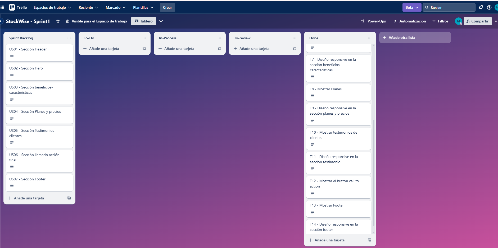

|Sprint # | 1 |  |  |  |  |  |  |
|----|----|----- |---- |---- |---- |---- | ---|
|User Story |  |Work-Item /Task  |  |  |  |  |  |
|Id|Title|Id |Title |Description|Estimation(Hours) |Assigned To| Status (To-do / InProcess / ToReview / Done)|
|US01|Sección Header|T1|Interacción de la barra de navegación |Añadir funcionalidades a la barra de navegaciones |0.5h|Camila Sanchez |Done|
|US01|Sección Header|T2|Diseño responsive en la barra de navegación |Implementar diseño responsive a la barra de navegación |1h |Camila Sanchez |Done|
|US01|Sección Header|T3|Función sticky en la barra de navegación |Aplicar la funcionalidad de que la barra de navegación se desplace por toda la landing |0.5h |Camila Sanchez |Done|
|US02|Sección Hero|T4|Mostrar Hero Section |Implementar un hero section |1h |Camila Sanchez |Done|
|US02|Sección Hero|T5|Diseño responsive en el hero section |Implementar un diseño responsivo a la sección hero |0.5h|Camila Sanchez |Done|
|US03|Sección beneficios-características|T6|Mostrar beneficios-características |Añadir cuadros de texto sobre la características del servicio |1h |Maria Fernanda Peña |Done|
|US03|Sección beneficios-características|T7|Diseño responsive en la sección beneficios-características |Implementar un diseño responsivo en la sección beneficios-características |0.5h |Maria Fernanda Peña |Done|
|US04|Sección Planes y precios|T8|Mostrar Planes |Añadir los planes establecidos y sus descripciones con precios |1.5h |Fabiola Saldaña |Done|
|US04|Sección Planes y precios|T9|Diseño responsive en la sección planes y precios |Aplicar un diseño responsivo en la sección planes y precios |0.5h|Fabiola Saldaña |Done|
|US05|Sección Testimonios clientes|T10|Mostrar testimonios de clientes |Añadir los testimonios de clientes |1h |Jocelyn Almerco |Done|
|US05|Sección Testimonios clientes|T11|Diseño responsive en la sección testimonio|Aplicar un diseño responsivo en la sección testimonios-clientes |0.5h |Jocelyn Almerco |Done|
|US06|Sección llamado acción final|T12|Mostrar el button call to action|Añadir enlace al botón call to action a la aplicación web |0.5h |Maria Fernanda Peña |Done|
|US07|Sección Footer|T13|Mostrar Footer|Implementar la sección Footer |0.5h|Henry Esteban |Done|
|US07|Sección Footer|T14|Diseño responsive en la sección footer|Aplicar un diseño responsivo en la sección footer |0.5h |Henry Esteban |Done|

#### 5.2.1.4. Development Evidence for Sprint Review.
|Repository|Branch| Commit Id| Commit Message | Commit Message Body | Commited on (Date)|
|----|----|----|----|----|----|
|upc-pre-202510-1asi0730-4366-AyniTech/Landing-Page|feature/Beneficios-Características |6b36a6919a2e91c77ff3baff566fd60e043c1395|Primer commit con README|Primer commit con README|16/04/2025 |
| |feature/Beneficios-Características |3f32cf3d2d04b57948f74499f6bcc0c9524c3446|feat: beneficios-caracteristicas|feat: beneficios-caracteristicas|19/04/2025|
| |feature/Footer|4c5ca5c622581ac3cee863d0e4219ac287e231df|Footer Landing page|Footer Landing page |17/04/2025|
| |feature/Footer|235e77f6d3b97ccb4b7e0340502f7c3ed1c367e8|Corrección|Corrección|17/04/2025|
| |feature/Footer|ea09d7b9f1ffca7b8d28a5a478a9ce146dcf78ed|Corrección footer implementación de html y css|Corrección footer implementación de html y css|17/04/2025|
| |feature/Header|046034c41d59af333c0d1b15f06bf8829586fe7d|feat:Header|feat:Header|16/04/2025|
| |feature/Hero-Section|fe076a40ec497b89907b1a5f0e812c04ad439d2b|feat: hero - section|feat: hero - section|16/04/2025|
| |feature/Llamado-Accion-Final|89ca26e0e4498cd8dbd986ca117b416fe3571c74|feat: llamado acción|feat: llamado acción|19/04/2025|
| |feature/Planes-Precios|36379aacd31c276220ea903783afa86f6c5aac67|Precios landing|Precios landing|19/04/2025|
| |feature/Testimonios-Clientes|5cf271c1711d25c79dd6700098e4b40e56089162|feat: Primera versión del código - Testimonios clientes|feat: Primera versión del código - Testimonios clientes|18/04/2025|

#### 5.2.1.5. Execution Evidence for Sprint Review.
En este Sprint se realizó nuestra landing page utilizando HTML y CSS con su respectivo despliegue en GitHub Pages. En esta sección se muestran los diferentes apartados que se han implementado en el trabajo:

- Sección beneficios y características
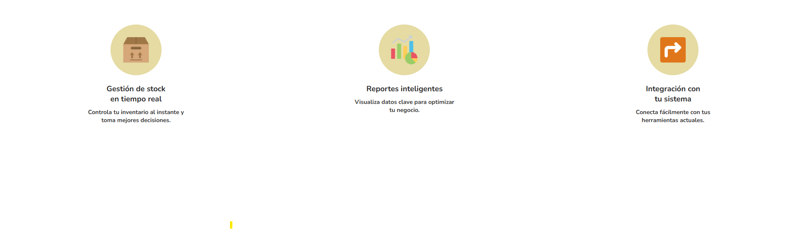

- Sección Planes y precios
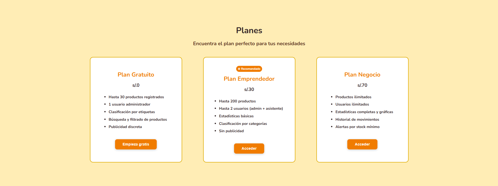

- Seccion Testimonios Clientes


#### 5.2.1.6. Services Documentation Evidence for Sprint Review.
Y aque este sprint fue el primero y solamente se desarrolló la landing page, por lo que no se evidencia el empleo de web service

#### 5.2.1.7. Software Deployment Evidence for Sprint Review.
Para la entrega del Sprint 1, se desplegó el landing page de forma completa. Para esto se siguió un proceso que es el siguiente:
- **Git:** ya que se utiliza como sistema de control de versiones, facilitando la colaboración efectiva entre los integrantes del equipo
- **GitFlow:** Se implementó como metodología, creando diferentes ramas por capítulo, ya que realizando esto el trabajo tuvo una mejor gestión  generando un flujo continuo en el avance del proyecto.
- **GitHub:** Se usó  como plataforma base para el trabajo colaborativo, donde se puede gestionar y almacenar todas las versiones del proyecto.
- **GitHub Pages**: Se empleó para publicar la landing page de forma eficiente, permitiendo que la aplicación quede accesible al público mediante un repositorio GitHub. En este caso nuestra compañera de equipo Camila Sanchez llevó a cabo eres proceso

1. Si nos vamos al github, vemos en la parte marcada con roja el link de nuestra landing page
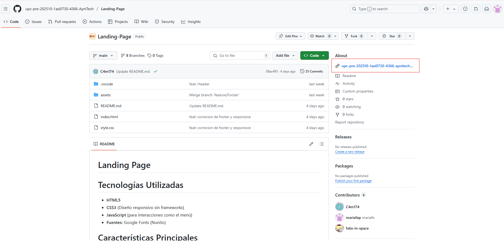

2. Entrando a link se puede correctamente la landing page de stock wise
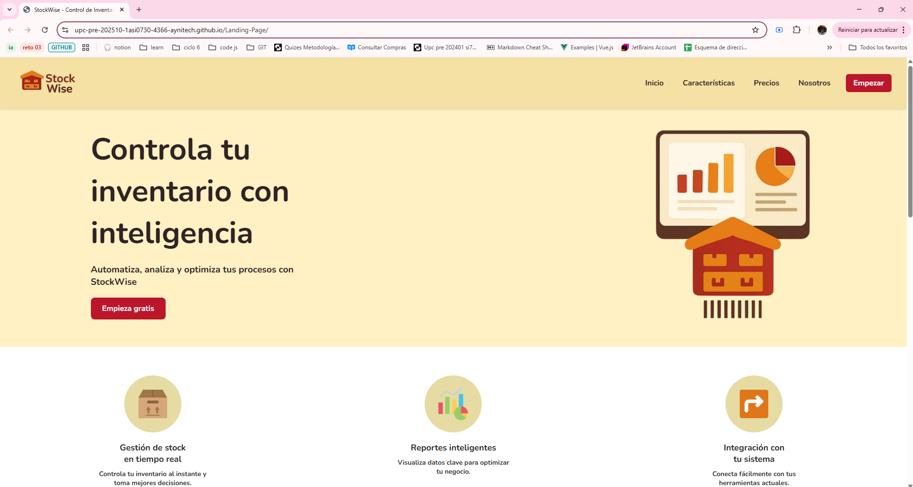

#### 5.2.1.8. Team Collaboration Insights during Sprint.
| Alumno | Actividad |
| ------ | --------- |
|Jocelyn Damaly Almerco Rojas|Implementación de las sección Testimonios-Clientes|
|Sanchez Rios, Camila Cristina|Implementación de la sección header y sección hero-section|
|Henry Kalet Esteban Roman|Implementación de la sección footer|
|Maria Fernanda Peña Riofrio|Implementación de la sección beneficios-características y llamado-acción-final|
|Fabiola Del Rocio Saldaña Ayala|Implementación de la sección planes-precios|

**Commits del landing page**
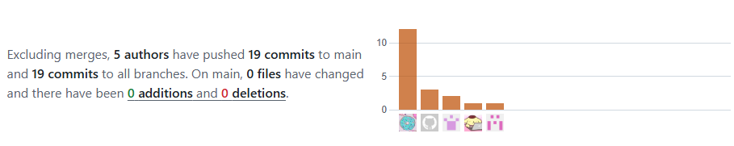

### 5.2.2. Sprint 2
#### 5.2.2.1. Sprint Planning 2
| Sprint # | 2 |
|---------|-------|
| **Sprint Planning Background** |      |
| Date | 14/05/2025|
| Time | 5:30 pm |
|Location | Modalidad remota |
|Prepared By | Camila Sanchez|
|Attendees (to planning meeting)| Jocelyn Almerco, Camila Sanchez, Maria Fernanda Peña, Fabiola Del Rocio Saldaña, Henry Esteban|
|Sprint 0 Review Summary | Se logro completar la landing page|
|Sprint 0 Retrospective Summary | Se tuvo que manejar mejor los tiempos para evitar inconvenientes en la entrega|
|**Sprint Goal & User Stories** | |
|Sprint Goal 1 |Realizar una primera version del Frontend.|
|Sprint Velocity 1 |15 |
|Sum of Story Points |20 |

#### 5.2.2.2. Aspect Leaders and Collaborators.
Durante el segundo sprint, el equipo tuvo como meta implementar el frontend de StockWise utilizando JavaScript, Vue. CSS y HTML. El enfoque se centró en desarrollar funcionalidades clave en varias páginas. Además, el equipo se enfocó en las historias de usuario relacionadas con este desarrollo, asegurando que cada nueva característica no solo fuera funcional, sino también alineada con las necesidades de los usuarios. Se utilizó Trello para organizar y distribuir las tareas, permitiendo que cada integrante del equipo se especializara en áreas que se correspondían con sus competencias, lo que facilitó un avance eficiente y coordinado hacia el objetivo del sprint.

#### 5.2.2.3. Sprint Backlog 2.
**Link del Trello:** 
[Trello](https://trello.com/b/GaGqplFO)

**Vista del Sprint Backlog en Trello:**

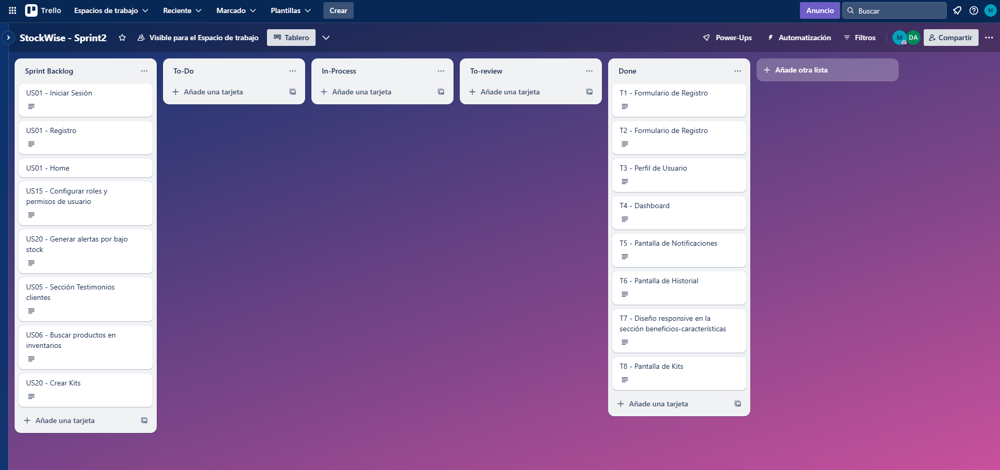

|Sprint # | 2 |  |  |  |  |  |  |
|----|----|----- |---- |---- |---- |---- | ---|
|User Story |  |Work-Item /Task  |  |  |  |  |  |
|Id|Title|Id |Title |Description|Estimation(Hours) |Assigned To| Status (To-do / InProcess / ToReview / Done)|
|US01|Iniciar Sesion|T1|Formulario de registro |Login del Usuario con ambos metodos (Google o registro)  |2h|Camila Sanchez |Done|
|US01|Registro|T2|Formulario de registro |Mostrar y redirigir al formulario de registro para nuevos usuarios desde la landing page.|3h |Camila Sanchez |Done|
|US15|Configurar roles y permisos de usuario |T3|Perfil de Usuario |Recolectar datos personales basicos y control de ajusted |2h |Fabiola Saldaña |Done|
|US01|Home|T4|Dashboard |Creacion de la pantalla de Inicio donde navegara por la pagina web |3h |Fabiola Saldaña |Done|
|US20|Generar alertas por bajo stock|T5| Pantalla de Notificaciones |Implementar historial de alertas de stock |2h|Sebastian |Done|
|US04|Ver historial de movimientos|T6| Pantalla de Historial |Implementar un diseño intuitivo para el usuario|2h |Jocelyn Almerco |Done|
|US06|Buscar productos en inventarios|T07|Pantalla de Inventario (Producto o lote)|Implementar un diseño intuitivo para el usuario|2h |Henry Esteban |Done|
|US20|Crear kits o combos de productos|T08|Pantalla de Kits|Implementar un diseño intuitivo para el usuario|2h |Maria Fernanda Peña |Done|

#### 5.2.2.4. Development Evidence for Sprint Review.
|Repository|Branch| Commit Id| Commit Message | Commit Name|Commited on (Date)|
|----|----|----|----|----|----|
|https://github.com/upc-pre-202510-1asi0730-4366-AyniTech/Frontend-Web-Applications|feature/History|0d6e97a8|feat: completar cambios faltantes en localización y vista|Damaly34873|15/05/2025 |
| |feature/History|49dfd0e9|Fix: ajustar diseño para mantener cards debajo de barra|Damaly34873|15/05/2025|
| |feature/iam|a760f8c8|feat: add log |C4M174|14/05/2025|
| |feature/iam|c43e30bd|feat: add login|C4M174|14/05/2025|
| |feature/iam|97abafbb  |feat: add authentication service|C4M174|14/05/2025|
| |feature/inventory|ac2773df |feature: new branch | kalet123-commit|14/05/2025 |
| |feature/inventory|3831040f|feature: add bounded countext | kalet123-commit|14/05/2025 |
| |feature/inventory|3706a28a |feature:add functional buttonns | kalet123-commit|15/05/2025 |
| |feature/kit-products|0eaec782 |feat: add kits-products components and include in App.vue | mariafep|15/05/2025 |
| |feature/kit-products|4765c520 |feat: add i18n and router modified kit component and main.js | mariafep|15/05/2025 |
| |feature/kit-products|955d7e7f |feat: add bounded context style, entity and services | mariafep|15/05/2025 |
| |feature/kit-products|9e61ed75 |feat: fix entity | mariafep|15/05/2025 |
| |feature/product-management|207f8daa |feat/avances dashboard| Fabs|14/05/2025 |
| |feature/product-management|6515fefc |avances dashboard2 | Fabs|14/05/2025 |
| |feature/product-management|1defb863ac2773df |feature: new branch | Fabs|14/05/2025 |
| |feature/stock-alert|6b841ec3 |Add feature/stock-alert | Sebastian|15/05/2025 |
| |feature/stock-alert|42e08cef |Update stock alert | Sebastian|15/05/2025 |

#### 5.2.2.5. Execution Evidence for Sprint Review.

**Iniciar sesión**
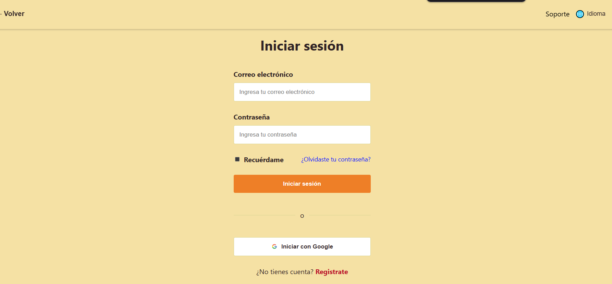 
**Crear cuenta**
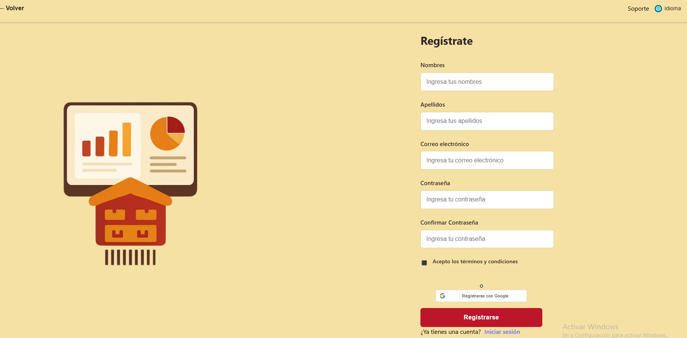 
**Mi perfil**

*Perfil Administrador*
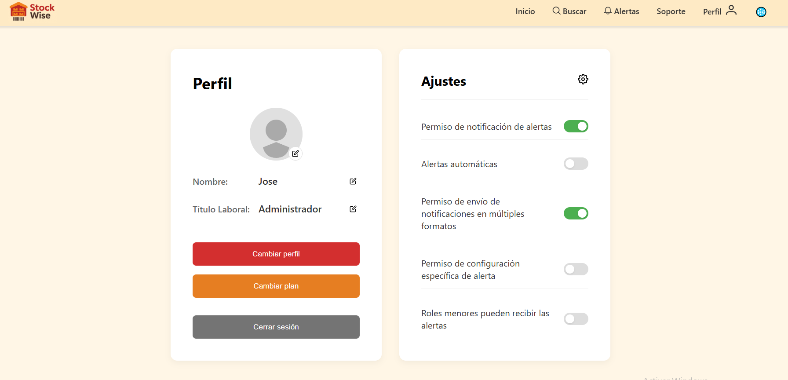

**Panel de control (Dashboard)**
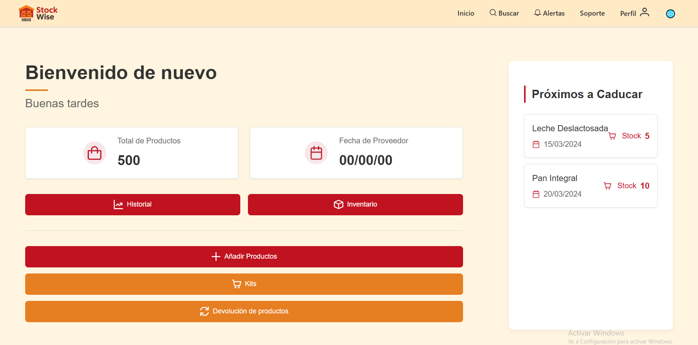
**Combinación de Productos en Kits**
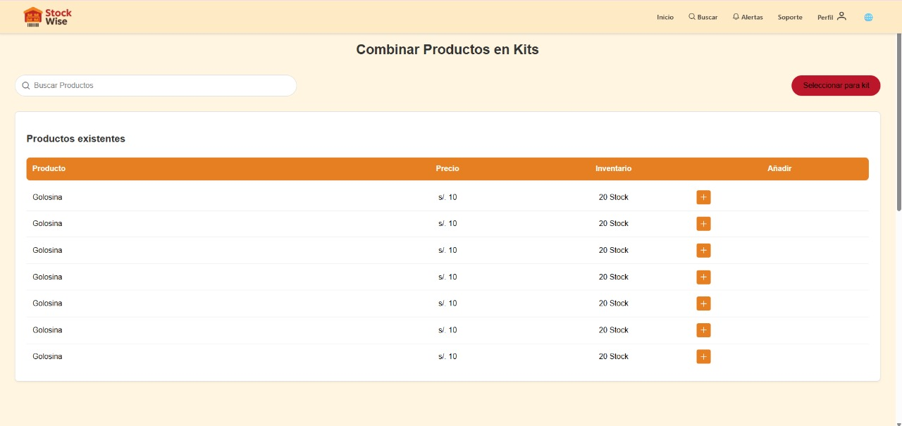

**Historial de Movimientos**
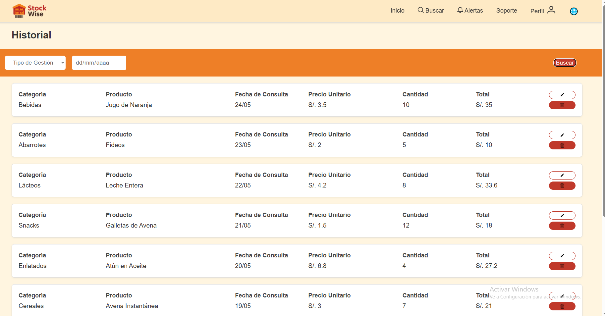
 *Confirmación de Eliminación*
 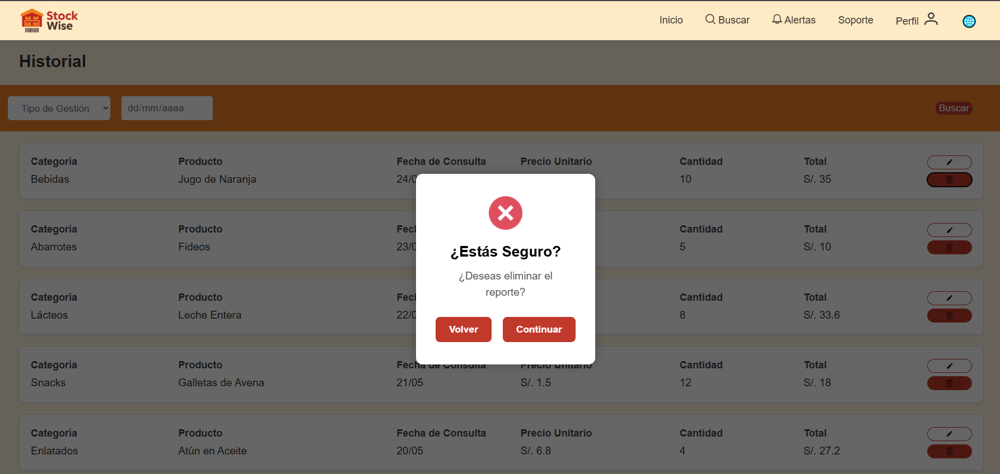
**Ticket Promedio**   
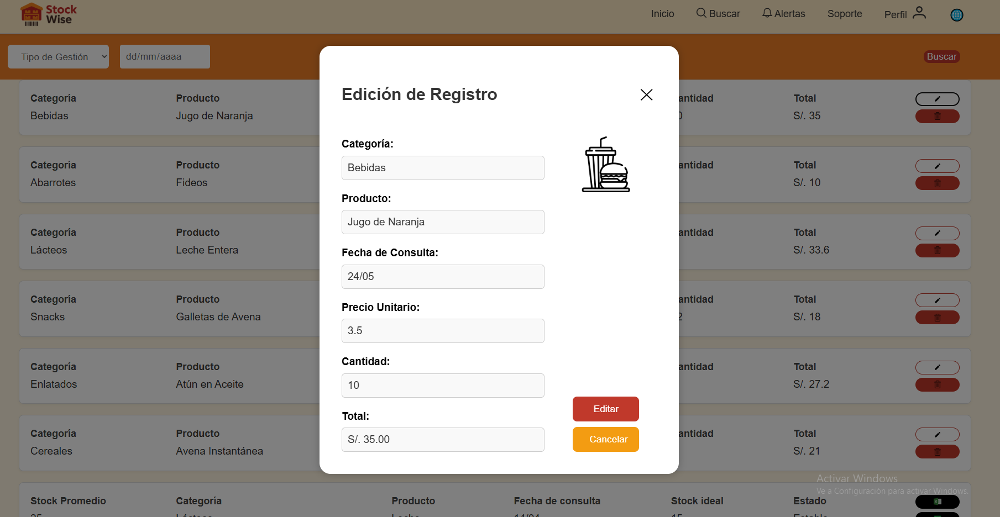
**Pantalla principal de Inventario por Lote**
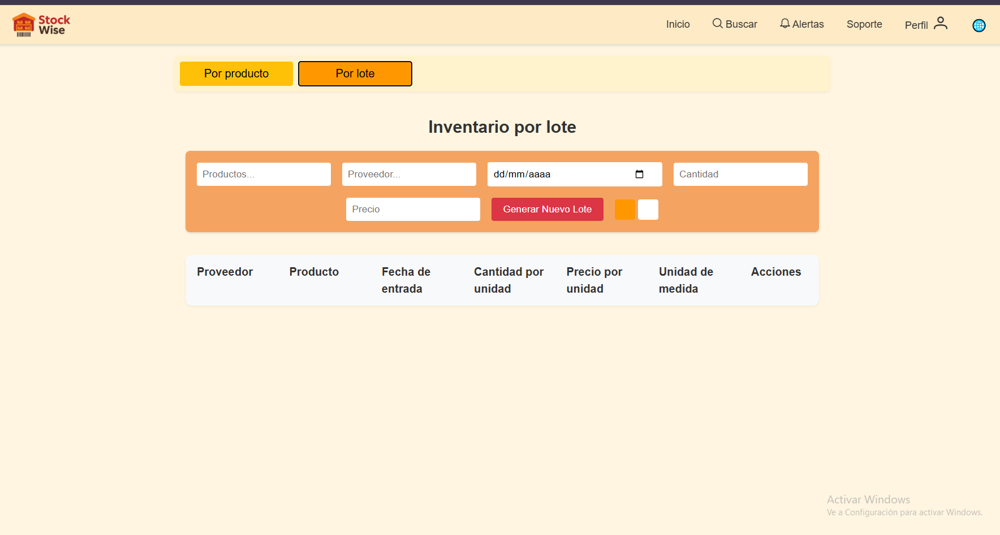
**Pantalla de Inventario por Producto**
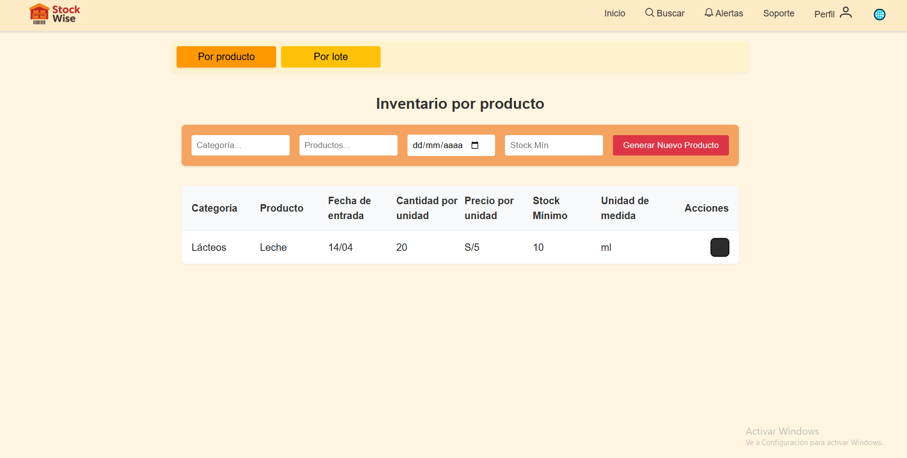
*Edición de Registro*
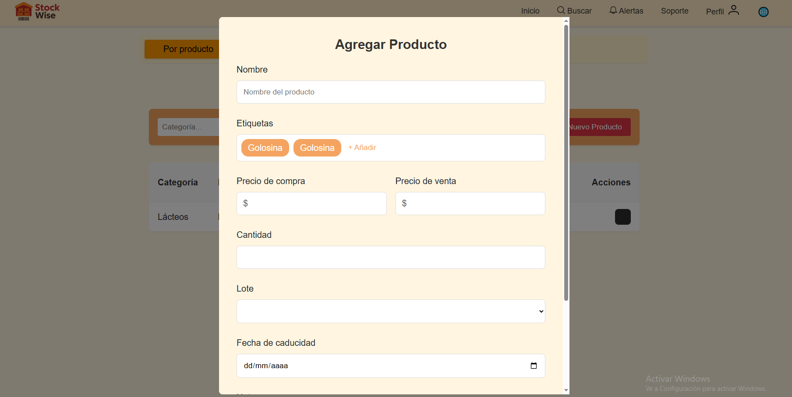
**Pantalla Principal de Alerta Stock**
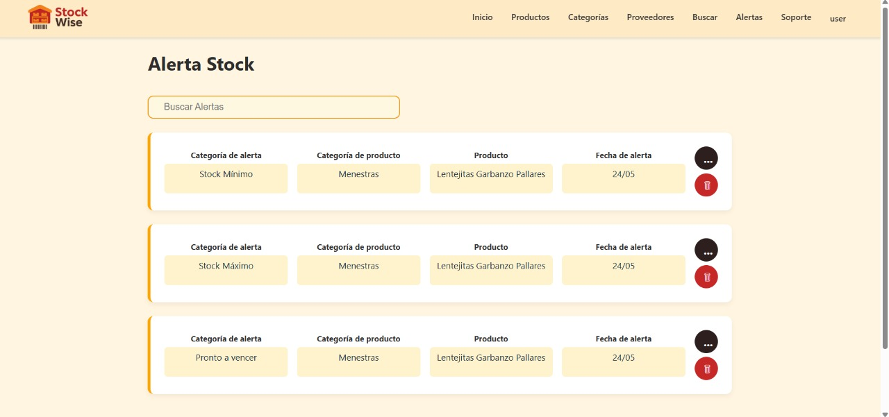


#### 5.2.2.6. Services Documentation Evidence for Sprint Review.
No se implementaron servicios en este sprint 
#### 5.2.2.7. Software Deployment Evidence for Sprint Review.
Para realizar el despliegue del Frontend se realizaron lo siguientes pasos:

- 1: Hacer merges de las ramas feature en la rama develop y finalmente merge en la rama main
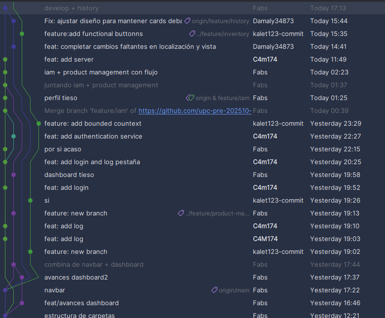

- 2: Ir a Netlify, seleccionar Add new site, seguidamente seleccionar Import an existing project
  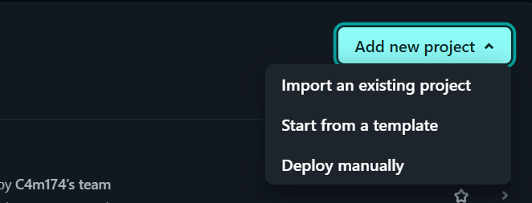

- 3: Seleccionar el repositorio del Frontend
  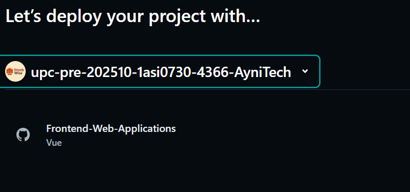

- 4: Ingresar un nombre disponible para la página del frontend y seleccionar la rama main
   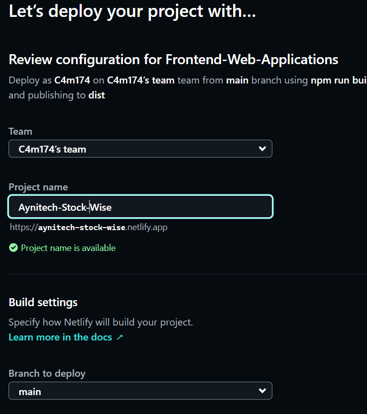

Link Fronted: https://aynitech.netlify.app/dashboard 
#### 5.2.2.8. Team Collaboration Insights during Sprint.
| Alumno | Actividad |
| ------ | --------- |
|Jocelyn Damaly Almerco Rojas|Implementación de Historial de movimientos|
|Sanchez Rios, Camila Cristina|Implementación de Inicio de sesión, registro y perfil del usuario|
|Henry Kalet Esteban Roman|Implementación de Inventario|
|Maria Fernanda Peña Riofrio|Implementación de Kits de productos|
|Fabiola Del Rocio Saldaña Ayala|Implementación de Dashboard|
|Sebastian Alonso Bustinza Muñoz|Implementación de Alerta Stock |

**Commits del Frontend**
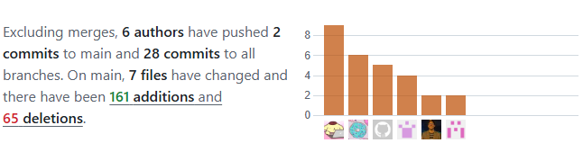

### 5.2.3. Sprint 3.
Para este Sprint nos enfocaremos desarrollar una primera version del Web-Services
#### 5.2.3.1. Sprint Planning 3.
En la siguiente sección, se presentará el sprint #3 con la versión de la aplicación web e implementación parcial del back-end, desarrollado en C#. Mostrando la organización, distribución y resultados de la aplicación web.
| Sprint # | 3 |
|---------|-------|
| **Sprint Planning Background** |      |
| Date | 11/06/2025|
| Time | 4:30 pm |
|Location | Modalidad remota |
|Prepared By | Camila Sanchez,  Henry Esteban|
|Attendees (to planning meeting)| Jocelyn Almerco, Camila Sanchez, Maria Fernanda Peña, Fabiola Del Rocio Saldaña, Henry Esteban|
|Sprint 0 Review Summary | En el segundo sprint desarrollamos y lanzamos la segunda versión de la aplicación web de AyniTech.|
|Sprint 0 Retrospective Summary | Para el segundo sprint tuvimos que aprender a trabajar con el modelo GitFlow, lo que nos permitió, desarrollar satisfactoriamente dicho sprint.|
|**Sprint Goal & User Stories** | |
|Sprint Goal 1 |Implementar los web services a un 70%. Desarrollamos y desplegamos la primera versión de la estructura Back-End funcional que presente de manera clara para el consumo de la aplicación web, a través del lenguaje de programación "C#".|
|Sprint Velocity 1 |5 |
|Sum of Story Points |30 |
#### 5.2.3.2. Aspects Leaders and Collaborators
Durante el tercer sprint, el equipo tuvo como meta implementar el backend de StockWise utilizando C#. El enfoque se centró en desarrollar e implementar los endpoints para la gestión de productos y la creación de órdenes en el backend de la aplicación web.

Además, el equipo se enfocó en las historias de usuario relacionadas con este desarrollo, asegurando que cada nueva característica no solo fuera funcional, sino también alineada con las necesidades de los usuarios. Se utilizó Trello para organizar y distribuir las tareas, permitiendo que cada integrante del equipo se especialicen  en áreas que se corresponden con sus competencias, lo que facilitó un avance eficiente y coordinado hacia el objetivo del sprint.

| Team member | Github Username | Validaciones y Lógica | Base de datos | Testing Backend | Backend deploy | Documentation |
|:------------|:----------------|:---------------------:|:-------------:|:---------------:|:--------------:|:-------------:|
|Almerco Rojas, Jocelyn Damaly|JocyDam| L | C | C | C | C |
|Saldaña Ayala, Fabiola del Rocio| fabs-in-space | L | C | L | C | C |
|Sánchez Ríos, Camila Cristina| C4m174 | C | C | C | L | C |
|Peña Riofrio, Maria Fernanda| mariafep | C | C | C | C | L |
|Esteban Román, Henry Kalet| Kalet12-commit | C | L | C | C | C |
|Bustinza Muñoz, Sebastian Alonso | Sebastianbustianza809 | C | C | C | C | L |

#### 5.2.3.3. Sprint Backlog 3.

**Vista del Sprint Backlog en Trello:**

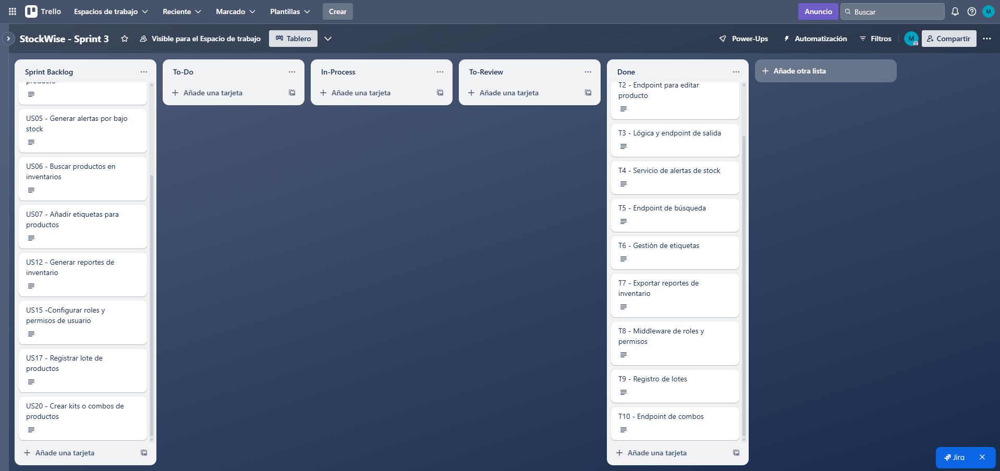

**Link del Trello:** 
[Trello](https://trello.com/invite/b/6856149857ff3b593bf42e19/ATTI1f148caabe73f0489fc96d11a69cf98fEA4E8AC6/stockwise-sprint-3)


Para el Sprint #3 nos trazamos como objetivo desarrollar y desplegar la parte del back end de la aplicación web y completar las funcionalidades del front end.

<table>
        <tr>
            <th>Sprint #</th>
            <th colspan="7">Sprint 3</th>
        </tr>
        <tr>
            <th colspan="2">User Story</th>
            <th colspan="6">WorkItem / Task</th>
        </tr>
        <tr>
            <th>Id</th>
            <th>Title</th>
            <th>Id</th>
            <th>Title</th>
            <th>Description</th>
            <th>Estimation(Hours)</th>
            <th>Assigned To</th>
            <th>Status(To-do/In-Process/To-Review/Done)</th>
        </tr>
        <tr>
            <td>US01</td>
            <td>Registrar producto nuevo</td>
            <td>T01</td>
            <td>Endpoint de registro de producto </td>
            <td>Crear endpoinr POST para agregar un nuevo producto en la base de datos</td>
            <td>3h</td>
            <td>Fabiola Saldaña</td>
            <td>Done</td>
        </tr>
        <tr>
            <td>US02</td>
            <td>Editar información de producto</td>
            <td>T02</td>
            <td>Endpoinr para editar producto</td>
            <td>Craer endpoint PUT para editar los campos de un producto existente <d>
            <td>3h</td>
            <td>Fabiola Saldaña</td>
            <td>Done</td>
        </tr>
        <tr>
            <td>US03</td>
            <td>Registrar salida de producto</td>
            <td>T03</td>
            <td>Lógica y endpoint de salida</td>
            <td>Implementar la lógica para registrar salidas y actualizar stock.</td>
            <td>3h</td>
            <td>Jocelyn Almerco</td>
            <td>Done</td>
        </tr>
        <tr>
            <td>US05</td>
            <td>Generar alertas por bajo stock</td>
            <td>T04</td>
            <td>Servicio de alertas de stock</td>
            <td>Desarrollar lógica para detectar productos con stock mínimo y generar alerta.</td>
            <td>3h</td>
            <td>Sebastian Bustinza</td>
            <td>Done</td>
        </tr>
        <tr>
            <td>US06</td>
            <td>Buscar productos en inventarios</td>
            <td>T05</td>
            <td>Endpoint de búsqueda</td>
            <td>Crear endpoint GET con filtros por nombre, código, categoría, etc.</td>
            <td>2.5h</td>
            <td>Henry Esteban</td>
            <td>Done</td>
        </tr>
         <tr>
            <td>US07</td>
            <td>Añadir etiquetas para productos</td>
            <td>T06</td>
            <td>Gestión de etiquetas</td>
            <td>Crear tablas relacionales y endpoints para asignar etiquetas a productos</td>
            <td>3h</td>
            <td>Maria Fernanda Peña RdRiofrio</td>
            <td>Done</td>
        </tr>
        <tr>
            <td>US12</td>
            <td>Generar reportes de inventario</td>
            <td>T07</td>
            <td>Exportar reportes de inventario</td>
            <td>Crear funcionalidad para generar reportes (Excel) con datos agregados.</td>
            <td>2.5h</td>
            <td>Jocelyn Almerco</td>
            <td>Done</td>
        </tr>
         <tr>
            <td>US15</td>
            <td>Configurar roles y permisos de usuario</td>
            <td>T08</td>
            <td>Middleware de roles y permisos</td>
            <td>Implementar lógica de control de acceso según rol del usuario.</td>
            <td>2.5h</td>
            <td>Camila Sanchez</td>
            <td>Done</td>
        </tr>
         <tr>
            <td>US17</td>
            <td>Registrar lote de productos</td>
            <td>T09</td>
            <td>Registro de Lotes</td>
            <td>Implementar la lógica de control de acceso según rol del usuario.</td>
            <td>3 h</td>
            <td>Henry Esteban</td>
            <td>Done</td>
        </tr>
         <tr>
            <td>US20</td>
            <td>Crear Kits o combos de productos</td>
            <td>T10</td>
            <td>Endpoint de combos.</td>
            <td>Crear endpoint para definir y registrar combos de productos. </td>
            <td>3h</td>
            <td>Maria Fernanda Peña Riofrio</td>
            <td>Done</td>
        </tr>
</table>


#### 5.2.3.4. Development Evidence for Sprint Review
En este punto abarcaremos las funcionalidades y la evidencia de que pudimos completar exitosamente las tareas planteadas en el Sprint Planning 3:
|Repository|Branch| Commit Id| Commit Message | Commit Name|Commited on (Date)|
|----|----|----|----|----|----|
|**Frontend-Web-Applications:** https://github.com/upc-pre-202510-1asi0730-4366-AyniTech/Frontend-Web-Applications|feature/History|0d6e97a8|feat: completar cambios faltantes en localización y vista|Damaly34873|15/05/2025 |
| |feature/History|49dfd0e9|Fix: ajustar diseño para mantener cards debajo de barra|Damaly34873|15/05/2025|
| |feature/iam|a760f8c8|feat: add log |C4M174|14/05/2025|
| |feature/iam|c43e30bd|feat: add login|C4M174|14/05/2025|
| |feature/iam|97abafbb  |feat: add authentication service|C4M174|14/05/2025|
| |feature/inventory|ac2773df |feature: new branch | kalet123-commit|14/05/2025 |
| |feature/inventory|3831040f|feature: add bounded countext | kalet123-commit|14/05/2025 |

|Repository|Branch| Commit Id| Commit Message | Commit Name|Commited on (Date)|
|----|----|----|----|----|----|
|**Backend:** https://github.com/upc-pre-202510-1asi0730-4366-AyniTech/Backend|feature/History|0d6e97a8|feat: completar cambios faltantes en localización y vista|Damaly34873|15/05/2025 |
| |feature/History|49dfd0e9|Fix: ajustar diseño para mantener cards debajo de barra|Damaly34873|15/05/2025|
| |feature/iam|a760f8c8|feat: add log |C4M174|14/05/2025|
| |feature/iam|c43e30bd|feat: add login|C4M174|14/05/2025|
| |feature/iam|97abafbb  |feat: add authentication service|C4M174|14/05/2025|
| |feature/inventory|ac2773df |feature: new branch | kalet123-commit|14/05/2025 |
| |feature/inventory|3831040f|feature: add bounded countext | kalet123-commit|14/05/2025 |
#### 5.2.3.5. Execution Evidence for Sprint Review
La realización de estas tareas refleja un enfoque estructurado para el desarrollo de la aplicación web. Cada tarea aborda un componente crucial del producto, lo que asegura que se cubran tanto aspectos visuales como funcionales. Este enfoque modular permite no solo mantener un orden en el proceso de desarrollo, sino también garantizar que cada sección cumple con las funcionalidades que brinda AyniTech.

A continuación se mostrarán capturas de pantallas así como el vídeo de la ejecución de las nuevas funcionalidades de la Landing Page, la Aplicación Web y el Web Service:

**LANDING PAGE**

Nueva funcionalidad Multilenguaje:

<th>Captura 1: 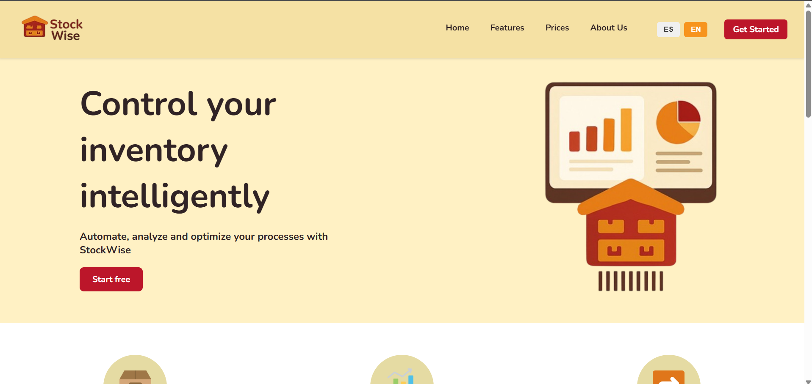Captura 2: 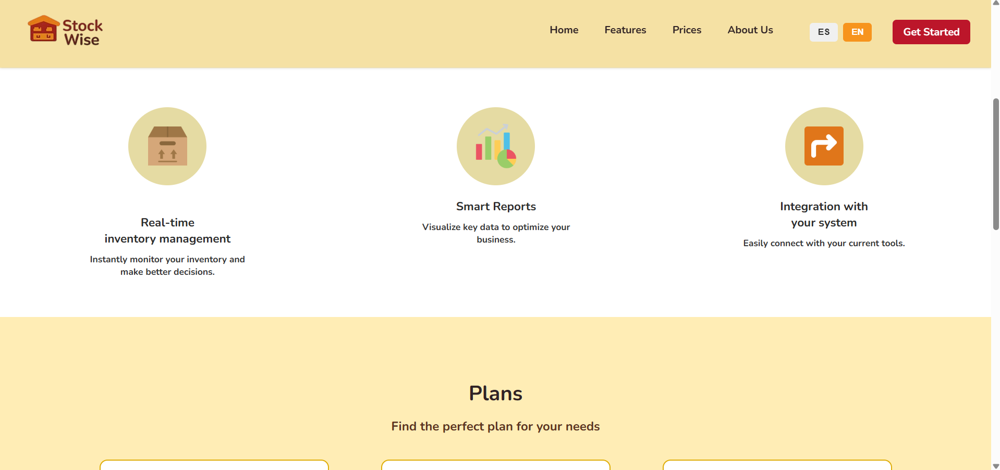Captura 3: 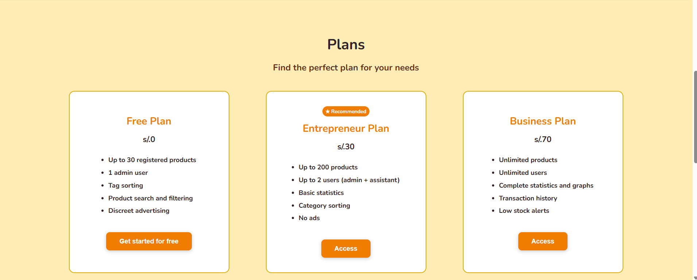Captura 5: 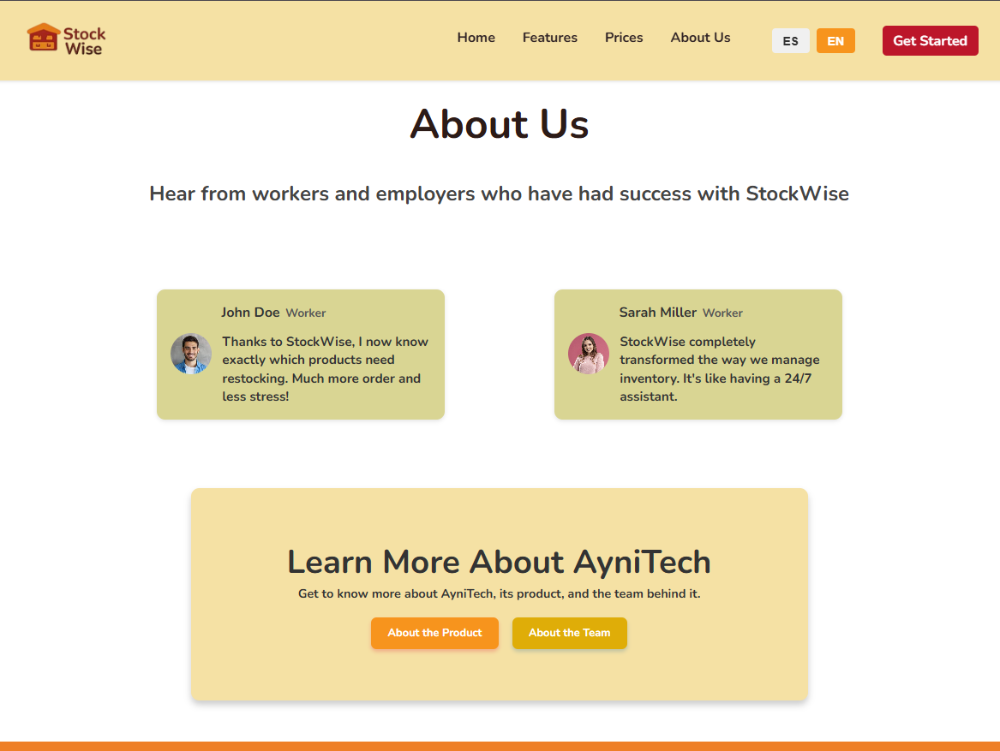Captura del back 1: Captura del back 2: 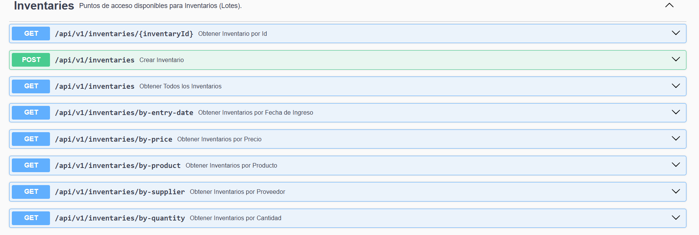Captura del back 3: 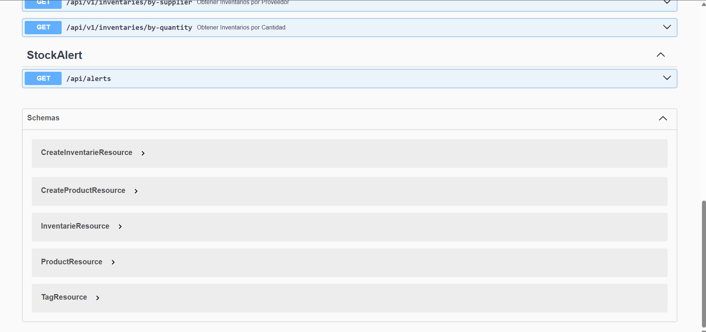Captura del back 3: 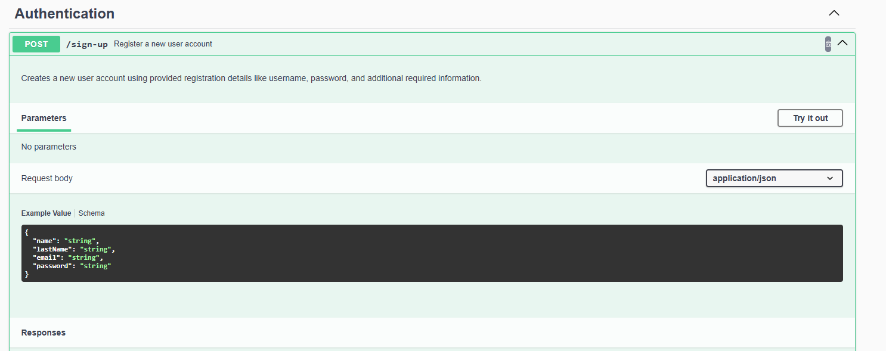Captura del back 3: 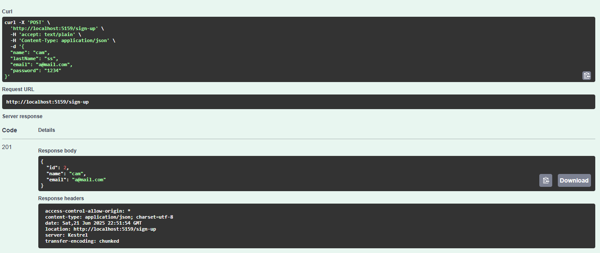Captura del back 3: 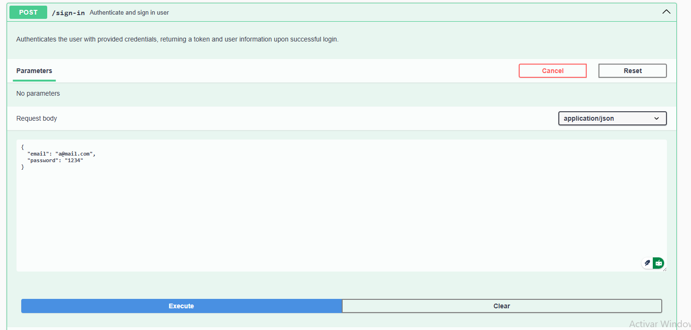Captura del back 3: Bounded context: Products:</b>

| Entity | Endpoint URL |Swagger | 
| ------ | --------- | --------- |
|Products|api/v1/products| 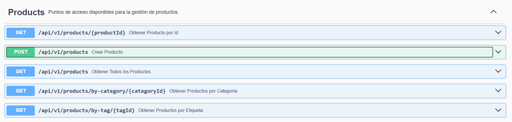 |
------------------------------------------------------

<b>Bounded context: Inventaries:</b>

| Entity | Endpoint URL |Swagger | 
| ------ | --------- | --------- |
|Products|api/v1/inventaries| 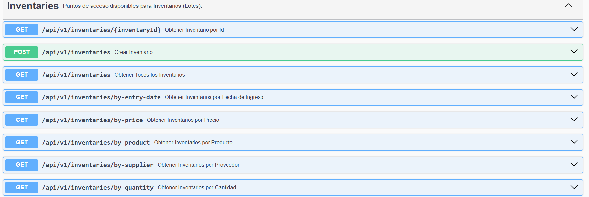 |

------------------------------------------------------
<b>Bounded context: Alert Stock:</b>

| Entity | Endpoint URL |Swagger | 
| ------ | --------- | --------- |
|Products|api/v1/alert| 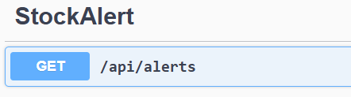 |

------------------------------------------------------
<b>Bounded context: Authentication:</b>

| Entity | Endpoint URL |Swagger | 
| ------ | --------- | --------- |
|User|api/v1/iam| 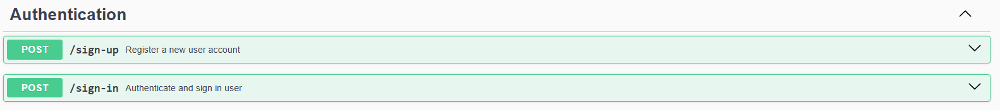 |

#### 5.2.3.7. Software Deployment Evidence for Sprint Review.
Evidencia de despliegue en Github Pages: Durante este sprint se usó Github Pages como plataforma de despliegue para la Landing Page:

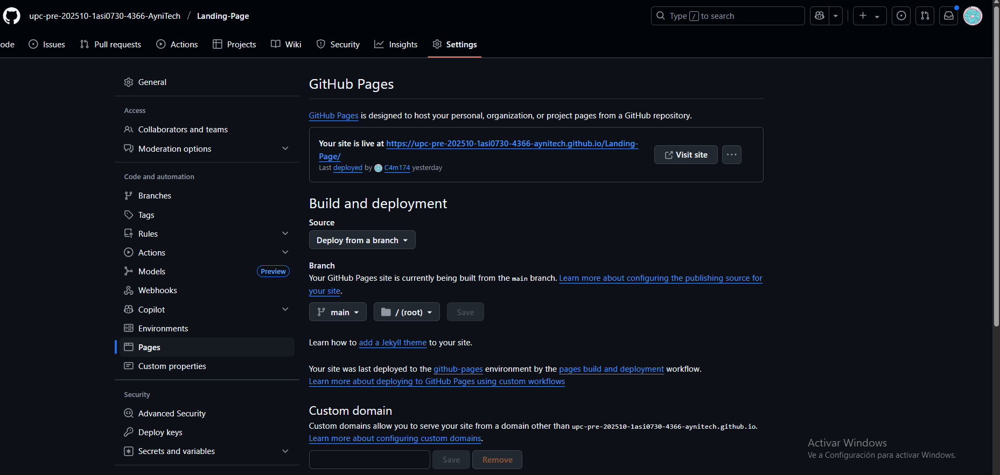

Evidencia de despliegue en Netlify: Durante este sprint, se utilizó Netlify como plataforma de despliegue para la aplicación web de AyniTech.

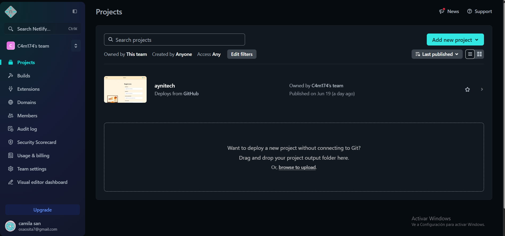
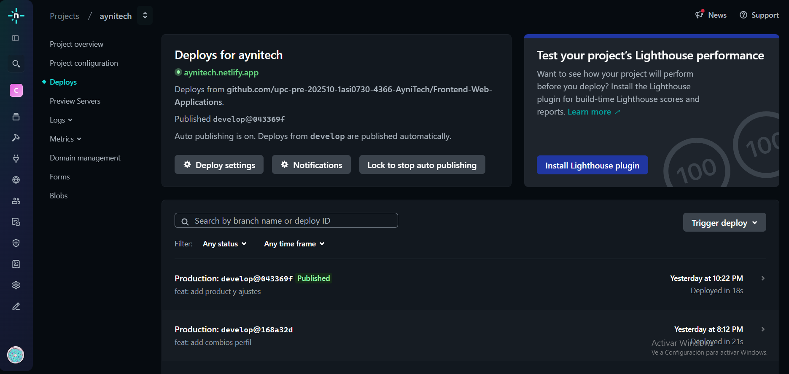
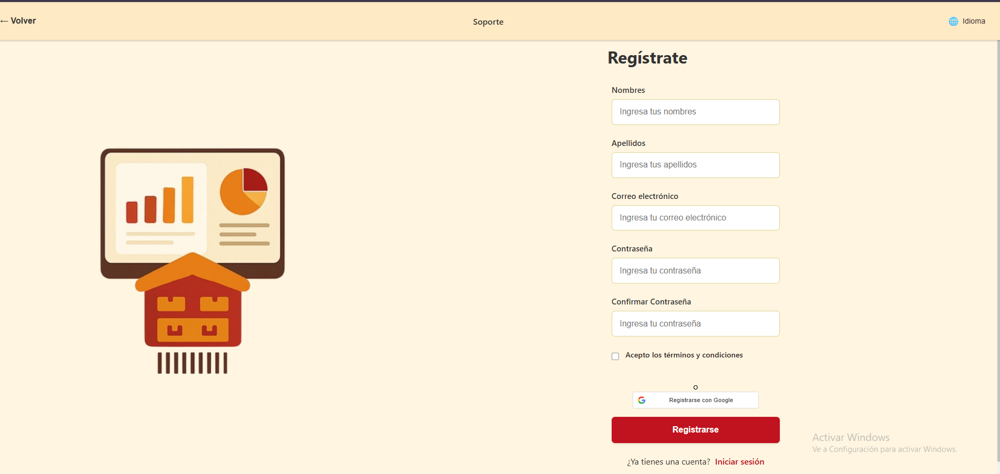
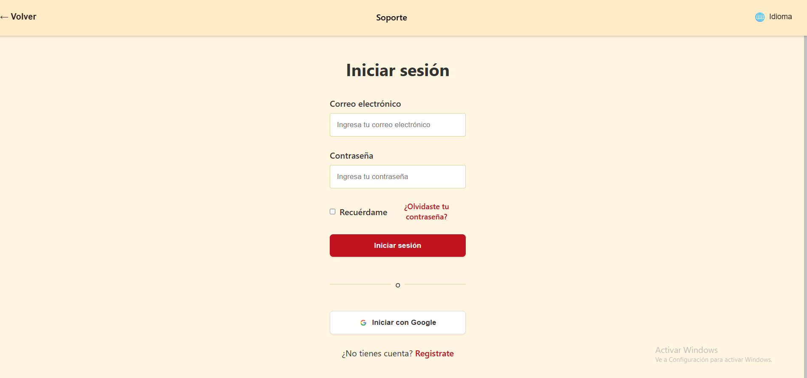

**Link de Landing Page:** https://upc-pre-202510-1asi0730-4366-aynitech.github.io/Landing-Page/ 
**Link de Web app:** https://aynitech.netlify.app/
 
#### 5.2.3. Team Collaboration Insights during Sprint.

| Alumno | Actividad |
| ------ | --------- |
|Jocelyn Damaly Almerco Rojas|Implementación del Report Context - historial de movimientos|
|Sanchez Rios, Camila Cristina|Implementación de User Bounded Context - usuario, resgistro, perfil|
|Henry Kalet Esteban Roman|Implementación del Inventory Bounded Context - inventario|
|Maria Fernanda Peña Riofrio|Implementación de Product Managment - kitsproducts|
|Fabiola Del Rocio Saldaña Ayala|Implementación de Product Managment - Product|
|Sebastian Alonso Bustinza Muñoz| Implementación del Inventory Bounded Context - alertastock|

**Commits del BackEnd**


## 5.3. Validation Interviews
### 5.3.1 Diseño de Entrevistas

**Segmento #1: Bodegas especializadas por rubro**

**Presentación del entrevistado**
* ¿Cuál es tu nombre?
* ¿Qué edad tienes?
* ¿Desde cuándo gestionas esta bodega?
* ¿Cuál es el rubro principal de tu bodega?

Interactúa el usuario con la landing page y la versión web de nuestra plataforma para gestión de inventarios.

**Landing page**

Acciones clave dentro del sistema

Navegación interactivo por la interfaz web


**User Goal: Registrar**

El usuario selecciona la opción "Register", completa los campos solicitados y hace clic en el botón "Registrar".

A continuación, se muestra el panel "Add Card", donde debe llenar los campos relacionados con su tarjeta y correo electrónico.

Una vez que el proceso de pago se complete exitosamente, se notifica al usuario con un mensaje confirmando el vínculo de su tarjeta con la plataforma.

Del mismo modo, si el usuario desea retirar su información o actualizarla, lo podrá hacer a través de su perfil.

Finalmente, hacer clic en el botón "Aceptar".

**User Goal: Iniciar sesión**

El usuario introduce su correo y contraseña.

Luego hace clic en el botón "Log In".

Después, se le redirige al panel de perfil.

Allí puede editar su información personal y acceder a herramientas según su perfil ("Administrador" o "Empleado").

**User Goal: Navegar por el Dashboard**

El usuario inicia sesión desde la Landing Page.

Ingresa a la vista principal del Dashboard.

Visualiza el total de productos registrados y la fecha del último proveedor.

Visualiza un resumen de productos próximos a caducar con su respectiva fecha y stock disponible.

Accede a botones de acción rápida como “Historial”, “Inventario”, “Añadir Productos”, “Kits” y “Devolución de productos”.

**User Goal: Inventario (Producto / Lote)**

Ingresa a la sección de Inventario.

Revisa el listado de productos presionando el botón "por producto".

Filtra los productos por categoría, nombre del producto, fecha o stock mínimo.

Consulta el listado con información clave: fecha de entrada, cantidad por unidad, precio, stock mínimo y unidad de medida.

**User Goal: Botones Principales (Agregar Producto y Kits)**

Pulsa el botón "Agregar Producto".

Rellena los campos solicitados para registrar uno nuevo.

Pulsa el botón "Crear Kit".

Combina productos existentes para crear un kit nuevo.


El usuario pulsa el botón “Añadir Productos” desde el Dashboard.

Visualiza una galería de productos existentes y accede a opciones para editarlos o duplicarlos.

Puede agregar uno nuevo haciendo clic en el botón “+”, donde se despliega un formulario con campos como nombre, etiquetas, cantidad, lote, precios, fecha de caducidad y notas.

Desde el menú principal, también accede a la opción “Kits”.

En esta sección, selecciona productos existentes y los combina mediante el botón “Seleccionar para kit”, indicando cantidad e inventario disponible.

**User Goal: Historial de Movimientos**

Navega a la sección de Historial.

Visualiza entradas y salidas de productos.

Filtra movimientos por fecha, producto o lote.

El usuario accede a la sección de Historial desde el panel principal.

Filtra los registros por tipo de gestión, categoría, stock promedio y fecha.

Visualiza los movimientos realizados, incluyendo datos como nombre del producto, fecha de consulta, precio unitario, cantidad y total.

Consulta métricas como el stock promedio, estado del producto y stock ideal.

Cuenta con botones para editar o eliminar cada registro y, para los stock promedio, exportar la información y realiza un ticket promedio.

**User Goal: Alerta de Stock**

El usuario accede a la sección de Alertas desde el menú superior.

Consulta una lista de productos que presentan alertas por stock mínimo o por cercanía a su fecha de vencimiento.

Visualiza detalles como categoría de alerta, tipo de producto, nombre y fecha de alerta.

Puede ingresar a una vista de detalles, generar reportes o confirmar acciones desde botones individuales por producto.

También puede eliminar una alerta específica luego de una confirmación emergente.

**Preguntas principales:**
* ¿Te resultó fácil encontrar cómo agregar un producto?
* ¿Qué tal fue el proceso para registrar el stock por producto y por lote?
* ¿Te resultó claro el apartado de “Próximos a caducar”? ¿Te pareció útil?
* ¿Probaste la sección de kits? ¿Te resultó útil combinar productos?
* ¿Hubo algo que no entendiste o que te confundió mientras usabas la app?
* ¿Qué te pareció el diseño general de la landing page?
* ¿Tuviste alguna dificultad visual o técnica durante la navegación?

**Valoración de experiencia**
* Del 1 al 10, ¿qué tan útil te pareció la app para tu bodega?
* ¿Qué funcionalidad te pareció más valiosa?
* ¿Qué función le agregarías sí o sí?
* ¿Recomendarías esta plataforma a otros dueños de bodegas? ¿Por qué?

**Segmento #2: Startups y emprendedores con necesidades logísticas**

**Presentación del entrevistado**
* ¿Cuál es tu nombre?
* ¿Qué edad tienes?
* ¿Qué tipo de producto vendes o almacenas?
* ¿Tienes local físico, almacén propio o trabajas con terceros?

Interactúa el usuario con la landing page y la versión web de nuestra plataforma para gestión gestionar stock, registrar compras y generar reportes.

**Landing page**

Acciones clave dentro del sistema

Navegación interactivo por la interfaz web

**User Goal: Registrar**

El usuario selecciona la opción "Register", completa los campos solicitados y hace clic en el botón "Registrar".

A continuación, se muestra el panel "Add Card", donde debe llenar los campos relacionados con su tarjeta y correo electrónico.

Una vez que el proceso de pago se complete exitosamente, se notifica al usuario con un mensaje confirmando el vínculo de su tarjeta con la plataforma.

Del mismo modo, si el usuario desea retirar su información o actualizarla, lo podrá hacer a través de su perfil.

Finalmente, hacer clic en el botón "Aceptar".

**User Goal: Iniciar sesión**

El usuario introduce su correo y contraseña.

Luego hace clic en el botón "Log In".

Después, se le redirige al panel de perfil.

Allí puede editar su información personal y acceder a herramientas según su perfil ("Administrador" o "Empleado").

**User Goal: Navegar por el Dashboard**

El usuario inicia sesión desde la Landing Page.

Ingresa a la vista principal del Dashboard.

Visualiza el total de productos registrados y la fecha del último proveedor.

Visualiza un resumen de productos próximos a caducar con su respectiva fecha y stock disponible.

Accede a botones de acción rápida como “Historial”, “Inventario”, “Añadir Productos”, “Kits” y “Devolución de productos”.

**User Goal: Inventario (Lote)**

Accede a la sección de Inventario por lote.

Filtra los lotes por nombre del producto, proveedor, fecha de entrada, cantidad o precio.

Consulta el listado con información detallada como proveedor, producto, fecha, cantidad por unidad, precio y unidad de medida.

Gestiona las acciones disponibles para cada lote desde la columna correspondiente.

**User Goal: Botones Principales (Agregar Producto y Kits)**

Pulsa el botón "Agregar Producto".

Rellena los campos solicitados para registrar uno nuevo.

Pulsa el botón "Crear Kit".

Combina productos existentes para crear un kit nuevo.


El usuario pulsa el botón “Añadir Productos” desde el Dashboard.

Visualiza una galería de productos existentes y accede a opciones para editarlos o duplicarlos.

Puede agregar uno nuevo haciendo clic en el botón “+”, donde se despliega un formulario con campos como nombre, etiquetas, cantidad, lote, precios, fecha de caducidad y notas.

Desde el menú principal, también accede a la opción “Kits”.

En esta sección, selecciona productos existentes y los combina mediante el botón “Seleccionar para kit”, indicando cantidad e inventario disponible.

**User Goal: Historial de Movimientos**

Navega a la sección de Historial.

Visualiza entradas y salidas de productos.

Filtra movimientos por fecha, producto o lote.

El usuario accede a la sección de Historial desde el panel principal.

Filtra los registros por tipo de gestión, categoría, stock promedio y fecha.

Visualiza los movimientos realizados, incluyendo datos como nombre del producto, fecha de consulta, precio unitario, cantidad y total.

Consulta métricas como el stock promedio, estado del producto y stock ideal.

Cuenta con botones para editar o eliminar cada registro y, para los stock promedio, exportar la información y realiza un ticket promedio.

**User Goal: Alerta de Stock**

El usuario accede a la sección de Alertas desde el menú superior.

Consulta una lista de productos que presentan alertas por stock mínimo o por cercanía a su fecha de vencimiento.

Visualiza detalles como categoría de alerta, tipo de producto, nombre y fecha de alerta.

Puede ingresar a una vista de detalles, generar reportes o confirmar acciones desde botones individuales por producto.

También puede eliminar una alerta específica luego de una confirmación emergente.

**Preguntas principales:**
* ¿Qué opinas de las alertas de stock mínimo/máximo y vencimiento? ¿Son suficientes?
* ¿La sección de historial de movimientos te pareció útil para revisar tus registros?
* ¿Te resultó útil la opción de devolución de productos?
* ¿Los reportes del historial son útiles para tomar decisiones?
* ¿Hubo algo que no entendiste o que te confundió mientras usabas la app?
* ¿Qué te pareció el diseño general de la landing page?
* ¿Tuviste alguna dificultad visual o técnica durante la navegación?

**Valoración de experiencia**
* Del 1 al 10, ¿qué tan útil te pareció la app para tu bodega?
* ¿Qué funcionalidad te pareció más valiosa?
* ¿Qué función le agregarías sí o sí?
* ¿Recomendarías esta plataforma a otros emprendedores? ¿Por qué?

### 5.3.2 Registro de Entrevistas

**Segmento 1: Bodegas especializadas por rubro**


<table border="1">
  <tr>
    <th>Entrevista</th>
    <td>1</td>
    <th>Nombre</th>
    <td>Milagros Almerco</td>
  </tr>
  <tr>
    <th>Edad</th>
    <td>28</td>
    <th>Distrito</th>
    <td>San Martín de Porres</td>
  </tr>
  <tr>
    <th>Captura de la entrevista: 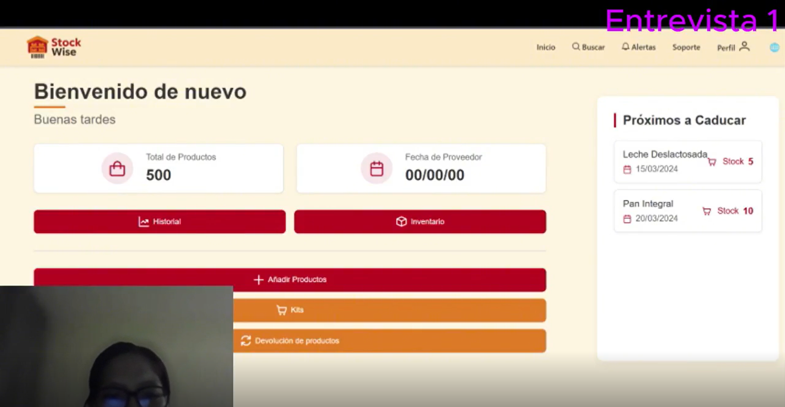</th>
    <td colspan="3">
        Milagros Almerco, evaluó la plataforma StockWise y destacó su facilidad de uso al registrar productos y gestionar inventario. Aunque al inicio tuvo dudas sobre la diferencia entre “stock” y “lote”, logró comprenderlo rápidamente gracias a la interfaz intuitiva. Resaltó como funcionalidades más valiosas el control de productos próximos a vencer y la visualización por lotes, que considera claves para evitar pérdidas. Valoró también el diseño moderno y claro, sin presentar dificultades técnicas. Sugirió como mejora incluir un sistema para registrar pagos pendientes o créditos. En general, calificó la app como práctica, útil y recomendada para otros dueños de bodegas.
    </td>
  </tr>
  <tr>
    <th>URL de la grabación</th>
    <td colspan="3">
      <a href="https://upcedupe-my.sharepoint.com/:v:/g/personal/u202310210_upc_edu_pe/EfEdvSoT6nZBn3Bjd_0YYpIBnQRFJ14Fy8uM2urSLFlOLg?e=Meau7E&nav=eyJyZWZlcnJhbEluZm8iOnsicmVmZXJyYWxBcHAiOiJTdHJlYW1XZWJBcHAiLCJyZWZlcnJhbFZpZXciOiJTaGFyZURpYWxvZy1MaW5rIiwicmVmZXJyYWxBcHBQbGF0Zm9ybSI6IldlYiIsInJlZmVycmFsTW9kZSI6InZpZXcifX0%3D">
        Ver grabación
      </a>
    </td>
  </tr>
  <tr>
   <th>Timing</th>
    <td colspan="3">
        05:24 -11:12
    </td>
  </tr>
</table>
<br>

<table border="1">
  <tr>
    <th>Entrevista</th>
    <td>2</td>
    <th>Nombre</th>
    <td>Elvis Aranga Mesa</td>
  </tr>
  <tr>
    <th>Edad</th>
    <td>31</td>
    <th>Distrito</th>
    <td>Santiago de Surco</td>
  </tr>
  <tr>
    <th>Captura de la entrevista: </th>
    <td colspan="3">
        Elvis Aranga Meza, encargado de un mini market en Surco, compartió su experiencia utilizando una aplicación para la gestión de bodegas, destacando la facilidad de uso tanto para agregar productos como para navegar por las funciones principales, y calificando su utilidad con un 9 sobre 10. Consideró el diseño visual adecuado y sencillo, aunque sugirió mejorar el tamaño de la interfaz en dispositivos móviles. Resaltó la utilidad de funciones como la visualización de fechas de vencimiento para evitar mermas y la organización de productos por lote, lo cual facilita la gestión de promociones. Sugirió incorporar reportes y estadísticas que permitan proyectar ventas y establecer metas. Finalmente, recomendó la plataforma a otros bodegueros, especialmente por su precio y utilidad, aunque señaló la importancia de brindar asistencia a usuarios con menos experiencia tecnológica.
    </td>
  </tr>
  <tr>
    <th>URL de la grabación</th>
    <td colspan="3">
      <a href="https://upcedupe-my.sharepoint.com/:v:/g/personal/u202210973_upc_edu_pe/Ed-8I9bYxj1GjnOlLeQB58UBd9lDt7bxHqXaAjqspe1NgQ?nav=eyJyZWZlcnJhbEluZm8iOnsicmVmZXJyYWxBcHAiOiJTdHJlYW1XZWJBcHAiLCJyZWZlcnJhbFZpZXciOiJTaGFyZURpYWxvZy1MaW5rIiwicmVmZXJyYWxBcHBQbGF0Zm9ybSI6IldlYiIsInJlZmVycmFsTW9kZSI6InZpZXcifX0%3D&e=PILRLJ">
        Ver grabación
      </a>
    </td>
  </tr>
  <tr>
   <th>Timing</th>
    <td colspan="3">
        00:00 - 3:53
    </td>
  </tr>
</table>
<br>
<table border="1">
  <tr>
    <th>Entrevista</th>
    <td>3</td>
    <th>Nombre</th>
    <td>Kerry Baquerrizo</td>
  </tr>
  <tr>
    <th>Edad</th>
    <td>21</td>
    <th>Distrito</th>
    <td>San Luis</td>
  </tr>
  <tr>
    <th>Captura de la entrevista: </th>
    <td colspan="3">
        ...
    </td>
  </tr>
  <tr>
    <th>URL de la grabación</th>
    <td colspan="3">
      <a href="---">
        Ver grabación
      </a>
    </td>
  </tr>
  <tr>
   <th>Timing</th>
    <td colspan="3">
        00:00 - 5:24
    </td>
  </tr>
</table>
<br>

**Segmento 2: Startups y emprendedores en expansión con necesidades logísticas**

<table border="1">
  <tr>
    <th>Entrevista</th>
    <td>4</td>
    <th>Nombre</th>
    <td>Alexander Miranda</td>
  </tr>
  <tr>
    <th>Edad</th>
    <td>25</td>
    <th>Distrito</th>
    <td>Villa el Salvador</td>
  </tr>
  <tr>
    <th>Captura de la entrevista: 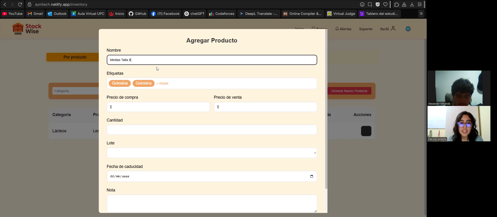</th>
    <td colspan="3">
         Alexander Miranda Vivanco, encargado de la venta de textiles, compartió su experiencia utilizando la aplicación para la gestión de emprendimienntos, destacando la facilidad de uso tanto para el historial de productos como el apartado de creación de un producto. Consideró que el diseño visual era adecuado y sencillo, aunque sugirió complementar ciertas funcionalidades y hacerlo más intuitivo. En especial el diseño del excel exportado. Opinó que la visualización de fechas de vencimiento y la organización de productos por lote fueron las funcionalidades más valiosas de la aplicación.
    </td>
  </tr>
  <tr>
    <th>URL de la grabación</th>
    <td colspan="3">
      <a href="https://upcedupe-my.sharepoint.com/:v:/g/personal/u202313773_upc_edu_pe/EYijLd_IDRlAoVIRmB0haHQB_BFtGINS912uRbLgy1pacg?nav=eyJyZWZlcnJhbEluZm8iOnsicmVmZXJyYWxBcHAiOiJPbmVEcml2ZUZvckJ1c2luZXNzIiwicmVmZXJyYWxBcHBQbGF0Zm9ybSI6IldlYiIsInJlZmVycmFsTW9kZSI6InZpZXciLCJyZWZlcnJhbFZpZXciOiJNeUZpbGVzTGlua0NvcHkifX0&e=ImTGHo">
        Ver grabación
      </a>
    </td>
  </tr>
  <tr>
   <th>Timing</th>
    <td colspan="3">
        17:42 - 23:07
    </td>
  </tr>
</table>

<table border="1">
  <tr>
    <th>Entrevista</th>
    <td>5</td>
    <th>Nombre</th>
    <td>Juan Carlos Ramírez</td>
  </tr>
  <tr>
    <th>Edad</th>
    <td>49</td>
    <th>Distrito</th>
    <td>Surquillo</td>
  </tr>
  <tr>
    <th>Captura de la entrevista: </th>
    <td colspan="3">
        ...
    </td>
  </tr>
  <tr>
    <th>URL de la grabación</th>
    <td colspan="3">
      <a href="---">
        Ver grabación
      </a>
    </td>
  </tr>
  <tr>
   <th>Timing</th>
    <td colspan="3">
        17:11 - 20:45
    </td>
  </tr>
</table>

<table border="1">
  <tr>
    <th>Entrevista</th>
    <td>6</td>
    <th>Nombre</th>
    <td>Maria Paula</td>
  </tr>
  <tr>
    <th>Edad</th>
    <td>23</td>
    <th>Distrito</th>
    <td>Los Olivos</td>
  </tr>
  <tr>
    <th>Captura de la entrevista: </th>
    <td colspan="3">
        Nuestra entrevistada Maria Pilares, después de observar y probar tanto la landing page y la aplicación web de nuestro proyecto, nos cuenta que le gusto la idea, ya que es llamativa y esta lo que necesita. Sin embargo, nos cuenta que punto de vista de emprendor, en este caso del sector textil, hay funcionalidades que le faltarían para sus productos, ya que ahí la mayoría de productos no se vencen, solo se gastan ya que son telas. Lo que más le llamo la atención fue la sección de alerta stock del producto, que es algo que realmente es útil para emprendedores.
    </td>
  </tr>
  <tr>
    <th>URL de la grabación</th>
    <td colspan="3">
      <a href="https://drive.google.com/file/d/1VQSyyc5wOJ0KoNuTVDFbdjuiJ4JwRTOf/view?usp=sharing">
        Ver grabación
      </a>
    </td>
  </tr>
  <tr>
   <th>Timing</th>
    <td colspan="3">
        00:00 - 09:51
    </td>
  </tr>
</table>


## 5.4.	Video About-the-Product
A continuación, presentaremos el video About-the-Product en el cual se detalla la propuesta de valor de StockWise así como el flujo de la solución junto con testimonios de usuarios.

<br>
Captura de la entrevista: <br>

<br>
<a href="https://www.youtube.com/watch?v=gKQCMO4rORw&ab_channel=CamilaSanchez">Ver grabación</a>


# Conclusiones 
El desarrollo de las funcionalidades propuestas para StockWise responde a las necesidades reales de emprendedores, pymes y startups que buscan optimizar su gestión de inventarios de manera simple, rápida y eficiente. A través de un enfoque centrado en el usuario, se priorizan características esenciales como el control de stock, la generación de alertas inteligentes, reportes visuales y una experiencia de uso intuitiva. Además, la estrategia de diferenciación frente a la competencia, basada en la simplicidad, accesibilidad y enfoque especializado, refuerza el potencial de StockWise para posicionarse como una solución líder en el mercado latinoamericano. Con esta base sólida, el proyecto avanza hacia la creación de una plataforma de alto valor, adaptable y preparada para el crecimiento continuo.

Como primer punto de contaco con los usuarios, se diseño una landing page clara, atractiva y que esta orientada al marketing digital. Esta página, su propósito es presentar StockWise de forma llamativa, destacando sus características y en que se diferencia la competencia. El contendio de la landing fue pensada para captar la atención de gente una bodega tanto como para emprendedores con llamados de acción para ser participe de forma sencilla.

En cuanto al frontend, se avanzó la construcción de una interfaz web moderna, que sea responsiva y sea fácil de utilizar. Acá se aplicaron principio de diseño centrado en el usuario, junto a una estructura basada en componentes reutilizables, lo que permite mantener un flujo de navegación claro y accesible.

Por último, en el backend, se ha desarrollado una arquitectura robusta y escalable utilizando C# como lenguaje de programación, esta organizada en capas y con principios de porgrmación orientada a objetos. Se implementaros, servicios y controladores que gestión operaciones relacionadas al stock, usuarios y reportes.

En conclusión, actualmente StocWise tiene un avance que refleja un progreso significativo, que da una solución integral, accesible y de alto valor para el mercado Peruano. Además, StockWise se diferencia de otras soluciones por ser simple de usar, enfocarse en negocios específicos y ser accesible para emprendedores. Gracias a esta base sólida, el proyecto está bien encaminado para seguir creciendo, llegar a más usuarios y sumar nuevas funciones útiles según lo que necesiten.

# Bibliografía
1. Dux Software. (2025, 9 abril). *Dux Software: El Sistema de Gestión para tu Negocio.* https://www.duxsoftware.com.ar/
2. Mecalux. (s. f.). *Store fulfillment.* Mecalux.pe. https://www.mecalux.pe/software/store-fulfillment
3. SoftDoIt. (s. f.). *▷Vendus: agiliza la gestión de tu punto de venta.* https://www.softwaredoit.es/vendus/vendus.html


# Anexos
**Video exposición TB1:** [Acceder al video de exposición](https://upcedupe-my.sharepoint.com/:f:/g/personal/u202313773_upc_edu_pe/EqhFMC87TlFMvlVc0wcPAeQBE8BXdNH1AMkYj5IQpp2erg?e=1hti0f)

**Video exposición TB2:** [Acceder al video de exposición](..)

**Video About the Product:** [Acceder al video de exposición](https://youtu.be/gKQCMO4rORw)

**Repositorio:** [AyniTech (GitHub)](https://github.com/upc-pre-202510-1asi0730-4366-AyniTech)
