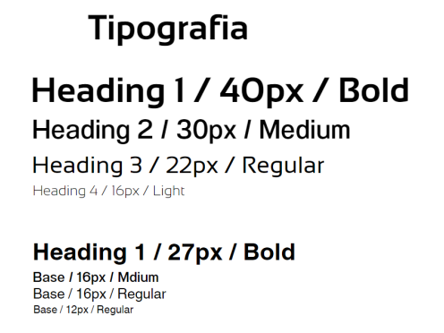

# <center>COURSE PROJECT</center>

<p align="center">
    <strong>Universidad Peruana de Ciencias Aplicadas</strong><br>
    </img><br>
    <strong>Ingeniería de Software - 2025-1</strong><br>
    <strong>Aplicaciones Web - 4366</strong><br>
    <strong>Profesor: Alex Humberto Sánchez Ponce</strong><br>
    <br><strong>Informe del Trabajo Final</strong>
</p>

</p>

<p align="center">
    <strong>Startup: AyniTech</strong><br>
    <strong>Producto: Stock Wise  </strong>
</p>

<div style="text-align:center;">
    <h3>Team Members:</h3>
    <table align="center">
        <tr>
            <th style="text-align:center;">Member</th>
            <th style="text-align:center;">Code</th>
        </tr>
        <tr>
            <td>Jocelyn Damaly Almerco Rojas</td>
            <td>U20221g068</td>
        </tr>
        <tr>
            <td>Sanchez Rios, Camila Cristina</td>
            <td>U202210973</td>
        </tr>
        <tr>
            <td>Henry Kalet Esteban Roman</td>
            <td>U202310210</td>
        </tr>
        <tr>
            <td>Maria Fernanda Peña Riofrio</td>
            <td>U202113279</td>
        </tr>
        <tr>
            <td>Fabiola Del Rocio Saldaña Ayala</td>
            <td>U202313773</td>
        </tr>
        <tr>
            <td>Sebastian Alonso Bustinza Muñoz</td>
            <td>U202123362</td>
        </tr>
    </table>
</div>

<p align="center">
    <strong>Abril, 2025</strong>
</p>
<br>
<br><br><br><br><br><br><br><br><br><br><br><br><br><br><br><br><br><br><br><br><br>
<h1 align="center">Registro de versiones del Informe</h1>
</br>
<table>
        <thead>
            <tr>
                <th>Versión</th>
                <th>Fecha</th>
                <th>Autor</th>
                <th>Descripción de modificaciones</th>
            </tr>
        </thead>
        <tbody>
            <tr>
                <th>TB1</th>
                <td>07/04/2025</td>
                <td>
                    <ul>
                      <li>Jocelyn Damaly Almerco Rojas</li>
                      <li>Camila Sanchez</li>
                      <li>Maria Fernanda Peña</li>
                      <li>Fabiola Del Rocio Saldaña Ayala</li>
                      <li>Henry Kalet Esteban Roman</li>
                    <ul>
           </td>
                         <td>            
             <ul>
          <li>Capítulo I: Introducción</li>
          <li>Capítulo II: Requirements Elicitation & Analysis</li>
          <li>Capítulo III: Requirements Specification</li>
          <li>Capítulo IV: Product Design</li>
          <li>Avance del Capítulo V: Product Implementation, Validation & Deployment hasta el punto 5.2.1.8</li>
          <li>Avance de Conclusiones, Bibliografía y Anexos</li>
        </ul>
      </td>
                        <tr>
                <th>TP1</th>
                <td>15/05/2025</td>
                <td>
                    <ul>
                      <li>Jocelyn Damaly Almerco Rojas</li>
                      <li>Camila Sanchez</li>
                      <li>Maria Fernanda Peña</li>
                      <li>Fabiola Del Rocio Saldaña Ayala</li>
                      <li>Henry Kalet Esteban Roman</li>
                      <li>Sebastian Alonso Bustinza Muñoz</li>
                    <ul>
           </td>
      <td>            
             <ul>
          <li>Capítulo V: Sprint 2 Web Application - Frontend</li>
          <li>Mejoras continuas</li>
          <li>Avance del Capítulo V: Product Implementation, Validation & Deployment hasta el punto 5.2.1.8</li>
          <li>Avance de Conclusiones, Bibliografía y Anexos</li>
        </ul>
      </td>
  </tr>
</tbody>
</table>

# Project Report Collaboration Insights
[Link de repositorio del reporte:](https://github.com/upc-pre-202510-1asi0730-4366-AyniTech/Report): https://github.com/upc-pre-202510-1asi0730-4366-AyniTech/Report

# Contenido
[Student Outcome](#student-outcome)

[Capítulo I: Introducción](#capítulo-i-introducción)
- [1.1. Startup Profile](#11-startup-profile)
  - [1.1.1. Descripción de la Startup](#111-descripción-de-la-startup)
  - [1.1.2. Perfiles de integrantes del equipo](#112-perfiles-de-integrantes-del-equipo)
- [1.2. Solution Profile](#12-solution-profile)
  - [1.2.1 Antecedentes y problemática](#121-antecedentes-y-problemática)
  - [1.2.2 Lean UX Process](#122-lean-ux-process)
    - [1.2.2.1. Lean UX Problem Statements](#1221-lean-ux-problem-statements)
    - [1.2.2.2. Lean UX Assumptions](#1222-lean-ux-assumptions)
    - [1.2.2.3. Lean UX Hypothesis Statements](#1223-lean-ux-hypothesis-statements)
    - [1.2.2.4. Lean UX Canvas](#1224-lean-ux-canvas)
- [1.3. Segmentos objetivo](#13-segmentos-objetivo)

[Capítulo II: Requirements Elicitation & Analysis](#capítulo-ii-requirements-elicitation--analysis)
- [COURSE PROJECT](#course-project)
- [Project Report Collaboration Insights](#project-report-collaboration-insights)
- [Contenido](#contenido)
- [Student Outcome](#student-outcome)
- [Capítulo I: Introducción](#capítulo-i-introducción)
  - [1.1. Startup Profile](#11-startup-profile)
    - [1.1.1. Descripción de la Startup](#111-descripción-de-la-startup)
    - [1.1.2. Perfiles de integrantes del equipo](#112-perfiles-de-integrantes-del-equipo)
  - [1.2. Solution Profile](#12-solution-profile)
    - [1.2.1 Antecedentes y problemática](#121-antecedentes-y-problemática)
    - [1.2.2 Lean UX Process](#122-lean-ux-process)
      - [1.2.2.1. Lean UX Problem Statements](#1221-lean-ux-problem-statements)
      - [1.2.2.2. Lean UX Assumptions](#1222-lean-ux-assumptions)
      - [1.2.2.3. Lean UX Hypothesis Statements](#1223-lean-ux-hypothesis-statements)
      - [1.2.2.4. Lean UX Canvas](#1224-lean-ux-canvas)
  - [1.3. Segmentos objetivo](#13-segmentos-objetivo)
- [Capítulo II: Requirements Elicitation \& Analysis](#capítulo-ii-requirements-elicitation--analysis)
  - [2.1. Competidores](#21-competidores)
    - [2.1.1. Análisis competitivo](#211-análisis-competitivo)
    - [2.1.2. Estrategias y tácticas frente a competidores](#212-estrategias-y-tácticas-frente-a-competidores)
  - [2.2. Entrevistas](#22-entrevistas)
    - [2.2.1. Diseño de entrevistas](#221-diseño-de-entrevistas)
    - [2.2.2. Registro de entrevistas](#222-registro-de-entrevistas)
    - [2.2.3. Análisis de entrevistas](#223-análisis-de-entrevistas)
  - [2.3. Needfinding](#23-needfinding)
    - [2.3.1. User Personas](#231-user-personas)
    - [2.3.2. User Task Matrix](#232-user-task-matrix)
    - [2.3.3. User Journey Mapping](#233-user-journey-mapping)
    - [2.3.4. Empathy Mapping](#234-empathy-mapping)
    - [2.3.5. As-is Scenario](#235-as-is-scenario)
  - [2.4. Ubiquitous Language](#24-ubiquitous-language)
- [Capítulo III: Requirements Specification](#capítulo-iii-requirements-specification)
  - [3.1. To-Be Scenario Mapping](#31-to-be-scenario-mapping)
  - [3.2. User Stories](#32-user-stories)
    - [Technical Stories](#technical-stories)
  - [3.3. Impact Mapping](#33-impact-mapping)
    - [Segmento Objetivo 1: Bodegas especializadas por rubro](#segmento-objetivo-1-bodegas-especializadas-por-rubro)
    - [Segmento Objetivo 2: Startups y emprendedores en expansión con necesidades logísticas](#segmento-objetivo-2-startups-y-emprendedores-en-expansión-con-necesidades-logísticas)
  - [3.4. Product Backlog](#34-product-backlog)
- [Capítulo IV: Product Design](#capítulo-iv-product-design)
  - [4.1. Style Guidelines](#41-style-guidelines)
    - [4.1.1. General Style Guidelines](#411-general-style-guidelines)
    - [4.1.2. Web Style Guidelines](#412-web-style-guidelines)
  - [4.2. Information Architecture](#42-information-architecture)
    - [4.2.1. Organization Systems.](#421-organization-systems)
    - [4.2.2. Labeling Systems.](#422-labeling-systems)
    - [4.2.3. SEO Tags and Meta Tags](#423-seo-tags-and-meta-tags)
    - [4.2.4. Searching Systems.](#424-searching-systems)
    - [4.2.5. Navigation Systems.](#425-navigation-systems)
  - [4.3. Landing Page UI Design.](#43-landing-page-ui-design)
    - [4.3.1. Landing Page Wireframe.](#431-landing-page-wireframe)
    - [4.3.2. Landing Page Mock-up.](#432-landing-page-mock-up)
  - [4.4. Web Applications UX/UI Design.](#44-web-applications-uxui-design)
    - [4.4.1. Web Applications Wireframes.](#441-web-applications-wireframes)
    - [4.4.2. Web Applications Wireflow Diagrams.](#442-web-applications-wireflow-diagrams)
    - [4.4.2. Web Applications Mock-ups.](#442-web-applications-mock-ups)
    - [4.4.3. Web Applications User Flow Diagrams.](#443-web-applications-user-flow-diagrams)
  - [4.5. Web Applications Prototyping.](#45-web-applications-prototyping)
  - [4.6. Domain-Driven Software Architecture.](#46-domain-driven-software-architecture)
    - [4.6.1. Software Architecture Context Diagram.](#461-software-architecture-context-diagram)
    - [4.6.2. Software Architecture Container Diagrams.](#462-software-architecture-container-diagrams)
    - [4.6.3. Software Architecture Components Diagrams.](#463-software-architecture-components-diagrams)
  - [4.7. Software Object-Oriented Design.](#47-software-object-oriented-design)
    - [4.7.1. Class Diagrams.](#471-class-diagrams)
    - [4.7.2. Class Dictionary.](#472-class-dictionary)
  - [4.8. Database Design.](#48-database-design)
    - [4.8.1. Database Diagram.](#481-database-diagram)
- [Capítulo V: Product Implementation, Validation \& Deployment](#capítulo-v-product-implementation-validation--deployment)
  - [5.1. Software Configuration Management.](#51-software-configuration-management)
    - [5.1.1. Software Development Environment Configuration](#511-software-development-environment-configuration)
    - [5.1.2. Source Code Management.](#512-source-code-management)
    - [5.1.3. Source Code Style Guide \& Conventions.](#513-source-code-style-guide--conventions)
    - [5.1.4. Software Deployment Configuration.](#514-software-deployment-configuration)
  - [5.2. Landing Page, Services \& Applications Implementation](#52-landing-page-services--applications-implementation)
    - [5.2.1. Sprint 1](#521-sprint-1)
      - [5.2.1.1. Sprint Planning 1](#5211-sprint-planning-1)
      - [5.2.1.2. Aspect Leaders and Collaborators.](#5212-aspect-leaders-and-collaborators)
      - [5.2.1.3. Sprint Backlog n.](#5213-sprint-backlog-n)
      - [5.2.1.4. Development Evidence for Sprint Review.](#5214-development-evidence-for-sprint-review)
      - [5.2.1.5. Execution Evidence for Sprint Review.](#5215-execution-evidence-for-sprint-review)
      - [5.2.1.6. Services Documentation Evidence for Sprint Review.](#5216-services-documentation-evidence-for-sprint-review)
      - [5.2.1.7. Software Deployment Evidence for Sprint Review.](#5217-software-deployment-evidence-for-sprint-review)
      - [5.2.1.8. Team Collaboration Insights during Sprint.](#5218-team-collaboration-insights-during-sprint)
- [Conclusiones](#conclusiones)
  - [Conclusiones y recomendaciones.](#conclusiones-y-recomendaciones)
- [Conclusiones](#conclusiones-1)
- [Bibliografía](#bibliografía)
- [Anexos](#anexos)

# Student Outcome

ABET – EAC - Student Outcome 5

Criterio: La capacidad de funcionar efectivamente en un equipo cuyos miembros juntos proporcionan liderazgo, crean un entorno de colaboración e inclusivo, establecen objetivos, planifican tareas y cumplen objetivos.

<table>
  <tr>
    <td><b>Criterio específico</b></td>
    <td><b>Acciones realizadas</b></td>
    <td><b>Conclusiones</b></td>
  </tr>
    </thead>
  <tbody>
    <tr>
      <td><b>Trabaja en equipo para <br>
      proporcionar liderazgo en <br> 
      forma conjunta.</b></td>
      <td>
<p><b>Henry Kalet Esteban Roman</b></p>
        <p><b>TB1:</b>Asumí un rol activo<br>
        de liderazgo dentro del equipo,<br>
        tomando la iniciativa con el<br>
         apartado de Antecedentes y<br>
        Problemática, así comoen la <br>
        definición de los segmentos.<br>
        objetivo Esto permitió al<br>
        grupo tener una base para el<br> 
        enfoque del proyecto. También<br>
        lideré la elaboración del<br>
        To-be Scenario Mapping<br>
        y participé activamente con<br>
        user stories y el diseño de<br>
        wireframesy mockups, <br>
        promoviendo una visión común<br>
        del producto final.</p>
        <p></p>
        <p><b>TP1:</b>Durante el Sprint 2
        , demostré<br>
         liderazgo
         <br> compartido<br>
         dentro del equipo al participar <br>
         activamente en la toma de<br>
          decisiones clave relacionadas con <br>
          el diseño e implementación de la <br>funcionalidad de inventario. Coordiné con mis <br>
          compañeros la asignación de<br>
           tareas según las <br>
          fortalezas individuales,<br>
           promoví espacios de <br>
          retroalimentación técnica y me <br>
          aseguré de que <br>
          todos los miembros comprendieran <br>
          el objetivo común.<br>
           Esta colaboración no solo fortaleció <br>
           la cohesión del equipo,<br>
            sino que también<br>
             permitió avanzar<br>
             de manera eficiente en la construcción <br>
             de una solución técnica <br>funcional.</p>
        <p>,..</p>
        <p><b>TB2:</b></p>
        <p>.</p>
        <p><b>TF:</b></p>
        <p>.</p>
       <p><b>Fabiola del Rocio Saldaña Ayala</b></p>
         <p><b>TB1:</b> Colaboré con el desarrollo del<br> 
         needfinding para el cual tuve que<br>
         coordinar con mi grupo para definir <br>
         bien a nuestros user personas y sus<br>
         necesidades. También apoyé en el<br> 
         diseño del c4 y en el apartado<br>
         Software Object-Oriented Design</p>
        <p></p>
        <p><b>TP1:</b>Colaboré con el desarrollo de<br> 
         las pantallas como el dashboard y el<br>
         perfil de usuario. También ayudé para<br>
         unir el código.</p>
        <p></p>
        <p><b>TB2:</b></p>
        <p></p>
        <p><b>TF:</b></p>
        <p>.</p>
        <p><b>Camila Sanchez Rios</b></p>
        <p><b>TB1:</b></p>
        <p>Me encargue de crear la organización<br>
        y los repositorios en el github. Colabore<br>
        con Capítulo IV: Product Design (Landing<br>
        y Web), Capitulo III: User Stories,<br>
        Capitulo II: Entrevistas<br></p>
        <p><b>TP1:</b></p>
        <p>Aporte con la creacion del repositorio y los archivos para esta entrega, colabore con la rama iam que abarca el Registro e Iniciar Sesion del usuario, ayude a desplegar la pagina web una vez unido y con las actualizaciones del capitulo 5</p>
        <p><b>TB2:</b></p>
        <p></p>
        <p><b>TF:</b></p>
        <p>.</p>
        <p><b>Maria Fernanda Peña Riofrio</b></p>
        <p><b>TB1:</b></p>
        <p>Me encargue del anális competitivo<br>
        y a definir estrategías frente a<br>
        competidores.
        </p>
        <p><b>TP1:</b>Colaboré con el desarrollo de<br> 
         una pantalla como el Kits de productos.<br>
        </p>
        <p></p>
        <p><b>TB2:</b></p>
        <p></p>
        <p><b>TF:</b></p>
        <p></p>
        <p><b>Jocelyn Damaly Almerco Rojas</b></p>
        <p><b>TB1:</b></p>
        <p>Me encargué de la elaboración de <br>
        los diagramas C4, apoyé en el registro<br>
        de entrevistas y también colaboré en el<br>
        desarrollo de wireframes y mockups.<br></p>
        <p><b>TP1:</b></p>
        <p>Durante el proyecto, trabajé en equipo implementando la vista de history, donde hice dos cartas para el stock y el otro para el producto. Además ayudé en los user stories. Además colaboré con el ppt y en el informe grupal.</p>
        <p><b>TB2:</b></p>
        <p></p>
        <p><b>TF:</b></p>
        <p></p>
        <p><b>Sebastian Alonso Bustinza Muñoz</b></p>
        <p><b>TB1:</b></p>
        <p>...</p>
        <p><b>TP1:</b></p>
        <p>Durante el proyecto, trabajé en equipo implementando la vista de Stock Alert y aplicando mejoras continuas para optimizar su funcionamiento. También colaboré activamente en la elaboración del informe grupal, aportando ideas y apoyando la coordinación de tareas.</p>
        <p><b>TB2:</b></p>
        <p>...</p>
        <p><b>TF:</b></p>
        <p>...</p>
      </td>
      <td>
        <p><strong>TB1:</strong> Nosotros demostramos un liderazgo<br>
        compartido y una colaboración efectiva, <br>
        estableciendo objetivos claros, <br>
        planificando tareas de manera<br>
        organizada y cumpliendo los <br>
        entregables en los plazos establecidos.</p>
        <p><strong>TP1:</strong> Seguimos demostrando liderazgo, </p>
        compromiso y solidaridad con<br>
        nuestros compañeros cuando tienen<br>
        dificultades durante el desarrollo<br>
       de esta entrega.
                <p>.</p>
        <p><strong>TB2:</strong></p>
        <p></p>
        <p><strong>TF:</strong></p>
        <p></p>
      </td>
    </tr>
    <tr>
      <td><b>Crea un entorno colaborativo e <br>
inclusivo, estable metas, planifica tareas <br>
y cumple objetivos.</b></td>
      <td>
        <p><b>Henry Kalet Esteban Román</b></p>
        <p><b>TB1:</b>Fomenté un entorno<br>
        colaborativo al integrar los aportes<br>
        de mis compañeros durante la edición<br>
        y análisis de entrevistas. Coordiné<br>
        con el equipo para definir a nuestros<br>
        user personas dentro del needfinding<br>
        asegurando que todas las voces fueran<br>
        consideradas. Además, apoyé en el<br>
        apartado Software Object-Oriented<br>
        Design, cumpliendo con los objetivos<br>
        establecidos en los plazos definidos.<br></p>
        <p></p>
        <p><b>TP1:</b>Para el desarrollo<br>
         de la funcionalidad de inventario<br>
         , contribuí a la creación de un <br>
         entorno inclusivo donde todas las<br>
          ideas fueron consideradas y<br>
           discutidas abiertamente. Propusimos<br>
            metas claras para el sprint, <br>
            como completar el diseño de<br>
             interfaz del módulo,<br>
              implementar el backend<br>
               de registro de lotes y<br>
             realizar pruebas funcionales.<br>
              A través de herramientas<br>
               de planificación como el <br>
               backlog priorizado y<br>
                reuniones de revisión, <br>
                logramos cumplir con los<br>
                 objetivos establecidos, <br>
                 garantizando que el <br>
                 módulo de inventario <br>
                 funcione correctamente<br>
                  y se integre con el sistema<br>
                   general de manera efectiva.</p>
        <p>..</p>
        <p><b>TB2:</b></p>
        <p>..</p>
        <p><b>TF:</b></p>
        <p>..</p>
        <p><b>Fabiola del Rocio Saldaña Ayala</b></p>
         <p><b>TB1:</b> Coordiné con mis compañeros<br> 
         para el desarrollo del needfinding<br>
         y para todos el apartado de  Software <br> 
         Object-Oriented Design<br></p>
        <p></p>
        <p><b>TP1:</b>Coordiné con mis compañeros<br> 
         para la distribución de pantallas<br>
         en base a los bounded contexts y <br>
         en el desarrollo de las pantallas.<br></p>
        <p>..</p>
        <p><b>TB2:</b></p>
        <p>...</p>
        <p><b>TF:</b></p>
        <p>.</p>
        <p><b>Camila Sanchez Rios</b></p>
        <p><b>TB1:</b></p>
        <p>Me encargue de crear la organización<br>
        y los repositorios en el github. Colabore<br>
        con Capítulo IV: Product Design (Landing<br>
        y Web), Capitulo III: User Stories,<br>
         Capitulo II: Entrevistas<br></p>
        <p><b>TP1:</b></p>
        <p>Aporte con la creacion del repositorio y los archivos para esta entrega, colabore con la rama iam que abarca el Registro e Iniciar Sesion del usuario, ayude a desplegar la pagina web una vez unido y con las actualizaciones del capitulo 5</p>
        <p><b>TB2:</b></p>
        <p>...</p>
        <p><b>TF:</b></p>
        <p>.</p>
        <p><b>Maria Fernanda Peña Riofrio</b></p>
        <p><b>TB1:</b></p>
        <p>Coordine el diseño y análisis de <br>
        entrevistas, propuse términos para <br>
        el ubiquitous language y ayudé a <br> 
        distribuir tareas dentro del equipo  <br> 
        </p>
        <p><b>TP1:</b>Coordiné con mis compañeros<br> 
         sobre la distribución de pantallas<br>
         creando un entorno colaborativo<br>
         entre todos.<br></p>
        <p><b>TB2:</b></p>
        <p>...</p>
        <p><b>TF:</b></p>
        <p>...</p>
        <p><b>Jocelyn Damaly Almerco Rojas</b></p>
        <p><b>TB1:</b></p>
        <p>Estuve atento a las reuniones y me<br>
         encargué de registrar mi entrevista a<br>
        tiempo. Además, participé en las reuniones<br>
        de coordinación y evaluación de las user<br>
        stories, con el objetivo de elaborar los<br>
        wireframes y mockups."</p>
        <p><b>TP1:</b></p>
        <p>Contribuí creando la pantalla de historial, aplicando el orden adecuado de las carpetas y también colaborando en la redacción del informe grupal.</p>
        <p><b>TB2:</b></p>
        <p>...</p>
        <p><b>TF:</b></p>
        <p>...</p>
        <p><b>Sebastian Alonso Bustinza Muñoz</b></p>
        <p><b>TB1:</b></p>
        <p>...</p>
        <p><b>TP1:</b></p>
        <p>Contribuí activamente creando la vista de Stock Alert, aplicando mejoras continuas y colaborando en la redacción del informe grupal. Estas acciones me permitieron fomentar un entorno colaborativo e inclusivo, ayudando a definir metas claras, planificar tareas en conjunto.</p>
        <p><b>TB2:</b></p>
        <p>...</p>
        <p><b>TF:</b></p>
        <p>...</p>
      </td>
       <td>
        <p><strong>TB1:</strong> Nosotros creamos un entorno colaborativo e<br>
        inclusivo, establecimos metas claras,<br>
         planificamos las tareas de manera <br>
         eficiente y cumplimos todos los<br>
          objetivos dentro de los plazos acordados.<br></p>
        <p><strong>TP1:</strong> Hemos creamos un entorno colaborativo y<br>
        unido donde todos hemos colaborado y<br>
        hemos cumplido con las metas propuestas.<br></p>
        <p><strong>TB2:</strong></p>
        <p>..</p>
        <p><strong>TF:</strong></p>
        <p>...</p>
      </td>
    </tr>

  </tbody>
</table>

# Capítulo I: Introducción
## 1.1. Startup Profile

### 1.1.1. Descripción de la Startup
StockWise es una plataforma web de gestión de inventarios dirigida a pequeñas y medianas empresas, startups y bodegas especializadas. Su objetivo principal es facilitar el control eficiente de entradas y salidas de productos, la gestión de usuarios, la configuración de alertas inteligentes y la generación de reportes detallados, todo a través de una interfaz intuitiva y accesible desde cualquier dispositivo.

La solución responde a una problemática concreta: muchos negocios aún utilizan métodos manuales (como hojas de cálculo o registros en papel) para administrar sus inventarios, lo cual genera errores, desorganización, sobrecompras y pérdidas económicas. StockWise busca resolver este problema digitalizando y centralizando el control del inventario, permitiendo a los negocios tomar decisiones basadas en datos y optimizar su operación.

<br>
<b>Misión: </b>Brindar a pequeñas y medianas empresas una solución de gestión de inventarios sencilla, accesible y eficiente, que les permita digitalizar su operación, reducir errores logísticos y tomar decisiones basadas en datos reales, apoyando así su crecimiento sostenible.

<br>
<b>Visión: </b>StockWise se enfoca en ser la plataforma preferida de los empresarios que buscan una gestión de inventarios, herramientas de alto valor con un modelo escalable, adaptable y centrado en el usuario.

### 1.1.2. Perfiles de integrantes del equipo
<table>
  <tr>
    <th>
      
    </th>
    <td valign="top">
      <p><b>Jocelyn Damaly Almerco Rohas</b></p>
      <p>
        Soy estudiante de Ingeniería de Software y actualmente curso el 5to ciclo. En mi tiempo libre me gusta tocar ukelele, leer libros, resolver sudoku, escuchar música y ver series.
      </p>
    </td>
  </tr>
  <tr>
    <th>
      
    </th>
    <td valign="top">
      <p><b>Saldaña Ayala, Fabiola del Rocio</b></p>
      <p>
        Soy estudiante de la carrera de Ingeniería de Software, actualmente me encuentro en el quinto ciclo. Me gusta viajar, aprender nuevos idiomas, leer y me interesa aprender más acerca de nuevas tecnologías.
      </p>
    </td>
  </tr>
  <tr>
    <th>
      
    </th>
    <td valign="top">
      <p><b>Sánchez Ríos, Camila Cristina</b></p>
      <p>
        Soy estudiante de la carrera de Ingeniería de Software en la Universidad Peruana de Ciencias Aplicadas, actualmente me encuentro en el setimo ciclo. Me gusta escuchar música y leer en los ratos libres y aprender más sobre la carrera.
      </p>
    </td>
  </tr>
  <tr>
    <th>
      
    </th>
    <td valign="top">
      <p><b>Peña Riofrio, Maria Fernanda</b></p>
      <p>
        Soy estudiante de la carrera de Ingeniería de Software en la Universidad Peruana de Ciencias Aplicadas, actualmente me encuentro en el sexto ciclo. En mismo tiempos libres me gusta leer sobre temas diversos y ver películas.
      </p>
    </td>
  </tr>
  <tr>
    <th>
      
    </th>
    <td valign="top">
      <p><b>Esteban Román, Henry Kalet</b></p>
      <p>
      Soy estudiante de la carrera de Ingeniería de Software. Actualmente me encunetro en 5to ciclo y me gusta mucho escuchar música y pasear.
      </p>
    </td>
  </tr>
    <tr>
    <th>
      
    </th>
    <td valign="top">
      <p><b>Bustinza Muñoz, Sebastian Alonso</b></p>
      <p>
      Mi nombre es Sebastian Alonso Bustinza Muñoz, tengo 23 años, estoy estudiando la carrera de ingeniería de software en la Universidad Peruana de Ciencias Aplicadas, elegí la carrera porque cuando era niño me encantaba la idea de viajar a otro mundo, me gustaría especializarme en Realidad Virtual.
      </p>
    </td>
  </tr>
</table>
<br>

## 1.2. Solution Profile
### 1.2.1 Antecedentes y problemática

- **Who (¿Quiénes?)**<br>
Emprendedores, startups y pequeñas/medianas empresas con bodegas físicas que almacenan productos de distintos rubros como ropa, calzado, electrodomésticos, ferretería o alimentos. 

- **What (¿Qué sucede?)**<br>
A medida que sus negocios escalan, la gestión manual del inventario con hojas de cálculo o registros físicos se vuelve ineficiente, generando pérdidas, errores, quiebres de stock, sobrecompras y desorden logístico.

- **When (¿Cuándo ocurre?)**<br>
En el momento en que el negocio empieza a crecer, aumentar su variedad de productos o abrir múltiples canales de venta, como tiendas físicas y plataformas online.

- **Where (¿Dónde ocurre?)**<br>
En bodegas físicas propias, espacios alquilados o incluso en el hogar del emprendedor, especialmente en etapas tempranas o de expansión del negocio.

- **Why (¿Por qué es un problema?)**<br>
La falta de un sistema centralizado y en tiempo real impide tomar decisiones estratégicas basadas en datos. Esto afecta la planificación de compras, genera pérdidas económicas, y daña la experiencia del cliente final.

- **How (¿Cómo lo solucionan hoy?)**<br>
Mediante herramientas manuales como hojas de Excel, inventarios escritos o software no especializado, que resultan limitados, propensos a errores y poco escalables.

- **How much (¿Cuánto cuesta no resolverlo?)**<br>
El costo se traduce en pérdidas económicas significativas por productos no vendidos, errores de stock, tiempo invertido en tareas manuales y menor competitividad frente a negocios más organizados.

### 1.2.2 Lean UX Process
#### 1.2.2.1. Lean UX Problem Statements
El propósito de StockWise es proporcionar una plataforma web intuitiva y accesible para que pequeñas y medianas empresas, startups y bodegas especializadas puedan gestionar su inventario de forma eficiente, digitalizada y sin complicaciones técnicas ni altos costos.

El problema se encuentra en que muchos de estos negocios aún dependen de métodos manuales como hojas de cálculo, cuadernos físicos o herramientas no especializadas para registrar y controlar su stock. Esto genera errores frecuentes, pérdidas de productos, compras innecesarias, falta de trazabilidad y escasa visibilidad sobre la operación logística.

Hemos observado que esta situación impacta negativamente en la productividad del negocio, la satisfacción del cliente y la capacidad de tomar decisiones basadas en datos. A medida que estos negocios escalan, el desorden operativo se vuelve insostenible, provocando sobrecostos y afectando su crecimiento.

¿Cómo podríamos diseñar una plataforma de gestión de inventarios que sea lo suficientemente simple, funcional y adaptable para cubrir las necesidades reales de estos negocios en expansión, facilitando el control del inventario, reduciendo errores y mejorando la toma de decisiones, con métricas que midan eficiencia operativa, precisión del stock y satisfacción del usuario?


#### 1.2.2.2. Lean UX Assumptions
Business Assumptions:

1.Creemos que los negocios emergentes necesitan digitalizar su gestión de inventarios.

2.Estas necesidades se pueden satisfacer con una plataforma web intuitiva, escalable y accesible.

3.Nuestros clientes iniciales serán emprendedores y start ups con bodegas especializadas.

4.El valor más importante que un cliente quiere de nuestros servicios es control y visibilidad de su inventario.

5.El cliente también va a obtener alertas inteligentes, reportes automáticos y una experiencia intuitiva.

6.Vamos a obtener la mayoría de los clientes mediante publicidad en línea  y asociaciones con comunidades de emprendedores.

7.Vamos a obtener ingresos mediante un modelo freemium con upgrade a planes premium.

8.Nuestra competencia en el mercado serán herramientas genéricas como Excel, Google Sheets y ERPs complejos.

9.Vamos a tener ventaja frente a nuestra competencia debido a nuestra simplicidad, enfoque en pymes, y especialización en inventarios.

10.El mayor riesgo del servicio es la baja adopción o la percepción de que es complejo o costoso.

11.Lo resolveremos realizando pruebas con usuarios reales, iteraciones constantes y una estrategia clara de onboarding.

**User Assumptions:**</br>
¿Quién es el usuario? Dueños de negocios, encargados de bodegas o logística en pymes/startups.

¿Qué problemas tiene nuestro producto que busca resolver? Falta de control de stock, errores manuales, sobrecostos, quiebres de stock.

¿Qué características son importantes? Registro de productos, historial de movimientos, alertas, reportes, roles y permisos.

¿Dónde encaja nuestro producto en su vida/trabajo? En la gestión diaria del inventario, decisiones de compra, y control de logística.

¿Cuándo y cómo es usado nuestro producto? A diario, desde computadoras o móviles, al inicio y cierre de turnos, y durante reposiciones.

¿Cómo debe verse y comportarse? Simple, rápida, intuitiva, con interfaz limpia, adaptable a cualquier dispositivo.

**Feature Assumptions:**

Creemos que la aplicación debe contar con una interfaz de usuario intuitiva y responsiva que permitirá a los encargados de almacén, emprendedores y administradores adoptarla sin dificultad, reduciendo la curva de aprendizaje.

Creemos que la plataforma debe proporcionar notificaciones y alertas personalizables (como stock bajo o fechas próximas de vencimiento) que mantendrán a los usuarios informados de manera oportuna para evitar errores logísticos y quiebres de stock.

Creemos que el sistema debe incluir herramientas de generación de reportes y gráficos que permitan visualizar fácilmente información clave del inventario (productos más rotados, niveles de stock, tendencias de ventas), ayudando a los usuarios a tomar decisiones informadas.

#### 1.2.2.3. Lean UX Hypothesis Statements

Creemos que los usuarios valorarán las alertas inteligentes.</br> sabremos que es cierto. 
</br>cuando recibamos al menos un 80% de los usuarios, un  feedback positivo y alta frecuencia de uso en esta funcionalidad.

Creemos que los usuarios encontrarán valiosos los reportes visuales.</br> sabremos que es cierto .
</br>cuando observemos mínimamente un 20% mayor retención y uso del módulo de reportes.

Creemos que ofrecer una versión gratuita con funcionalidades limitadas incentivará la adopción inicial.</br>
 sabremos que es cierto.</br>
  cuando el número de registros y usuarios activos supere nuestras métricas objetivo durante el primer mes.

Creemos que implementar alertas inteligentes por stock bajo y fechas de vencimiento reducirá los quiebres de stock.</br>
Sabremos que tenemos razón </br>
Cuando comparemos el número de productos con quiebre antes y después de la activación de alertas por parte del usuario.

#### 1.2.2.4. Lean UX Canvas

 

 *Imagen (N°1). Elaboración propia. Realizado en Canva*

## 1.3. Segmentos objetivo

**Segmento 1: Bodegas especializadas por rubro**

**Aspectos demográficos:**

- Sexo: Femenino, Masculino
- Edades: 28 a 50 años
- Nivel socioeconómico: Clases B y C
- Aspectos geográficos:
- Nacionalidad: Peruana
- Zona geográfica: Urbana
- Departamento: Lima Metropolitana y otras ciudades con fuerte actividad comercial

**Aspectos psicográficos:**

- Dirigen negocios mayoristas o minoristas que gestionan inventario con productos variados en tallas, colores, fechas de vencimiento o dimensiones técnicas.
- Enfrentan desafíos como alta rotación de productos, pérdidas por desorden o falta de trazabilidad y decisiones poco informadas de compra.
- Buscan soluciones para profesionalizar su operación, evitar errores y mantener el control del stock.
- Valoran herramientas tecnológicas, que les permite ordenar su inventario, recibir alertas según el tipo de producto y tomar decisiones basadas en reportes visuales y detallados

**Segmento 2: Startups y emprendedores en expansión con necesidades logísticas** 

**Aspectos demográficos:**

- Sexo: Masculino
- Edades: 20 a 30 años
- Nivel socioeconómico: Clases B y C
- Aspectos geográficos:
- Nacionalidad: Peruana
- Zona geográfica: Urbana
- Departamento: Lima Metropolitana y otras ciudades con fuerte actividad comercial

**Aspectos psicográficos:**

- Están en una etapa de crecimiento empresarial y buscan escalar su operación de manera eficiente.
- Tienen una mentalidad emprendedora y están dispuestos a invertir en herramientas que optimicen su logística.
- Reconocen que el desorden en su inventario afecta su productividad y atención al cliente.
- Valoran las soluciones tecnológicas que profesionalicen su negocio y les permitan competir a mayor escala.

Además de definir los segmentos por criterios psicográficos, hemos incorporado datos demográficos concretos para fundamentar mejor la selección de segmentos y mejorar las estrategias de mercado hacia los usuarios reales de nuestra app.

# Capítulo II: Requirements Elicitation & Analysis

## 2.1. Competidores
### 2.1.1. Análisis competitivo
   | **Elemento**                                                                 | **Stock Wise**                                                                                   | **MECALUX**                                                                                           | **VENDUS**                                                                                     | **DUX Software**                                                                                         |
|------------------------------------------------------------------------------|--------------------------------------------------------------------------------------------------|--------------------------------------------------------------------------------------------------------|------------------------------------------------------------------------------------------------|-----------------------------------------------------------------------------------------------------------|
| **¿Por qué llevar a cabo este análisis?**                                    | Este análisis se lleva a cabo con la finalidad de identificar a nuestros competidores y generar estrategias que nos diferencien, brindando información clave para tomar decisiones estratégicas en el desarrollo y crecimiento de nuestra aplicación. |                                                                                                        |                                                                                                        |                                                                                                            |
| **Perfil**                                                                   |                                                                                  |                                                                                                        |                                                                                                        |                                                                                                            |
| Overview                                                                     | Plataforma web para gestionar inventarios de pymes, startup y bodegas                           | Plataforma web especializada en soluciones logísticas e inventarios industriales                      | Plataforma web de punto de venta e inventario enfocada en pequeños comercios                  | Software peruano de gestión para negocios minoristas y distribuidores                                     |
| Ventaja Competitiva – ¿Qué valor ofrece a los clientes?                     | Fácil de usar, accesible, con alertas inteligentes y reportes visuales. Optimiza inventarios, reduce errores y mejora decisiones con datos en tiempo real | Tecnología avanzada y soluciones integrales para almacenes. Automatización del almacenamiento, control de stock en tiempo real | Facilidad de uso y precios accesibles. Ofrece una gestión rápida de ventas, inventario, facturación electrónica | Adaptado al mercado local. Ofrece control de inventarios, ventas y caja con cumplimiento tributario local |
| **Perfil de Marketing**                                                     |                                                                                                  |                                                                                                        |                                                                                                        |                                                                                                            |
| Mercado objetivo                                                             | Emprendedores y pymes                                                                           | Empresas medianas y grandes con necesidades logísticas complejas                                      | Tiendas pequeñas, emprendedores, minoristas                                                   | Comercios pequeños y medianos del Perú                                                                    |
| Estrategias de Marketing                                                     | Publicidad en redes sociales, alianzas con MYPES, contenido educativo                            | Ferias industriales, redes sociales                                                                    | Publicidad digital, redes sociales, prueba gratuita                                           | Marketing local, publicidad en redes, presencia en eventos MYPE                                           |
| **Perfil de Productos**                                                     |                                                                                                  |                                                                                                        |                                                                                                        |                                                                                                            |
| Productos & Servicios                                                        | Gestión de stock, alertas, reportes, control de usuarios, versión gratuita                      | Software de gestión de almacenes (WMS), estanterías, robots logísticos                                | POS, control de stock, reportes, gestión de clientes                                           | Gestión de stock, ventas, compras, reportes contables                                                    |
| Precios y Costos                                                             | Bajo costo inicial, modelo freemium con planes escalables                                       | Precios altos ya que tiene soluciones personalizadas según la empresa                                 | Modelos de suscripción mensuales accesibles desde 10 a 25 dólares                             | Modelos por licencia o suscripción, accesible para MYPES                                                 |
| Precios específicos                                                           | Plan gratuito / Plan básico desde $9.99/mes                                       | Desde $2000 por proyecto personalizado                                 | $9 mesual / $80 anual                           | $80 licencia única o $15 mensual                                                  |
| Canales de distribución (Web y/o Móvil)                                     | Web, soporte técnico local                                                                      | Web corporativa, atención directa con ejecutivos de ventas                                            | Web y app móvil, soporte técnico local                                                         | Web, soporte técnico local                                                                               |
| **Análisis SWOT**                                                            |                                                                                                  |                                                                                                        |                                                                                                        |                                                                                                            |
| Fortalezas                                                                   | Intuitiva, enfocada en negocios en crecimiento, funciones clave bien integradas                | Tecnología robusta, experiencia global, soluciones a medida                                           | Bajo costo, interfaz amigable, soporte en español                                             | Cumplimiento legal en Perú, lenguaje y enfoque local                                                     |
| Debilidades                                                                  | Marca nueva, validación en proceso                                                              | Costos elevados, poca accesibilidad para pymes                                                        | Funcionalidades limitadas frente a soluciones más avanzadas                                  | Poca expansión internacional, interfaz no tan moderna                                                    |
| Oportunidades                                                                | Alta demanda de digitalización en LATAM, posible integración con e-commerce                    | Expansión hacia software más accesible para negocios pequeños                                         | Crecimiento en mercados emergentes, integración con apps externas                            | Ampliación de módulos (delivery, e-commerce); expansión a LATAM                                          |
| Amenazas                                                                     | Competencia establecida, resistencia al cambio                                                  | Competencia con soluciones más simples y económicas                                                   | Alta competencia en el segmento de POS económicos                                             | Competencia extranjera con mejor tecnología y marketing                                                  |       
### 2.1.2. Estrategias y tácticas frente a competidores

StockWise destacar frente a la competencia aprovechando sus ventajas clave frente a competidores como Mecalux, Vendus y Dux Software. A continuación, se detallarán algunas estrategias y tácticas que podríamos considerar:

**Diferenciación del Producto:**

**Estrategia**: Resaltar los aspectos únicos de StockWise frente a competidores como Mecalux, Vendus y Dux Software.

**Táctica**: Enfatizar la simplicidad, accesibilidad y bajo costo del producto, junto con la oferta de una versión freemium que facilite la  adopción en negocios pequeños.

**Optimización de la experiencia del usuario**

**Estrategia:** Fomentar la satisfacción y fidelidad del usuario mediante una interfaz intuitiva y fácil de usar.

**Táctica**: Mejorar continuamente la interfaz de usuario, simplificando la navegación, e incorporar funcionalidades clave como alertas inteligentes y reportes visuales que faciliten la gestión.

**Expansión de la base de usuarios**

**Estrategia**: Atraer nuevos usuarios para incrementar la presencia de StockWise en el mercado de pymes y startups.

**Táctica**: Implementar un modelo freemium para incentivar la adopción inicial, y ejecutar campañas digitales dirigidas a pequeñas empresas que busquen una solución eficiente de gestión de inventarios.

## 2.2. Entrevistas

La finalidad de realizar entrevistas es obtener un alcance más completo sobre las experiencias, perspectivas y opiniones de los segmentos de mercado definidos. Nuestro objetivo es recolectar información valiosa que nos permita conocer mejor a nuestro público objetivo. Con estas entrevistas se tendrá una visión más clara de las necesidades y expectativas de nuestros usuarios.

### 2.2.1. Diseño de entrevistas

**Segmento #1: Bodegas especializadas por rubro**

**Preguntas principales**

1. ¿Podrías contarme cómo gestionas actualmente el inventario de tu bodega?
2. ¿Cuáles son los mayores retos que enfrentas al momento de organizar tus productos?
3. ¿Has tenido pérdidas o problemas por errores en el inventario? ¿Cómo los resolviste?
4. ¿Qué tan importante es para ti tener un control en tiempo real de tu stock?
5. ¿Utilizas algún sistema o herramienta digital? ¿Cuál y cómo te va con ella?

**Preguntas complementarias**

1. ¿Cómo te enteras cuando falta un producto o está a punto de vencerse?
2. ¿Qué tipo de reportes o información te gustaría tener sobre tu inventario?
3. ¿Qué dispositivos usas más en tu trabajo (laptop, celular, tablet)?
4. ¿Cómo crees que una plataforma digital podría ayudarte a mejorar tu operación?

**Segmento #2: Startups y emprendedores en expansión con necesidades logísticas**

**Preguntas principales**
1. ¿Cómo manejas actualmente el inventario de tu negocio?
2. ¿En qué momentos has sentido que el control del stock te limita o te hace perder tiempo?
3. ¿Cómo llevas el registro de entradas y salidas de productos?
4. ¿Qué te gustaría mejorar de tu proceso logístico actual?
5. ¿Has considerado usar alguna plataforma para gestionar tu inventario? ¿Por qué sí o por qué no?

**Preguntas complementarias**
1. ¿Qué herramientas digitales usas en tu negocio actualmente?
2. ¿Dónde almacenas tus productos?
3. ¿Qué tan seguido necesitas revisar el stock?
4. ¿Qué redes sociales o canales digitales usas para vender?


### 2.2.2. Registro de entrevistas

**Segmento 1: Bodegas especializadas por rubro**

<table border="1">
  <tr>
    <th>Entrevista</th>
    <td>1</td>
    <th>Nombre</th>
    <td>Milagros Almerco</td>
  </tr>
  <tr>
    <th>Edad</th>
    <td>28</td>
    <th>Distrito</th>
    <td>San Martín de Porres</td>
  </tr>
  <tr>
    <th>Captura de la entrevista: </th>
    <td colspan="3">
        En la entrevista, la estudiante Milagros Almerco comenta que lleva el control de su bodega en un cuaderno, anotando manualmente las ventas y compras. Reconoce que su sistema es básico y que a veces se olvida de registrar productos, lo que dificulta llevar un control claro del inventario. Además, le resulta complicado encontrar información específica entre tantas hojas. Señala como uno de sus principales problemas la falta de control sobre las fechas de vencimiento, lo que ha ocasionado pérdidas por productos que no logró vender a tiempo. También menciona que no siempre actualiza los cambios de precio. Para prevenir esto, trata de revisar los estantes y adelantar los productos por vencer. Respecto a herramientas digitales, indica que usa el celular y la calculadora por practicidad. Pero le gustaría contar con un sistema que le avise qué productos están por vencer, cuáles debe reponer y cómo están cambiando los precios. Además, considera importante poder visualizar su inventario en tiempo real. Le gustaría recibir alertas y reportes que le ayuden a organizar mejor su negocio.
    </td>
  </tr>
  <tr>
    <th>URL de la grabación</th>
    <td colspan="3">
      <a href="https://upcedupe-my.sharepoint.com/:v:/g/personal/u202310210_upc_edu_pe/EcdO_7IMHslJvnfLQriZz-ABm7y1EeoaVKtpaloN3Upm4A?e=2MviFe&nav=eyJyZWZlcnJhbEluZm8iOnsicmVmZXJyYWxBcHAiOiJTdHJlYW1XZWJBcHAiLCJyZWZlcnJhbFZpZXciOiJTaGFyZURpYWxvZy1MaW5rIiwicmVmZXJyYWxBcHBQbGF0Zm9ybSI6IldlYiIsInJlZmVycmFsTW9kZSI6InZpZXcifX0%3D">
        Ver grabación
      </a>
    </td>
  </tr>
  <tr>
   <th>Timing</th>
    <td colspan="3">
        05:24 -11:12
    </td>
  </tr>
</table>
<br>

<table border="1">
  <tr>
    <th>Entrevista</th>
    <td>2</td>
    <th>Nombre</th>
    <td>Elvis Aranga Mesa</td>
  </tr>
  <tr>
    <th>Edad</th>
    <td>31</td>
    <th>Distrito</th>
    <td>Santiago de Surco</td>
  </tr>
  <tr>
    <th>Captura de la entrevista: </th>
    <td colspan="3">
        Elvis Aranga Meza, de 31 años y encargado de la administración en su bodega en Santiago de Surco, gestiona el inventario de forma manual, sin un sistema digital, basándose en el control visual y el registro de ventas totales. Reconoce que esta falta de control sistematizado dificulta hacer proyecciones, identificar los productos con mayor rotación o margen de ganancia, y manejar adecuadamente las mermas, especialmente en productos perecibles como frutas y abarrotes. Ha enfrentado pérdidas por productos vencidos y robos, y señala la necesidad de implementar un sistema digital para actualizar precios en tiempo real, controlar vencimientos y facilitar la gestión por parte del personal. Considera que una plataforma digital mejoraría la eficiencia, permitiría delegar tareas y evitar errores en la rotación y precios, aportando mayor libertad y control en la operación diaria.
    </td>
  </tr>
  <tr>
    <th>URL de la grabación</th>
    <td colspan="3">
      <a href="https://upcedupe-my.sharepoint.com/:v:/g/personal/u202310210_upc_edu_pe/EcdO_7IMHslJvnfLQriZz-ABm7y1EeoaVKtpaloN3Upm4A?e=2MviFe&nav=eyJyZWZlcnJhbEluZm8iOnsicmVmZXJyYWxBcHAiOiJTdHJlYW1XZWJBcHAiLCJyZWZlcnJhbFZpZXciOiJTaGFyZURpYWxvZy1MaW5rIiwicmVmZXJyYWxBcHBQbGF0Zm9ybSI6IldlYiIsInJlZmVycmFsTW9kZSI6InZpZXcifX0%3D">
        Ver grabación
      </a>
    </td>
  </tr>
  <tr>
   <th>Timing</th>
    <td colspan="3">
        11:12 - 17:11
    </td>
  </tr>
</table>
<br>
<table border="1">
  <tr>
    <th>Entrevista</th>
    <td>3</td>
    <th>Nombre</th>
    <td>Kerry Baquerrizo</td>
  </tr>
  <tr>
    <th>Edad</th>
    <td>21</td>
    <th>Distrito</th>
    <td>San Luis</td>
  </tr>
  <tr>
    <th>Captura de la entrevista: </th>
    <td colspan="3">
        Kerry Baquerrizo tiene 21 años y trabaja en la bodega de sus padres. A lo largo de la entrevista menciona la falta de un sistema para poder organizar mejor su inventario y manejo de stock, teniendo como un ejemplo las frutas, siendo agotador para ella estar yendo al mercado para abastacer las frutas ya que se malogran muy rápido por la temporada o los clientes simplemente  no compran la cantidad suficiente que los vendedores esperan que compren, por lo que se deteriora y pierden ganancias. También menciona la importancia de poder adquirir una herramienta que pueda gestionar, alertar y registrar sus productos, pues considera que podrían mejorar enormemente su manera de organizar sus productos en su tienda.
    </td>
  </tr>
  <tr>
    <th>URL de la grabación</th>
    <td colspan="3">
      <a href="https://upcedupe-my.sharepoint.com/:v:/g/personal/u202310210_upc_edu_pe/EcdO_7IMHslJvnfLQriZz-ABm7y1EeoaVKtpaloN3Upm4A?e=2MviFe&nav=eyJyZWZlcnJhbEluZm8iOnsicmVmZXJyYWxBcHAiOiJTdHJlYW1XZWJBcHAiLCJyZWZlcnJhbFZpZXciOiJTaGFyZURpYWxvZy1MaW5rIiwicmVmZXJyYWxBcHBQbGF0Zm9ybSI6IldlYiIsInJlZmVycmFsTW9kZSI6InZpZXcifX0%3D">
        Ver grabación
      </a>
    </td>
  </tr>
  <tr>
   <th>Timing</th>
    <td colspan="3">
        00:00 - 5:24
    </td>
  </tr>
</table>
<br>

**Segmento 2: Startups y emprendedores en expansión con necesidades logísticas**

<table border="1">
  <tr>
    <th>Entrevista</th>
    <td>4</td>
    <th>Nombre</th>
    <td>Alexander Miranda</td>
  </tr>
  <tr>
    <th>Edad</th>
    <td>25</td>
    <th>Distrito</th>
    <td>Villa el Salvador</td>
  </tr>
  <tr>
    <th>Captura de la entrevista: </th>
    <td colspan="3">
        En la entrevista, Alexander Miranda comentó que se dedica a la venta texti. Explicó que hace sus registros de manera manual lo que es agotador para él y que siente que pierde mucho tiempo ya que le puede tomar horas. Mediante excel controla sus ingresos y luego revisa las boletas para actualziar el inventario y llevar un conteo general. Nos dice que le gustaría automatizar sus procesos y ha considerado emplear tecnologías que le apoyen a modernizar su negocio para la gestión de inventarios. 
    </td>
  </tr>
  <tr>
    <th>URL de la grabación</th>
    <td colspan="3">
      <a href="https://upcedupe-my.sharepoint.com/:v:/g/personal/u202310210_upc_edu_pe/EcdO_7IMHslJvnfLQriZz-ABm7y1EeoaVKtpaloN3Upm4A?e=2MviFe&nav=eyJyZWZlcnJhbEluZm8iOnsicmVmZXJyYWxBcHAiOiJTdHJlYW1XZWJBcHAiLCJyZWZlcnJhbFZpZXciOiJTaGFyZURpYWxvZy1MaW5rIiwicmVmZXJyYWxBcHBQbGF0Zm9ybSI6IldlYiIsInJlZmVycmFsTW9kZSI6InZpZXcifX0%3D">
        Ver grabación
      </a>
    </td>
  </tr>
  <tr>
   <th>Timing</th>
    <td colspan="3">
        20:45 - 23:50
    </td>
  </tr>
</table>

<table border="1">
  <tr>
    <th>Entrevista</th>
    <td>5</td>
    <th>Nombre</th>
    <td>Juan Carlos Ramírez</td>
  </tr>
  <tr>
    <th>Edad</th>
    <td>49</td>
    <th>Distrito</th>
    <td>Surquillo</td>
  </tr>
  <tr>
    <th>Captura de la entrevista: </th>
    <td colspan="3">
        Juan Carlos Ramírez, emprendedor de 49 años, gestiona su inventario principalmente de forma manual, registrando entradas y salidas mediante boletas y facturas sin un control digital completo. Actualmente está en proceso de digitalizar su sistema con un programa y una máquina POS que escanea códigos de barra, aunque aún no emite boletas ni facturas electrónicas. La revisión del stock se realiza visualmente y las ventas se gestionan principalmente por WhatsApp con entrega a domicilio. Busca mejorar la eficiencia y liberar tiempo mediante la implementación de herramientas digitales más integradas.
    </td>
  </tr>
  <tr>
    <th>URL de la grabación</th>
    <td colspan="3">
      <a href="https://upcedupe-my.sharepoint.com/:v:/g/personal/u202310210_upc_edu_pe/EcdO_7IMHslJvnfLQriZz-ABm7y1EeoaVKtpaloN3Upm4A?e=2MviFe&nav=eyJyZWZlcnJhbEluZm8iOnsicmVmZXJyYWxBcHAiOiJTdHJlYW1XZWJBcHAiLCJyZWZlcnJhbFZpZXciOiJTaGFyZURpYWxvZy1MaW5rIiwicmVmZXJyYWxBcHBQbGF0Zm9ybSI6IldlYiIsInJlZmVycmFsTW9kZSI6InZpZXcifX0%3D">
        Ver grabación
      </a>
    </td>
  </tr>
  <tr>
   <th>Timing</th>
    <td colspan="3">
        17:11 - 20:45
    </td>
  </tr>
</table>

<table border="1">
  <tr>
    <th>Entrevista</th>
    <td>6</td>
    <th>Nombre</th>
    <td>Octavio</td>
  </tr>
  <tr>
    <th>Edad</th>
    <td>23</td>
    <th>Distrito</th>
    <td>Jesus Maria</td>
  </tr>
  <tr>
    <th>Captura de la entrevista: </th>
    <td colspan="3">
        En la entrevista, Octavio comentó que se dedica a vender productos ecologicos para el hogar, nos cuentas que para gestionar su inventario lo hace de forma manual a través de un excel en google sheets pero ya se queda corto pq no se sincroniza con sus canales de venta y que ha estado investigando sobre buscar una plataforma para gestionar su inventario pero estas lo detiene por su cruva de aprendizaje, cuenta que si va a pagar por una plataforma quiere que sea intuitiva y facil de utilizar para que valga la pena la inversión que esta haciendo</td>
  </tr>
  <tr>
    <th>URL de la grabación</th>
    <td colspan="3">
      <a href="https://upcedupe-my.sharepoint.com/:v:/g/personal/u202310210_upc_edu_pe/EcdO_7IMHslJvnfLQriZz-ABm7y1EeoaVKtpaloN3Upm4A?e=2MviFe&nav=eyJyZWZlcnJhbEluZm8iOnsicmVmZXJyYWxBcHAiOiJTdHJlYW1XZWJBcHAiLCJyZWZlcnJhbFZpZXciOiJTaGFyZURpYWxvZy1MaW5rIiwicmVmZXJyYWxBcHBQbGF0Zm9ybSI6IldlYiIsInJlZmVycmFsTW9kZSI6InZpZXcifX0%3D">
        Ver grabación
      </a>
    </td>
  </tr>
  <tr>
   <th>Timing</th>
    <td colspan="3">
        23:50 - 27:02
    </td>
  </tr>
</table>

### 2.2.3. Análisis de entrevistas
<h2>Análisis del segmento de bodegas especializadas por rubro</h2>

<p>
En este segmento, los entrevistados muestran una tendencia a gestionar el inventario de forma manual, utilizando herramientas como cuadernos, calculadoras o simplemente observación visual. 
</p>

<p>
Por ejemplo, <strong>Milagros Almerco</strong> reconoce que lleva el control de su bodega anotando manualmente las ventas y compras, lo cual le genera dificultades para mantener un inventario claro. Menciona que se le dificulta encontrar productos específicos y ha tenido pérdidas por no controlar adecuadamente las fechas de vencimiento. Le gustaría tener un sistema que le brinde alertas de productos próximos a vencer, cambios de precio y reportes automáticos en tiempo real.
</p>

<p>
En el caso de <strong>Kerry Baquerrizo</strong>, quien trabaja en la bodega familiar, destaca la necesidad de contar con una herramienta que le permita gestionar, alertar y registrar sus productos. Se muestra especialmente preocupada por productos perecibles como las frutas, que suelen deteriorarse por falta de control en el abastecimiento y baja demanda estacional. Resalta el deseo de contar con una plataforma que optimice el proceso logístico y de stock.
</p>

<p>
Por su parte, <strong>Juan Carlos Ramírez</strong>, un emprendedor de 49 años, aún depende de facturas y boletas físicas, aunque se encuentra en proceso de transición hacia un sistema digital apoyado en un POS con escáner de código de barras. La revisión del stock se hace de manera visual y la gestión de ventas se da por WhatsApp. Su motivación para digitalizar es mejorar la eficiencia operativa y ahorrar tiempo.
</p>

<p>
En resumen, todos los entrevistados coinciden en la necesidad de implementar herramientas tecnológicas que les ayuden a mejorar el control del inventario, recibir alertas sobre productos críticos y facilitar la organización general del negocio. Se evidencia una apertura al cambio tecnológico, aunque actualmente muchos aún operan con métodos tradicionales.
</p>

<h2>Análisis del segmento de startups y emprendedores en expansión con necesidades logísticas</h2>

<p>
Este segmento se caracteriza por emprendedores que, si bien han adoptado ciertas herramientas básicas como Excel, enfrentan dificultades para escalar su sistema de gestión de inventarios debido a la falta de integración, automatización o facilidad de uso de las plataformas actuales.
</p>

<p>
<strong>Octavio</strong>, quien comercializa productos ecológicos para el hogar, gestiona su inventario a través de Google Sheets. Sin embargo, expresa que esta herramienta se queda corta, ya que no se sincroniza con sus canales de venta. Ha evaluado el uso de plataformas de gestión, pero le preocupa la curva de aprendizaje. Señala que si va a pagar por un sistema, espera que sea intuitivo y fácil de usar, para justificar la inversión.
</p>

<p>
<strong>Elvis Aranga Meza</strong>, de 31 años, administra una bodega en Santiago de Surco. Su gestión se basa en el control visual y registros manuales de ventas totales. Reconoce limitaciones para proyectar inventario, controlar mermas y actualizar precios, lo cual le ha ocasionado pérdidas por vencimientos y robos. Considera que una plataforma digital podría mejorar la eficiencia operativa, permitir la delegación de tareas y reducir errores humanos, aportando mayor libertad en la gestión.
</p>

<p>
Por otro lado, <strong>Alexander Miranda</strong>, quien se dedica a la venta de productos textiles, registra su inventario manualmente. Indica que este proceso es agotador y le consume horas. Usa Excel para controlar ingresos y luego compara con boletas para llevar un conteo. Está interesado en automatizar sus procesos y considera implementar tecnologías para modernizar su gestión de inventario.
</p>

<p>
En conjunto, estos emprendedores muestran disposición a adoptar herramientas tecnológicas, pero enfrentan barreras relacionadas a la complejidad de uso, falta de sincronización con otros procesos comerciales y la necesidad de una solución simple y adaptada a sus necesidades logísticas específicas.
</p>

## 2.3. Needfinding

En el siguiente apartado, analizaremos a nuestros segmentos objetivos para identificar sus necesidades y en base a esto ofrecerles soluciones óptimas a sus problemas.


### 2.3.1. User Personas

**Segmento 1: Bodegas especializadas por rubro**


*Imagen (N°2). Elaboración propia. Realizado en UXPressia*

**Segmento 2: Startups y emprendedores en expansión con necesidades logísticas**


*Imagen (N°3). Elaboración propia. Realizado en UXPressia*
<br> <!-- Esto agrega espacio visual en algunas plataformas -->
<br> <!-- Esto agrega espacio visual en algunas plataformas -->
<br> <!-- Esto agrega espacio visual en algunas plataformas -->

### 2.3.2. User Task Matrix

**Segmento 1: Bodegas especializadas por rubro**

| **Task Matrix**                                                     | **Frecuencia** | **Importancia** |
|----------------------------------------------------------------------|----------------|------------------|
| Supervisar el stock y revisar niveles de inventario                 | Alta           | Alta             |
| Realizar conteos físicos o auditorías manuales                      | Media          | Alta             |
| Negociar precios y coordinar con proveedores                        | Alta           | Alta             |
| Revisar reportes de ventas, rotación y márgenes                     | Media          | Alta             |
| Ingresar datos en Excel o sistemas básicos de control               | Media          | Media            |
| Delegar tareas a sus asistentes o empleados                         | Media          | Alta             |
| Atender clientes en tienda                                          | Alta           | Alta             |
| Coordinar pedidos con mayoristas o distribuidores                   | Alta           | Alta             |
| Capacitarse en nuevas herramientas tecnológicas                     | Baja           | Media            |
| Resolver errores de inventario (*sobrestock*, productos vencidos)  | Alta           | Alta             |

<br> <!-- Esto agrega espacio visual en algunas plataformas -->


**Segmento 2: Startups y emprendedores en expansión con necesidades logísticas**

| **Task Matrix**                                                                       | **Frecuencia** | **Importancia** |
|---------------------------------------------------------------------------------------|----------------|------------------|
| Supervisar la producción (propia o con talleres externos)                             | Alta           | Alta             |
| Gestionar inventario de insumos y productos terminados (telas, hilos, prendas)        | Alta           | Alta             |
| Registrar entradas, salidas y devoluciones de productos                               | Media          | Alta             |
| Coordinar pedidos con clientes o puntos de venta                                      | Alta           | Alta             |
| Diseñar nuevas piezas o adaptar modelos a la demanda                                  | Alta           | Alta             |
| Publicar contenido y gestionar redes sociales                                         | Alta           | Media            |
| Empaquetar productos y organizar despachos                                            | Media          | Alta             |
| Analizar qué productos se venden más y qué insumos se usan más                        | Media          | Alta             |
| Actualizar listas de precios, catálogos o colecciones                                 | Media          | Media            |
| Registrar ventas y organizar información contable o administrativa                    | Media          | Alta             |
| Aprender herramientas nuevas para mejorar su operativa (apps, control, automatización)| Media          | Alta             |
### 2.3.3. User Journey Mapping

**Segmento 1: Bodegas especializadas por rubro**


*Imagen (N°4). Elaboración propia. Realizado en UXPressia*

**Segmento 2: Startups y emprendedores en expansión con necesidades logísticas**


*Imagen (N°5). Elaboración propia. Realizado en UXPressia*
<br> <!-- Esto agrega espacio visual en algunas plataformas -->
<br> <!-- Esto agrega espacio visual en algunas plataformas -->


### 2.3.4. Empathy Mapping

**Segmento 1: Bodegas especializadas por rubro**


*Imagen (N°6). Elaboración propia. Realizado en UXPressia*

**Segmento 2: Startups y emprendedores en expansión con necesidades logísticas**


*Imagen (N°7). Elaboración propia. Realizado en UXPressia*
<br> <!-- Esto agrega espacio visual en algunas plataformas -->
<br> <!-- Esto agrega espacio visual en algunas plataformas -->


### 2.3.5. As-is Scenario 
**Segmento 1: Bodegas especializadas por rubro**


*Imagen (N°8). Elaboración propia. Realizado en LucidChart*

**Segmento 2: Startups y emprendedores en expansión con necesidades logísticas**


*Imagen (N°9). Elaboración propia. Realizado en LucidChart*
<br> <!-- Esto agrega espacio visual en algunas plataformas -->
<br> <!-- Esto agrega espacio visual en algunas plataformas -->

## 2.4. Ubiquitous Language
El siguiente glosario presenta los términos clave utilizados a lo largo del desarrollo del proyecto StockWise. Este lenguaje común busca asegurar que todos los miembros del equipo (tanto técnicos como no ténicos) compartan una compresnión unificada de los conceptos centrales del sistema, facilitando así la comunicación y el diseño colaborativo.

1. **Landing Page:** Página de presentación a la que llegan los usuarios cuando visitan el sitio oficial de stockwise.
2. **Inventario:** Conjunto de productos almacenados en una bodega. Incluye información como cantidad disponible, ubicación, fecha de vencimiento, entre otros.
3. **Producto:** Bien que se registra en la plataforma, con atributos específicos como nombre, descripción, stock mínimo, unidades, fecha de vencimiento, y categoría.
4. **Stock:** Cantidad disponible de un producto exacto en el inventario
5. **Stock bajo:** Estado de un producto que ha superado la mínima cantidad definida por el usuario. 
6. **Panel de Control:** Interfaz principal de la plataforma donde el usuario puede visualizar métricas clave del inventario, movimientos y reportes
7. **Movimiento de Inventario:** Registro de cualquier cambio en la cantidad de productos: entrada (nueva compra), salida (venta o pérdida), ajuste manual, etc.
8. **Reporte:** Documento visual o estadístico que resume información clave del inventario
9. **Bodega:** Negocio pequeños donde se venden productos de primera necesidad, como alimentos y bebidas.
10. **Usuario Administrador:** Persona que tiene acceso total a la plataforma, puede crear usuarios, modificar configuraciones y visualizar todos los datos.
11. **Emprendedor:** Usuario que está en proceso de expansión de su negocio, y busca profesionalizar su gestión
12. **Dueña de bodega:** Usuario generalmente con experiencia en el rubro comercial que busca optimizar su gestión operativa con herramientas digitales
13. **Versión Freemium:** Modelo de negocio que permite a los usuarios acceder a funciones básicas de forma gratuita, con la posibilidad de pagar por funciones premium.
14. **Onboarding:** Proceso de bienvenida y guía para nuevos usuarios que les enseña cómo usar la plataforma y aprovechar sus funcionalidades.
15. **MVP (Producto Mínimo Viable):** Versión inicial de la plataforma con las funciones mínimas necesarias para validar hipótesis clave con usuarios reales.

# Capítulo III: Requirements Specification

## 3.1. To-Be Scenario Mapping
**Segmento 1: Bodegas especializadas por rubro**


<a href="https://miro.com/welcomeonboard/aDlWMVF5ZmljQnhsTnBqVXV3aHgxck5BVUhWZTJudkNLKzJuZEJNUnEyYXd2RFBkdjhuSzVzYU44RWl6YU94ZC9DbWhZUWJTWU1Xck84R1cxekFSNVZXMGkwRHlXNHlQbkZyb2NyeWVYZVRGYytiNEppeE9JK1hjV0d1cEhxM1FhWWluRVAxeXRuUUgwWDl3Mk1qRGVRPT0hdjE=?share_link_id=354513357599" target="_blank" style="color: skye blue; text-decoration: underline;">
Enlace para acceder al Miro
</a>

*Imagen (N°10). Elaboración propia. Realizado en LucidChart*

**Segmento 2: Startups y emprendedores en expansión con necesidades logísticas**

<a href="https://miro.com/welcomeonboard/aDlWMVF5ZmljQnhsTnBqVXV3aHgxck5BVUhWZTJudkNLKzJuZEJNUnEyYXd2RFBkdjhuSzVzYU44RWl6YU94ZC9DbWhZUWJTWU1Xck84R1cxekFSNVZXMGkwRHlXNHlQbkZyb2NyeWVYZVRGYytiNEppeE9JK1hjV0d1cEhxM1FhWWluRVAxeXRuUUgwWDl3Mk1qRGVRPT0hdjE=?share_link_id=354513357599" target="_blank" style="color: skye blue; text-decoration: underline;">
Enlace para acceder al Miro
</a>

*Imagen (N°11). Elaboración propia. Realizado en LucidChart*
<br> <!-- Esto agrega espacio visual en algunas plataformas -->
<br> <!-- Esto agrega espacio visual en algunas plataformas -->
## 3.2. User Stories

En esta sección se describen las historias técnicas que desarrollamos para implementar las funcionalidades clave de StockWise. Cada historia define tareas específicas que el equipo de desarrollo debe realizar, como crear endpoints, manejar validaciones, controlar el stock, generar reportes, entre otros. 

### Technical Stories
<table border="1" cellspacing="0" cellpadding="8">
  <thead>
    <tr>
      <th>Story ID</th>
      <th>Título</th>
      <th>Descripción técnica</th>
      <th>Criterios de Aceptación</th>
      <th>Relacionado con (Epic ID)</th>
    </tr>
  </thead>
  <tbody>
    <tr>
      <td>TUS01</td>
      <td>API para registrar productos</td>
      <td>Como desarrollador, quiero crear un endpoint para registrar productos, para almacenar productos nuevos en la base de datos.</td>
      <td>
        <strong>Escenario 1: Registro exitoso de producto</strong><br>
        Dado que tengo un producto con todos los campos obligatorios,<br>
        Cuando envío una solicitud POST a <code>/productos</code>,<br>
        Entonces el sistema guarda el producto y retorna un código 201.<br><br>
        <strong>Escenario 2: Validación de campos</strong><br>
        Dado que falta un campo obligatorio,<br>
        Cuando intento registrar el producto,<br>
        Entonces recibo un error 400 con mensaje de validación.
      </td>
      <td>US01</td>
    </tr>
    <tr>
      <td>TUS02</td>
      <td>Actualizar producto existente</td>
      <td>Como desarrollador, quiero crear un endpoint para editar productos, para permitir la actualización de datos existentes.</td>
      <td>
        <strong>Escenario 1: Edición exitosa</strong><br>
        Dado que existe un producto,<br>
        Cuando envío una solicitud PUT con datos válidos,<br>
        Entonces el sistema actualiza el producto y retorna código 200.<br><br>
        <strong>Escenario 2: Datos inválidos</strong><br>
        Dado que el campo de precio contiene texto,<br>
        Cuando intento actualizar,<br>
        Entonces recibo error de validación.
      </td>
      <td>US02</td>
    </tr>
    <tr>
      <td>TUS03</td>
      <td>Registrar salida de stock</td>
      <td>Como desarrollador, quiero implementar la lógica para registrar salidas de stock, para mantener actualizado el inventario.</td>
      <td>
        <strong>Escenario 1: Salida válida</strong><br>
        Dado que hay suficiente stock,<br>
        Cuando registro una salida,<br>
        Entonces se descuenta correctamente y se guarda el movimiento.<br><br>
        <strong>Escenario 2: Stock insuficiente</strong><br>
        Dado que el stock es menor que la cantidad solicitada,<br>
        Cuando intento registrar la salida,<br>
        Entonces el sistema muestra un mensaje de error.
      </td>
      <td>US03</td>
    </tr>
    <tr>
      <td>TUS04</td>
      <td>Listar historial de movimientos</td>
      <td>Como desarrollador, quiero listar los movimientos de un producto, para que el usuario vea su historial.</td>
      <td>
        <strong>Escenario 1: Producto con movimientos</strong><br>
        Dado que el producto tiene movimientos,<br>
        Cuando accedo al endpoint de historial,<br>
        Entonces se muestra la lista cronológica.<br><br>
        <strong>Escenario 2: Sin movimientos</strong><br>
        Dado que no hay movimientos,<br>
        Cuando accedo al historial,<br>
        Entonces el sistema muestra un mensaje informativo.
      </td>
      <td>US04</td>
    </tr>
    <tr>
      <td>TUS05</td>
      <td>Alertas de stock bajo</td>
      <td>Como desarrollador, quiero implementar alertas cuando el stock sea inferior al mínimo, para advertir al usuario.</td>
      <td>
        <strong>Escenario 1: Stock bajo</strong><br>
        Dado que el stock es menor al mínimo configurado,<br>
        Cuando se consulta el producto,<br>
        Entonces se muestra una alerta visual.<br><br>
        <strong>Escenario 2: Configuración de mínimos</strong><br>
        Dado que soy administrador,<br>
        Cuando configuro un nuevo valor mínimo,<br>
        Entonces el sistema lo usa como referencia para futuras alertas.
      </td>
      <td>US05</td>
    </tr>
    <tr>
      <td>TUS06</td>
      <td>Registrar entrada de stock</td>
      <td>Como desarrollador, quiero registrar entradas de stock, para reflejar nuevos ingresos de productos.</td>
      <td>
        <strong>Escenario 1: Entrada válida</strong><br>
        Dado que recibo una nueva carga de productos,<br>
        Cuando registro la entrada con cantidad y fecha,<br>
        Entonces el stock se incrementa correctamente.<br><br>
        <strong>Escenario 2: Datos incompletos</strong><br>
        Dado que falta la cantidad,<br>
        Cuando intento registrar la entrada,<br>
        Entonces el sistema lanza un mensaje de error.
      </td>
      <td>US06</td>
    </tr>
    <tr>
      <td>TUS07</td>
      <td>Eliminar producto</td>
      <td>Como desarrollador, quiero permitir eliminar productos, para mantener el catálogo actualizado.</td>
      <td>
        <strong>Escenario 1: Eliminación exitosa</strong><br>
        Dado que el producto no tiene movimientos,<br>
        Cuando envío una solicitud DELETE,<br>
        Entonces el producto se elimina correctamente.<br><br>
        <strong>Escenario 2: Producto con historial</strong><br>
        Dado que el producto tiene historial de movimientos,<br>
        Cuando intento eliminarlo,<br>
        Entonces el sistema no permite eliminar y muestra una advertencia.
      </td>
      <td>US07</td>
    </tr>
    <tr>
      <td>TUS08</td>
      <td>Buscar productos por nombre o código</td>
      <td>Como desarrollador, quiero implementar búsqueda por nombre o código, para facilitar el acceso rápido a productos.</td>
      <td>
        <strong>Escenario 1: Búsqueda por nombre</strong><br>
        Dado que ingreso un texto parcial del nombre,<br>
        Cuando hago la búsqueda,<br>
        Entonces se muestran los productos que coincidan.<br><br>
        <strong>Escenario 2: Búsqueda exacta por código</strong><br>
        Dado que ingreso el código exacto,<br>
        Cuando presiono buscar,<br>
        Entonces el sistema muestra el producto correspondiente.
      </td>
      <td>US08</td>
    </tr>
    <tr>
      <td>TUS09</td>
      <td>Paginar resultados de productos</td>
      <td>Como desarrollador, quiero paginar la lista de productos, para mejorar el rendimiento y usabilidad del sistema.</td>
      <td>
        <strong>Escenario 1: Página de resultados</strong><br>
        Dado que hay más de 10 productos,<br>
        Cuando accedo a la lista,<br>
        Entonces se muestran solo 10 por página con botones de navegación.<br><br>
        <strong>Escenario 2: Filtro + paginación</strong><br>
        Dado que uso un filtro de categoría,<br>
        Cuando navego por páginas,<br>
        Entonces solo se muestran los productos filtrados.
      </td>
      <td>US09</td>
    </tr>
    <tr>
      <td>TUS10</td>
      <td>Generar reportes PDF</td>
      <td>Como desarrollador, quiero generar reportes PDF del inventario, para facilitar su exportación y respaldo.</td>
      <td>
        <strong>Escenario 1: Reporte completo</strong><br>
        Dado que presiono "Exportar",<br>
        Cuando genero un PDF,<br>
        Entonces el archivo incluye todos los productos y sus cantidades.<br><br>
        <strong>Escenario 2: Reporte filtrado</strong><br>
        Dado que aplico un filtro por fecha o categoría,<br>
        Cuando exporto el reporte,<br>
        Entonces solo se incluyen los productos filtrados.
      </td>
      <td>US10</td>
    </tr>
    <tr>
      <td>TUS11</td>
      <td>Login de usuarios</td>
      <td>Como desarrollador, quiero implementar el login de usuarios, para que accedan de forma segura al sistema.</td>
      <td>
        <strong>Escenario 1: Login exitoso</strong><br>
        Dado que el usuario ingresa credenciales válidas,<br>
        Cuando hace clic en “Iniciar sesión”,<br>
        Entonces accede al sistema.<br><br>
        <strong>Escenario 2: Credenciales inválidas</strong><br>
        Dado que las credenciales son incorrectas,<br>
        Cuando intenta ingresar,<br>
        Entonces el sistema muestra un mensaje de error.
      </td>
      <td>US11</td>
    </tr>
    <tr>
      <td>TUS12</td>
      <td>Registro de usuarios</td>
      <td>Como desarrollador, quiero permitir el registro de nuevos usuarios, para que puedan acceder al sistema.</td>
      <td>
        <strong>Escenario 1: Registro válido</strong><br>
        Dado que el formulario está completo,<br>
        Cuando se envía,<br>
        Entonces se crea un nuevo usuario.<br><br>
        <strong>Escenario 2: Campos incompletos</strong><br>
        Dado que falta información,<br>
        Cuando se intenta registrar,<br>
        Entonces se muestra un mensaje de error.
      </td>
      <td>US12</td>
    </tr>
    <tr>
      <td>TUS13</td>
      <td>Gestión de roles</td>
      <td>Como desarrollador, quiero asignar roles a los usuarios, para controlar sus permisos en el sistema.</td>
      <td>
        <strong>Escenario 1: Asignación de rol</strong><br>
        Dado que soy administrador,<br>
        Cuando selecciono un usuario,<br>
        Entonces puedo asignarle un rol.<br><br>
        <strong>Escenario 2: Acceso restringido</strong><br>
        Dado que un usuario tiene rol básico,<br>
        Cuando intenta acceder al panel de administración,<br>
        Entonces se deniega el acceso.
      </td>
      <td>US13</td>
    </tr>
    <tr>
      <td>TUS14</td>
      <td>Auditoría de acciones</td>
      <td>Como desarrollador, quiero registrar las acciones importantes, para tener trazabilidad de lo que ocurre en el sistema.</td>
      <td>
        <strong>Escenario 1: Registro automático</strong><br>
        Dado que un usuario crea o edita un producto,<br>
        Cuando se guarda la acción,<br>
        Entonces se genera un log en el historial de auditoría.<br><br>
        <strong>Escenario 2: Revisión de auditoría</strong><br>
        Dado que soy un auditor,<br>
        Cuando ingreso al módulo de auditoría,<br>
        Entonces puedo ver todas las acciones con fecha y usuario.
      </td>
      <td>US14</td>
    </tr>
    <tr>
      <td>TUS15</td>
      <td>Gestión de categorías</td>
      <td>Como desarrollador, quiero crear, editar y eliminar categorías, para organizar los productos eficientemente.</td>
      <td>
        <strong>Escenario 1: Crear categoría</strong><br>
        Dado que ingreso un nombre de categoría,<br>
        Cuando presiono guardar,<br>
        Entonces la nueva categoría se almacena.<br><br>
        <strong>Escenario 2: Evitar duplicados</strong><br>
        Dado que ya existe una categoría con ese nombre,<br>
        Cuando intento crearla de nuevo,<br>
        Entonces el sistema muestra un error.
      </td>
      <td>US15</td>
    </tr>
    <tr>
      <td>TUS16</td>
      <td>Filtrar productos por categoría</td>
      <td>Como desarrollador, quiero filtrar productos por categoría, para facilitar la búsqueda específica.</td>
      <td>
        <strong>Escenario 1: Filtrado correcto</strong><br>
        Dado que selecciono una categoría,<br>
        Cuando se actualiza la lista,<br>
        Entonces solo se muestran productos de esa categoría.<br><br>
        <strong>Escenario 2: Categoría sin productos</strong><br>
        Dado que no hay productos en la categoría,<br>
        Cuando la selecciono,<br>
        Entonces el sistema muestra un mensaje indicando que no hay resultados.
      </td>
      <td>US16</td>
    </tr>
    <tr>
      <td>TUS17</td>
      <td>Control de caducidad</td>
      <td>Como desarrollador, quiero controlar la fecha de caducidad de productos, para evitar ventas de productos vencidos.</td>
      <td>
        <strong>Escenario 1: Alerta de vencimiento próximo</strong><br>
        Dado que un producto vencerá en menos de 30 días,<br>
        Cuando accedo a su información,<br>
        Entonces el sistema muestra una alerta.<br><br>
        <strong>Escenario 2: Producto vencido</strong><br>
        Dado que la fecha de hoy es posterior a la de caducidad,<br>
        Cuando consulto el inventario,<br>
        Entonces el sistema indica que el producto está vencido.
      </td>
      <td>US17</td>
    </tr>
    <tr>
      <td>TUS18</td>
      <td>Reportes por rango de fechas</td>
      <td>Como desarrollador, quiero generar reportes filtrados por fechas, para análisis temporales del inventario.</td>
      <td>
        <strong>Escenario 1: Filtro de fechas válido</strong><br>
        Dado que ingreso un rango válido,<br>
        Cuando genero el reporte,<br>
        Entonces se incluyen solo los movimientos dentro de ese rango.<br><br>
        <strong>Escenario 2: Rango vacío</strong><br>
        Dado que el rango no contiene movimientos,<br>
        Cuando genero el reporte,<br>
        Entonces el sistema indica que no hay datos disponibles.
      </td>
      <td>US18</td>
    </tr>
    <tr>
      <td>TUS19</td>
      <td>Dashboard de indicadores</td>
      <td>Como desarrollador, quiero crear un dashboard con KPIs, para mostrar métricas clave del inventario.</td>
      <td>
        <strong>Escenario 1: Visualización de métricas</strong><br>
        Dado que accedo al dashboard,<br>
        Cuando se cargan los datos,<br>
        Entonces veo indicadores como stock total, productos con stock bajo, productos vencidos.<br><br>
        <strong>Escenario 2: Indicadores actualizados</strong><br>
        Dado que cambia el inventario,<br>
        Cuando recargo el dashboard,<br>
        Entonces los datos reflejan la situación actual.
      </td>
      <td>US19</td>
    </tr>
    <tr>
      <td>TUS20</td>
      <td>Exportar a Excel</td>
      <td>Como desarrollador, quiero exportar el inventario a Excel, para facilitar el análisis externo de los datos.</td>
      <td>
        <strong>Escenario 1: Exportación completa</strong><br>
        Dado que presiono el botón “Exportar a Excel”,<br>
        Cuando el sistema genera el archivo,<br>
        Entonces contiene todos los productos y detalles.<br><br>
        <strong>Escenario 2: Exportación filtrada</strong><br>
        Dado que aplico un filtro,<br>
        Cuando exporto,<br>
        Entonces solo se exportan los datos visibles.
      </td>
      <td>US20</td>
    </tr>
    <tr>
      <td>TUS21</td>
      <td>Backup automático</td>
      <td>Como desarrollador, quiero implementar backups automáticos, para proteger la información del inventario.</td>
      <td>
        <strong>Escenario 1: Backup diario</strong><br>
        Dado que el sistema está configurado,<br>
        Cuando llega la hora programada,<br>
        Entonces se genera un archivo de respaldo.<br><br>
        <strong>Escenario 2: Restauración de backup</strong><br>
        Dado que tengo un backup,<br>
        Cuando lo restauro,<br>
        Entonces el sistema recupera los datos correctamente.
      </td>
      <td>US21</td>
    </tr>
    <tr>
      <td>TUS22</td>
      <td>Notificaciones por email</td>
      <td>Como desarrollador, quiero enviar correos automáticos por alertas, para informar a los usuarios de eventos importantes.</td>
      <td>
        <strong>Escenario 1: Stock crítico</strong><br>
        Dado que el stock de un producto es crítico,<br>
        Cuando se detecta esta situación,<br>
        Entonces se envía un correo al responsable.<br><br>
        <strong>Escenario 2: Producto vencido</strong><br>
        Dado que un producto ha caducado,<br>
        Cuando ocurre,<br>
        Entonces se notifica por email.
      </td>
      <td>US22</td>
    </tr>
    <tr>
      <td>TUS23</td>
      <td>Soporte para código de barras</td>
      <td>Como desarrollador, quiero permitir escaneo de códigos de barras, para agilizar la búsqueda y registro de productos.</td>
      <td>
        <strong>Escenario 1: Escaneo exitoso</strong><br>
        Dado que escaneo un producto con lector,<br>
        Cuando se detecta el código,<br>
        Entonces el sistema carga automáticamente el producto.<br><br>
        <strong>Escenario 2: Código no registrado</strong><br>
        Dado que el código no existe,<br>
        Cuando lo escaneo,<br>
        Entonces se muestra un mensaje de error.
      </td>
      <td>US23</td>
    </tr>
    <tr>
      <td>TUS24</td>
      <td>Interfaz responsiva</td>
      <td>Como desarrollador, quiero que la interfaz sea responsiva, para que funcione en dispositivos móviles y de escritorio.</td>
      <td>
        <strong>Escenario 1: Visualización en móvil</strong><br>
        Dado que accedo desde un celular,<br>
        Cuando ingreso al sistema,<br>
        Entonces se adapta correctamente al tamaño de pantalla.<br><br>
        <strong>Escenario 2: Navegación fluida</strong><br>
        Dado que uso el sistema en tablet,<br>
        Cuando navego entre módulos,<br>
        Entonces la experiencia es fluida y sin errores visuales.
      </td>
      <td>US24</td>
    </tr>
    <tr>
      <td>TUS25</td>
      <td>Accesibilidad</td>
      <td>Como desarrollador, quiero que el sistema cumpla estándares de accesibilidad, para que sea usable por personas con discapacidades.</td>
      <td>
        <strong>Escenario 1: Compatibilidad con lectores de pantalla</strong><br>
        Dado que uso un lector de pantalla,<br>
        Cuando navego por la app,<br>
        Entonces los elementos son anunciados correctamente.<br><br>
        <strong>Escenario 2: Teclado como único medio</strong><br>
        Dado que no uso mouse,<br>
        Cuando navego solo con el teclado,<br>
        Entonces puedo acceder a todas las funciones.
      </td>
      <td>US25</td>
    </tr>
  </tbody>
</table>

## 3.3. Impact Mapping
### Segmento Objetivo 1: Bodegas especializadas por rubro


*Imagen (N°12). Elaboración propia. Realizado en UXPRESSIA*

### Segmento Objetivo 2: Startups y emprendedores en expansión con necesidades logísticas


*Imagen (N°13). Elaboración propia. Realizado en UXPRESSIA*

## 3.4. Product Backlog
<table>
  <thead>
    <tr>
      <th>#</th>
      <th>User Story ID</th>
      <th>Título</th>
      <th>Descripción</th>
      <th>Story Points</th>
    </tr>
  </thead>
  <tbody>
    <tr><td>1</td><td>US01</td><td>Registra producto nuevo</td><td>Como usuario, quiero registrar un nuevo producto en mi inventario, para tener un control detallado desde el inicio</td><td>5</td></tr>
    <tr><td>2</td><td>US03</td><td>Registrar salida de producto</td><td>Como usuario, quiero registrar la salida de productos, para mantener actualizado el stock en tiempo real</td><td>3</td></tr>
    <tr><td>3</td><td>US05</td><td>Generar alertas por bajo stock</td><td>Como usuario, quiero recibir alertas por bajo stock, para reabastecerme a tiempo</td><td>5</td></tr>
    <tr><td>4</td><td>US02</td><td>Editar información de producto</td><td>Como usuario, quiero editar la información de un producto registrado, para corregir o actualizar datos</td><td>3</td></tr>
    <tr><td>5</td><td>US04</td><td>Ver historial de movimientos</td><td>Como usuario, quiero ver el historial de movimientos, para rastrear los cambios en el inventario</td><td>3</td></tr>
    <tr><td>6</td><td>US12</td><td>Generar reportes de inventario</td><td>Como usuario, quiero generar reportes detallados del inventario para tomar decisiones informadas</td><td>3</td></tr>
    <tr><td>7</td><td>US13</td><td>Controlar productos caducados</td><td>Como usuario, quiero identificar productos caducados para evitar pérdidas</td><td>3</td></tr>
    <tr><td>8</td><td>US06</td><td>Buscar productos en inventario</td><td>Como usuario, quiero buscar productos por nombre o categoría, para encontrarlos rápidamente</td><td>3</td></tr>
    <tr><td>9</td><td>US07</td><td>Añadir etiquetas para productos</td><td>Como usuario, quiero clasificar productos con etiquetas, para organizar el stock y facilitar búsquedas</td><td>5</td></tr>
    <tr><td>10</td><td>US18</td><td>Registrar precios de compra y venta</td><td>Como usuario, quiero registrar precios para calcular márgenes de ganancia</td><td>3</td></tr>
    <tr><td>11</td><td>US08</td><td>Estadística de productos más vendidos</td><td>Como usuario, quiero ver los productos más vendidos para identificar los de mayor demanda</td><td>5</td></tr>
    <tr><td>12</td><td>US09</td><td>Estadística de categoría más vendida</td><td>Como usuario, quiero saber qué categorías son las más vendidas para tomar decisiones comerciales</td><td>5</td></tr>
    <tr><td>13</td><td>US11</td><td>Estadística de stock promedio</td><td>Como usuario, quiero ver el stock promedio para detectar quiebres o sobrestock</td><td>5</td></tr>
    <tr><td>14</td><td>US10</td><td>Ticket promedio</td><td>Como usuario, quiero conocer el ticket promedio para evaluar efectividad de precios</td><td>3</td></tr>
    <tr><td>15</td><td>US14</td><td>Registrar devolución de productos</td><td>Como usuario, quiero registrar devoluciones al inventario para mantener el stock actualizado</td><td>3</td></tr>
    <tr><td>16</td><td>US16</td><td>Gestionar proveedores</td><td>Como usuario, quiero registrar y gestionar proveedores para facilitar la reposición de productos</td><td>3</td></tr>
    <tr><td>17</td><td>US17</td><td>Registrar lote de productos</td><td>Como usuario, quiero registrar productos por lote para facilitar el control masivo</td><td>5</td></tr>
    <tr><td>18</td><td>US15</td><td>Configurar roles y permisos</td><td>Como administrador, quiero definir roles y permisos para proteger la información del sistema</td><td>5</td></tr>
    <tr><td>19</td><td>US20</td><td>Crear kits o combos de productos</td><td>Como usuario, quiero agrupar productos en kits para venderlos como un solo paquete</td><td>5</td></tr>
    <tr><td>20</td><td>US19</td><td>Registrar unidades de medida</td><td>Como usuario, quiero definir unidades de medida para cada producto</td><td>3</td></tr>
    <tr><td>21</td><td>US21</td><td>Agregar ubicación de producto</td><td>Como usuario, quiero registrar la ubicación del producto para facilitar su localización</td><td>3</td></tr>
    <tr><td>22</td><td>US25</td><td>Ver inventario por estantería</td><td>Como usuario, quiero ver inventario por ubicación física para facilitar el control por zonas</td><td>3</td></tr>
    <tr><td>23</td><td>US22</td><td>Personalizar columnas en inventario</td><td>Como usuario, quiero personalizar la vista del inventario según mis necesidades</td><td>3</td></tr>
    <tr><td>24</td><td>US23</td><td>Duplicar ficha de producto</td><td>Como usuario, quiero duplicar productos para registrar variantes fácilmente</td><td>3</td></tr>
    <tr><td>25</td><td>US24</td><td>Añadir notas internas a productos</td><td>Como usuario, quiero añadir comentarios internos para registrar incidencias sin mostrarlas al cliente</td><td>2</td></tr>
  </tbody>
</table>


# Capítulo IV: Product Design

## 4.1. Style Guidelines
Un "style guideline" o guía de estilo es un conjunto de reglas y pautas que establecen la forma en que se deben escribir, diseñar o presentar documentos, contenido web, software, o cualquier otro tipo de trabajo creativo. A continuación, se otorga especificación a los parámetros implementados en la estructura del proyecto:

### 4.1.1. General Style Guidelines

**Branding**

StockWise es una marca pensada para ofrecer confianza, cercanía y eficiencia a pequeñas y medianas empresas, especialmente bodegas de barrio y emprendimientos. El branding refleja accesibilidad, modernidad y calidez. El enfoque está en facilitar la transformación digital de la gestión de inventarios con una interfaz clara, amigable y funcional.

**Logotipo**

El logo combina una bodega estilizada con colores cálidos y un código de barras, representando tanto la esencia física del negocio como la modernización a través de tecnología.

- La palabra "Stock" en rojo (#BC162A) resalta la acción y lo esencial del inventario.
- La palabra "Wise" en marrón oscuro (#302325) sugiere inteligencia y fiabilidad.

El código de barras integrado representa la gestión estructurada y la automatización del stock.

<center>  </center>
<br>

**Tono de comunicación** 

Nos comunicamos como lo haría un buen amigo del barrio, claro, sin complicaciones, y con buena onda.  Queremos transmitir una sensación de seguridad y eficiencia, mientras mantenemos una comunicación cercana y amigable.

**Lenguaje (Language):**

Usamos términos fáciles de entender: “productos”, “alertas”, “entradas/salidas”, “usuarios”. Evitamos jerga técnica innecesaria o anglicismos si no son esenciales.

**Colores**

La paleta de colores de StockWise ha sido cuidadosamente seleccionada para transmitir profesionalismo, confianza y accesibilidad.

- #F5E1A4 (Fondo cálido claro): 	Fondo general de la app o materiales 
- #BC162A (Rojo intenso): Este tono vibrante servirá para destacar llamadas a la acción (CTA), botones y elementos interactivos. Representa dinamismo y urgencia, incentivando a los usuarios a actuar.
- #EE7F27 (Naranja vibrante): íconos o llamados a la acción secundarios
- #302325 (Marrón oscuro / gris cálido): texto general, íconos y texto principal
- #D9D593 (Gris suave): Elementos secundarios, bordes, fondos suaves

<center>  </center>
<br>

**Tipografía**

La elección tipográfica para StockWise es un componente esencial que complementa la identidad visual de la marca. Se han seleccionado dos familias tipográficas que juntas ofrecen versatilidad y coherencia, asegurando que la comunicación sea clara y efectiva en todos los medios.

Escala:

- Base: 16px
- Tipografía: Nunito e Inter 
- Interlineado: 1.1
- Weights: Bold - Medium - Regular - Light

<center>  </center>
<br>

### 4.1.2. Web Style Guidelines

La guía de estilo de un sitio web es un documento detallado que se basa en el diseño y la marca del sitio. Su propósito es crear una guía de estilo mucho más completa que abarca el uso de elementos en varios contextos, incluyendo medios impresos y otros medios. Es importante destacar que un sistema de diseño no siempre equivale a una guía de estilo.

**Footers y Headers**

- Header limpio y fijo, con fondo color #F5E1A4 o blanco. Incluye logo a la izquierda, navegación principal al centro/derecha, botón de login o “Empezar” en rojo #BC162A.

- Footer informativo, con fondo #302325 y texto claro en blanco o gris suave.

   - Secciones: Información de la empresa, enlaces rápidos, redes sociales (íconos minimalistas), soporte.
   - Tipografía en Inter Regular para facilitar lectura.

**Responsividad**

La web debe estar optimizada para múltiples dispositivos, desde móviles hasta pantallas de escritorio grandes.

- Diseño mobile-first, adaptable desde 320px hasta pantallas de escritorio grandes (>1440px).
- Componentes escalables: tarjetas, inputs y botones con padding amplio y bordes redondeados

**Imágenes y Multimedia:**

Las imágenes deben ser de alta calidad y alinearse con el tono visual de TaskLinker.

- Imágenes de Cabecera
- Imágenes en Contenido

**Botones y Llamadas a la Acción (CTAs):**

Los botones deben ser claramente distinguibles y usar colores de la paleta para indicar su función.

- Botones principales:
  - Color: Rojo #BC162A (hover más oscuro)
  - Texto blanco en Nunito Bold

- Botones secundarios:
  - Fondo blanco, borde #EE7F27, texto naranja o negro
  - Redondeados, con sombra suave para dar profundidad

- CTAs visibles en las páginas clave: "Agregar Producto", "Ver Reporte", "Crear Alerta".

**Encabezados y Jerarquía de Contenido:**

Mantén una jerarquía clara para los diferentes niveles de encabezados (H1, H2, H3) para guiar al usuario a través del contenido.

- H1 – Nunito ExtraBold 36–48px – Titulares principales (ej. "Gestión inteligente para tu inventario")
- H2 – Nunito Bold 28–36px – Subtítulos o secciones
- H3 – Inter SemiBold 20–24px – Títulos menores o cards
- Texto general – Inter Regular 16px – Lectura clara, gris oscuro o marrón (#302325)
- Labels, tablas o formularios – Inter Medium 14px

<center>  </center>
<br>

**Fuentes**

- Nunito: Branding, títulos, botones, elementos destacados
- Inter: Cuerpo de texto, formularios, menús, información secundaria

**Tono de voz & Microcopy**
- Familiar, claro, y directo
- Habla como si estuvieras ayudando a un amigo con su bodega
  - “¡Todo está bajo control!”

❌ Evitar lenguaje técnico o confuso.

✅ Preferir lenguaje humano: “producto agotado” en vez de “stock = 0”.

## 4.2. Information Architecture
La arquitectura de la información, también conocida como Information Architecture (IA), implica la organización de la información de manera clara y lógica, de modo que los usuarios puedan comprender su ubicación, lo que han descubierto, qué pueden esperar y qué está disponible a su alrededor. Esto tiene como objetivo permitir a los usuarios encontrar con facilidad lo que están buscando, y a los clientes, comprender las capacidades de la plataforma. Además, la arquitectura de la información posibilita la incorporación de nuevas funciones y la expansión del producto sin generar una estructura compleja o de difícil comprensión (Rosenfeld, Morville & Arango 2015).
### 4.2.1. Organization Systems.
La interfaz se divide en módulos bien definidos, accesibles desde un panel de navegación estructurado jerárquicamente. Estos módulos incluyen: Inicio, Home, Inventario y Configuración. Cada sección agrupa funciones específicas según su propósito, permitiendo que las tareas clave estén siempre al alcance del usuario.

Por ejemplo:

- En **Home**, los usuarios pueden crear kits o combos de productos, generar alertas por bajo stock, gestionar proveedores, revisar el historial de movimientos y acceder a estadísticas claves como los productos más vendidos o el ticket promedio.

- El módulo de **Inventario** ofrece un entorno completo para registrar nuevos productos, gestionar precios, unidades, ubicaciones físicas (estanterías), etiquetas, notas internas, devoluciones y caducidades, así como personalizar columnas para facilitar la visualización.

- En **Configuración**, se pueden gestionar los roles de usuario (Administrador o Empleado), permisos según el plan activo, y actualizar perfiles a través de un asistente guiado.

La interfaz adapta su contenido según el tipo de usuario:

- **Administradores** tienen acceso completo a la configuración del sistema y la gestión general.

- **Empleados** acceden a funciones operativas esenciales, sin comprometer la seguridad ni integridad de la información.

La disposición lógica de las herramientas, acompañada de una navegación consistente, etiquetas claras y una estructura jerárquica coherente, garantiza que tanto nuevos usuarios como operadores frecuentes puedan comprender rápidamente el flujo de trabajo y realizar sus tareas con eficiencia.

### 4.2.2. Labeling Systems.
En StockWise ha sido diseñado para mejorar la organización, búsqueda y clasificación de productos dentro del inventario, facilitando la gestión y toma de decisiones por parte de los usuarios.

| Elemento de Navegación  | Descripción     |
|----------------------------|-----------------------|
| Sistema de Etiquetas         | Permite asignar múltiples etiquetas a productos para mejorar la organización, búsqueda y clasificación dentro del inventario.                   |
| Creación de Etiquetas        | Los usuarios pueden crear nuevas etiquetas o seleccionar etiquetas ya existentes mediante autocompletado en el formulario del producto.         |
| Visualización de Etiquetas   | Las etiquetas se muestran como chips de colores junto al nombre del producto, permitiendo una identificación rápida y visual.                   |
| Filtro por Etiquetas         | En la vista de inventario se puede filtrar por una o varias etiquetas, facilitando la segmentación de productos.                              |
| Permisos por Rol             | Administradores pueden crear/editar/eliminar etiquetas globales. Empleados pueden aplicar etiquetas existentes o proponer nuevas.              |
| Sugerencia de Etiquetas      | El sistema sugiere etiquetas ya existentes mientras se escriben nuevas, para evitar duplicados y mantener consistencia.                        |
| Accesibilidad y Estilo       | Las etiquetas tienen colores accesibles y tipografía legible, respetando la paleta y el diseño UI de StockWise.                                |
| Aplicación en Reportes       | Las etiquetas también pueden utilizarse como criterio para generar reportes filtrados de productos e inventario.                               |


### 4.2.3. SEO Tags and Meta Tags

**SEO Tags**

SEO (Search Engine Optimization) Tags son elementos de HTML que ayudan a los motores de búsqueda a entender el contenido y la estructura de una página web. Estos tags influyen en cómo los motores de búsqueda indexan y clasifican tu sitio en los resultados de búsqueda. 

**Algunos ejemplos importantes de SEO Tags incluyen:**

**Title Tag:**

Es el título de la página web que aparece en la pestaña del navegador y como el título del enlace en los resultados de búsqueda. Importancia: Es crucial porque es uno de los factores más influyentes en el ranking de la página. Debe ser relevante, contener palabras clave, y tener una longitud de entre 50 y 60 caracteres. 

*Ejemplo:* 
``` html
<title>Compra Ropa de Moda Online - Tienda XYZ</title>
``` 

**Header Tags (H1, H2, H3, etc.):** 

Son etiquetas utilizadas para definir los encabezados y subencabezados dentro del contenido de la página. El H1 es el encabezado principal y es el más importante en términos de SEO. Importancia: Ayudan a organizar el contenido y permiten a los motores de búsqueda comprender la jerarquía y el tema principal de la página. 

*Ejemplo:*
```html
<h1>Las Mejores Ofertas en Ropa de Moda</h1>
```

**Alt Tags:**

Son atributos utilizados en imágenes para describir su contenido. Aunque los usuarios no pueden ver este texto directamente, los motores de búsqueda lo utilizan para entender el contenido de la imagen. Importancia: Mejoran la accesibilidad y también son importantes para el SEO, especialmente en la búsqueda de imágenes.

**Meta Tags**

Los Meta Tags son fragmentos de texto que describen el contenido de la página; no aparecen en la página misma, pero se encuentran en el código HTML de la página. Los motores de búsqueda y los navegadores utilizan estos tags para obtener información adicional sobre la página. Algunos de los Meta Tags más relevantes para SEO son:

**Meta Description Tag:**

Proporciona un resumen breve del contenido de la página. Aunque no afecta directamente al ranking de búsqueda, es importante porque aparece en los resultados de búsqueda bajo el título de la página. Importancia: Una meta descripción atractiva puede aumentar la tasa de clics (CTR) desde los motores de búsqueda. 

Originalmente, se utilizaba para listar palabras clave relevantes para la página. Sin embargo, hoy en día, la mayoría de los motores de búsqueda ya no utilizan este tag para el ranking. Importancia: Es menos relevante en la actualidad, pero puede ser utilizado por algunos motores de búsqueda secundarios. 

**Meta Robots Tag:**

Indica a los motores de búsqueda cómo deben indexar o seguir los enlaces en la página. Importancia: Se utiliza para controlar la indexación de la página. Por ejemplo, si no quieres que una página específica sea indexada, puedes usar este tag. 

*Ejemplo:*
```
 Viewport Tag
```
 Especifica cómo se ajustará la página a la pantalla del dispositivo (especialmente importante para dispositivos móviles). 
 
 Importancia: Crucial para la optimización móvil, ya que garantiza que el sitio web se visualice correctamente en dispositivos de diferentes tamaños.

### 4.2.4. Searching Systems.
Un Searching Systems, también conocido como sistema de búsqueda o motor de búsqueda, es una aplicación automática diseñada para buscar y recuperar información almacenada en una base de datos o en internet. Su principal objetivo es encontrar y mostrar resultados relevantes que coincidan con las palabras clave o términos de búsqueda ingresados por el usuario.

### 4.2.5. Navigation Systems.

## 4.3. Landing Page UI Design.
### 4.3.1. Landing Page Wireframe.
El prototipado de la landing page cuenta diversas secciones:

- Header: Incluye botones para facilitar la navegación
- Hero Section: Con un botón CTA principal, un título y una imagen.
- Sección de Beneficios / Características: mostrara un resumen de 3 beneficios que ofrece la app
- Planes / Precios: Trendra 2 planes con su referente título y lista de características y contara con un botón CTA secundario por cada plan.
- Testimonios: Consta de un título y subtítulo, así como de unos testimonios de usuarios de cada segmento, lo que aumenta la confianza en los potenciales clientes.
- Llamado a la acción final (CTA grande) : Tiene un título y subtítulo, un boton CTA grande para "Crear cuenta gratis"
- Footer: Sección que da fin a la landing page, cuenta con las redes sociales de la plataforma.

**Wireframe Desktop**
<center>  </center>
<br>

*Imagen (N°13). Elaboración propia. Realizado en Figma*

**Wireframe Mobile**

En la versión mobile el navbar se reemplaza por un menu desplegable.

<center>  </center>
<br>

*Imagen (N°14). Elaboración propia. Realizado en Figma*

### 4.3.2. Landing Page Mock-up.
El prototipado de la landing page cuenta diversas secciones:

- Header: Incluye botones para facilitar la navegación
- Hero Section: Con un botón CTA principal, un título y una imagen.
- Sección de Beneficios / Características: mostrara un resumen de 3 beneficios que ofrece la app
- Planes / Precios: Trendra 2 planes con su referente título y lista de características y contara con un botón CTA secundario por cada plan.
- Testimonios: Consta de un título y subtítulo, así como de unos testimonios de usuarios de cada segmento, lo que aumenta la confianza en los potenciales clientes.
- Llamado a la acción final (CTA grande) : Tiene un título y subtítulo, un boton CTA grande para "Crear cuenta gratis"
- Footer: Sección que da fin a la landing page, cuenta con las redes sociales de la plataforma.

**Mock-up Desktop**
<center>  </center>
<br>

*Imagen (N°15). Elaboración propia. Realizado en Figma*

**Mock-up Mobile**

En la versión mobile el navbar se reemplaza por un menu desplegable.

<center>  </center>
<br>

*Imagen (N°16). Elaboración propia. Realizado en Figma*

## 4.4. Web Applications UX/UI Design.
El diseño UX/UI para aplicaciones web se centra en crear interfaces intuitivas y experiencias de usuario fluidas que maximicen la satisfacción y eficiencia al interactuar con una plataforma. Para el diseño de los wireframes en StockWise, se aplicaron principios heurísticos de usabilidad reconocidos por Jakob Nielsen, garantizando que la experiencia del usuario sea intuitiva, eficiente y centrada en sus necesidades dentro del entorno de gestión de inventario.

1. Visibilidad del estado del sistema
Los usuarios siempre sabrán en qué parte del sistema se encuentran y qué acciones están ocurriendo, gracias a indicadores claros como barras de progreso, breadcrumbs, notificaciones de estado, y confirmaciones visuales al ejecutar tareas clave como agregar productos o generar reportes.

2. Coincidencia entre el sistema y el mundo real
La terminología, iconografía y flujo de interacción se alinean con el lenguaje y procesos habituales en la gestión de inventarios. Por ejemplo, los módulos se nombran como “Entradas”, “Salidas”, “Kardex” o “Reportes”, usando símbolos familiares y metáforas visuales reconocibles.

3. Control y libertad del usuario
StockWise permite deshacer o rehacer acciones, navegar entre módulos sin pérdida de datos, y salir de operaciones sin consecuencias no deseadas. Esto otorga al usuario flexibilidad y sensación de control durante su experiencia.

4. Consistencia y estándares
La interfaz mantiene una consistencia visual y funcional en todos los módulos. Se siguen patrones comunes de UI/UX y estándares reconocidos en sistemas de gestión, facilitando el aprendizaje y reduciendo la carga cognitiva del usuario.

5. Prevención de errores
Se han implementado validaciones en formularios, confirmaciones antes de acciones críticas (como eliminaciones), y restricciones visuales que ayudan a evitar errores frecuentes como duplicación de registros o selecciones erróneas.

6. Reconocimiento en lugar de recuerdo
Los usuarios no necesitan memorizar pasos. Menús contextuales, accesos directos visibles y formularios autocompletados permiten una interacción basada en reconocimiento.

7. Flexibilidad y eficiencia de uso
StockWise permite configurar accesos rápidos, personalizar vistas y generar reportes filtrados, adaptándose tanto a usuarios principiantes como avanzados. Esto mejora la productividad y acelera tareas repetitivas.

8. Diseño estético y minimalista
La interfaz prioriza la funcionalidad sin sacrificar el diseño. Usamos una estética limpia con jerarquía visual clara, apoyada en una paleta de colores corporativa armoniosa y tipografía legible (Nunito e Inter), evitando la sobrecarga informativa.

9. Ayuda y documentación
La plataforma incluye accesos rápidos a tutoriales, guías interactivas y secciones de ayuda contextual. Esto asegura que los usuarios siempre tengan soporte disponible, especialmente durante la adopción inicial del sistema.

### 4.4.1. Web Applications Wireframes.
Los wireframes ayudan a los diseñadores y desarrolladores a planificar la arquitectura y la funcionalidad de la aplicación, permitiendo visualizar cómo los usuarios interactuarán con ella. Son esenciales en las primeras etapas de desarrollo, ya que facilitan la comunicación de ideas, la identificación de problemas potenciales y la alineación de todos los involucrados en el proyecto antes de pasar al diseño detallado y la programación.

**Iniciar sesión**

La siguiente imagen evidencia el wireframe de la sección de “inicio de sesión” desde la vista desktop web browser. En ella, los usuarios deberán ingresar las credenciales necesarias para poder acceder a la aplicación, siempre y cuando posean con una cuenta previamente creada.

<center>  </center>
<br>

*Imagen (N°17). Elaboración propia. Realizado en Figma*

**Crear cuenta**

La siguiente imagen presenta la sección de “registro de usuario”, a través de la cual los administradores podrán remitir a la aplicación la información necesaria para crear una cuenta.

<center>  </center>
<br>

*Imagen (N°18). Elaboración propia. Realizado en Figma*

**Elegir plan de pago**

La siguiente imagen presenta la sección “Elegir plan de pago”, la cual despliega las categorías de planes disponibles en la plataforma. Los tres planes están diseñados para adaptarse a las necesidades de los administradores de tienda acorde a sus necesidades.

<center>  </center>
<br>

*Imagen (N°19). Elaboración propia. Realizado en Figma*

**Pasarela de pagos**

La siguiente imagen corresponde a la sección “Pasarela de pagos” donde los usuarios son dirigidas a un formulario para seleccionar y registrar su método de pago. Una vez que el proceso de pago es completado exitosamente, se notifica al usuario con un mensaje confirmando el vinculo de su tarjeta con la plataforma. Del mismo modo, si el usuario desea retirar su información o actualizar lo podra hacer a travéz de su perfil.

<center>  </center>
<br>

*Imagen (N°20). Elaboración propia. Realizado en Figma*

**Mi perfil**

La sección titulada “Mi perfil” solicita al usuario que complete información en dos categorías para registrar sus datos. Adicionalmente, la categoría "cambiar cuenta" ofrece la opción de permitir al usuario cambiar de cuenta a una de empleador y utilizar las herramientas de este por la plataforma. Tambien, tiene libertad de cambiar el plan si es necesario. 

*Perfil Administrador*

En este perfil, el usuario puede ver a la derecha sus herramientas correpondientes a su cuenta.
<center>  </center>
<br>

*Imagen (N°21). Elaboración propia. Realizado en Figma*

**Panel de control (Dashboard)**
Esta pantalla representa el panel de control principal del sistema StockWise. Su objetivo es proporcionar al usuario una vista general del estado del inventario y acceso rápido a funciones clave. Entre sus elementos principales se encuentran:

- **Resumen de información:**
   - **Total de Productos:** número total de ítems registrados.
   - **Fecha del Último Proveedor:** muestra la última fecha de ingreso de productos (por proveedor).
   - **Próximos a Caducar:** productos con fecha de vencimiento próxima, indicando la fecha y el stock restante.

- **Accesos rápidos:**
  - **Historial de Movimientos:** seguimiento de entradas y salidas del inventario.
  - **Inventario:** acceso directo a la lista completa de productos.

- **Botones de acción:**
  - **Agregar Productos:** para registrar nuevos productos en el sistema.
  - **Kits de Productos:** permite combinar productos individuales en un kit.
  - **Devolución de Productos:** facilita el registro de productos devueltos por proveedores o clientes.

<center>  </center>
<br>

*Imagen (N°22). Elaboración propia. Realizado en Figma*

**Combinación de Productos en Kits**

Esta sección está dedicada a la funcionalidad de crear kits de productos, una herramienta útil para negocios que venden combos o paquetes predefinidos. Las características principales incluyen:

- **Buscador de productos:** permite al usuario localizar rápidamente productos por nombre.
- **Listado de productos existentes:**
  - Muestra el nombre, precio y stock disponible de cada producto.
  - Incluye un botón de acción en cada fila para añadir productos al kit.
- **Botón “Seleccionar para kit”:** una vez seleccionados los productos deseados, el usuario puede avanzar para crear el kit final.

Esta funcionalidad mejora la gestión del stock agrupado y permite optimizar estrategias de venta, como combos promocionales o paquetes de temporada.

<center>  </center>
<br>

*Imagen (N°23). Elaboración propia. Realizado en Figma*

**Agregar Producto**

Esta pantalla permite visualizar todos los productos actualmente registrados en el inventario, con acceso rápido para editar o ver más detalles. Las funcionalidades clave incluyen:

- Tarjetas de producto con información relevante:
  - Nombre del producto (ej. Galleta).
  - Categoría/etiqueta (ej. Golosina).
  - Stock disponible.
- Botón “+ Detalle” para ver información adicional o editar.
 - Botón “+”: permite agregar un nuevo producto desde cero
 - Buscador de productos y opción de filtro por categoría o stock.

<center>  </center>
<br>

*Imagen (N°24). Elaboración propia. Realizado en Figma*

**Registro de Nuevo Producto**

Pantalla que aparece al presionar el botón “+”, diseñada para agregar un nuevo producto al sistema. Incluye los siguientes campos:

- Nombre del producto.
- Etiquetas/Categorías (por ejemplo: Golosina, Bebida).
- Precio de compra y de venta.
- Cantidad inicial del producto.
- Número de lote y fecha de caducidad.
- Notas adicionales, si se desea registrar observaciones específicas.

Una vez completado el formulario, se debe presionar "Guardar" para registrar el nuevo ítem.

<center>  </center>
<br>

*Imagen (N°25). Elaboración propia. Realizado en Figma*

*Edición Rápida de Producto*

Este modal aparece al hacer clic en “+ Detalle” sobre cualquier tarjeta de producto en la pantalla principal. Permite realizar modificaciones rápidas sobre un producto específico:

- Editar etiquetas.
- Actualizar cantidad.
- Modificar fecha de caducidad.
- Agregar notas.

Incluye botones para “Duplicar” (crear una copia rápida del producto) y “Eliminar” (quitar del sistema).

<center>  </center>
<br>

*Imagen (N°26). Elaboración propia. Realizado en Figma*

**Historial de Movimientos**

Esta vista permite al usuario consultar todos los movimientos registrados en el sistema, ya sea por producto individual, por categoría o mediante cálculo del ticket promedio.

- **Filtros disponibles:**
  - Tipo de gestión: Producto, Categoría o Stock Promedio.
  - Rango de fecha: permite buscar registros por fechas específicas.
- **Resultados organizados en tarjetas que muestran:**
  - Producto o categoría
  - Fecha del movimiento
  - Precio unitario (si aplica)
  - Cantidad gestionada
  - Total del movimiento

- **También cuenta con botones para:**
  - Editar un registro
  - Eliminar un registro (con confirmación previa).

<center>  </center>
<br>

*Imagen (N°27). Elaboración propia. Realizado en Figma*

*Confirmación de Eliminación*

Al presionar el botón de eliminar, se despliega una ventana emergente de confirmación que advierte al usuario antes de borrar un registro del historial.

<center>  </center>
<br>

*Imagen (N°28). Elaboración propia. Realizado en Figma*

**Ticket Promedio**     

Al seleccionar “Stock Promedio” como tipo de gestión, se habilita el acceso al cálculo de Ticket Promedio, que estima el valor promedio de venta por unidad en un rango de fechas. Este recurso permite realizar un análisis financiero rápido sobre el comportamiento de productos específicos.

Campos del formulario:
- Rango de fecha.
- Producto a analizar.
- Cantidad de ventas.
- Precio total de ventas.
- Resultado del ticket promedio (calculado automáticamente).

Botones:
- Crear: Guarda el registro del ticket.
- Cancelar: Cierra el modal sin guardar.

<center>  </center>
<br>

*Imagen (N°29). Elaboración propia. Realizado en Figma*

**Pantalla principal de Inventario por Lote**

Esta pantalla permite la visualización y gestión del inventario agrupado por lote de entrada.
- Filtros en la parte superior: 
  - Búsqueda por Producto
  - Proveedor 
  - Fecha de ingreso 
  - Cantidad 
  - Precio
- Lista de productos ingresados por lote: 
  - Proveedor
  - Producto
  - Fecha de entrada 
  - Cantidad por unidad 
  - Precio por unidad 
  - Unidad de medida
- Botón rojo “Generar Nuevo Lote” ubicado a la derecha, que permite agregar un nuevo registro.

<center>  </center>
<br>

*Imagen (N°30). Elaboración propia. Realizado en Figma*

*Pantalla de Comentarios del Lote* 

Este modal aparece al hacer clic en el icono de "Comentarios", permite dejar notas asociadas a un producto, útiles para incidencias, condiciones especiales del lote o instrucciones de seguimiento.

- Campos de entrada para seleccionar el Lote y el Producto.
- Área para ingresar el comentario del usuario.
- Botones:
  -  “Guardar” (acción de confirmar)
  -  “Cancelar” (descartar el comentario)

<center>  </center>
<br>

*Imagen (N°31). Elaboración propia. Realizado en Figma*

*Pantalla de Exportación*

Permite obtener un respaldo o trabajar fuera del sistema con los datos del inventario. Al dar click, saldra una ventana emergente con el ícono de exportación. Mostrara un texto  “¿Deseas exportar en excel?” y botones de acción: “Volver” y “Continuar”. 

<center>  </center>
<br>

*Imagen (N°32). Elaboración propia. Realizado en Figma*

**Pantalla de Inventario por Producto**

Visualización clara de todos los productos del inventario, con opción de filtrar por condiciones específicas, lo cual optimiza el control individualizado del stock.

- **Filtros:** 
  - Categoría 
  - Productos 
  - Rango de Fecha  
  - Stock Mínimo.
- **Tabla:**
  - Categoría  
  - Producto 
  - Fecha de entrada 
  - Cantidad 
  - Precio 
  - Stock mínimo  
  - Unidad de medida.
- **Botón:** “Generar Nuevo Lote”.

<center>  </center>
<br>

*Imagen (N°33). Elaboración propia. Realizado en Figma*

*Edición de Registro*

Facilita la actualización de datos en tiempo real, permitiendo mantener el inventario siempre actualizado y preciso.

Elementos mostrados:
- Formulario editable con campos: Categoría, Producto, Cantidad por unidad, Precio por unidad, Unidad de medida.
- Botones de acción: “Crear” (confirmar edición) y “Cancelar”.

<center>  </center>
<br>

*Imagen (N°34). Elaboración propia. Realizado en Figma*

**Pantalla Principal de Alerta Stock**

Esta pantalla vindra una visión de todas las alertas activas y gestionar su estado.

Componentes funcionales:
- **Buscador de alertas:** Permite filtrar por texto para encontrar alertas específicas.
- **Listado de alertas** con información clave:
  - Categoría de alerta (Ej.: Stock Mínimo, Stock Máximo, Pronto a vencer)
  - Categoría de producto
  - Nombre del producto
  - Fecha de alerta
- **Botones de acción** al lado derecho:
  - Menú de opciones (ícono de tres puntos) para más acciones.
  - Ícono de papelera para eliminar la alerta.

<center>  </center>
<br>

*Imagen (N°35). Elaboración propia. Realizado en Figma*

*Detalles de Alerta*

 Ofrece una opción rápida para revisar a fondo cada alerta, ya sea por condiciones especiales o requerimientos de seguimiento.

 <center>  </center>
<br>

*Imagen (N°36). Elaboración propia. Realizado en Figma*

*Eliminar Alerta*

Confirmar si se desea eliminar una alerta del sistema.  

 <center>  </center>
<br>

*Imagen (N°37). Elaboración propia. Realizado en Figma*

### 4.4.2. Web Applications Wireflow Diagrams.
Los Web Applications Wireflow Diagrams son una combinación de wireframes y flujos de usuario (user flows) que ilustran no solo la estructura y disposición de las páginas de una aplicación web, sino también cómo los usuarios navegarán entre ellas. Estos diagramas proporcionan una visión detallada del recorrido del usuario, mostrando las interacciones clave y las transiciones de una página a otra dentro de la aplicación.

**User Goal: Registrar**

El usuario selecciona la opción "Register", completa los campos solicitados y hace clic en el botón "Registrar". A continuación, se muestra el panel "Add Card", donde debe llenar los campos relacionados con su tarjeta y correo electrónico. Una vez que el proceso de pago se complete exitosamente, se notifica al usuario con un mensaje confirmando el vínculo de su tarjeta con la plataforma. Del mismo modo, si el usuario desea retirar su información o actualizar lo podrá hacer a través de su perfil. Finalmente hacer clic en el botón "Aceptar".

<center>  </center>
<br>

*Imagen (N°38). Elaboración propia. Realizado en Lucidchart*

**User Goal: Iniciar sesión**

El usuario introduce su correo y contraseña, luego hace clic en el botón "Log In". Después, se le redirige al panel de perfil, donde podrá editar su información personal y acceder a las herramientas según su perfil "Administrador" o "Empleado".

<center>  </center>
<br>

*Imagen (N°39). Elaboración propia. Realizado en Lucidchart*

**User Goal: Navegar por el dashboard**

<center>  </center>
<br>

*Imagen (N°40). Elaboración propia. Realizado en Lucidchart*

**User Goal: Inventario (Producto/Lote)**

<center>  </center>
<br>

*Imagen (N°41). Elaboración propia. Realizado en Lucidchart*

**User Goal: Botones Principales (Agregar Producto y Kits)**

<center>  </center>
<br>

*Imagen (N°42). Elaboración propia. Realizado en Lucidchart*

**User Goal: Historial de Movimientos**

<center>  </center>
<br>

*Imagen (N°43). Elaboración propia. Realizado en Lucidchart*

**User Goal: Alerta de Stock**

<center>  </center>
<br>

*Imagen (N°44). Elaboración propia. Realizado en Lucidchart*

### 4.4.2. Web Applications Mock-ups.

**Iniciar sesión**
<center>  </center>
<br>

*Imagen (N°45). Elaboración propia. Realizado en Figma*

**Crear cuenta**
<center>  </center>
<br>

*Imagen (N°46). Elaboración propia. Realizado en Figma*

**Elegir plan de pago**
<center>  </center>
<br>

*Imagen (N°47). Elaboración propia. Realizado en Figma*

**Pasarela de pagos**
<center>  </center>
<br>

*Imagen (N°48). Elaboración propia. Realizado en Figma*

**Mi perfil**

*Perfil Administrador*
<center>  </center>
<br>

*Imagen (N°49). Elaboración propia. Realizado en Figma*

**Panel de control (Dashboard)**
<center>  </center>
<br>

*Imagen (N°50). Elaboración propia. Realizado en Figma*

**Combinación de Productos en Kits**
<center>  </center>
<br>

*Imagen (N°51). Elaboración propia. Realizado en Figma*

**Agregar Producto**
<center>  </center>
<br>

*Imagen (N°52). Elaboración propia. Realizado en Figma*

**Registro de Nuevo Producto**
<center>  </center>
<br>

*Imagen (N°53). Elaboración propia. Realizado en Figma*

*Edición Rápida de Producto*
<center>  </center>
<br>

*Imagen (N°54). Elaboración propia. Realizado en Figma*

**Historial de Movimientos**
<center>  </center>
<br>

*Imagen (N°55). Elaboración propia. Realizado en Figma*

*Confirmación de Eliminación*
<center>  </center>
<br>

*Imagen (N°56). Elaboración propia. Realizado en Figma*

**Ticket Promedio**
<center>  </center>
<br>

*Imagen (N°57). Elaboración propia. Realizado en Figma*

**Pantalla principal de Inventario por Lote**
<center>  </center>
<br>

*Imagen (N°58). Elaboración propia. Realizado en Figma*

*Pantalla de Comentarios del Lote* 
<center>  </center>
<br>

*Imagen (N°59). Elaboración propia. Realizado en Figma*

*Pantalla de Exportación*
<center>  </center>
<br>

*Imagen (N°60). Elaboración propia. Realizado en Figma*

**Pantalla de Inventario por Producto**
<center>  </center>
<br>

*Imagen (N°61). Elaboración propia. Realizado en Figma*

*Edición de Registro*
<center>  </center>
<br>

*Imagen (N°62). Elaboración propia. Realizado en Figma*

**Pantalla Principal de Alerta Stock**
<center>  </center>
<br>

*Imagen (N°63). Elaboración propia. Realizado en Figma*

*Detalles de Alerta*
<center>  </center>
<br>

*Imagen (N°64). Elaboración propia. Realizado en Figma*

*Eliminar Alerta*
<center>  </center>
<br>

*Imagen (N°65). Elaboración propia. Realizado en Figma*

### 4.4.3. Web Applications User Flow Diagrams.
**User Goal: Registrar**
<center>  </center>
<br>

*Imagen (N°66). Elaboración propia. Realizado en Lucidchart*

**User Goal: Iniciar sesión**
<center>  </center>
<br>

*Imagen (N°67). Elaboración propia. Realizado en Lucidchart*

**User Goal: Navegar por el dashboard**
<center>  </center>
<br>

*Imagen (N°68). Elaboración propia. Realizado en Lucidchart*

**User Goal: Inventario (Producto/Lote)**
<center>  </center>
<br>

*Imagen (N°69). Elaboración propia. Realizado en Lucidchart*

**User Goal: Botones Principales (Agregar Producto y Kits)**
<center>  </center>
<br>

*Imagen (N°70). Elaboración propia. Realizado en Lucidchart*

**User Goal: Historial de Movimientos**
<center>  </center>
<br>

*Imagen (N°71). Elaboración propia. Realizado en Lucidchart*

**User Goal: Alerta de Stock**
<center>  </center>
<br>

*Imagen (N°72). Elaboración propia. Realizado en Lucidchart*

## 4.5. Web Applications Prototyping.

<h2>Web Application Prototyping</h2>

<p>
El apartado de Web Application Prototyping muestra el primer acercamiento visual e interactivo al diseño de la plataforma web. A través del uso de herramientas de prototipado, se crean representaciones dinámicas que permiten simular la navegación, disposición de módulos y flujos de interacción del usuario antes de pasar a la fase de desarrollo.
</p>

<p>
Durante este proceso, se estructuran pantallas clave como el login, panel de control, gestión de productos, movimientos de stock, generación de reportes y alertas de inventario. El objetivo es anticipar posibles mejoras de usabilidad y validar la propuesta funcional con los usuarios finales.
</p>

<p>
El prototipo también permite identificar ajustes necesarios en la experiencia de usuario (UX) y verificar que los requisitos funcionales definidos en las User Stories se reflejen correctamente en las interfaces propuestas.
</p>

<p>
A continuación, se presenta el enlace para visualizar el video de navegación del prototipo interactivo:
</p>

<p>
<a href="https://upcedupe-my.sharepoint.com/:v:/g/personal/u202310210_upc_edu_pe/EXKfruhspmVBidF6TSup3wQBhyHtNR2_ePztNA5OyxQ2XQ?e=mjWxUU&nav=eyJyZWZlcnJhbEluZm8iOnsicmVmZXJyYWxBcHAiOiJTdHJlYW1XZWJBcHAiLCJyZWZlcnJhbFZpZXciOiJTaGFyZURpYWxvZy1MaW5rIiwicmVmZXJyYWxBcHBQbGF0Zm9ybSI6IldlYiIsInJlZmVycmFsTW9kZSI6InZpZXcifX0%3D" 
   target="_blank" style="color: #2c3e50; font-weight: bold; text-decoration: underline;">
   Ver video del prototipo interactivo
</a>
</p>

## 4.6. Domain-Driven Software Architecture.

El Domain-Driven Design (DDD) busca que el software refleje fielmente nuestro producto StockWise, mediante un lenguaje compartido y la separación del dominio en contextos bien delimitados. Se utilizarán patrones estratégicos y tácticos para guiar tanto el diseño del modelo como la arquitectura del sistema.

### 4.6.1. Software Architecture Context Diagram.

En el Diagrama de Contexto (C4 Nivel 1) representamos a StockWise como un único sistema ("Inventory Management Platform") y sus interacciones con los actores y sistemas externos. StockWise permite a los usuarios —empleados, emprendedores y administradores— gestionar inventarios, controlar stock, configurar parámetros del sistema y analizar ventas. Además, se integra con Gmail para el envío de alertas por correo electrónico y con Firebase Auth para la autenticación de usuarios.

**Context Diagram**

<center>  </center>
<br>

*Imagen (N°73). Elaboración propia. Realizado en Structurizr*

### 4.6.2. Software Architecture Container Diagrams.

En el Diagrama de Contenedores (C4 Nivel 2) de StockWise representamos la arquitectura interna del sistema, mostrando cómo se organiza en aplicaciones de usuario, un backend RESTful API y diferentes contextos de negocio especializados. Los usuarios interactúan a través de una Mobile App, Web App y Landing Page, que se comunican con el backend. A su vez, el backend gestiona el dominio mediante Bounded Contexts separados (Product, Report, Inventory y User & Security), todos persistiendo datos en una base de datos central y conectándose a sistemas externos como Gmail y Firebase Auth para notificaciones y autenticación.


**Container Diagram**

<center>  </center>
<br>

*Imagen (N°74). Elaboración propia. Realizado en Structurizr*


### 4.6.3. Software Architecture Components Diagrams.

A nivel de C4 Model — Nivel 3 (Component View), se describen los principales componentes internos de cada contexto del sistema StockWise. Cada uno de estos diagramas detalla cómo se organizan los controladores, servicios, repositorios y entidades dentro de sus respectivos bounded contexts, permitiendo visualizar la arquitectura interna y las responsabilidades de cada parte del sistema.

**Product Management Context:**

<center>  </center>
<br>

*Imagen (N°75). Elaboración propia. Realizado en Structurizr*

El Product Management Context gestiona los productos y combos (kits) disponibles en el inventario. ProductController y KitController manejan las solicitudes HTTP relacionadas a productos y kits respectivamente, delegando a ProductService y KitService la validación y coordinación de las operaciones. ProductRepository y KitRepository se encargan de persistir las entidades Product y Kit, así como sus asociaciones mediante KitItem.


**Report Context:**

<center>  </center>
<br>

*Imagen (N°76). Elaboración propia. Realizado en Structurizr*

El Report Context organiza la generación de reportes en StockWise. ReportController maneja solicitudes de creación, listado y exportación de reportes, delegando en ReportService la orquestación de estos procesos. ReportService consulta y persiste los reportes a través de ReportRepository, y utiliza el componente Exporter para exportar los datos en formato PDF o Excel. Statistics se encarga del cálculo de métricas agregadas para los reportes.

**Inventory Context:**

<center>  </center>
<br>

*Imagen (N°77). Elaboración propia. Realizado en Structurizr*

El Inventory Context maneja el control de inventarios, historial de movimientos, devoluciones, precios y alertas de bajo stock. El InventoryController expone los endpoints de inventario, delegando la lógica a InventoryService, que gestiona operaciones sobre el stock y alerta a través de AlertService cuando se detecta bajo inventario. La persistencia de datos se realiza mediante InventoryRepository, interactuando con la entidad Inventory y la base de datos principal. Las alertas de bajo stock se envían vía Gmail.

**User and Security Context**

<center>  </center>
<br>

*Imagen (N°78). Elaboración propia. Realizado en Structurizr*

El User and Security Context se encarga de la gestión de usuarios, roles, permisos y la autenticación. UserController expone endpoints para operaciones CRUD de usuarios y orquesta la autenticación. SecurityService valida operaciones de seguridad, apoyándose en SecurityRepository para acceder a los datos de usuarios y permisos. Permits contiene las definiciones específicas de permisos. La autenticación se realiza mediante integración con Firebase Auth API.

## 4.7. Software Object-Oriented Design.
### 4.7.1. Class Diagrams.
<center>  </center>


### 4.7.2. Class Dictionary.
<body>

<h2>Product Management Context</h2>

<h3>Clase Product</h3>
<table border="1" cellspacing="0" cellpadding="8">
  <thead>
    <tr><th>Atributo</th><th>Tipo</th><th>Descripción</th></tr>
  </thead>
  <tbody>
    <tr><td>id</td><td>String</td><td>Identificador único del producto</td></tr>
    <tr><td>name</td><td>String</td><td>Nombre comercial del producto</td></tr>
    <tr><td>description</td><td>String</td><td>Descripción detallada del producto</td></tr>
    <tr><td>purchasePrice</td><td>double</td><td>Precio de compra al proveedor</td></tr>
    <tr><td>salePrice</td><td>double</td><td>Precio de venta al cliente</td></tr>
    <tr><td>internalNotes</td><td>String</td><td>Comentarios internos para gestión</td></tr>
  </tbody>
</table>

<h3>Clase Category</h3>
<table border="1" cellspacing="0" cellpadding="8">
  <thead><tr><th>Atributo</th><th>Tipo</th><th>Descripción</th></tr></thead>
  <tbody>
    <tr><td>id</td><td>String</td><td>Identificador de la categoría</td></tr>
    <tr><td>name</td><td>String</td><td>Nombre de la categoría</td></tr>
  </tbody>
</table>

<h3>Clase UnitOfMeasure</h3>
<table border="1" cellspacing="0" cellpadding="8">
  <thead><tr><th>Atributo</th><th>Tipo</th><th>Descripción</th></tr></thead>
  <tbody>
    <tr><td>id</td><td>String</td><td>Identificador de la unidad</td></tr>
    <tr><td>name</td><td>String</td><td>Nombre de la unidad (ej. kilogramo)</td></tr>
    <tr><td>abbreviation</td><td>String</td><td>Abreviatura (ej. kg, L)</td></tr>
  </tbody>
</table>

<h3>Clase Tag</h3>
<table border="1" cellspacing="0" cellpadding="8">
  <thead><tr><th>Atributo</th><th>Tipo</th><th>Descripción</th></tr></thead>
  <tbody>
    <tr><td>id</td><td>String</td><td>Identificador de la etiqueta</td></tr>
    <tr><td>name</td><td>String</td><td>Nombre de la etiqueta</td></tr>
  </tbody>
</table>

<h3>Clase Combo (Kit)</h3>
<table border="1" cellspacing="0" cellpadding="8">
  <thead><tr><th>Atributo</th><th>Tipo</th><th>Descripción</th></tr></thead>
  <tbody>
    <tr><td>id</td><td>int</td><td>Identificador del combo</td></tr>
    <tr><td>name</td><td>String</td><td>Nombre descriptivo del kit</td></tr>
    <tr><td>items</td><td>List<ComboItem></td><td>Elementos que componen el combo</td></tr>
  </tbody>
</table>

<h3>Clase ComboItem (KitItem)</h3>
<table border="1" cellspacing="0" cellpadding="8">
  <thead><tr><th>Atributo</th><th>Tipo</th><th>Descripción</th></tr></thead>
  <tbody>
    <tr><td>id</td><td>int</td><td>Identificador del ítem en el kit</td></tr>
    <tr><td>quantity</td><td>int</td><td>Cantidad de ese producto en el combo</td></tr>
    <tr><td>product</td><td>Product</td><td>Referencia al producto incluido</td></tr>
  </tbody>
</table>

<h3>Interfaces</h3>
<ul>
  <li><b>IProductService:</b> define operaciones de negocio sobre Productos.</li>
  <li><b>IComboService:</b> define la lógica para armar o modificar combos.</li>
  <li><b>IProductRepository / IComboRepository:</b> abstracción para acceso a datos.</li>
</ul>

<hr>

<h2>Inventory Context</h2>

<h3>Clase StockItem</h3>
<table border="1" cellspacing="0" cellpadding="8">
  <thead><tr><th>Atributo</th><th>Tipo</th><th>Descripción</th></tr></thead>
  <tbody>
    <tr><td>id</td><td>String</td><td>Identificador de stock</td></tr>
    <tr><td>currentQuantity</td><td>int</td><td>Cantidad disponible actual</td></tr>
    <tr><td>minimumQuantity</td><td>int</td><td>Nivel mínimo para alerta</td></tr>
  </tbody>
</table>

<h3>Clase Movement</h3>
<table border="1" cellspacing="0" cellpadding="8">
  <thead><tr><th>Atributo</th><th>Tipo</th><th>Descripción</th></tr></thead>
  <tbody>
    <tr><td>id</td><td>String</td><td>Identificador del movimiento</td></tr>
    <tr><td>date</td><td>DateTime</td><td>Fecha y hora del movimiento</td></tr>
    <tr><td>type</td><td>String</td><td>Tipo: IN, OUT o RETURN</td></tr>
    <tr><td>quantity</td><td>int</td><td>Cantidad movida</td></tr>
  </tbody>
</table>

<h3>Clase Batch</h3>
<table border="1" cellspacing="0" cellpadding="8">
  <thead><tr><th>Atributo</th><th>Tipo</th><th>Descripción</th></tr></thead>
  <tbody>
    <tr><td>id</td><td>String</td><td>Código de lote</td></tr>
    <tr><td>manufactureDate</td><td>Date</td><td>Fecha de fabricación</td></tr>
    <tr><td>expiryDate</td><td>Date</td><td>Fecha de vencimiento</td></tr>
  </tbody>
</table>

<h3>Clase Provider</h3>
<table border="1" cellspacing="0" cellpadding="8">
  <thead><tr><th>Atributo</th><th>Tipo</th><th>Descripción</th></tr></thead>
  <tbody>
    <tr><td>id</td><td>String</td><td>Identificador del proveedor</td></tr>
    <tr><td>name</td><td>String</td><td>Nombre o razón social</td></tr>
    <tr><td>joinDate</td><td>Date</td><td>Fecha de alta en el sistema</td></tr>
  </tbody>
</table>

<h3>Clase ExpirationAlert</h3>
<table border="1" cellspacing="0" cellpadding="8">
  <thead><tr><th>Atributo</th><th>Tipo</th><th>Descripción</th></tr></thead>
  <tbody>
    <tr><td>id</td><td>String</td><td>Identificador de la alerta</td></tr>
    <tr><td>date</td><td>Date</td><td>Fecha de expiración detectada</td></tr>
    <tr><td>batch</td><td>Batch</td><td>Lote afectado</td></tr>
  </tbody>
</table>

<h3>Clase StockAlert</h3>
<table border="1" cellspacing="0" cellpadding="8">
  <thead><tr><th>Atributo</th><th>Tipo</th><th>Descripción</th></tr></thead>
  <tbody>
    <tr><td>id</td><td>String</td><td>Identificador de la alerta</td></tr>
    <tr><td>message</td><td>String</td><td>Mensaje descriptivo</td></tr>
  </tbody>
</table>

<h3>Interfaces</h3>
<ul>
  <li><b>IInventoryService:</b> orquesta registros y consultas de stock y movimientos.</li>
  <li><b>IStockRepository / IMovementRepository:</b> abstracción para persistencia.</li>
</ul>

<hr>

<h2>Report Context</h2>

<h3>Clase Report</h3>
<table border="1" cellspacing="0" cellpadding="8">
  <thead><tr><th>Atributo</th><th>Tipo</th><th>Descripción</th></tr></thead>
  <tbody>
    <tr><td>id</td><td>int</td><td>Identificador del reporte</td></tr>
    <tr><td>date</td><td>Date</td><td>Fecha de generación</td></tr>
    <tr><td>type</td><td>String</td><td>Tipo de reporte (stock, histórico, ventas)</td></tr>
  </tbody>
</table>

<h3>Clase ReportExporter</h3>
<table border="1" cellspacing="0" cellpadding="8">
  <thead><tr><th>Método</th><th>Descripción</th></tr></thead>
  <tbody>
    <tr><td>exportToExcel(data)</td><td>Genera un archivo Excel con los datos recibidos</td></tr>
    <tr><td>exportToPDF(data)</td><td>Genera un documento PDF con los datos recibidos</td></tr>
  </tbody>
</table>

<h3>Interfaces</h3>
<ul>
  <li><b>IReportService:</b> define métodos para obtener estadísticas y consolidar datos.</li>
  <li><b>IReportRepository:</b> abstrae la lectura de datos históricos para los reportes.</li>
</ul>

<hr>

<h2>Security Context</h2>

<h3>Clase User</h3>
<table border="1" cellspacing="0" cellpadding="8">
  <thead><tr><th>Atributo</th><th>Tipo</th><th>Descripción</th></tr></thead>
  <tbody>
    <tr><td>id</td><td>int</td><td>ID único del usuario</td></tr>
    <tr><td>username</td><td>String</td><td>Nombre de usuario para login</td></tr>
    <tr><td>email</td><td>String</td><td>Correo electrónico</td></tr>
    <tr><td>role</td><td>Role</td><td>Rol asignado</td></tr>
  </tbody>
</table>

<h3>Clase Role</h3>
<table border="1" cellspacing="0" cellpadding="8">
  <thead><tr><th>Atributo</th><th>Tipo</th><th>Descripción</th></tr></thead>
  <tbody>
    <tr><td>id</td><td>int</td><td>ID del rol</td></tr>
    <tr><td>name</td><td>String</td><td>Nombre descriptivo</td></tr>
  </tbody>
</table>

<h3>Clase Permission</h3>
<table border="1" cellspacing="0" cellpadding="8">
  <thead><tr><th>Atributo</th><th>Tipo</th><th>Descripción</th></tr></thead>
  <tbody>
    <tr><td>id</td><td>int</td><td>ID del permiso</td></tr>
    <tr><td>name</td><td>String</td><td>Descripción de la acción permitida</td></tr>
  </tbody>
</table>

<h3>Interfaces</h3>
<ul>
  <li><b>ISecurityService:</b> coordina la creación de usuarios y asignación de roles/permissions.</li>
  <li><b>IUserRepository / IRoleRepository / IPermissionRepository:</b> abstracción de la capa de datos.</li>
</ul>

</body>


## 4.8. Database Design.


### 4.8.1. Database Diagram.
<center>  </center>

# Capítulo V: Product Implementation, Validation & Deployment
## 5.1. Software Configuration Management.
### 5.1.1. Software Development Environment Configuration
En la siguiente sección se describe la ruta de referencia de cada uno de los productos de software para que cualquier miembro del equipo pueda desarrollar cada punto del trabajo.

- **UXPressia:** Plataforma colaborativa que nos permitirá crear user personas e integrados con los múltiples mapas para evaluar sus prioridades.
- **Figma:** Herramienta colaborativa que nos permitirá desarrollar wireframes y mockups.
- **Miro:** Es una plataforma en línea que facilita la colaboración en tiempo real mediante pizarras digitales. Proporciona herramientas para crear diagramas, mapas mentales, flujos de trabajo y otros tipos de representaciones visuales. En
- **LucidChart:** Aplicación web destinada a la elaboración de Wireflows, Users Flows y diagramas de clases.
- **HTML:** Es el lenguaje de marcado que se utiliza para estructurar y organizar el contenido de una página web.
- **CSS:** Es el lenguaje de estilos que se utiliza para controlar la apariencia visual de la página. 

**Software Deployment**
- **Git:** Es una herramienta de control de versiones que nos permitirá rastrear cambios, colaborar de manera eficiente y mantener un historial detallado de las modificaciones en el código.
- **Software Documentation and Project Management GitHub:** Como plataforma de alojamiento, facilitará la colaboración en equipo, la gestión de ramas y la integración continua

### 5.1.2. Source Code Management.

El proyecto seguirá las convenciones de flujo de trabajo establecidas por el modelo GitFlow para el control de versiones, utilizando GitHub como plataforma y sistema de control de versiones. A continuación, se detallará cómo se implementará GitFlow como Workflow de control de versiones, además de proporcionar los URL de los repositorios de GitHub para cada producto: Landing Page, Web Services y Frontend Web Applications.

- [**Repositorio Landing Page:**](https://github.com/upc-pre-202510-1asi0730-4366-AyniTech/Landing-Page)  https://github.com/upc-pre-202510-1asi0730-4366-AyniTech/Landing-Page
- [**Repositorio Web Services:**](https://github.com/upc-pre-202510-1asi0730-4366-AyniTech/Web-Services) https://github.com/upc-pre-202510-1asi0730-4366-AyniTech/Web-Services
-  [**Repositorio Frontend Web Applications:**](https://github.com/upc-pre-202510-1asi0730-4366-AyniTech/Frontend-Web-Applications) https://github.com/upc-pre-202510-1asi0730-4366-AyniTech/Frontend-Web-Applications

**GitFlow**

Estructura de branches (Ramas):

**1. Master branch (Rama principal):** Esta rama será considerada como la principal para la aplicación, y contendrá versiones estables y finales del desarrollo. Solo se permitirán cambios que hayan sido previamente probados y verificados en otras ramas de prueba.

**2. Develop branch (Rama de desarrollo):** El propósito de esta rama es llevar a cabo los avances del proyecto en equipo y de mantener los archivos centrales del desarrollo continuo.

**3. Feature branches (Ramas de funcionalidad):** Cada funcionalidad desarrollada por el equipo o separada del enfoque actual del desarrollo tendrá su propia rama. Una vez que una funcionalidad esté completamente trabajada, se fusionará con la rama de desarrollo del proyecto. Las convenciones para nombrar las ramas de funcionalidad seguirán un patrón descriptivo y único, por ejemplo, "feature/nombre-de-la-funcionalidad".

**4. Release branches (Ramas de lanzamiento):** Estas ramas se utilizarán para mantener una instancia de la rama develop
que esté próxima a ser incluida en la rama principal. Se seguirá el sistema de versionamiento semántico (Semantic
Versioning) para nombrar las Releases.

**Versionamiento Semántico:** Para nombrar las Releases, se aplicará el sistema de versionamiento semántico (Semantic
Versioning 2.0.0).

**Convenciones de Commits:** Para los mensajes de los commits realizados, se utilizará la especificación Conventional Commits basada en Angular Commit Guidelines. La estructura a seguir será la siguiente:

```bash
git commit -m "<type>[optional scope]:<title>" -m"<description>"
```

### 5.1.3. Source Code Style Guide & Conventions.
**HTML:** Algunas de las prácticas que deben de seguirse para alcanzar un código coherente, sostenible y ordenado son las siguientes:
1. Cerrar todos los elementos HTML. Por ejemplo:
``` html
<p>Esto es un párrafo.</p>
```

2. A pesar de que HTML permite combinar mayúsculas y minúsculas en los nombres de los elementos y atributos, se limitará al uso de minúsculas para mantener el orden y garantizar la legibilidad.

3. Utilizar comillas en caso de que los atributos contengan espacios entre sí.

4. Procurar especificar el texto alt y las dimensiones width y height de las imágenes, ya que de esta manera se facilitará la disponibilidad del contenido. Por ejemplo:
``` html
 
```

**CSS:** Entre las prácticas empleadas se mencionan:

1. Los nombres de las clases deben de ser breves y autodescriptivos.

2. Separar los nombres de las clases y ID con un guión. Por ejemplo:
```css
#video-id .hero-shadow
```

3. Evitar especificar la unidad de medida luego de usar el valor 0.

4. Separar las declaraciones y selectores en nuevas líneas para agilizar la legibilidad.

### 5.1.4. Software Deployment Configuration.

**Landing Page**

Para poder desplegar la Landing Page resulta necesario contar con una serie de requisitos, entre ellos, es necesario contar con una cuenta personal, una organización y un repositorio al cual cargar los documentos. A partir de lo anterior, es posible comenzar el despliegue de la landing page. A continuación se enuncian los pasos a seguir:

1. Crear un repositorio para alojar el Landing Page.

2. Asegurarse de que los archivos sigan las nomenclaturas "index.html", para el contenido de la landing page; "style.css" para los estilos. Se tendra una carpeta "assets" y dentro estaran las carpetas "img".

3. Cargar los archivos al repositorio mediante un commit.

4. Dirigirse a Settings > Pages y seleccionar la branch correspondiente dentro de la cual se encuentra el proyecto,
generalmente se trata de "main" o "master".

1. Esperar a que GitHub realice las comprobaciones necesarias. Una vez culminado el proceso, se obtendrá un enlace que llevará al Landing Page desplegado.

## 5.2. Landing Page, Services & Applications Implementation
En esta sección se explica y evidencia el proceso de implementación, pruebas, documentación y despliegue del Landing Page, Web Services y Frontend Web Applications.
### 5.2.1. Sprint 1
En este apartado se presenta un resumen del progreso obtenido durante el Sprint 1, dedicado a la construcción de la Landing Page. Incluye los logros en diseño, programación y features desarrollados, junto con la gestión del equipo: comunicación, herramientas y planificación. También se puede observar el Sprint backlog, evidencias del trabajo y documentación de servicios.
#### 5.2.1.1. Sprint Planning 1
En el Sprint Planning 1, se muestran evidencias de la planeación y creación del landing page, incluyendo avances del proyecto como colaboración en equipo que se registran en GitHub.

| Sprint # | 1 |
|---------|-------|
| **Sprint Planning Background** |      |
| Date | 17/04/2025|
| Time | 8:30 pm |
|Location | Modalidad remota |
|Prepared By | Henry Esteban|
|Attendees (to planning meeting)| Jocelyn Almerco, Camila Sanchez, Maria Fernanda Peña, Fabiola Del Rocio Saldaña, Henry Esteban|
|Sprint 0 Review Summary | Para esta entrega no hay un Sprint anterior por ende no hay un resumen del Sprint|
|Sprint 0 Retrospective Summary | Para esta entrega no hay un Sprint anterior por ende no hay un resumen del Sprint|
|**Sprint Goal & User Stories** | |
|Sprint Goal 1 |En este sprint se tiene como objetivo, realizar la landing page con HTML y CSS. Anticipadamente, en otras previas reuniones se coordinó en equipo, el contenido y diseño de la landing page,el cual se realizó en Figma. Una vez realizado el sprint, la landing debe estar desplegada en GitHub Pages para que los usuarios puedan acceder a través del link a está misma. |
|Sprint Velocity 1 |18 |
|Sum of Story Points |18 |

#### 5.2.1.2. Aspect Leaders and Collaborators.
Para lograr una distribución eficiente del trabajo y mayor claridad en las responsabilidades, se identificaron 4 áreas claves: Diseño UX/UI, Landing Page, Deploy y Documentation, La asignación se basó en experiencia y carga equilibrada. La tabla detalla los roles por área, leader (L) y collaborator(C):

|Team Member|GitHub Username | Diseño UX/UI | Landing Page | Deploy | Documentation |
|---|---|---|---|---|---|
|Almerco Rojas, Jocelyn Damaly  |JocyDam |L  | C | C | C |
|Saldaña Ayala, Fabiola del Rocio  |fabs-in-space | C |L  | C |C  |
|Sánchez Ríos, Camila Cristina  |C4m174 | C | C | L | C |
|Peña Riofrio, Maria Fernanda  |mariafep | C | C | C | C |
|Esteban Román, Henry Kalet  |Kalet123-commit  | C | C | C | L |

#### 5.2.1.3. Sprint Backlog n.
En esta parte mostramos las tareas que se realizaron en este sprint.

**Link del Trello:** 
[Trello](https://trello.com/b/GaGqplFO)

**Vista del Sprint Backlog en Trello:**


|Sprint # | 1 |  |  |  |  |  |  |
|----|----|----- |---- |---- |---- |---- | ---|
|User Story |  |Work-Item /Task  |  |  |  |  |  |
|Id|Title|Id |Title |Description|Estimation(Hours) |Assigned To| Status (To-do / InProcess / ToReview / Done)|
|US01|Sección Header|T1|Interacción de la barra de navegación |Añadir funcionalidades a la barra de navegaciones |0.5h|Camila Sanchez |Done|
|US01|Sección Header|T2|Diseño responsive en la barra de navegación |Implementar diseño responsive a la barra de navegación |1h |Camila Sanchez |Done|
|US01|Sección Header|T3|Función sticky en la barra de navegación |Aplicar la funcionalidad de que la barra de navegación se desplace por toda la landing |0.5h |Camila Sanchez |Done|
|US02|Sección Hero|T4|Mostrar Hero Section |Implementar un hero section |1h |Camila Sanchez |Done|
|US02|Sección Hero|T5|Diseño responsive en el hero section |Implementar un diseño responsivo a la sección hero |0.5h|Camila Sanchez |Done|
|US03|Sección beneficios-características|T6|Mostrar beneficios-características |Añadir cuadros de texto sobre la características del servicio |1h |Maria Fernanda Peña |Done|
|US03|Sección beneficios-características|T7|Diseño responsive en la sección beneficios-características |Implementar un diseño responsivo en la sección beneficios-características |0.5h |Maria Fernanda Peña |Done|
|US04|Sección Planes y precios|T8|Mostrar Planes |Añadir los planes establecidos y sus descripciones con precios |1.5h |Fabiola Saldaña |Done|
|US04|Sección Planes y precios|T9|Diseño responsive en la sección planes y precios |Aplicar un diseño responsivo en la sección planes y precios |0.5h|Fabiola Saldaña |Done|
|US05|Sección Testimonios clientes|T10|Mostrar testimonios de clientes |Añadir los testimonios de clientes |1h |Jocelyn Almerco |Done|
|US05|Sección Testimonios clientes|T11|Diseño responsive en la sección testimonio|Aplicar un diseño responsivo en la sección testimonios-clientes |0.5h |Jocelyn Almerco |Done|
|US06|Sección llamado acción final|T12|Mostrar el button call to action|Añadir enlace al botón call to action a la aplicación web |0.5h |Maria Fernanda Peña |Done|
|US07|Sección Footer|T13|Mostrar Footer|Implementar la sección Footer |0.5h|Henry Esteban |Done|
|US07|Sección Footer|T14|Diseño responsive en la sección footer|Aplicar un diseño responsivo en la sección footer |0.5h |Henry Esteban |Done|

#### 5.2.1.4. Development Evidence for Sprint Review.
|Repository|Branch| Commit Id| Commit Message | Commit Message Body | Commited on (Date)|
|----|----|----|----|----|----|
|upc-pre-202510-1asi0730-4366-AyniTech/Landing-Page|feature/Beneficios-Características |6b36a6919a2e91c77ff3baff566fd60e043c1395|Primer commit con README|Primer commit con README|16/04/2025 |
| |feature/Beneficios-Características |3f32cf3d2d04b57948f74499f6bcc0c9524c3446|feat: beneficios-caracteristicas|feat: beneficios-caracteristicas|19/04/2025|
| |feature/Footer|4c5ca5c622581ac3cee863d0e4219ac287e231df|Footer Landing page|Footer Landing page |17/04/2025|
| |feature/Footer|235e77f6d3b97ccb4b7e0340502f7c3ed1c367e8|Corrección|Corrección|17/04/2025|
| |feature/Footer|ea09d7b9f1ffca7b8d28a5a478a9ce146dcf78ed|Corrección footer implementación de html y css|Corrección footer implementación de html y css|17/04/2025|
| |feature/Header|046034c41d59af333c0d1b15f06bf8829586fe7d|feat:Header|feat:Header|16/04/2025|
| |feature/Hero-Section|fe076a40ec497b89907b1a5f0e812c04ad439d2b|feat: hero - section|feat: hero - section|16/04/2025|
| |feature/Llamado-Accion-Final|89ca26e0e4498cd8dbd986ca117b416fe3571c74|feat: llamado acción|feat: llamado acción|19/04/2025|
| |feature/Planes-Precios|36379aacd31c276220ea903783afa86f6c5aac67|Precios landing|Precios landing|19/04/2025|
| |feature/Testimonios-Clientes|5cf271c1711d25c79dd6700098e4b40e56089162|feat: Primera versión del código - Testimonios clientes|feat: Primera versión del código - Testimonios clientes|18/04/2025|

#### 5.2.1.5. Execution Evidence for Sprint Review.
En este Sprint se realizó nuestra landing page utilizando HTML y CSS con su respectivo despliegue en GitHub Pages. En esta sección se muestran los diferentes apartados que se han implementado en el trabajo:

- Sección beneficios y características


- Sección Planes y precios


- Seccion Testimonios Clientes


#### 5.2.1.6. Services Documentation Evidence for Sprint Review.
Y aque este sprint fue el primero y solamente se desarrolló la landing page, por lo que no se evidencia el empleo de web service

#### 5.2.1.7. Software Deployment Evidence for Sprint Review.
Para la entrega del Sprint 1, se desplegó el landing page de forma completa. Para esto se siguió un proceso que es el siguiente:
- **Git:** ya que se utiliza como sistema de control de versiones, facilitando la colaboración efectiva entre los integrantes del equipo
- **GitFlow:** Se implementó como metodología, creando diferentes ramas por capítulo, ya que realizando esto el trabajo tuvo una mejor gestión  generando un flujo continuo en el avance del proyecto.
- **GitHub:** Se usó  como plataforma base para el trabajo colaborativo, donde se puede gestionar y almacenar todas las versiones del proyecto.
- **GitHub Pages**: Se empleó para publicar la landing page de forma eficiente, permitiendo que la aplicación quede accesible al público mediante un repositorio GitHub. En este caso nuestra compañera de equipo Camila Sanchez llevó a cabo eres proceso

1. Si nos vamos al github, vemos en la parte marcada con roja el link de nuestra landing page


2. Entrando a link se puede correctamente la landing page de stock wise


#### 5.2.1.8. Team Collaboration Insights during Sprint.
| Alumno | Actividad |
| ------ | --------- |
|Jocelyn Damaly Almerco Rojas|Implementación de las sección Testimonios-Clientes|
|Sanchez Rios, Camila Cristina|Implementación de la sección header y sección hero-section|
|Henry Kalet Esteban Roman|Implementación de la sección footer|
|Maria Fernanda Peña Riofrio|Implementación de la sección beneficios-características y llamado-acción-final|
|Fabiola Del Rocio Saldaña Ayala|Implementación de la sección planes-precios|

**Commits del landing page**


# Conclusiones
## Conclusiones y recomendaciones.

# Conclusiones 
El desarrollo de las funcionalidades propuestas para StockWise responde a las necesidades reales de emprendedores, pymes y startups que buscan optimizar su gestión de inventarios de manera simple, rápida y eficiente. A través de un enfoque centrado en el usuario, se priorizan características esenciales como el control de stock, la generación de alertas inteligentes, reportes visuales y una experiencia de uso intuitiva. Además, la estrategia de diferenciación frente a la competencia, basada en la simplicidad, accesibilidad y enfoque especializado, refuerza el potencial de StockWise para posicionarse como una solución líder en el mercado latinoamericano. Con esta base sólida, el proyecto avanza hacia la creación de una plataforma de alto valor, adaptable y preparada para el crecimiento continuo.

# Bibliografía
1. Dux Software. (2025, 9 abril). *Dux Software: El Sistema de Gestión para tu Negocio.* https://www.duxsoftware.com.ar/
2. Mecalux. (s. f.). *Store fulfillment.* Mecalux.pe. https://www.mecalux.pe/software/store-fulfillment
3. SoftDoIt. (s. f.). *▷Vendus: agiliza la gestión de tu punto de venta.* https://www.softwaredoit.es/vendus/vendus.html


# Anexos
**Video exposición:** [Acceder al video de exposición](https://upcedupe-my.sharepoint.com/:f:/g/personal/u202313773_upc_edu_pe/EqhFMC87TlFMvlVc0wcPAeQBE8BXdNH1AMkYj5IQpp2erg?e=1hti0f)

**Repositorio:** [AyniTech (GitHub)](https://github.com/upc-pre-202510-1asi0730-4366-AyniTech)
