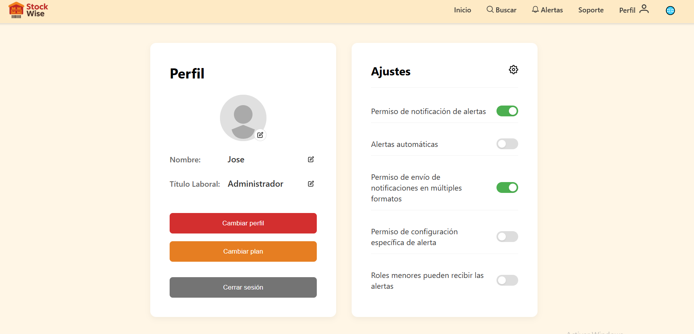

# <center>COURSE PROJECT</center>

<p align="center">
    <strong>Universidad Peruana de Ciencias Aplicadas</strong><br>
    </img><br>
    <strong>Ingeniería de Software - 2025-1</strong><br>
    <strong>Aplicaciones Web - 4366</strong><br>
    <strong>Profesor: Alex Humberto Sánchez Ponce</strong><br>
    <br><strong>Informe del Trabajo Final</strong>
</p>

</p>

<p align="center">
    <strong>Startup: AyniTech</strong><br>
    <strong>Producto:  </strong>
</p>

<div style="text-align:center;">
    <h3>Team Members:</h3>
    <table align="center">
        <tr>
            <th style="text-align:center;">Member</th>
            <th style="text-align:center;">Code</th>
        </tr>
        <tr>
            <td>Jocelyn Damaly Almerco Rojas</td>
            <td>U20221g068</td>
        </tr>
        <tr>
            <td>Sanchez Rios, Camila Cristina</td>
            <td>U202210973</td>
        </tr>
        <tr>
            <td>Henry Kalet Esteban Roman</td>
            <td>U202310210</td>
        </tr>
        <tr>
            <td>Maria Fernanda Peña Riofrio</td>
            <td>U202113279</td>
        </tr>
        <tr>
            <td>Fabiola Del Rocio Saldaña Ayala</td>
            <td>U202313773</td>
        </tr>
    </table>
</div>

<p align="center">
    <strong>Abril, 2025</strong>
</p>
<br>

<h1 align="center">Registro de versiones del Informe</h1>
</br>
<table>
        <thead>
            <tr>
                <th>Versión</th>
                <th>Fecha</th>
                <th>Autor</th>
                <th>Descripción de modificaciones</th>
            </tr>
        </thead>
        <tbody>
            <tr>
                <th>TB1</th>
                <td>07/04/2025</td>
                <td>
                    <ul>
          <li>..</li>
          <li>Camila Sanchez</li>
          <li>..</li>
          <li>..</li>
                    <ul>
           </td>
      <td>            
             <ul>
          <li>Capítulo I: Introducción</li>
          <li>Capítulo II: Requirements Elicitation & Analysis</li>
          <li>Capítulo III: Requirements Specification</li>
          <li>Capítulo IV: Product Design</li>
          <li>Avance del Capítulo V: Product Implementation, Validation & Deployment hasta el punto 5.2.1.8</li>
          <li>Avance de Conclusiones, Bibliografía y Anexos</li>
        </ul>
      </td>
  </tr>
</tbody>
</table>

# Project Report Collaboration Insights
[Link de repositorio del reporte:](https://github.com/upc-pre-202510-1asi0730-4366-AyniTech/Report): https://github.com/upc-pre-202510-1asi0730-4366-AyniTech/Report

# Contenido
[Student Outcome](#student-outcome)

[Capítulo I: Introducción](#capítulo-i-introducción)
- [1.1. Startup Profile](#11-startup-profile)
  - [1.1.1. Descripción de la Startup](#111-descripción-de-la-startup)
  - [1.1.2. Perfiles de integrantes del equipo](#112-perfiles-de-integrantes-del-equipo)
- [1.2. Solution Profile](#12-solution-profile)
  - [1.2.1 Antecedentes y problemática](#121-antecedentes-y-problemática)
  - [1.2.2 Lean UX Process](#122-lean-ux-process)
    - [1.2.2.1. Lean UX Problem Statements](#1221-lean-ux-problem-statements)
    - [1.2.2.2. Lean UX Assumptions](#1222-lean-ux-assumptions)
    - [1.2.2.3. Lean UX Hypothesis Statements](#1223-lean-ux-hypothesis-statements)
    - [1.2.2.4. Lean UX Canvas](#1224-lean-ux-canvas)
- [1.3. Segmentos objetivo](#13-segmentos-objetivo)

[Capítulo II: Requirements Elicitation & Analysis](#capítulo-ii-requirements-elicitation--analysis)
- [COURSE PROJECT](#course-project)
- [Project Report Collaboration Insights](#project-report-collaboration-insights)
- [Contenido](#contenido)
- [Student Outcome](#student-outcome)
- [Capítulo I: Introducción](#capítulo-i-introducción)
  - [1.1. Startup Profile](#11-startup-profile)
    - [1.1.1. Descripción de la Startup](#111-descripción-de-la-startup)
    - [1.1.2. Perfiles de integrantes del equipo](#112-perfiles-de-integrantes-del-equipo)
  - [1.2. Solution Profile](#12-solution-profile)
    - [1.2.1 Antecedentes y problemática](#121-antecedentes-y-problemática)
    - [1.2.2 Lean UX Process](#122-lean-ux-process)
      - [1.2.2.1. Lean UX Problem Statements](#1221-lean-ux-problem-statements)
      - [1.2.2.2. Lean UX Assumptions](#1222-lean-ux-assumptions)
      - [1.2.2.3. Lean UX Hypothesis Statements](#1223-lean-ux-hypothesis-statements)
      - [1.2.2.4. Lean UX Canvas](#1224-lean-ux-canvas)
  - [1.3. Segmentos objetivo](#13-segmentos-objetivo)
- [Capítulo II: Requirements Elicitation \& Analysis](#capítulo-ii-requirements-elicitation--analysis)
  - [2.1. Competidores](#21-competidores)
    - [2.1.1. Análisis competitivo](#211-análisis-competitivo)
    - [2.1.2. Estrategias y tácticas frente a competidores](#212-estrategias-y-tácticas-frente-a-competidores)
  - [2.2. Entrevistas](#22-entrevistas)
    - [2.2.1. Diseño de entrevistas](#221-diseño-de-entrevistas)
    - [2.2.2. Registro de entrevistas](#222-registro-de-entrevistas)
    - [2.2.3. Análisis de entrevistas](#223-análisis-de-entrevistas)
  - [2.3. Needfinding](#23-needfinding)
    - [2.3.1. User Personas](#231-user-personas)
    - [2.3.2. User Task Matrix](#232-user-task-matrix)
    - [2.3.3. User Journey Mapping](#233-user-journey-mapping)
    - [2.3.4. Empathy Mapping](#234-empathy-mapping)
    - [2.3.5. As-is Scenario Mapping](#235-as-is-scenario-mapping)
  - [2.4. Ubiquitous Language](#24-ubiquitous-language)
- [Capítulo III: Requirements Specification](#capítulo-iii-requirements-specification)
  - [3.1. To-Be Scenario Mapping](#31-to-be-scenario-mapping)
  - [3.2. User Stories](#32-user-stories)
  - [3.3. Impact Mapping](#33-impact-mapping)
  - [3.4. Product Backlog](#34-product-backlog)
- [Capítulo IV: Product Design](#capítulo-iv-product-design)
  - [4.1. Style Guidelines](#41-style-guidelines)
    - [4.1.1. General Style Guidelines](#411-general-style-guidelines)
    - [4.1.2. Web Style Guidelines](#412-web-style-guidelines)
  - [4.2. Information Architecture](#42-information-architecture)
    - [4.2.1. Organization Systems.](#421-organization-systems)
    - [4.2.2. Labeling Systems.](#422-labeling-systems)
    - [4.2.3. SEO Tags and Meta Tags](#423-seo-tags-and-meta-tags)
    - [4.2.4. Searching Systems.](#424-searching-systems)
    - [4.2.5. Navigation Systems.](#425-navigation-systems)
  - [4.3. Landing Page UI Design.](#43-landing-page-ui-design)
    - [4.3.1. Landing Page Wireframe.](#431-landing-page-wireframe)
    - [4.3.2. Landing Page Mock-up.](#432-landing-page-mock-up)
  - [4.4. Web Applications UX/UI Design.](#44-web-applications-uxui-design)
    - [4.4.1. Web Applications Wireframes.](#441-web-applications-wireframes)
    - [4.4.2. Web Applications Wireflow Diagrams.](#442-web-applications-wireflow-diagrams)
    - [4.4.2. Web Applications Mock-ups.](#442-web-applications-mock-ups)
    - [4.4.3. Web Applications User Flow Diagrams.](#443-web-applications-user-flow-diagrams)
  - [4.5. Web Applications Prototyping.](#45-web-applications-prototyping)
  - [4.6. Domain-Driven Software Architecture.](#46-domain-driven-software-architecture)
    - [4.6.1. Software Architecture Context Diagram.](#461-software-architecture-context-diagram)
    - [4.6.2. Software Architecture Container Diagrams.](#462-software-architecture-container-diagrams)
    - [4.6.3. Software Architecture Components Diagrams.](#463-software-architecture-components-diagrams)
  - [4.7. Software Object-Oriented Design.](#47-software-object-oriented-design)
    - [4.7.1. Class Diagrams.](#471-class-diagrams)
    - [4.7.2. Class Dictionary.](#472-class-dictionary)
  - [4.8. Database Design.](#48-database-design)
    - [4.8.1. Database Diagram.](#481-database-diagram)
- [Capítulo V: Product Implementation, Validation \& Deployment](#capítulo-v-product-implementation-validation--deployment)
  - [5.1. Software Configuration Management.](#51-software-configuration-management)
    - [5.1.1. Software Development Environment Configuration](#511-software-development-environment-configuration)
    - [5.1.2. Source Code Management.](#512-source-code-management)
    - [5.1.3. Source Code Style Guide \& Conventions.](#513-source-code-style-guide--conventions)
    - [5.1.4. Software Deployment Configuration.](#514-software-deployment-configuration)
  - [5.2. Landing Page, Services \& Applications Implementation](#52-landing-page-services--applications-implementation)
    - [5.2.1. Sprint 1](#521-sprint-1)
      - [5.2.1.1. Sprint Planning 1](#5211-sprint-planning-1)
      - [5.2.1.2. Aspect Leaders and Collaborators.](#5212-aspect-leaders-and-collaborators)
      - [5.2.1.3. Sprint Backlog n.](#5213-sprint-backlog-n)
      - [5.2.1.4. Development Evidence for Sprint Review.](#5214-development-evidence-for-sprint-review)
      - [5.2.1.5. Execution Evidence for Sprint Review.](#5215-execution-evidence-for-sprint-review)
      - [5.2.1.6. Services Documentation Evidence for Sprint Review.](#5216-services-documentation-evidence-for-sprint-review)
      - [5.2.1.7. Software Deployment Evidence for Sprint Review.](#5217-software-deployment-evidence-for-sprint-review)
      - [5.2.1.8. Team Collaboration Insights during Sprint.](#5218-team-collaboration-insights-during-sprint)
    - [5.2.2. Sprint 2](#522-sprint-2)
      - [5.2.2.1. Sprint Planning 2](#5221-sprint-planning-2)
      - [5.2.2.2. Aspect Leaders and Collaborators.](#5222-aspect-leaders-and-collaborators)
      - [5.2.2.3. Sprint Backlog 2.](#5223-sprint-backlog-2)
      - [5.2.2.4. Development Evidence for Sprint Review.](#5224-development-evidence-for-sprint-review)
      - [5.2.2.5. Execution Evidence for Sprint Review.](#5225-execution-evidence-for-sprint-review)
      - [5.2.2.6. Services Documentation Evidence for Sprint Review.](#5226-services-documentation-evidence-for-sprint-review)
      - [5.2.2.7. Software Deployment Evidence for Sprint Review.](#5227-software-deployment-evidence-for-sprint-review)
      - [5.2.2.8. Team Collaboration Insights during Sprint.](#5228-team-collaboration-insights-during-sprint)
- [Conclusiones](#conclusiones)
  - [Conclusiones y recomendaciones.](#conclusiones-y-recomendaciones)
- [Conclusiones](#conclusiones-1)
- [Bibliografía](#bibliografía)
- [Anexos](#anexos)

[Capítulo III: Requirements Specification](#capítulo-iii-requirements-specification)
- [3.1. To-Be Scenario Mapping](#31-to-be-scenario-mapping)
- [3.2. User Stories](#32-user-stories)
- [3.3. Impact Mapping](#33-impact-mapping)
- [3.4. Product Backlog](#34-product-backlog)

[Capítulo IV: Product Design](#capítulo-iv-product-design)
- [COURSE PROJECT](#course-project)
- [Project Report Collaboration Insights](#project-report-collaboration-insights)
- [Contenido](#contenido)
- [Student Outcome](#student-outcome)
- [Capítulo I: Introducción](#capítulo-i-introducción)
  - [1.1. Startup Profile](#11-startup-profile)
    - [1.1.1. Descripción de la Startup](#111-descripción-de-la-startup)
    - [1.1.2. Perfiles de integrantes del equipo](#112-perfiles-de-integrantes-del-equipo)
  - [1.2. Solution Profile](#12-solution-profile)
    - [1.2.1 Antecedentes y problemática](#121-antecedentes-y-problemática)
    - [1.2.2 Lean UX Process](#122-lean-ux-process)
      - [1.2.2.1. Lean UX Problem Statements](#1221-lean-ux-problem-statements)
      - [1.2.2.2. Lean UX Assumptions](#1222-lean-ux-assumptions)
      - [1.2.2.3. Lean UX Hypothesis Statements](#1223-lean-ux-hypothesis-statements)
      - [1.2.2.4. Lean UX Canvas](#1224-lean-ux-canvas)
  - [1.3. Segmentos objetivo](#13-segmentos-objetivo)
- [Capítulo II: Requirements Elicitation \& Analysis](#capítulo-ii-requirements-elicitation--analysis)
  - [2.1. Competidores](#21-competidores)
    - [2.1.1. Análisis competitivo](#211-análisis-competitivo)
    - [2.1.2. Estrategias y tácticas frente a competidores](#212-estrategias-y-tácticas-frente-a-competidores)
  - [2.2. Entrevistas](#22-entrevistas)
    - [2.2.1. Diseño de entrevistas](#221-diseño-de-entrevistas)
    - [2.2.2. Registro de entrevistas](#222-registro-de-entrevistas)
    - [2.2.3. Análisis de entrevistas](#223-análisis-de-entrevistas)
  - [2.3. Needfinding](#23-needfinding)
    - [2.3.1. User Personas](#231-user-personas)
    - [2.3.2. User Task Matrix](#232-user-task-matrix)
    - [2.3.3. User Journey Mapping](#233-user-journey-mapping)
    - [2.3.4. Empathy Mapping](#234-empathy-mapping)
    - [2.3.5. As-is Scenario Mapping](#235-as-is-scenario-mapping)
  - [2.4. Ubiquitous Language](#24-ubiquitous-language)
- [Capítulo III: Requirements Specification](#capítulo-iii-requirements-specification)
  - [3.1. To-Be Scenario Mapping](#31-to-be-scenario-mapping)
  - [3.2. User Stories](#32-user-stories)
  - [3.3. Impact Mapping](#33-impact-mapping)
  - [3.4. Product Backlog](#34-product-backlog)
- [Capítulo IV: Product Design](#capítulo-iv-product-design)
  - [4.1. Style Guidelines](#41-style-guidelines)
    - [4.1.1. General Style Guidelines](#411-general-style-guidelines)
    - [4.1.2. Web Style Guidelines](#412-web-style-guidelines)
  - [4.2. Information Architecture](#42-information-architecture)
    - [4.2.1. Organization Systems.](#421-organization-systems)
    - [4.2.2. Labeling Systems.](#422-labeling-systems)
    - [4.2.3. SEO Tags and Meta Tags](#423-seo-tags-and-meta-tags)
    - [4.2.4. Searching Systems.](#424-searching-systems)
    - [4.2.5. Navigation Systems.](#425-navigation-systems)
  - [4.3. Landing Page UI Design.](#43-landing-page-ui-design)
    - [4.3.1. Landing Page Wireframe.](#431-landing-page-wireframe)
    - [4.3.2. Landing Page Mock-up.](#432-landing-page-mock-up)
  - [4.4. Web Applications UX/UI Design.](#44-web-applications-uxui-design)
    - [4.4.1. Web Applications Wireframes.](#441-web-applications-wireframes)
    - [4.4.2. Web Applications Wireflow Diagrams.](#442-web-applications-wireflow-diagrams)
    - [4.4.2. Web Applications Mock-ups.](#442-web-applications-mock-ups)
    - [4.4.3. Web Applications User Flow Diagrams.](#443-web-applications-user-flow-diagrams)
  - [4.5. Web Applications Prototyping.](#45-web-applications-prototyping)
  - [4.6. Domain-Driven Software Architecture.](#46-domain-driven-software-architecture)
    - [4.6.1. Software Architecture Context Diagram.](#461-software-architecture-context-diagram)
    - [4.6.2. Software Architecture Container Diagrams.](#462-software-architecture-container-diagrams)
    - [4.6.3. Software Architecture Components Diagrams.](#463-software-architecture-components-diagrams)
  - [4.7. Software Object-Oriented Design.](#47-software-object-oriented-design)
    - [4.7.1. Class Diagrams.](#471-class-diagrams)
    - [4.7.2. Class Dictionary.](#472-class-dictionary)
  - [4.8. Database Design.](#48-database-design)
    - [4.8.1. Database Diagram.](#481-database-diagram)
- [Capítulo V: Product Implementation, Validation \& Deployment](#capítulo-v-product-implementation-validation--deployment)
  - [5.1. Software Configuration Management.](#51-software-configuration-management)
    - [5.1.1. Software Development Environment Configuration](#511-software-development-environment-configuration)
    - [5.1.2. Source Code Management.](#512-source-code-management)
    - [5.1.3. Source Code Style Guide \& Conventions.](#513-source-code-style-guide--conventions)
    - [5.1.4. Software Deployment Configuration.](#514-software-deployment-configuration)
  - [5.2. Landing Page, Services \& Applications Implementation](#52-landing-page-services--applications-implementation)
    - [5.2.1. Sprint 1](#521-sprint-1)
      - [5.2.1.1. Sprint Planning 1](#5211-sprint-planning-1)
      - [5.2.1.2. Aspect Leaders and Collaborators.](#5212-aspect-leaders-and-collaborators)
      - [5.2.1.3. Sprint Backlog n.](#5213-sprint-backlog-n)
      - [5.2.1.4. Development Evidence for Sprint Review.](#5214-development-evidence-for-sprint-review)
      - [5.2.1.5. Execution Evidence for Sprint Review.](#5215-execution-evidence-for-sprint-review)
      - [5.2.1.6. Services Documentation Evidence for Sprint Review.](#5216-services-documentation-evidence-for-sprint-review)
      - [5.2.1.7. Software Deployment Evidence for Sprint Review.](#5217-software-deployment-evidence-for-sprint-review)
      - [5.2.1.8. Team Collaboration Insights during Sprint.](#5218-team-collaboration-insights-during-sprint)
    - [5.2.2. Sprint 2](#522-sprint-2)
      - [5.2.2.1. Sprint Planning 2](#5221-sprint-planning-2)
      - [5.2.2.2. Aspect Leaders and Collaborators.](#5222-aspect-leaders-and-collaborators)
      - [5.2.2.3. Sprint Backlog 2.](#5223-sprint-backlog-2)
      - [5.2.2.4. Development Evidence for Sprint Review.](#5224-development-evidence-for-sprint-review)
      - [5.2.2.5. Execution Evidence for Sprint Review.](#5225-execution-evidence-for-sprint-review)
      - [5.2.2.6. Services Documentation Evidence for Sprint Review.](#5226-services-documentation-evidence-for-sprint-review)
      - [5.2.2.7. Software Deployment Evidence for Sprint Review.](#5227-software-deployment-evidence-for-sprint-review)
      - [5.2.2.8. Team Collaboration Insights during Sprint.](#5228-team-collaboration-insights-during-sprint)
- [Conclusiones](#conclusiones)
  - [Conclusiones y recomendaciones.](#conclusiones-y-recomendaciones)
- [Conclusiones](#conclusiones-1)
- [Bibliografía](#bibliografía)
- [Anexos](#anexos)

[Capítulo V: Product Implementation, Validation & Deployment](#capítulo-v-product-implementation-validation--deployment)
- [COURSE PROJECT](#course-project)
- [Project Report Collaboration Insights](#project-report-collaboration-insights)
- [Contenido](#contenido)
- [Student Outcome](#student-outcome)
- [Capítulo I: Introducción](#capítulo-i-introducción)
  - [1.1. Startup Profile](#11-startup-profile)
    - [1.1.1. Descripción de la Startup](#111-descripción-de-la-startup)
    - [1.1.2. Perfiles de integrantes del equipo](#112-perfiles-de-integrantes-del-equipo)
  - [1.2. Solution Profile](#12-solution-profile)
    - [1.2.1 Antecedentes y problemática](#121-antecedentes-y-problemática)
    - [1.2.2 Lean UX Process](#122-lean-ux-process)
      - [1.2.2.1. Lean UX Problem Statements](#1221-lean-ux-problem-statements)
      - [1.2.2.2. Lean UX Assumptions](#1222-lean-ux-assumptions)
      - [1.2.2.3. Lean UX Hypothesis Statements](#1223-lean-ux-hypothesis-statements)
      - [1.2.2.4. Lean UX Canvas](#1224-lean-ux-canvas)
  - [1.3. Segmentos objetivo](#13-segmentos-objetivo)
- [Capítulo II: Requirements Elicitation \& Analysis](#capítulo-ii-requirements-elicitation--analysis)
  - [2.1. Competidores](#21-competidores)
    - [2.1.1. Análisis competitivo](#211-análisis-competitivo)
    - [2.1.2. Estrategias y tácticas frente a competidores](#212-estrategias-y-tácticas-frente-a-competidores)
  - [2.2. Entrevistas](#22-entrevistas)
    - [2.2.1. Diseño de entrevistas](#221-diseño-de-entrevistas)
    - [2.2.2. Registro de entrevistas](#222-registro-de-entrevistas)
    - [2.2.3. Análisis de entrevistas](#223-análisis-de-entrevistas)
  - [2.3. Needfinding](#23-needfinding)
    - [2.3.1. User Personas](#231-user-personas)
    - [2.3.2. User Task Matrix](#232-user-task-matrix)
    - [2.3.3. User Journey Mapping](#233-user-journey-mapping)
    - [2.3.4. Empathy Mapping](#234-empathy-mapping)
    - [2.3.5. As-is Scenario Mapping](#235-as-is-scenario-mapping)
  - [2.4. Ubiquitous Language](#24-ubiquitous-language)
- [Capítulo III: Requirements Specification](#capítulo-iii-requirements-specification)
  - [3.1. To-Be Scenario Mapping](#31-to-be-scenario-mapping)
  - [3.2. User Stories](#32-user-stories)
  - [3.3. Impact Mapping](#33-impact-mapping)
  - [3.4. Product Backlog](#34-product-backlog)
- [Capítulo IV: Product Design](#capítulo-iv-product-design)
  - [4.1. Style Guidelines](#41-style-guidelines)
    - [4.1.1. General Style Guidelines](#411-general-style-guidelines)
    - [4.1.2. Web Style Guidelines](#412-web-style-guidelines)
  - [4.2. Information Architecture](#42-information-architecture)
    - [4.2.1. Organization Systems.](#421-organization-systems)
    - [4.2.2. Labeling Systems.](#422-labeling-systems)
    - [4.2.3. SEO Tags and Meta Tags](#423-seo-tags-and-meta-tags)
    - [4.2.4. Searching Systems.](#424-searching-systems)
    - [4.2.5. Navigation Systems.](#425-navigation-systems)
  - [4.3. Landing Page UI Design.](#43-landing-page-ui-design)
    - [4.3.1. Landing Page Wireframe.](#431-landing-page-wireframe)
    - [4.3.2. Landing Page Mock-up.](#432-landing-page-mock-up)
  - [4.4. Web Applications UX/UI Design.](#44-web-applications-uxui-design)
    - [4.4.1. Web Applications Wireframes.](#441-web-applications-wireframes)
    - [4.4.2. Web Applications Wireflow Diagrams.](#442-web-applications-wireflow-diagrams)
    - [4.4.2. Web Applications Mock-ups.](#442-web-applications-mock-ups)
    - [4.4.3. Web Applications User Flow Diagrams.](#443-web-applications-user-flow-diagrams)
  - [4.5. Web Applications Prototyping.](#45-web-applications-prototyping)
  - [4.6. Domain-Driven Software Architecture.](#46-domain-driven-software-architecture)
    - [4.6.1. Software Architecture Context Diagram.](#461-software-architecture-context-diagram)
    - [4.6.2. Software Architecture Container Diagrams.](#462-software-architecture-container-diagrams)
    - [4.6.3. Software Architecture Components Diagrams.](#463-software-architecture-components-diagrams)
  - [4.7. Software Object-Oriented Design.](#47-software-object-oriented-design)
    - [4.7.1. Class Diagrams.](#471-class-diagrams)
    - [4.7.2. Class Dictionary.](#472-class-dictionary)
  - [4.8. Database Design.](#48-database-design)
    - [4.8.1. Database Diagram.](#481-database-diagram)
- [Capítulo V: Product Implementation, Validation \& Deployment](#capítulo-v-product-implementation-validation--deployment)
  - [5.1. Software Configuration Management.](#51-software-configuration-management)
    - [5.1.1. Software Development Environment Configuration](#511-software-development-environment-configuration)
    - [5.1.2. Source Code Management.](#512-source-code-management)
    - [5.1.3. Source Code Style Guide \& Conventions.](#513-source-code-style-guide--conventions)
    - [5.1.4. Software Deployment Configuration.](#514-software-deployment-configuration)
  - [5.2. Landing Page, Services \& Applications Implementation](#52-landing-page-services--applications-implementation)
    - [5.2.1. Sprint 1](#521-sprint-1)
      - [5.2.1.1. Sprint Planning 1](#5211-sprint-planning-1)
      - [5.2.1.2. Aspect Leaders and Collaborators.](#5212-aspect-leaders-and-collaborators)
      - [5.2.1.3. Sprint Backlog n.](#5213-sprint-backlog-n)
      - [5.2.1.4. Development Evidence for Sprint Review.](#5214-development-evidence-for-sprint-review)
      - [5.2.1.5. Execution Evidence for Sprint Review.](#5215-execution-evidence-for-sprint-review)
      - [5.2.1.6. Services Documentation Evidence for Sprint Review.](#5216-services-documentation-evidence-for-sprint-review)
      - [5.2.1.7. Software Deployment Evidence for Sprint Review.](#5217-software-deployment-evidence-for-sprint-review)
      - [5.2.1.8. Team Collaboration Insights during Sprint.](#5218-team-collaboration-insights-during-sprint)
    - [5.2.2. Sprint 2](#522-sprint-2)
      - [5.2.2.1. Sprint Planning 2](#5221-sprint-planning-2)
      - [5.2.2.2. Aspect Leaders and Collaborators.](#5222-aspect-leaders-and-collaborators)
      - [5.2.2.3. Sprint Backlog 2.](#5223-sprint-backlog-2)
      - [5.2.2.4. Development Evidence for Sprint Review.](#5224-development-evidence-for-sprint-review)
      - [5.2.2.5. Execution Evidence for Sprint Review.](#5225-execution-evidence-for-sprint-review)
      - [5.2.2.6. Services Documentation Evidence for Sprint Review.](#5226-services-documentation-evidence-for-sprint-review)
      - [5.2.2.7. Software Deployment Evidence for Sprint Review.](#5227-software-deployment-evidence-for-sprint-review)
      - [5.2.2.8. Team Collaboration Insights during Sprint.](#5228-team-collaboration-insights-during-sprint)
- [Conclusiones](#conclusiones)
  - [Conclusiones y recomendaciones.](#conclusiones-y-recomendaciones)
- [Conclusiones](#conclusiones-1)
- [Bibliografía](#bibliografía)
- [Anexos](#anexos)

[Conclusiones](#conclusiones)
- [Conclusiones y recomendaciones](#conclusiones-y-recomendaciones)
- [Video About-the-Team](#video-about-the-team)

[Bibliografía](#bibliografía)

[Anexos](#anexos)

# Student Outcome

ABET – EAC - Student Outcome 5

Criterio: La capacidad de funcionar efectivamente en un equipo cuyos miembros juntos proporcionan liderazgo, crean un entorno de colaboración e inclusivo, establecen objetivos, planifican tareas y cumplen objetivos.

<table>
  <tr>
    <td><b>Criterio específico</b></td>
    <td><b>Acciones realizadas</b></td>
    <td><b>Conclusiones</b></td>
  </tr>
    </thead>
  <tbody>
    <tr>
      <td><b>Comunica oralmente con
efectividad a diferentes rangos
de audiencia.</b></td>
      <td>
        <p><b>name  </b></p>
        <p><b>TB1:</b></p>
        <p>..</p>
        <p><b>TP1:</b></p>
        <p>,..</p>
        <p><b>TB2:</b></p>
        <p>.</p>
        <p><b>TF:</b></p>
        <p>.</p>
        <p><b>name</b></p>
       <p><b>TB1:</b></p>
        <p></p>
        <p><b>TP1:</b></p>
        <p></p>
        <p><b>TB2:</b></p>
        <p></p>
        <p><b>TF:</b></p>
        <p>.</p>
        <p><b>name</b></p>
        <p><b>TB1:</b></p>
        <p>     
        </p>
        <p><b>TP1:</b></p>
        <p>.</p>
        <p><b>TB2:</b></p>
        <p></p>
        <p><b>TF:</b></p>
        <p>.</p>
        <p><b></b></p>
       <p><b>TB1:</b></p>
        <p></p>
        <p><b>TP1:</b></p>
        <p></p>
        <p><b>TB2:</b></p>
        <p></p>
        <p><b>TF:</b></p>
        <p></p>
      </td>
      <td>
        <p><strong>TB1:</strong></p>
        <p></p>
        <p><strong>TP1:</strong></p>
        <p>.</p>
        <p><strong>TB2:</strong></p>
        <p></p>
        <p><strong>TF:</strong></p>
        <p></p>
      </td>
    </tr>
    <tr>
      <td>Comunica por escrito con
efectividad a diferentes rangos
de audiencia.</td>
      <td>
        <p><b>name  </b></p>
        <p><b>TB1:</b></p>
        <p>..</p>
        <p><b>TP1:</b></p>
        <p>..</p>
        <p><b>TB2:</b></p>
        <p>..</p>
        <p><b>TF:</b></p>
        <p>..</p>
        <p><b>name</b></p>
       <p><b>TB1:</b></p>
        <p>..</p>
        <p><b>TP1:</b></p>
        <p>..</p>
        <p><b>TB2:</b></p>
        <p>...</p>
        <p><b>TF:</b></p>
        <p>.</p>
        <p><b>name</b></p>
        <p><b>TB1:</b></p>
        <p>..
        </p>
        <p><b>TP1:</b></p>
        <p>..</p>
        <p><b>TB2:</b></p>
        <p>...</p>
        <p><b>TF:</b></p>
        <p>.</p>
        <p><b>name</b></p>
       <p><b>TB1:</b></p>
        <p>...</p>
        <p><b>TP1:</b></p>
        <p>...</p>
        <p><b>TB2:</b></p>
        <p>...</p>
        <p><b>TF:</b></p>
        <p>...</p>
      </td>
       <td>
        <p><strong>TB1:</strong></p>
        <p>..</p>
        <p><strong>TP1:</strong></p>
        <p>...</p>
        <p><strong>TB2:</strong></p>
        <p>..</p>
        <p><strong>TF:</strong></p>
        <p>...</p>
      </td>
    </tr>
  </tbody>
</table>

# Capítulo I: Introducción
## 1.1. Startup Profile
### 1.1.1. Descripción de la Startup
### 1.1.2. Perfiles de integrantes del equipo

## 1.2. Solution Profile
### 1.2.1 Antecedentes y problemática
### 1.2.2 Lean UX Process
#### 1.2.2.1. Lean UX Problem Statements
#### 1.2.2.2. Lean UX Assumptions
#### 1.2.2.3. Lean UX Hypothesis Statements
#### 1.2.2.4. Lean UX Canvas
## 1.3. Segmentos objetivo

# Capítulo II: Requirements Elicitation & Analysis

## 2.1. Competidores
### 2.1.1. Análisis competitivo
### 2.1.2. Estrategias y tácticas frente a competidores
## 2.2. Entrevistas
### 2.2.1. Diseño de entrevistas
### 2.2.2. Registro de entrevistas 
### 2.2.3. Análisis de entrevistas
## 2.3. Needfinding
### 2.3.1. User Personas
### 2.3.2. User Task Matrix
### 2.3.3. User Journey Mapping
### 2.3.4. Empathy Mapping
### 2.3.5. As-is Scenario Mapping
## 2.4. Ubiquitous Language

# Capítulo III: Requirements Specification

## 3.1. To-Be Scenario Mapping
## 3.2. User Stories
## 3.3. Impact Mapping
## 3.4. Product Backlog

# Capítulo IV: Product Design

## 4.1. Style Guidelines
### 4.1.1. General Style Guidelines
### 4.1.2. Web Style Guidelines
## 4.2. Information Architecture
### 4.2.1. Organization Systems.
### 4.2.2. Labeling Systems.
### 4.2.3. SEO Tags and Meta Tags
### 4.2.4. Searching Systems.
### 4.2.5. Navigation Systems.
## 4.3. Landing Page UI Design.
### 4.3.1. Landing Page Wireframe.
### 4.3.2. Landing Page Mock-up.
## 4.4. Web Applications UX/UI Design.
### 4.4.1. Web Applications Wireframes.
### 4.4.2. Web Applications Wireflow Diagrams.
### 4.4.2. Web Applications Mock-ups.
### 4.4.3. Web Applications User Flow Diagrams.
## 4.5. Web Applications Prototyping.
## 4.6. Domain-Driven Software Architecture.
### 4.6.1. Software Architecture Context Diagram.
### 4.6.2. Software Architecture Container Diagrams.
### 4.6.3. Software Architecture Components Diagrams.
## 4.7. Software Object-Oriented Design.
### 4.7.1. Class Diagrams.
### 4.7.2. Class Dictionary.
## 4.8. Database Design.
### 4.8.1. Database Diagram.

# Capítulo V: Product Implementation, Validation & Deployment
## 5.1. Software Configuration Management.
### 5.1.1. Software Development Environment Configuration
En la siguiente sección se describe la ruta de referencia de cada uno de los productos de software para que cualquier miembro del equipo pueda desarrollar cada punto del trabajo.

- **UXPressia:** Plataforma colaborativa que nos permitirá crear user personas e integrados con los múltiples mapas para evaluar sus prioridades.
- **Figma:** Herramienta colaborativa que nos permitirá desarrollar wireframes y mockups.
- **Miro:** Es una plataforma en línea que facilita la colaboración en tiempo real mediante pizarras digitales. Proporciona herramientas para crear diagramas, mapas mentales, flujos de trabajo y otros tipos de representaciones visuales. En
- **LucidChart:** Aplicación web destinada a la elaboración de Wireflows, Users Flows y diagramas de clases.
- **HTML:** Es el lenguaje de marcado que se utiliza para estructurar y organizar el contenido de una página web.
- **CSS:** Es el lenguaje de estilos que se utiliza para controlar la apariencia visual de la página. 

**Software Deployment**
- **Git:** Es una herramienta de control de versiones que nos permitirá rastrear cambios, colaborar de manera eficiente y mantener un historial detallado de las modificaciones en el código.
- **Software Documentation and Project Management GitHub:** Como plataforma de alojamiento, facilitará la colaboración en equipo, la gestión de ramas y la integración continua

### 5.1.2. Source Code Management.

El proyecto seguirá las convenciones de flujo de trabajo establecidas por el modelo GitFlow para el control de versiones, utilizando GitHub como plataforma y sistema de control de versiones. A continuación, se detallará cómo se implementará GitFlow como Workflow de control de versiones, además de proporcionar los URL de los repositorios de GitHub para cada producto: Landing Page, Web Services y Frontend Web Applications.

- [**Repositorio Landing Page:**](https://github.com/upc-pre-202510-1asi0730-4366-AyniTech/Landing-Page)  https://github.com/upc-pre-202510-1asi0730-4366-AyniTech/Landing-Page
- [**Repositorio Web Services:**](https://github.com/upc-pre-202510-1asi0730-4366-AyniTech/Web-Services) https://github.com/upc-pre-202510-1asi0730-4366-AyniTech/Web-Services
-  [**Repositorio Frontend Web Applications:**](https://github.com/upc-pre-202510-1asi0730-4366-AyniTech/Frontend-Web-Applications) https://github.com/upc-pre-202510-1asi0730-4366-AyniTech/Frontend-Web-Applications

**GitFlow**

Estructura de branches (Ramas):

**1. Master branch (Rama principal):** Esta rama será considerada como la principal para la aplicación, y contendrá versiones estables y finales del desarrollo. Solo se permitirán cambios que hayan sido previamente probados y verificados en otras ramas de prueba.

**2. Develop branch (Rama de desarrollo):** El propósito de esta rama es llevar a cabo los avances del proyecto en equipo y de mantener los archivos centrales del desarrollo continuo.

**3. Feature branches (Ramas de funcionalidad):** Cada funcionalidad desarrollada por el equipo o separada del enfoque actual del desarrollo tendrá su propia rama. Una vez que una funcionalidad esté completamente trabajada, se fusionará con la rama de desarrollo del proyecto. Las convenciones para nombrar las ramas de funcionalidad seguirán un patrón descriptivo y único, por ejemplo, "feature/nombre-de-la-funcionalidad".

**4. Release branches (Ramas de lanzamiento):** Estas ramas se utilizarán para mantener una instancia de la rama develop
que esté próxima a ser incluida en la rama principal. Se seguirá el sistema de versionamiento semántico (Semantic
Versioning) para nombrar las Releases.

**Versionamiento Semántico:** Para nombrar las Releases, se aplicará el sistema de versionamiento semántico (Semantic
Versioning 2.0.0).

**Convenciones de Commits:** Para los mensajes de los commits realizados, se utilizará la especificación Conventional Commits basada en Angular Commit Guidelines. La estructura a seguir será la siguiente:

```bash
git commit -m "<type>[optional scope]:<title>" -m"<description>"
```

### 5.1.3. Source Code Style Guide & Conventions.
**HTML:** Algunas de las prácticas que deben de seguirse para alcanzar un código coherente, sostenible y ordenado son las siguientes:
1. Cerrar todos los elementos HTML. Por ejemplo:
``` html
<p>Esto es un párrafo.</p>
```

2. A pesar de que HTML permite combinar mayúsculas y minúsculas en los nombres de los elementos y atributos, se limitará al uso de minúsculas para mantener el orden y garantizar la legibilidad.

3. Utilizar comillas en caso de que los atributos contengan espacios entre sí.

4. Procurar especificar el texto alt y las dimensiones width y height de las imágenes, ya que de esta manera se facilitará la disponibilidad del contenido. Por ejemplo:
``` html
 
```

**CSS:** Entre las prácticas empleadas se mencionan:

1. Los nombres de las clases deben de ser breves y autodescriptivos.

2. Separar los nombres de las clases y ID con un guión. Por ejemplo:
```css
#video-id .hero-shadow
```

3. Evitar especificar la unidad de medida luego de usar el valor 0.

4. Separar las declaraciones y selectores en nuevas líneas para agilizar la legibilidad.

### 5.1.4. Software Deployment Configuration.

**Landing Page**

Para poder desplegar la Landing Page resulta necesario contar con una serie de requisitos, entre ellos, es necesario contar con una cuenta personal, una organización y un repositorio al cual cargar los documentos. A partir de lo anterior, es posible comenzar el despliegue de la landing page. A continuación se enuncian los pasos a seguir:

1. Crear un repositorio para alojar el Landing Page.

2. Asegurarse de que los archivos sigan las nomenclaturas "index.html", para el contenido de la landing page; "style.css" para los estilos. Se tendra una carpeta "assets" y dentro estaran las carpetas "img".

3. Cargar los archivos al repositorio mediante un commit.

4. Dirigirse a Settings > Pages y seleccionar la branch correspondiente dentro de la cual se encuentra el proyecto,
generalmente se trata de "main" o "master".

1. Esperar a que GitHub realice las comprobaciones necesarias. Una vez culminado el proceso, se obtendrá un enlace que llevará al Landing Page desplegado.

## 5.2. Landing Page, Services & Applications Implementation
En esta sección se explica y evidencia el proceso de implementación, pruebas, documentación y despliegue del Landing Page, Web Services y Frontend Web Applications.
### 5.2.1. Sprint 1
En este apartado se presenta un resumen del progreso obtenido durante el Sprint 1, dedicado a la construcción de la Landing Page. Incluye los logros en diseño, programación y features desarrollados, junto con la gestión del equipo: comunicación, herramientas y planificación. También se puede observar el Sprint backlog, evidencias del trabajo y documentación de servicios.
#### 5.2.1.1. Sprint Planning 1
En el Sprint Planning 1, se muestran evidencias de la planeación y creación del landing page, incluyendo avances del proyecto como colaboración en equipo que se registran en GitHub.

| Sprint # | 1 |
|---------|-------|
| **Sprint Planning Background** |      |
| Date | 17/04/2025|
| Time | 8:30 pm |
|Location | Modalidad remota |
|Prepared By | Henry Esteban|
|Attendees (to planning meeting)| Jocelyn Almerco, Camila Sanchez, Maria Fernanda Peña, Fabiola Del Rocio Saldaña, Henry Esteban|
|Sprint 0 Review Summary | Para esta entrega no hay un Sprint anterior por ende no hay un resumen del Sprint|
|Sprint 0 Retrospective Summary | Para esta entrega no hay un Sprint anterior por ende no hay un resumen del Sprint|
|**Sprint Goal & User Stories** | |
|Sprint Goal 1 |En este sprint se tiene como objetivo, realizar la landing page con HTML y CSS. Anticipadamente, en otras previas reuniones se coordinó en equipo, el contenido y diseño de la landing page,el cual se realizó en Figma. Una vez realizado el sprint, la landing debe estar desplegada en GitHub Pages para que los usuarios puedan acceder a través del link a está misma. |
|Sprint Velocity 1 |18 |
|Sum of Story Points |18 |

#### 5.2.1.2. Aspect Leaders and Collaborators.
Para lograr una distribución eficiente del trabajo y mayor claridad en las responsabilidades, se identificaron 4 áreas claves: Diseño UX/UI, Landing Page, Deploy y Documentation, La asignación se basó en experiencia y carga equilibrada. La tabla detalla los roles por área, leader (L) y collaborator(C):

|Team Member|GitHub Username | Diseño UX/UI | Landing Page | Deploy | Documentation |
|---|---|---|---|---|---|
|Almerco Rojas, Jocelyn Damaly  |JocyDam |L  | C | C | C |
|Saldaña Ayala, Fabiola del Rocio  |fabs-in-space | C |L  | C |C  |
|Sánchez Ríos, Camila Cristina  |C4m174 | C | C | L | C |
|Peña Riofrio, Maria Fernanda  |mariafep | C | C | C | C |
|Esteban Román, Henry Kalet  |Kalet123-commit  | C | C | C | L |

#### 5.2.1.3. Sprint Backlog n.
En esta parte mostramos las tareas que se realizaron en este sprint.

**Link del Trello:** 
[Trello](https://trello.com/b/GaGqplFO)

**Vista del Sprint Backlog en Trello:**


|Sprint # | 1 |  |  |  |  |  |  |
|----|----|----- |---- |---- |---- |---- | ---|
|User Story |  |Work-Item /Task  |  |  |  |  |  |
|Id|Title|Id |Title |Description|Estimation(Hours) |Assigned To| Status (To-do / InProcess / ToReview / Done)|
|US01|Sección Header|T1|Interacción de la barra de navegación |Añadir funcionalidades a la barra de navegaciones |0.5h|Camila Sanchez |Done|
|US01|Sección Header|T2|Diseño responsive en la barra de navegación |Implementar diseño responsive a la barra de navegación |1h |Camila Sanchez |Done|
|US01|Sección Header|T3|Función sticky en la barra de navegación |Aplicar la funcionalidad de que la barra de navegación se desplace por toda la landing |0.5h |Camila Sanchez |Done|
|US02|Sección Hero|T4|Mostrar Hero Section |Implementar un hero section |1h |Camila Sanchez |Done|
|US02|Sección Hero|T5|Diseño responsive en el hero section |Implementar un diseño responsivo a la sección hero |0.5h|Camila Sanchez |Done|
|US03|Sección beneficios-características|T6|Mostrar beneficios-características |Añadir cuadros de texto sobre la características del servicio |1h |Maria Fernanda Peña |Done|
|US03|Sección beneficios-características|T7|Diseño responsive en la sección beneficios-características |Implementar un diseño responsivo en la sección beneficios-características |0.5h |Maria Fernanda Peña |Done|
|US04|Sección Planes y precios|T8|Mostrar Planes |Añadir los planes establecidos y sus descripciones con precios |1.5h |Fabiola Saldaña |Done|
|US04|Sección Planes y precios|T9|Diseño responsive en la sección planes y precios |Aplicar un diseño responsivo en la sección planes y precios |0.5h|Fabiola Saldaña |Done|
|US05|Sección Testimonios clientes|T10|Mostrar testimonios de clientes |Añadir los testimonios de clientes |1h |Jocelyn Almerco |Done|
|US05|Sección Testimonios clientes|T11|Diseño responsive en la sección testimonio|Aplicar un diseño responsivo en la sección testimonios-clientes |0.5h |Jocelyn Almerco |Done|
|US06|Sección llamado acción final|T12|Mostrar el button call to action|Añadir enlace al botón call to action a la aplicación web |0.5h |Maria Fernanda Peña |Done|
|US07|Sección Footer|T13|Mostrar Footer|Implementar la sección Footer |0.5h|Henry Esteban |Done|
|US07|Sección Footer|T14|Diseño responsive en la sección footer|Aplicar un diseño responsivo en la sección footer |0.5h |Henry Esteban |Done|

#### 5.2.1.4. Development Evidence for Sprint Review.
|Repository|Branch| Commit Id| Commit Message | Commit Message Body | Commited on (Date)|
|----|----|----|----|----|----|
|upc-pre-202510-1asi0730-4366-AyniTech/Landing-Page|feature/Beneficios-Características |6b36a6919a2e91c77ff3baff566fd60e043c1395|Primer commit con README|Primer commit con README|16/04/2025 |
| |feature/Beneficios-Características |3f32cf3d2d04b57948f74499f6bcc0c9524c3446|feat: beneficios-caracteristicas|feat: beneficios-caracteristicas|19/04/2025|
| |feature/Footer|4c5ca5c622581ac3cee863d0e4219ac287e231df|Footer Landing page|Footer Landing page |17/04/2025|
| |feature/Footer|235e77f6d3b97ccb4b7e0340502f7c3ed1c367e8|Corrección|Corrección|17/04/2025|
| |feature/Footer|ea09d7b9f1ffca7b8d28a5a478a9ce146dcf78ed|Corrección footer implementación de html y css|Corrección footer implementación de html y css|17/04/2025|
| |feature/Header|046034c41d59af333c0d1b15f06bf8829586fe7d|feat:Header|feat:Header|16/04/2025|
| |feature/Hero-Section|fe076a40ec497b89907b1a5f0e812c04ad439d2b|feat: hero - section|feat: hero - section|16/04/2025|
| |feature/Llamado-Accion-Final|89ca26e0e4498cd8dbd986ca117b416fe3571c74|feat: llamado acción|feat: llamado acción|19/04/2025|
| |feature/Planes-Precios|36379aacd31c276220ea903783afa86f6c5aac67|Precios landing|Precios landing|19/04/2025|
| |feature/Testimonios-Clientes|5cf271c1711d25c79dd6700098e4b40e56089162|feat: Primera versión del código - Testimonios clientes|feat: Primera versión del código - Testimonios clientes|18/04/2025|

#### 5.2.1.5. Execution Evidence for Sprint Review.
En este Sprint se realizó nuestra landing page utilizando HTML y CSS con su respectivo despliegue en GitHub Pages. En esta sección se muestran los diferentes apartados que se han implementado en el trabajo:

- Sección beneficios y características


- Sección Planes y precios


- Seccion Testimonios Clientes


#### 5.2.1.6. Services Documentation Evidence for Sprint Review.
Y aque este sprint fue el primero y solamente se desarrolló la landing page, por lo que no se evidencia el empleo de web service

#### 5.2.1.7. Software Deployment Evidence for Sprint Review.
Para la entrega del Sprint 1, se desplegó el landing page de forma completa. Para esto se siguió un proceso que es el siguiente:
- **Git:** ya que se utiliza como sistema de control de versiones, facilitando la colaboración efectiva entre los integrantes del equipo
- **GitFlow:** Se implementó como metodología, creando diferentes ramas por capítulo, ya que realizando esto el trabajo tuvo una mejor gestión  generando un flujo continuo en el avance del proyecto.
- **GitHub:** Se usó  como plataforma base para el trabajo colaborativo, donde se puede gestionar y almacenar todas las versiones del proyecto.
- **GitHub Pages**: Se empleó para publicar la landing page de forma eficiente, permitiendo que la aplicación quede accesible al público mediante un repositorio GitHub. En este caso nuestra compañera de equipo Camila Sanchez llevó a cabo eres proceso

1. Si nos vamos al github, vemos en la parte marcada con roja el link de nuestra landing page


2. Entrando a link se puede correctamente la landing page de stock wise


#### 5.2.1.8. Team Collaboration Insights during Sprint.
| Alumno | Actividad |
| ------ | --------- |
|Jocelyn Damaly Almerco Rojas|Implementación de las sección Testimonios-Clientes|
|Sanchez Rios, Camila Cristina|Implementación de la sección header y sección hero-section|
|Henry Kalet Esteban Roman|Implementación de la sección footer|
|Maria Fernanda Peña Riofrio|Implementación de la sección beneficios-características y llamado-acción-final|
|Fabiola Del Rocio Saldaña Ayala|Implementación de la sección planes-precios|

**Commits del landing page**


### 5.2.2. Sprint 2
#### 5.2.2.1. Sprint Planning 2
| Sprint # | 2 |
|---------|-------|
| **Sprint Planning Background** |      |
| Date | 14/05/2025|
| Time | 5:30 pm |
|Location | Modalidad remota |
|Prepared By | Camila Sanchez|
|Attendees (to planning meeting)| Jocelyn Almerco, Camila Sanchez, Maria Fernanda Peña, Fabiola Del Rocio Saldaña, Henry Esteban|
|Sprint 0 Review Summary | Se logro completar la landing page|
|Sprint 0 Retrospective Summary | Se tuvo que manejar mejor los tiempos para evitar inconvenientes en la entrega|
|**Sprint Goal & User Stories** | |
|Sprint Goal 1 |Realizar una primera version del Frontend.|
|Sprint Velocity 1 |15 |
|Sum of Story Points |20 |

#### 5.2.2.2. Aspect Leaders and Collaborators.
Durante el segundo sprint, el equipo tuvo como meta implementar el frontend de StockWise utilizando JavaScript, Vue. CSS y HTML. El enfoque se centró en desarrollar funcionalidades clave en varias páginas. Además, el equipo se enfocó en las historias de usuario relacionadas con este desarrollo, asegurando que cada nueva característica no solo fuera funcional, sino también alineada con las necesidades de los usuarios. Se utilizó Trello para organizar y distribuir las tareas, permitiendo que cada integrante del equipo se especializara en áreas que se correspondían con sus competencias, lo que facilitó un avance eficiente y coordinado hacia el objetivo del sprint.

#### 5.2.2.3. Sprint Backlog 2.
**Link del Trello:** 
[Trello](https://trello.com/b/GaGqplFO)

**Vista del Sprint Backlog en Trello:**


|Sprint # | 2 |  |  |  |  |  |  |
|----|----|----- |---- |---- |---- |---- | ---|
|User Story |  |Work-Item /Task  |  |  |  |  |  |
|Id|Title|Id |Title |Description|Estimation(Hours) |Assigned To| Status (To-do / InProcess / ToReview / Done)|
|US01|Iniciar Sesion|T1|Formulario de registro |Login del Usuario con ambos metodos (Google o registro)  |2h|Camila Sanchez |Done|
|US01|Registro|T2|Formulario de registro |Mostrar y redirigir al formulario de registro para nuevos usuarios desde la landing page.|3h |Camila Sanchez |Done|
|US15|Configurar roles y permisos de usuario |T3|Perfil de Usuario |Recolectar datos personales basicos y control de ajusted |2h |Fabiola Saldaña |Done|
|US01|Home|T4|Dashboard |Creacion de la pantalla de Inicio donde navegara por la pagina web |3h |Fabiola Saldaña |Done|
|US20|Generar alertas por bajo stock|T5| Pantalla de Notificaciones |Implementar historial de alertas de stock |2h|Sebastian |Done|
|US04|Ver historial de movimientos|T6| Pantalla de Historial |Implementar un diseño intuitivo para el usuario|2h |Jocelyn Almerco |Done|
|US06|Buscar productos en inventarios|T07|Pantalla de Inventario (Producto o lote)|Implementar un diseño intuitivo para el usuario|2h |Henry Esteban |Done|
|US20|Crear kits o combos de productos|T08|Pantalla de Kits|Implementar un diseño intuitivo para el usuario|2h |Maria Fernanda Peña |Done|

#### 5.2.2.4. Development Evidence for Sprint Review.
|Repository|Branch| Commit Id| Commit Message | Commit Name|Commited on (Date)|
|----|----|----|----|----|----|
|https://github.com/upc-pre-202510-1asi0730-4366-AyniTech/Frontend-Web-Applications|feature/History|0d6e97a8|feat: completar cambios faltantes en localización y vista|Damaly34873|15/05/2025 |
| |feature/History|49dfd0e9|Fix: ajustar diseño para mantener cards debajo de barra|Damaly34873|15/05/2025|
| |feature/iam|a760f8c8|feat: add log |C4M174|14/05/2025|
| |feature/iam|c43e30bd|feat: add login|C4M174|14/05/2025|
| |feature/iam|97abafbb  |feat: add authentication service|C4M174|14/05/2025|
| |feature/inventory|ac2773df |feature: new branch | kalet123-commit|14/05/2025 |
| |feature/inventory|3831040f|feature: add bounded countext | kalet123-commit|14/05/2025 |
| |feature/inventory|3706a28a |feature:add functional buttonns | kalet123-commit|15/05/2025 |
| |feature/kit-products|0eaec782 |feat: add kits-products components and include in App.vue | mariafep|15/05/2025 |
| |feature/kit-products|4765c520 |feat: add i18n and router modified kit component and main.js | mariafep|15/05/2025 |
| |feature/kit-products|955d7e7f |feat: add bounded context style, entity and services | mariafep|15/05/2025 |
| |feature/kit-products|9e61ed75 |feat: fix entity | mariafep|15/05/2025 |
| |feature/product-management|207f8daa |feat/avances dashboard| Fabs|14/05/2025 |
| |feature/product-management|6515fefc |avances dashboard2 | Fabs|14/05/2025 |
| |feature/product-management|1defb863ac2773df |feature: new branch | Fabs|14/05/2025 |
| |feature/stock-alert|6b841ec3 |Add feature/stock-alert | Sebastian|15/05/2025 |
| |feature/stock-alert|42e08cef |Update stock alert | Sebastian|15/05/2025 |

#### 5.2.2.5. Execution Evidence for Sprint Review.

**Iniciar sesión**
 
**Crear cuenta**
 
**Mi perfil**

*Perfil Administrador*


**Panel de control (Dashboard)**

**Combinación de Productos en Kits**


**Historial de Movimientos**

 
**Pantalla principal de Inventario por Lote**
*Pantalla de Comentarios del Lote* 
*Pantalla de Exportación*
**Pantalla de Inventario por Producto**
*Edición de Registro*
**Pantalla Principal de Alerta Stock**


#### 5.2.2.6. Services Documentation Evidence for Sprint Review.
No se implementaron servicios en este sprint 
#### 5.2.2.7. Software Deployment Evidence for Sprint Review.
Para realizar el despliegue del Frontend se realizaron lo siguientes pasos:

- 1: Hacer merges de las ramas feature en la rama develop y finalmente merge en la rama main

#### 5.2.2.8. Team Collaboration Insights during Sprint.


# Conclusiones
## Conclusiones y recomendaciones.

# Conclusiones 
El desarrollo de las funcionalidades propuestas para StockWise responde a las necesidades reales de emprendedores, pymes y startups que buscan optimizar su gestión de inventarios de manera simple, rápida y eficiente. A través de un enfoque centrado en el usuario, se priorizan características esenciales como el control de stock, la generación de alertas inteligentes, reportes visuales y una experiencia de uso intuitiva. Además, la estrategia de diferenciación frente a la competencia, basada en la simplicidad, accesibilidad y enfoque especializado, refuerza el potencial de StockWise para posicionarse como una solución líder en el mercado latinoamericano. Con esta base sólida, el proyecto avanza hacia la creación de una plataforma de alto valor, adaptable y preparada para el crecimiento continuo.

# Bibliografía
1. Dux Software. (2025, 9 abril). *Dux Software: El Sistema de Gestión para tu Negocio.* https://www.duxsoftware.com.ar/
2. Mecalux. (s. f.). *Store fulfillment.* Mecalux.pe. https://www.mecalux.pe/software/store-fulfillment
3. SoftDoIt. (s. f.). *▷Vendus: agiliza la gestión de tu punto de venta.* https://www.softwaredoit.es/vendus/vendus.html


# Anexos
**Video exposición:** [Acceder al video de exposición](https://upcedupe-my.sharepoint.com/:f:/g/personal/u202313773_upc_edu_pe/EqhFMC87TlFMvlVc0wcPAeQBE8BXdNH1AMkYj5IQpp2erg?e=1hti0f)

**Repositorio:** [AyniTech (GitHub)](https://github.com/upc-pre-202510-1asi0730-4366-AyniTech)
