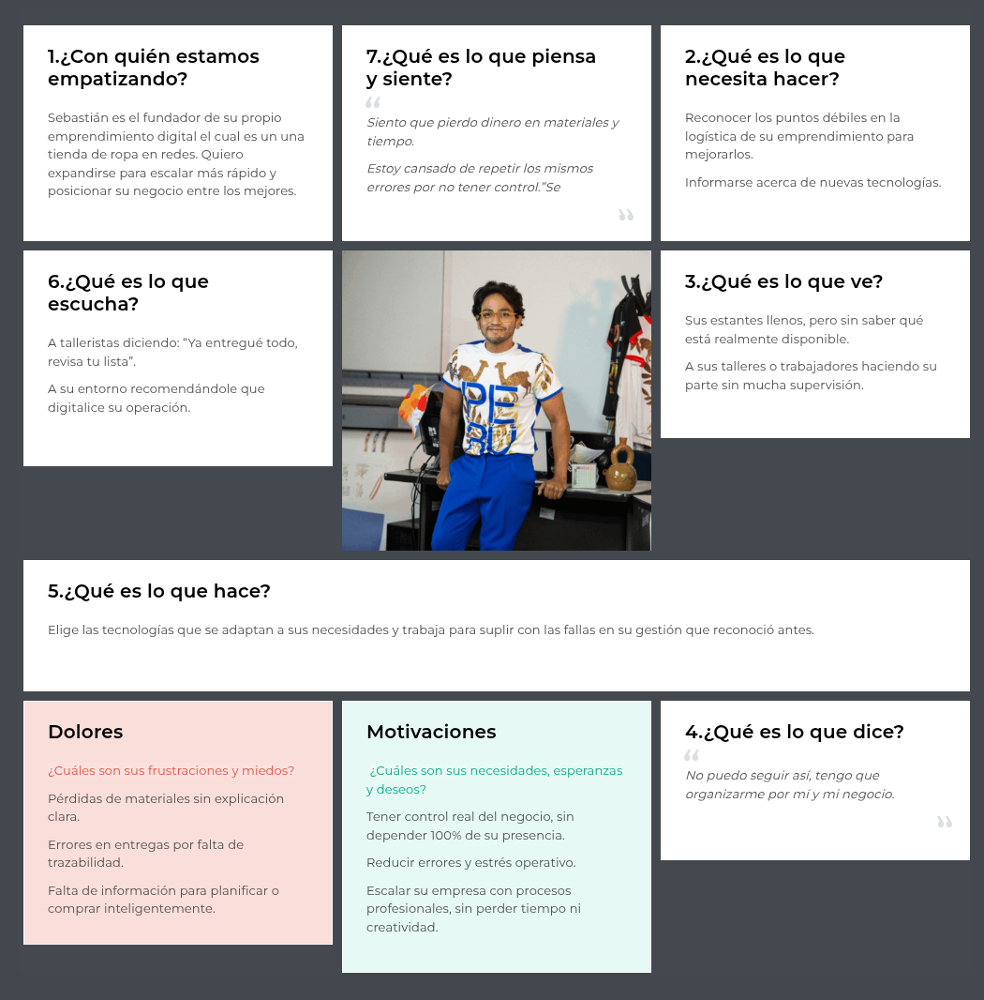

# 
COURSE PROJECT

    <strong>Universidad Peruana de Ciencias Aplicadas</strong> 
    </img> 
    <strong>Ingeniería de Software - 2025-1</strong> 
    <strong>Aplicaciones Web - 4366</strong> 
    <strong>Profesor: Alex Humberto Sánchez Ponce</strong> 
     <strong>Informe del Trabajo Final</strong>

    <strong>Startup: AyniTech</strong> 
    <strong>Producto:  </strong>

    <h3>Team Members:</h3>
    <table align="center">
        <tr>
            <th style="text-align:center;">Member</th>
            <th style="text-align:center;">Code</th>
        </tr>
        <tr>
            <td>Jocelyn Damaly Almerco Rojas</td>
            <td>U20221g068</td>
        </tr>
        <tr>
            <td>Sanchez Rios, Camila Cristina</td>
            <td>U202210973</td>
        </tr>
        <tr>
            <td>Henry Kalet Esteban Roman</td>
            <td>U202310210</td>
        </tr>
        <tr>
            <td>Maria Fernanda Peña Riofrio</td>
            <td>U202113279</td>
        </tr>
        <tr>
            <td>Fabiola Del Rocio Saldaña Ayala</td>
            <td>U202313773</td>
        </tr>
    </table>

    <strong>Abril, 2025</strong>

 

<h1 align="center">Registro de versiones del Informe</h1>
 
<table>
        <thead>
            <tr>
                <th>Versión</th>
                <th>Fecha</th>
                <th>Autor</th>
                <th>Descripción de modificaciones</th>
            </tr>
        </thead>
        <tbody>
            <tr>
                <th>TB1</th>
                <td>07/04/2025</td>
                <td>
                    <ul>
          <li>..</li>
          <li>Camila Sanchez</li>
          <li>..</li>
          <li>..</li>
                    <ul>
           </td>
      <td>            
             <ul>
          <li>Capítulo I: Introducción</li>
          <li>Capítulo II: Requirements Elicitation & Analysis</li>
          <li>Capítulo III: Requirements Specification</li>
          <li>Capítulo IV: Product Design</li>
          <li>Avance del Capítulo V: Product Implementation, Validation & Deployment hasta el punto 5.2.1.8</li>
          <li>Avance de Conclusiones, Bibliografía y Anexos</li>
        </ul>
      </td>
  </tr>
</tbody>
</table>

# Project Report Collaboration Insights
[Link de repositorio del reporte:](https://github.com/upc-pre-202510-1asi0730-4366-AyniTech/Report): https://github.com/upc-pre-202510-1asi0730-4366-AyniTech/Report

# Contenido
[Student Outcome](#student-outcome)

[Capítulo I: Introducción](#capítulo-i-introducción)
- [1.1. Startup Profile](#11-startup-profile)
  - [1.1.1. Descripción de la Startup](#111-descripción-de-la-startup)
  - [1.1.2. Perfiles de integrantes del equipo](#112-perfiles-de-integrantes-del-equipo)
- [1.2. Solution Profile](#12-solution-profile)
  - [1.2.1 Antecedentes y problemática](#121-antecedentes-y-problemática)
  - [1.2.2 Lean UX Process](#122-lean-ux-process)
    - [1.2.2.1. Lean UX Problem Statements](#1221-lean-ux-problem-statements)
    - [1.2.2.2. Lean UX Assumptions](#1222-lean-ux-assumptions)
    - [1.2.2.3. Lean UX Hypothesis Statements](#1223-lean-ux-hypothesis-statements)
    - [1.2.2.4. Lean UX Canvas](#1224-lean-ux-canvas)
- [1.3. Segmentos objetivo](#13-segmentos-objetivo)

[Capítulo II: Requirements Elicitation & Analysis](#capítulo-ii-requirements-elicitation--analysis)
- [COURSE PROJECT](#course-project)
- [Project Report Collaboration Insights](#project-report-collaboration-insights)
- [Contenido](#contenido)
- [Student Outcome](#student-outcome)
- [Capítulo I: Introducción](#capítulo-i-introducción)
  - [1.1. Startup Profile](#11-startup-profile)
    - [1.1.1. Descripción de la Startup](#111-descripción-de-la-startup)
    - [1.1.2. Perfiles de integrantes del equipo](#112-perfiles-de-integrantes-del-equipo)
  - [1.2. Solution Profile](#12-solution-profile)
    - [1.2.1 Antecedentes y problemática](#121-antecedentes-y-problemática)
    - [1.2.2 Lean UX Process](#122-lean-ux-process)
      - [1.2.2.1. Lean UX Problem Statements](#1221-lean-ux-problem-statements)
      - [1.2.2.2. Lean UX Assumptions](#1222-lean-ux-assumptions)
      - [1.2.2.3. Lean UX Hypothesis Statements](#1223-lean-ux-hypothesis-statements)
      - [1.2.2.4. Lean UX Canvas](#1224-lean-ux-canvas)
  - [1.3. Segmentos objetivo](#13-segmentos-objetivo)
- [Capítulo II: Requirements Elicitation \& Analysis](#capítulo-ii-requirements-elicitation--analysis)
  - [2.1. Competidores](#21-competidores)
    - [2.1.1. Análisis competitivo](#211-análisis-competitivo)
    - [2.1.2. Estrategias y tácticas frente a competidores](#212-estrategias-y-tácticas-frente-a-competidores)
  - [2.2. Entrevistas](#22-entrevistas)
    - [2.2.1. Diseño de entrevistas](#221-diseño-de-entrevistas)
    - [2.2.2. Registro de entrevistas](#222-registro-de-entrevistas)
    - [2.2.3. Análisis de entrevistas](#223-análisis-de-entrevistas)
  - [2.3. Needfinding](#23-needfinding)
    - [2.3.1. User Personas](#231-user-personas)
    - [2.3.2. User Task Matrix](#232-user-task-matrix)
    - [2.3.3. User Journey Mapping](#233-user-journey-mapping)
    - [2.3.4. Empathy Mapping](#234-empathy-mapping)
    - [2.3.5. As-is Scenario](#235-as-is-scenario)
  - [2.4. Ubiquitous Language](#24-ubiquitous-language)
- [Capítulo III: Requirements Specification](#capítulo-iii-requirements-specification)
  - [3.1. To-Be Scenario Mapping](#31-to-be-scenario-mapping)
  - [3.2. User Stories](#32-user-stories)
  - [3.3. Impact Mapping](#33-impact-mapping)
  - [3.4. Product Backlog](#34-product-backlog)
- [Capítulo IV: Product Design](#capítulo-iv-product-design)
  - [4.1. Style Guidelines](#41-style-guidelines)
    - [4.1.1. General Style Guidelines](#411-general-style-guidelines)
    - [4.1.2. Web Style Guidelines](#412-web-style-guidelines)
  - [4.2. Information Architecture](#42-information-architecture)
    - [4.2.1. Organization Systems.](#421-organization-systems)
    - [4.2.2. Labeling Systems.](#422-labeling-systems)
    - [4.2.3. SEO Tags and Meta Tags](#423-seo-tags-and-meta-tags)
    - [4.2.4. Searching Systems.](#424-searching-systems)
    - [4.2.5. Navigation Systems.](#425-navigation-systems)
  - [4.3. Landing Page UI Design.](#43-landing-page-ui-design)
    - [4.3.1. Landing Page Wireframe.](#431-landing-page-wireframe)
    - [4.3.2. Landing Page Mock-up.](#432-landing-page-mock-up)
  - [4.4. Web Applications UX/UI Design.](#44-web-applications-uxui-design)
    - [4.4.1. Web Applications Wireframes.](#441-web-applications-wireframes)
    - [4.4.2. Web Applications Wireflow Diagrams.](#442-web-applications-wireflow-diagrams)
    - [4.4.2. Web Applications Mock-ups.](#442-web-applications-mock-ups)
    - [4.4.3. Web Applications User Flow Diagrams.](#443-web-applications-user-flow-diagrams)
  - [4.5. Web Applications Prototyping.](#45-web-applications-prototyping)
  - [4.6. Domain-Driven Software Architecture.](#46-domain-driven-software-architecture)
    - [4.6.1. Software Architecture Context Diagram.](#461-software-architecture-context-diagram)
    - [4.6.2. Software Architecture Container Diagrams.](#462-software-architecture-container-diagrams)
    - [4.6.3. Software Architecture Components Diagrams.](#463-software-architecture-components-diagrams)
  - [4.7. Software Object-Oriented Design.](#47-software-object-oriented-design)
    - [4.7.1. Class Diagrams.](#471-class-diagrams)
    - [4.7.2. Class Dictionary.](#472-class-dictionary)
  - [4.8. Database Design.](#48-database-design)
    - [4.8.1. Database Diagram.](#481-database-diagram)
- [Capítulo V: Product Implementation, Validation \& Deployment](#capítulo-v-product-implementation-validation--deployment)
  - [5.1. Software Configuration Management.](#51-software-configuration-management)
    - [5.1.1. Software Development Environment Configuration.](#511-software-development-environment-configuration)
    - [5.1.2. Source Code Management.](#512-source-code-management)
    - [5.1.3. Source Code Style Guide \& Conventions.](#513-source-code-style-guide--conventions)
    - [5.1.4. Software Deployment Configuration.](#514-software-deployment-configuration)
  - [5.2. Landing Page, Services \& Applications Implementation](#52-landing-page-services--applications-implementation)
    - [5.2.1. Sprint 1](#521-sprint-1)
      - [5.2.1.1. Sprint Planning 1](#5211-sprint-planning-1)
      - [5.2.1.2. Aspect Leaders and Collaborators.](#5212-aspect-leaders-and-collaborators)
      - [5.2.1.3. Sprint Backlog n.](#5213-sprint-backlog-n)
      - [5.2.1.4. Development Evidence for Sprint Review.](#5214-development-evidence-for-sprint-review)
      - [5.2.1.5. Execution Evidence for Sprint Review.](#5215-execution-evidence-for-sprint-review)
      - [5.2.1.6. Services Documentation Evidence for Sprint Review.](#5216-services-documentation-evidence-for-sprint-review)
      - [5.2.1.7. Software Deployment Evidence for Sprint Review.](#5217-software-deployment-evidence-for-sprint-review)
      - [5.2.1.8. Team Collaboration Insights during Sprint.](#5218-team-collaboration-insights-during-sprint)
  - [5.3. Validation Interviews.](#53-validation-interviews)
    - [5.3.1. Diseño de Entrevistas.](#531-diseño-de-entrevistas)
    - [5.3.2. Registro de Entrevistas.](#532-registro-de-entrevistas)
    - [5.3.3. Evaluaciones según heurísticas.](#533-evaluaciones-según-heurísticas)
  - [5.4. Video About-the-Product.](#54-video-about-the-product)
- [Conclusiones](#conclusiones)
  - [Conclusiones y recomendaciones.](#conclusiones-y-recomendaciones)
- [Video About-the-Team.](#video-about-the-team)
- [Bibliografía](#bibliografía)
- [Anexos](#anexos)

[Capítulo III: Requirements Specification](#capítulo-iii-requirements-specification)
- [3.1. To-Be Scenario Mapping](#31-to-be-scenario-mapping)
- [3.2. User Stories](#32-user-stories)
- [3.3. Impact Mapping](#33-impact-mapping)
- [3.4. Product Backlog](#34-product-backlog)

[Capítulo IV: Product Design](#capítulo-iv-product-design)
- [COURSE PROJECT](#course-project)
- [Project Report Collaboration Insights](#project-report-collaboration-insights)
- [Contenido](#contenido)
- [Student Outcome](#student-outcome)
- [Capítulo I: Introducción](#capítulo-i-introducción)
  - [1.1. Startup Profile](#11-startup-profile)
    - [1.1.1. Descripción de la Startup](#111-descripción-de-la-startup)
    - [1.1.2. Perfiles de integrantes del equipo](#112-perfiles-de-integrantes-del-equipo)
  - [1.2. Solution Profile](#12-solution-profile)
    - [1.2.1 Antecedentes y problemática](#121-antecedentes-y-problemática)
    - [1.2.2 Lean UX Process](#122-lean-ux-process)
      - [1.2.2.1. Lean UX Problem Statements](#1221-lean-ux-problem-statements)
      - [1.2.2.2. Lean UX Assumptions](#1222-lean-ux-assumptions)
      - [1.2.2.3. Lean UX Hypothesis Statements](#1223-lean-ux-hypothesis-statements)
      - [1.2.2.4. Lean UX Canvas](#1224-lean-ux-canvas)
  - [1.3. Segmentos objetivo](#13-segmentos-objetivo)
- [Capítulo II: Requirements Elicitation \& Analysis](#capítulo-ii-requirements-elicitation--analysis)
  - [2.1. Competidores](#21-competidores)
    - [2.1.1. Análisis competitivo](#211-análisis-competitivo)
    - [2.1.2. Estrategias y tácticas frente a competidores](#212-estrategias-y-tácticas-frente-a-competidores)
  - [2.2. Entrevistas](#22-entrevistas)
    - [2.2.1. Diseño de entrevistas](#221-diseño-de-entrevistas)
    - [2.2.2. Registro de entrevistas](#222-registro-de-entrevistas)
    - [2.2.3. Análisis de entrevistas](#223-análisis-de-entrevistas)
  - [2.3. Needfinding](#23-needfinding)
    - [2.3.1. User Personas](#231-user-personas)
    - [2.3.2. User Task Matrix](#232-user-task-matrix)
    - [2.3.3. User Journey Mapping](#233-user-journey-mapping)
    - [2.3.4. Empathy Mapping](#234-empathy-mapping)
    - [2.3.5. As-is Scenario](#235-as-is-scenario)
  - [2.4. Ubiquitous Language](#24-ubiquitous-language)
- [Capítulo III: Requirements Specification](#capítulo-iii-requirements-specification)
  - [3.1. To-Be Scenario Mapping](#31-to-be-scenario-mapping)
  - [3.2. User Stories](#32-user-stories)
  - [3.3. Impact Mapping](#33-impact-mapping)
  - [3.4. Product Backlog](#34-product-backlog)
- [Capítulo IV: Product Design](#capítulo-iv-product-design)
  - [4.1. Style Guidelines](#41-style-guidelines)
    - [4.1.1. General Style Guidelines](#411-general-style-guidelines)
    - [4.1.2. Web Style Guidelines](#412-web-style-guidelines)
  - [4.2. Information Architecture](#42-information-architecture)
    - [4.2.1. Organization Systems.](#421-organization-systems)
    - [4.2.2. Labeling Systems.](#422-labeling-systems)
    - [4.2.3. SEO Tags and Meta Tags](#423-seo-tags-and-meta-tags)
    - [4.2.4. Searching Systems.](#424-searching-systems)
    - [4.2.5. Navigation Systems.](#425-navigation-systems)
  - [4.3. Landing Page UI Design.](#43-landing-page-ui-design)
    - [4.3.1. Landing Page Wireframe.](#431-landing-page-wireframe)
    - [4.3.2. Landing Page Mock-up.](#432-landing-page-mock-up)
  - [4.4. Web Applications UX/UI Design.](#44-web-applications-uxui-design)
    - [4.4.1. Web Applications Wireframes.](#441-web-applications-wireframes)
    - [4.4.2. Web Applications Wireflow Diagrams.](#442-web-applications-wireflow-diagrams)
    - [4.4.2. Web Applications Mock-ups.](#442-web-applications-mock-ups)
    - [4.4.3. Web Applications User Flow Diagrams.](#443-web-applications-user-flow-diagrams)
  - [4.5. Web Applications Prototyping.](#45-web-applications-prototyping)
  - [4.6. Domain-Driven Software Architecture.](#46-domain-driven-software-architecture)
    - [4.6.1. Software Architecture Context Diagram.](#461-software-architecture-context-diagram)
    - [4.6.2. Software Architecture Container Diagrams.](#462-software-architecture-container-diagrams)
    - [4.6.3. Software Architecture Components Diagrams.](#463-software-architecture-components-diagrams)
  - [4.7. Software Object-Oriented Design.](#47-software-object-oriented-design)
    - [4.7.1. Class Diagrams.](#471-class-diagrams)
    - [4.7.2. Class Dictionary.](#472-class-dictionary)
  - [4.8. Database Design.](#48-database-design)
    - [4.8.1. Database Diagram.](#481-database-diagram)
- [Capítulo V: Product Implementation, Validation \& Deployment](#capítulo-v-product-implementation-validation--deployment)
  - [5.1. Software Configuration Management.](#51-software-configuration-management)
    - [5.1.1. Software Development Environment Configuration.](#511-software-development-environment-configuration)
    - [5.1.2. Source Code Management.](#512-source-code-management)
    - [5.1.3. Source Code Style Guide \& Conventions.](#513-source-code-style-guide--conventions)
    - [5.1.4. Software Deployment Configuration.](#514-software-deployment-configuration)
  - [5.2. Landing Page, Services \& Applications Implementation](#52-landing-page-services--applications-implementation)
    - [5.2.1. Sprint 1](#521-sprint-1)
      - [5.2.1.1. Sprint Planning 1](#5211-sprint-planning-1)
      - [5.2.1.2. Aspect Leaders and Collaborators.](#5212-aspect-leaders-and-collaborators)
      - [5.2.1.3. Sprint Backlog n.](#5213-sprint-backlog-n)
      - [5.2.1.4. Development Evidence for Sprint Review.](#5214-development-evidence-for-sprint-review)
      - [5.2.1.5. Execution Evidence for Sprint Review.](#5215-execution-evidence-for-sprint-review)
      - [5.2.1.6. Services Documentation Evidence for Sprint Review.](#5216-services-documentation-evidence-for-sprint-review)
      - [5.2.1.7. Software Deployment Evidence for Sprint Review.](#5217-software-deployment-evidence-for-sprint-review)
      - [5.2.1.8. Team Collaboration Insights during Sprint.](#5218-team-collaboration-insights-during-sprint)
  - [5.3. Validation Interviews.](#53-validation-interviews)
    - [5.3.1. Diseño de Entrevistas.](#531-diseño-de-entrevistas)
    - [5.3.2. Registro de Entrevistas.](#532-registro-de-entrevistas)
    - [5.3.3. Evaluaciones según heurísticas.](#533-evaluaciones-según-heurísticas)
  - [5.4. Video About-the-Product.](#54-video-about-the-product)
- [Conclusiones](#conclusiones)
  - [Conclusiones y recomendaciones.](#conclusiones-y-recomendaciones)
- [Video About-the-Team.](#video-about-the-team)
- [Bibliografía](#bibliografía)
- [Anexos](#anexos)

[Capítulo V: Product Implementation, Validation & Deployment](#capítulo-v-product-implementation-validation--deployment)
- [COURSE PROJECT](#course-project)
- [Project Report Collaboration Insights](#project-report-collaboration-insights)
- [Contenido](#contenido)
- [Student Outcome](#student-outcome)
- [Capítulo I: Introducción](#capítulo-i-introducción)
  - [1.1. Startup Profile](#11-startup-profile)
    - [1.1.1. Descripción de la Startup](#111-descripción-de-la-startup)
    - [1.1.2. Perfiles de integrantes del equipo](#112-perfiles-de-integrantes-del-equipo)
  - [1.2. Solution Profile](#12-solution-profile)
    - [1.2.1 Antecedentes y problemática](#121-antecedentes-y-problemática)
    - [1.2.2 Lean UX Process](#122-lean-ux-process)
      - [1.2.2.1. Lean UX Problem Statements](#1221-lean-ux-problem-statements)
      - [1.2.2.2. Lean UX Assumptions](#1222-lean-ux-assumptions)
      - [1.2.2.3. Lean UX Hypothesis Statements](#1223-lean-ux-hypothesis-statements)
      - [1.2.2.4. Lean UX Canvas](#1224-lean-ux-canvas)
  - [1.3. Segmentos objetivo](#13-segmentos-objetivo)
- [Capítulo II: Requirements Elicitation \& Analysis](#capítulo-ii-requirements-elicitation--analysis)
  - [2.1. Competidores](#21-competidores)
    - [2.1.1. Análisis competitivo](#211-análisis-competitivo)
    - [2.1.2. Estrategias y tácticas frente a competidores](#212-estrategias-y-tácticas-frente-a-competidores)
  - [2.2. Entrevistas](#22-entrevistas)
    - [2.2.1. Diseño de entrevistas](#221-diseño-de-entrevistas)
    - [2.2.2. Registro de entrevistas](#222-registro-de-entrevistas)
    - [2.2.3. Análisis de entrevistas](#223-análisis-de-entrevistas)
  - [2.3. Needfinding](#23-needfinding)
    - [2.3.1. User Personas](#231-user-personas)
    - [2.3.2. User Task Matrix](#232-user-task-matrix)
    - [2.3.3. User Journey Mapping](#233-user-journey-mapping)
    - [2.3.4. Empathy Mapping](#234-empathy-mapping)
    - [2.3.5. As-is Scenario](#235-as-is-scenario)
  - [2.4. Ubiquitous Language](#24-ubiquitous-language)
- [Capítulo III: Requirements Specification](#capítulo-iii-requirements-specification)
  - [3.1. To-Be Scenario Mapping](#31-to-be-scenario-mapping)
  - [3.2. User Stories](#32-user-stories)
  - [3.3. Impact Mapping](#33-impact-mapping)
  - [3.4. Product Backlog](#34-product-backlog)
- [Capítulo IV: Product Design](#capítulo-iv-product-design)
  - [4.1. Style Guidelines](#41-style-guidelines)
    - [4.1.1. General Style Guidelines](#411-general-style-guidelines)
    - [4.1.2. Web Style Guidelines](#412-web-style-guidelines)
  - [4.2. Information Architecture](#42-information-architecture)
    - [4.2.1. Organization Systems.](#421-organization-systems)
    - [4.2.2. Labeling Systems.](#422-labeling-systems)
    - [4.2.3. SEO Tags and Meta Tags](#423-seo-tags-and-meta-tags)
    - [4.2.4. Searching Systems.](#424-searching-systems)
    - [4.2.5. Navigation Systems.](#425-navigation-systems)
  - [4.3. Landing Page UI Design.](#43-landing-page-ui-design)
    - [4.3.1. Landing Page Wireframe.](#431-landing-page-wireframe)
    - [4.3.2. Landing Page Mock-up.](#432-landing-page-mock-up)
  - [4.4. Web Applications UX/UI Design.](#44-web-applications-uxui-design)
    - [4.4.1. Web Applications Wireframes.](#441-web-applications-wireframes)
    - [4.4.2. Web Applications Wireflow Diagrams.](#442-web-applications-wireflow-diagrams)
    - [4.4.2. Web Applications Mock-ups.](#442-web-applications-mock-ups)
    - [4.4.3. Web Applications User Flow Diagrams.](#443-web-applications-user-flow-diagrams)
  - [4.5. Web Applications Prototyping.](#45-web-applications-prototyping)
  - [4.6. Domain-Driven Software Architecture.](#46-domain-driven-software-architecture)
    - [4.6.1. Software Architecture Context Diagram.](#461-software-architecture-context-diagram)
    - [4.6.2. Software Architecture Container Diagrams.](#462-software-architecture-container-diagrams)
    - [4.6.3. Software Architecture Components Diagrams.](#463-software-architecture-components-diagrams)
  - [4.7. Software Object-Oriented Design.](#47-software-object-oriented-design)
    - [4.7.1. Class Diagrams.](#471-class-diagrams)
    - [4.7.2. Class Dictionary.](#472-class-dictionary)
  - [4.8. Database Design.](#48-database-design)
    - [4.8.1. Database Diagram.](#481-database-diagram)
- [Capítulo V: Product Implementation, Validation \& Deployment](#capítulo-v-product-implementation-validation--deployment)
  - [5.1. Software Configuration Management.](#51-software-configuration-management)
    - [5.1.1. Software Development Environment Configuration.](#511-software-development-environment-configuration)
    - [5.1.2. Source Code Management.](#512-source-code-management)
    - [5.1.3. Source Code Style Guide \& Conventions.](#513-source-code-style-guide--conventions)
    - [5.1.4. Software Deployment Configuration.](#514-software-deployment-configuration)
  - [5.2. Landing Page, Services \& Applications Implementation](#52-landing-page-services--applications-implementation)
    - [5.2.1. Sprint 1](#521-sprint-1)
      - [5.2.1.1. Sprint Planning 1](#5211-sprint-planning-1)
      - [5.2.1.2. Aspect Leaders and Collaborators.](#5212-aspect-leaders-and-collaborators)
      - [5.2.1.3. Sprint Backlog n.](#5213-sprint-backlog-n)
      - [5.2.1.4. Development Evidence for Sprint Review.](#5214-development-evidence-for-sprint-review)
      - [5.2.1.5. Execution Evidence for Sprint Review.](#5215-execution-evidence-for-sprint-review)
      - [5.2.1.6. Services Documentation Evidence for Sprint Review.](#5216-services-documentation-evidence-for-sprint-review)
      - [5.2.1.7. Software Deployment Evidence for Sprint Review.](#5217-software-deployment-evidence-for-sprint-review)
      - [5.2.1.8. Team Collaboration Insights during Sprint.](#5218-team-collaboration-insights-during-sprint)
  - [5.3. Validation Interviews.](#53-validation-interviews)
    - [5.3.1. Diseño de Entrevistas.](#531-diseño-de-entrevistas)
    - [5.3.2. Registro de Entrevistas.](#532-registro-de-entrevistas)
    - [5.3.3. Evaluaciones según heurísticas.](#533-evaluaciones-según-heurísticas)
  - [5.4. Video About-the-Product.](#54-video-about-the-product)
- [Conclusiones](#conclusiones)
  - [Conclusiones y recomendaciones.](#conclusiones-y-recomendaciones)
- [Video About-the-Team.](#video-about-the-team)
- [Bibliografía](#bibliografía)
- [Anexos](#anexos)

[Conclusiones](#conclusiones)
- [Conclusiones y recomendaciones](#conclusiones-y-recomendaciones)
- [Video About-the-Team](#video-about-the-team)

[Bibliografía](#bibliografía)

[Anexos](#anexos)

# Student Outcome

ABET – EAC - Student Outcome 5

Criterio: La capacidad de funcionar efectivamente en un equipo cuyos miembros juntos proporcionan liderazgo, crean un entorno de colaboración e inclusivo, establecen objetivos, planifican tareas y cumplen objetivos.

<table>
  <tr>
    <td><b>Criterio específico</b></td>
    <td><b>Acciones realizadas</b></td>
    <td><b>Conclusiones</b></td>
  </tr>
    </thead>
  <tbody>
    <tr>
      <td><b>Comunica oralmente con
efectividad a diferentes rangos
de audiencia.</b></td>
      <td>
        
<b>name  </b>

        
<b>TB1:</b>

        
..

        
<b>TP1:</b>

        
,..

        
<b>TB2:</b>

        
.

        
<b>TF:</b>

        
.

        
<b>name</b>

       
<b>TB1:</b>

        

        
<b>TP1:</b>

        

        
<b>TB2:</b>

        

        
<b>TF:</b>

        
.

        
<b>name</b>

        
<b>TB1:</b>

        
     
        

        
<b>TP1:</b>

        
.

        
<b>TB2:</b>

        

        
<b>TF:</b>

        
.

        
<b></b>

       
<b>TB1:</b>

        

        
<b>TP1:</b>

        

        
<b>TB2:</b>

        

        
<b>TF:</b>

        

      </td>
      <td>
        
<strong>TB1:</strong>

        

        
<strong>TP1:</strong>

        
.

        
<strong>TB2:</strong>

        

        
<strong>TF:</strong>

        

      </td>
    </tr>
    <tr>
      <td>Comunica por escrito con
efectividad a diferentes rangos
de audiencia.</td>
      <td>
        
<b>name  </b>

        
<b>TB1:</b>

        
..

        
<b>TP1:</b>

        
..

        
<b>TB2:</b>

        
..

        
<b>TF:</b>

        
..

        
<b>name</b>

       
<b>TB1:</b>

        
..

        
<b>TP1:</b>

        
..

        
<b>TB2:</b>

        
...

        
<b>TF:</b>

        
.

        
<b>name</b>

        
<b>TB1:</b>

        
..
        

        
<b>TP1:</b>

        
..

        
<b>TB2:</b>

        
...

        
<b>TF:</b>

        
.

        
<b>name</b>

       
<b>TB1:</b>

        
...

        
<b>TP1:</b>

        
...

        
<b>TB2:</b>

        
...

        
<b>TF:</b>

        
...

      </td>
       <td>
        
<strong>TB1:</strong>

        
..

        
<strong>TP1:</strong>

        
...

        
<strong>TB2:</strong>

        
..

        
<strong>TF:</strong>

        
...

      </td>
    </tr>
  </tbody>
</table>

# Capítulo I: Introducción
## 1.1. Startup Profile
### 1.1.1. Descripción de la Startup
### 1.1.2. Perfiles de integrantes del equipo

## 1.2. Solution Profile
### 1.2.1 Antecedentes y problemática
### 1.2.2 Lean UX Process
#### 1.2.2.1. Lean UX Problem Statements
#### 1.2.2.2. Lean UX Assumptions
#### 1.2.2.3. Lean UX Hypothesis Statements
#### 1.2.2.4. Lean UX Canvas
## 1.3. Segmentos objetivo

# Capítulo II: Requirements Elicitation & Analysis

## 2.1. Competidores
### 2.1.1. Análisis competitivo
   | **Elemento**                                                                 | **Stock Wise**                                                                                   | **MECALUX**                                                                                           | **VENDUS**                                                                                     | **DUX Software**                                                                                         |
|------------------------------------------------------------------------------|--------------------------------------------------------------------------------------------------|--------------------------------------------------------------------------------------------------------|------------------------------------------------------------------------------------------------|-----------------------------------------------------------------------------------------------------------|
| **¿Por qué llevar a cabo este análisis?**                                    | Este análisis se lleva a cabo con la finalidad de identificar a nuestros competidores y generar estrategias que nos diferencien, brindando información clave para tomar decisiones estratégicas en el desarrollo y crecimiento de nuestra aplicación. |                                                                                                        |                                                                                                        |                                                                                                            |
| **Perfil**                                                                   |                                                                                  |                                                                                                        |                                                                                                        |                                                                                                            |
| Overview                                                                     | Plataforma web para gestionar inventarios de pymes, startup y bodegas                           | Plataforma web especializada en soluciones logísticas e inventarios industriales                      | Plataforma web de punto de venta e inventario enfocada en pequeños comercios                  | Software peruano de gestión para negocios minoristas y distribuidores                                     |
| Ventaja Competitiva – ¿Qué valor ofrece a los clientes?                     | Fácil de usar, accesible, con alertas inteligentes y reportes visuales. Optimiza inventarios, reduce errores y mejora decisiones con datos en tiempo real | Tecnología avanzada y soluciones integrales para almacenes. Automatización del almacenamiento, control de stock en tiempo real | Facilidad de uso y precios accesibles. Ofrece una gestión rápida de ventas, inventario, facturación electrónica | Adaptado al mercado local. Ofrece control de inventarios, ventas y caja con cumplimiento tributario local |
| **Perfil de Marketing**                                                     |                                                                                                  |                                                                                                        |                                                                                                        |                                                                                                            |
| Mercado objetivo                                                             | Emprendedores y pymes                                                                           | Empresas medianas y grandes con necesidades logísticas complejas                                      | Tiendas pequeñas, emprendedores, minoristas                                                   | Comercios pequeños y medianos del Perú                                                                    |
| Estrategias de Marketing                                                     | Publicidad en redes sociales, alianzas con MYPES, contenido educativo                            | Ferias industriales, redes sociales                                                                    | Publicidad digital, redes sociales, prueba gratuita                                           | Marketing local, publicidad en redes, presencia en eventos MYPE                                           |
| **Perfil de Productos**                                                     |                                                                                                  |                                                                                                        |                                                                                                        |                                                                                                            |
| Productos & Servicios                                                        | Gestión de stock, alertas, reportes, control de usuarios, versión gratuita                      | Software de gestión de almacenes (WMS), estanterías, robots logísticos                                | POS, control de stock, reportes, gestión de clientes                                           | Gestión de stock, ventas, compras, reportes contables                                                    |
| Precios y Costos                                                             | Bajo costo inicial, modelo freemium con planes escalables                                       | Precios altos ya que tiene soluciones personalizadas según la empresa                                 | Modelos de suscripción mensuales accesibles desde 10 a 25 dólares                             | Modelos por licencia o suscripción, accesible para MYPES                                                 |
| Canales de distribución (Web y/o Móvil)                                     | Web, soporte técnico local                                                                      | Web corporativa, atención directa con ejecutivos de ventas                                            | Web y app móvil, soporte técnico local                                                         | Web, soporte técnico local                                                                               |
| **Análisis SWOT**                                                            |                                                                                                  |                                                                                                        |                                                                                                        |                                                                                                            |
| Fortalezas                                                                   | Intuitiva, enfocada en negocios en crecimiento, funciones clave bien integradas                | Tecnología robusta, experiencia global, soluciones a medida                                           | Bajo costo, interfaz amigable, soporte en español                                             | Cumplimiento legal en Perú, lenguaje y enfoque local                                                     |
| Debilidades                                                                  | Marca nueva, validación en proceso                                                              | Costos elevados, poca accesibilidad para pymes                                                        | Funcionalidades limitadas frente a soluciones más avanzadas                                  | Poca expansión internacional, interfaz no tan moderna                                                    |
| Oportunidades                                                                | Alta demanda de digitalización en LATAM, posible integración con e-commerce                    | Expansión hacia software más accesible para negocios pequeños                                         | Crecimiento en mercados emergentes, integración con apps externas                            | Ampliación de módulos (delivery, e-commerce); expansión a LATAM                                          |
| Amenazas                                                                     | Competencia establecida, resistencia al cambio                                                  | Competencia con soluciones más simples y económicas                                                   | Alta competencia en el segmento de POS económicos                                             | Competencia extranjera con mejor tecnología y marketing                                                  |       
### 2.1.2. Estrategias y tácticas frente a competidores

StockWise destacar frente a la competencia aprovechando sus ventajas clave frente a competidores como Mecalux, Vendus y Dux Software. A continuación, se detallarán algunas estrategias y tácticas que podríamos considerar:

**Diferenciación del Producto:**

**Estrategia**: Resaltar los aspectos únicos de StockWise frente a competidores como Mecalux, Vendus y Dux Software.

**Táctica**: Enfatizar la simplicidad, accesibilidad y bajo costo del producto, junto con la oferta de una versión freemium que facilite la  adopción en negocios pequeños.

**Optimización de la experiencia del usuario**

**Estrategia:** Fomentar la satisfacción y fidelidad del usuario mediante una interfaz intuitiva y fácil de usar.

**Táctica**: Mejorar continuamente la interfaz de usuario, simplificando la navegación, e incorporar funcionalidades clave como alertas inteligentes y reportes visuales que faciliten la gestión.

**Expansión de la base de usuarios**

**Estrategia**: Atraer nuevos usuarios para incrementar la presencia de StockWise en el mercado de pymes y startups.

**Táctica**: Implementar un modelo freemium para incentivar la adopción inicial, y ejecutar campañas digitales dirigidas a pequeñas empresas que busquen una solución eficiente de gestión de inventarios.

## 2.2. Entrevistas

La finalidad de realizar entrevistas es obtener un alcance más completo sobre las experiencias, perspectivas y opiniones de los segmentos de mercado definidos. Nuestro objetivo es recolectar información valiosa que nos permita conocer mejor a nuestro público objetivo. Con estas entrevistas se tendrá una visión más clara de las necesidades y expectativas de nuestros usuarios.

### 2.2.1. Diseño de entrevistas

**Segmento #1: Bodegas especializadas por rubro**

**Preguntas principales**

1. ¿Podrías contarme cómo gestionas actualmente el inventario de tu bodega?
2. ¿Cuáles son los mayores retos que enfrentas al momento de organizar tus productos?
3. ¿Has tenido pérdidas o problemas por errores en el inventario? ¿Cómo los resolviste?
4. ¿Qué tan importante es para ti tener un control en tiempo real de tu stock?
5. ¿Utilizas algún sistema o herramienta digital? ¿Cuál y cómo te va con ella?

**Preguntas complementarias**

1. ¿Cómo te enteras cuando falta un producto o está a punto de vencerse?
2. ¿Qué tipo de reportes o información te gustaría tener sobre tu inventario?
3. ¿Qué dispositivos usas más en tu trabajo (laptop, celular, tablet)?
4. ¿Cómo crees que una plataforma digital podría ayudarte a mejorar tu operación?

**Segmento #2: Startups y emprendedores en expansión con necesidades logísticas**

**Preguntas principales**
1. ¿Cómo manejas actualmente el inventario de tu negocio?
2. ¿En qué momentos has sentido que el control del stock te limita o te hace perder tiempo?
3. ¿Cómo llevas el registro de entradas y salidas de productos?
4. ¿Qué te gustaría mejorar de tu proceso logístico actual?
5. ¿Has considerado usar alguna plataforma para gestionar tu inventario? ¿Por qué sí o por qué no?

**Preguntas complementarias**
1. ¿Qué herramientas digitales usas en tu negocio actualmente?
2. ¿Dónde almacenas tus productos?
3. ¿Qué tan seguido necesitas revisar el stock?
4. ¿Qué redes sociales o canales digitales usas para vender?

### 2.2.2. Registro de entrevistas

**Segmento 1: Bodegas especializadas por rubro**

<table border="1">
  <tr>
    <th>Entrevista</th>
    <td>1</td>
    <th>Nombre</th>
    <td>Milagros Almerco</td>
  </tr>
  <tr>
    <th>Edad</th>
    <td>28</td>
    <th>Distrito</th>
    <td>San Martín de Porres</td>
  </tr>
  <tr>
    <th>Captura de la entrevista: </th>
    <td colspan="3">
        En la entrevista, la estudiante Milagros Almerco comenta que lleva el control de su bodega en un cuaderno, anotando manualmente las ventas y compras. Reconoce que su sistema es básico y que a veces se olvida de registrar productos, lo que dificulta llevar un control claro del inventario. Además, le resulta complicado encontrar información específica entre tantas hojas. Señala como uno de sus principales problemas la falta de control sobre las fechas de vencimiento, lo que ha ocasionado pérdidas por productos que no logró vender a tiempo. También menciona que no siempre actualiza los cambios de precio. Para prevenir esto, trata de revisar los estantes y adelantar los productos por vencer. Respecto a herramientas digitales, indica que usa el celular y la calculadora por practicidad. Pero le gustaría contar con un sistema que le avise qué productos están por vencer, cuáles debe reponer y cómo están cambiando los precios. Además, considera importante poder visualizar su inventario en tiempo real. Le gustaría recibir alertas y reportes que le ayuden a organizar mejor su negocio.
    </td>
  </tr>
  <tr>
    <th>URL de la grabación</th>
    <td colspan="3">
      <a href="https://upcedupe-my.sharepoint.com/personal/u202313773_upc_edu_pe/_layouts/15/stream.aspx?id=%2Fpersonal%2Fu202313773%5Fupc%5Fedu%5Fpe%2FDocuments%2FAPPS%20WEB%20Entrevistas%2FSegmento%201%20%2D%20Milagros%20Almerco%2Emp4&referrer=StreamWebApp%2EWeb&referrerScenario=AddressBarCopied%2Eview%2Edc94b62e%2D1e74%2D40a3%2D95b6%2Df2d0a4409236">
        Ver grabación
      </a>
    </td>
  </tr>
  <tr>
   <th>Timing</th>
    <td colspan="3">
        00:00 - 6:58
    </td>
  </tr>
</table>
 

<table border="1">
  <tr>
    <th>Entrevista</th>
    <td>2</td>
    <th>Nombre</th>
    <td>Elvis Aranga Mesa</td>
  </tr>
  <tr>
    <th>Edad</th>
    <td>31</td>
    <th>Distrito</th>
    <td>Santiago de Surco</td>
  </tr>
  <tr>
    <th>Captura de la entrevista: </th>
    <td colspan="3">
        Elvis Aranga Meza, de 31 años y encargado de la administración en su bodega en Santiago de Surco, gestiona el inventario de forma manual, sin un sistema digital, basándose en el control visual y el registro de ventas totales. Reconoce que esta falta de control sistematizado dificulta hacer proyecciones, identificar los productos con mayor rotación o margen de ganancia, y manejar adecuadamente las mermas, especialmente en productos perecibles como frutas y abarrotes. Ha enfrentado pérdidas por productos vencidos y robos, y señala la necesidad de implementar un sistema digital para actualizar precios en tiempo real, controlar vencimientos y facilitar la gestión por parte del personal. Considera que una plataforma digital mejoraría la eficiencia, permitiría delegar tareas y evitar errores en la rotación y precios, aportando mayor libertad y control en la operación diaria.
    </td>
  </tr>
  <tr>
    <th>URL de la grabación</th>
    <td colspan="3">
      <a href="https://upcedupe-my.sharepoint.com/:v:/g/personal/u202210973_upc_edu_pe/EVFkpIPNJJNAmdHkKcstbtEBWupkv7DWIEhjeeZ35zq4fQ?nav=eyJyZWZlcnJhbEluZm8iOnsicmVmZXJyYWxBcHAiOiJTdHJlYW1XZWJBcHAiLCJyZWZlcnJhbFZpZXciOiJTaGFyZURpYWxvZy1MaW5rIiwicmVmZXJyYWxBcHBQbGF0Zm9ybSI6IldlYiIsInJlZmVycmFsTW9kZSI6InZpZXcifX0%3D&e=If9s44">
        Ver grabación
      </a>
    </td>
  </tr>
  <tr>
   <th>Timing</th>
    <td colspan="3">
        00:00 - 5:58
    </td>
  </tr>
</table>
 

**Segmento 2: Startups y emprendedores en expansión con necesidades logísticas**

<table border="1">
  <tr>
    <th>Entrevista</th>
    <td>4</td>
    <th>Nombre</th>
    <td>Alexander Miranda</td>
  </tr>
  <tr>
    <th>Edad</th>
    <td>25</td>
    <th>Distrito</th>
    <td>Villa el Salvador</td>
  </tr>
  <tr>
    <th>Captura de la entrevista: </th>
    <td colspan="3">
        En la entrevista, Alexander Miranda comentó que se dedica a la venta texti. Explicó que hace sus registros de manera manual lo que es agotador para él y que siente que pierde mucho tiempo ya que le puede tomar horas. Mediante excel controla sus ingresos y luego revisa las boletas para actualziar el inventario y llevar un conteo general. Nos dice que le gustaría automatizar sus procesos y ha considerado emplear tecnologías que le apoyen a modernizar su negocio para la gestión de inventarios. 
    </td>
  </tr>
  <tr>
    <th>URL de la grabación</th>
    <td colspan="3">
      <a href="https://upcedupe-my.sharepoint.com/:v:/g/personal/u202313773_upc_edu_pe/ETPQr9I6u29Err2BinQ0Zr8Bu1EkhHaYdA8rEER-XxKDbg?nav=eyJyZWZlcnJhbEluZm8iOnsicmVmZXJyYWxBcHAiOiJPbmVEcml2ZUZvckJ1c2luZXNzIiwicmVmZXJyYWxBcHBQbGF0Zm9ybSI6IldlYiIsInJlZmVycmFsTW9kZSI6InZpZXciLCJyZWZlcnJhbFZpZXciOiJNeUZpbGVzTGlua0NvcHkifX0&e=AKIgP2">
        Ver grabación
      </a>
    </td>
  </tr>
  <tr>
   <th>Timing</th>
    <td colspan="3">
        00:00 - 3:00
    </td>
  </tr>
</table>

<table border="1">
  <tr>
    <th>Entrevista</th>
    <td>5</td>
    <th>Nombre</th>
    <td>Juan Carlos Ramírez</td>
  </tr>
  <tr>
    <th>Edad</th>
    <td>49</td>
    <th>Distrito</th>
    <td>Surquillo</td>
  </tr>
  <tr>
    <th>Captura de la entrevista: </th>
    <td colspan="3">
        Juan Carlos Ramírez, emprendedor de 49 años, gestiona su inventario principalmente de forma manual, registrando entradas y salidas mediante boletas y facturas sin un control digital completo. Actualmente está en proceso de digitalizar su sistema con un programa y una máquina POS que escanea códigos de barra, aunque aún no emite boletas ni facturas electrónicas. La revisión del stock se realiza visualmente y las ventas se gestionan principalmente por WhatsApp con entrega a domicilio. Busca mejorar la eficiencia y liberar tiempo mediante la implementación de herramientas digitales más integradas.

    </td>
  </tr>
  <tr>
    <th>URL de la grabación</th>
    <td colspan="3">
      <a href="https://upcedupe-my.sharepoint.com/:v:/g/personal/u202210973_upc_edu_pe/EbpC_u5BZVNDhNTo7pHv2_UBe-4e_XgetugcdwDvEFOUJA?nav=eyJyZWZlcnJhbEluZm8iOnsicmVmZXJyYWxBcHAiOiJTdHJlYW1XZWJBcHAiLCJyZWZlcnJhbFZpZXciOiJTaGFyZURpYWxvZy1MaW5rIiwicmVmZXJyYWxBcHBQbGF0Zm9ybSI6IldlYiIsInJlZmVycmFsTW9kZSI6InZpZXcifX0%3D&e=0mociM">
        Ver grabación
      </a>
    </td>
  </tr>
  <tr>
   <th>Timing</th>
    <td colspan="3">
        00:00 - 3:34
    </td>
  </tr>
</table>

### 2.2.3. Análisis de entrevistas
## 2.3. Needfinding

En el siguiente apartado, analizaremos a nuestros segmentos objetivos para identificar sus necesidades y en base a esto ofrecerles soluciones óptimas a sus problemas.

  <!-- Esto agrega espacio visual en algunas plataformas -->
  
### 2.3.1. User Personas

**Segmento 1: Bodegas especializadas por rubro**

**Segmento 2: Startups y emprendedores en expansión con necesidades logísticas**

  <!-- Esto agrega espacio visual en algunas plataformas -->
  <!-- Esto agrega espacio visual en algunas plataformas -->
  <!-- Esto agrega espacio visual en algunas plataformas -->
  <!-- Esto agrega espacio visual en algunas plataformas -->
### 2.3.2. User Task Matrix

**Segmento 1: Bodegas especializadas por rubro**

| **Task Matrix**                                                     | **Frecuencia** | **Importancia** |
|----------------------------------------------------------------------|----------------|------------------|
| Supervisar el stock y revisar niveles de inventario                 | Alta           | Alta             |
| Realizar conteos físicos o auditorías manuales                      | Media          | Alta             |
| Negociar precios y coordinar con proveedores                        | Alta           | Alta             |
| Revisar reportes de ventas, rotación y márgenes                     | Media          | Alta             |
| Ingresar datos en Excel o sistemas básicos de control               | Media          | Media            |
| Delegar tareas a sus asistentes o empleados                         | Media          | Alta             |
| Atender clientes en tienda                                          | Alta           | Alta             |
| Coordinar pedidos con mayoristas o distribuidores                   | Alta           | Alta             |
| Capacitarse en nuevas herramientas tecnológicas                     | Baja           | Media            |
| Resolver errores de inventario (*sobrestock*, productos vencidos)  | Alta           | Alta             |

  <!-- Esto agrega espacio visual en algunas plataformas -->

**Segmento 2: Startups y emprendedores en expansión con necesidades logísticas**

| **Task Matrix**                                                                       | **Frecuencia** | **Importancia** |
|---------------------------------------------------------------------------------------|----------------|------------------|
| Supervisar la producción (propia o con talleres externos)                             | Alta           | Alta             |
| Gestionar inventario de insumos y productos terminados (telas, hilos, prendas)        | Alta           | Alta             |
| Registrar entradas, salidas y devoluciones de productos                               | Media          | Alta             |
| Coordinar pedidos con clientes o puntos de venta                                      | Alta           | Alta             |
| Diseñar nuevas piezas o adaptar modelos a la demanda                                  | Alta           | Alta             |
| Publicar contenido y gestionar redes sociales                                         | Alta           | Media            |
| Empaquetar productos y organizar despachos                                            | Media          | Alta             |
| Analizar qué productos se venden más y qué insumos se usan más                        | Media          | Alta             |
| Actualizar listas de precios, catálogos o colecciones                                 | Media          | Media            |
| Registrar ventas y organizar información contable o administrativa                    | Media          | Alta             |
| Aprender herramientas nuevas para mejorar su operativa (apps, control, automatización)| Media          | Alta             |
  <!-- Esto agrega espacio visual en algunas plataformas -->
  
### 2.3.3. User Journey Mapping

**Segmento 1: Bodegas especializadas por rubro**

**Segmento 2: Startups y emprendedores en expansión con necesidades logísticas**

  <!-- Esto agrega espacio visual en algunas plataformas -->
  <!-- Esto agrega espacio visual en algunas plataformas -->
  <!-- Esto agrega espacio visual en algunas plataformas -->

### 2.3.4. Empathy Mapping

**Segmento 1: Bodegas especializadas por rubro**

**Segmento 2: Startups y emprendedores en expansión con necesidades logísticas**

  <!-- Esto agrega espacio visual en algunas plataformas -->
  <!-- Esto agrega espacio visual en algunas plataformas -->
  <!-- Esto agrega espacio visual en algunas plataformas -->
  <!-- Esto agrega espacio visual en algunas plataformas -->
  <!-- Esto agrega espacio visual en algunas plataformas -->

### 2.3.5. As-is Scenario 
**Segmento 1: Bodegas especializadas por rubro**

**Segmento 2: Startups y emprendedores en expansión con necesidades logísticas**

  <!-- Esto agrega espacio visual en algunas plataformas -->
  <!-- Esto agrega espacio visual en algunas plataformas -->

## 2.4. Ubiquitous Language
El siguiente glosario presenta los términos clave utilizados a lo largo del desarrollo del proyecto StockWise. Este lenguaje común busca asegurar que todos los miembros del equipo (tanto técnicos como no ténicos) compartan una compresnión unificada de los conceptos centrales del sistema, facilitando así la comunicación y el diseño colaborativo.

1. **Landing Page:** Página de presentación a la que llegan los usuarios cuando visitan el sitio oficial de stockwise.
2. **Inventario:** Conjunto de productos almacenados en una bodega. Incluye información como cantidad disponible, ubicación, fecha de vencimiento, entre otros.
3. **Producto:** Bien que se registra en la plataforma, con atributos específicos como nombre, descripción, stock mínimo, unidades, fecha de vencimiento, y categoría.
4. **Stock:** Cantidad disponible de un producto exacto en el inventario
5. **Stock bajo:** Estado de un producto que ha superado la mínima cantidad definida por el usuario. 
6. **Panel de Control:** Interfaz principal de la plataforma donde el usuario puede visualizar métricas clave del inventario, movimientos y reportes
7. **Movimiento de Inventario:** Registro de cualquier cambio en la cantidad de productos: entrada (nueva compra), salida (venta o pérdida), ajuste manual, etc.
8. **Reporte:** Documento visual o estadístico que resume información clave del inventario
9. **Bodega:** Negocio pequeños donde se venden productos de primera necesidad, como alimentos y bebidas.
10. **Usuario Administrador:** Persona que tiene acceso total a la plataforma, puede crear usuarios, modificar configuraciones y visualizar todos los datos.
11. **Emprendedor:** Usuario que está en proceso de expansión de su negocio, y busca profesionalizar su gestión
12. **Dueña de bodega:** Usuario generalmente con experiencia en el rubro comercial que busca optimizar su gestión operativa con herramientas digitales
13. **Versión Freemium:** Modelo de negocio que permite a los usuarios acceder a funciones básicas de forma gratuita, con la posibilidad de pagar por funciones premium.
14. **Onboarding:** Proceso de bienvenida y guía para nuevos usuarios que les enseña cómo usar la plataforma y aprovechar sus funcionalidades.
15. **MVP (Producto Mínimo Viable):** Versión inicial de la plataforma con las funciones mínimas necesarias para validar hipótesis clave con usuarios reales.

# Capítulo III: Requirements Specification

## 3.1. To-Be Scenario Mapping
## 3.2. User Stories
## 3.3. Impact Mapping
## 3.4. Product Backlog

# Capítulo IV: Product Design

## 4.1. Style Guidelines
### 4.1.1. General Style Guidelines
### 4.1.2. Web Style Guidelines
## 4.2. Information Architecture
### 4.2.1. Organization Systems.
### 4.2.2. Labeling Systems.
### 4.2.3. SEO Tags and Meta Tags
### 4.2.4. Searching Systems.
### 4.2.5. Navigation Systems.
## 4.3. Landing Page UI Design.
### 4.3.1. Landing Page Wireframe.
### 4.3.2. Landing Page Mock-up.
## 4.4. Web Applications UX/UI Design.
### 4.4.1. Web Applications Wireframes.
### 4.4.2. Web Applications Wireflow Diagrams.
### 4.4.2. Web Applications Mock-ups.
### 4.4.3. Web Applications User Flow Diagrams.
## 4.5. Web Applications Prototyping.
## 4.6. Domain-Driven Software Architecture.
### 4.6.1. Software Architecture Context Diagram.
### 4.6.2. Software Architecture Container Diagrams.
### 4.6.3. Software Architecture Components Diagrams.
## 4.7. Software Object-Oriented Design.
### 4.7.1. Class Diagrams.
### 4.7.2. Class Dictionary.
## 4.8. Database Design.
### 4.8.1. Database Diagram.

# Capítulo V: Product Implementation, Validation & Deployment

## 5.1. Software Configuration Management.
### 5.1.1. Software Development Environment Configuration.
### 5.1.2. Source Code Management.
### 5.1.3. Source Code Style Guide & Conventions.
### 5.1.4. Software Deployment Configuration.
## 5.2. Landing Page, Services & Applications Implementation
### 5.2.1. Sprint 1
#### 5.2.1.1. Sprint Planning 1
#### 5.2.1.2. Aspect Leaders and Collaborators.
#### 5.2.1.3. Sprint Backlog n.
#### 5.2.1.4. Development Evidence for Sprint Review.
#### 5.2.1.5. Execution Evidence for Sprint Review.
#### 5.2.1.6. Services Documentation Evidence for Sprint Review.
#### 5.2.1.7. Software Deployment Evidence for Sprint Review.
#### 5.2.1.8. Team Collaboration Insights during Sprint.
## 5.3. Validation Interviews.
### 5.3.1. Diseño de Entrevistas.
### 5.3.2. Registro de Entrevistas.
### 5.3.3. Evaluaciones según heurísticas.

## 5.4. Video About-the-Product.

# Conclusiones
## Conclusiones y recomendaciones.
# Video About-the-Team.
# Bibliografía
# Anexos
