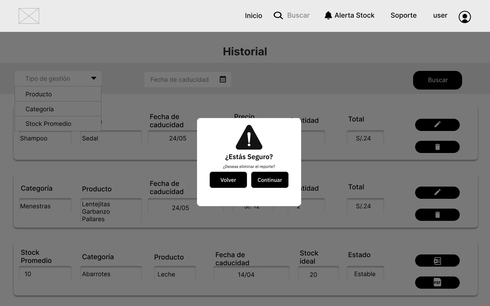

# <center>COURSE PROJECT</center>

<p align="center">
    <strong>Universidad Peruana de Ciencias Aplicadas</strong><br>
    </img><br>
    <strong>Ingeniería de Software - 2025-1</strong><br>
    <strong>Aplicaciones Web - 4366</strong><br>
    <strong>Profesor: Alex Humberto Sánchez Ponce</strong><br>
    <br><strong>Informe del Trabajo Final</strong>
</p>

</p>

<p align="center">
    <strong>Startup: AyniTech</strong><br>
    <strong>Producto:  </strong>
</p>

<div style="text-align:center;">
    <h3>Team Members:</h3>
    <table align="center">
        <tr>
            <th style="text-align:center;">Member</th>
            <th style="text-align:center;">Code</th>
        </tr>
        <tr>
            <td>Jocelyn Damaly Almerco Rojas</td>
            <td>U20221g068</td>
        </tr>
        <tr>
            <td>Sanchez Rios, Camila Cristina</td>
            <td>U202210973</td>
        </tr>
        <tr>
            <td>Henry Kalet Esteban Roman</td>
            <td>U202310210</td>
        </tr>
        <tr>
            <td>Maria Fernanda Peña Riofrio</td>
            <td>U202113279</td>
        </tr>
        <tr>
            <td>Fabiola Del Rocio Saldaña Ayala</td>
            <td>U202313773</td>
        </tr>
    </table>
</div>

<p align="center">
    <strong>Abril, 2025</strong>
</p>
<br>

<h1 align="center">Registro de versiones del Informe</h1>
</br>
<table>
        <thead>
            <tr>
                <th>Versión</th>
                <th>Fecha</th>
                <th>Autor</th>
                <th>Descripción de modificaciones</th>
            </tr>
        </thead>
        <tbody>
            <tr>
                <th>TB1</th>
                <td>07/04/2025</td>
                <td>
                    <ul>
          <li>..</li>
          <li>Camila Sanchez</li>
          <li>..</li>
          <li>..</li>
                    <ul>
           </td>
      <td>            
             <ul>
          <li>Capítulo I: Introducción</li>
          <li>Capítulo II: Requirements Elicitation & Analysis</li>
          <li>Capítulo III: Requirements Specification</li>
          <li>Capítulo IV: Product Design</li>
          <li>Avance del Capítulo V: Product Implementation, Validation & Deployment hasta el punto 5.2.1.8</li>
          <li>Avance de Conclusiones, Bibliografía y Anexos</li>
        </ul>
      </td>
  </tr>
</tbody>
</table>

# Project Report Collaboration Insights
[Link de repositorio del reporte:](https://github.com/upc-pre-202510-1asi0730-4366-AyniTech/Report): https://github.com/upc-pre-202510-1asi0730-4366-AyniTech/Report

# Contenido
[Student Outcome](#student-outcome)

[Capítulo I: Introducción](#capítulo-i-introducción)
- [1.1. Startup Profile](#11-startup-profile)
  - [1.1.1. Descripción de la Startup](#111-descripción-de-la-startup)
  - [1.1.2. Perfiles de integrantes del equipo](#112-perfiles-de-integrantes-del-equipo)
- [1.2. Solution Profile](#12-solution-profile)
  - [1.2.1 Antecedentes y problemática](#121-antecedentes-y-problemática)
  - [1.2.2 Lean UX Process](#122-lean-ux-process)
    - [1.2.2.1. Lean UX Problem Statements](#1221-lean-ux-problem-statements)
    - [1.2.2.2. Lean UX Assumptions](#1222-lean-ux-assumptions)
    - [1.2.2.3. Lean UX Hypothesis Statements](#1223-lean-ux-hypothesis-statements)
    - [1.2.2.4. Lean UX Canvas](#1224-lean-ux-canvas)
- [1.3. Segmentos objetivo](#13-segmentos-objetivo)

[Capítulo II: Requirements Elicitation & Analysis](#capítulo-ii-requirements-elicitation--analysis)
- [COURSE PROJECT](#course-project)
- [Project Report Collaboration Insights](#project-report-collaboration-insights)
- [Contenido](#contenido)
- [Student Outcome](#student-outcome)
- [Capítulo I: Introducción](#capítulo-i-introducción)
  - [1.1. Startup Profile](#11-startup-profile)
    - [1.1.1. Descripción de la Startup](#111-descripción-de-la-startup)
    - [1.1.2. Perfiles de integrantes del equipo](#112-perfiles-de-integrantes-del-equipo)
  - [1.2. Solution Profile](#12-solution-profile)
    - [1.2.1 Antecedentes y problemática](#121-antecedentes-y-problemática)
    - [1.2.2 Lean UX Process](#122-lean-ux-process)
      - [1.2.2.1. Lean UX Problem Statements](#1221-lean-ux-problem-statements)
      - [1.2.2.2. Lean UX Assumptions](#1222-lean-ux-assumptions)
      - [1.2.2.3. Lean UX Hypothesis Statements](#1223-lean-ux-hypothesis-statements)
      - [1.2.2.4. Lean UX Canvas](#1224-lean-ux-canvas)
  - [1.3. Segmentos objetivo](#13-segmentos-objetivo)
- [Capítulo II: Requirements Elicitation \& Analysis](#capítulo-ii-requirements-elicitation--analysis)
  - [2.1. Competidores](#21-competidores)
    - [2.1.1. Análisis competitivo](#211-análisis-competitivo)
    - [2.1.2. Estrategias y tácticas frente a competidores](#212-estrategias-y-tácticas-frente-a-competidores)
  - [2.2. Entrevistas](#22-entrevistas)
    - [2.2.1. Diseño de entrevistas](#221-diseño-de-entrevistas)
    - [2.2.2. Registro de entrevistas](#222-registro-de-entrevistas)
    - [2.2.3. Análisis de entrevistas](#223-análisis-de-entrevistas)
  - [2.3. Needfinding](#23-needfinding)
    - [2.3.1. User Personas](#231-user-personas)
    - [2.3.2. User Task Matrix](#232-user-task-matrix)
    - [2.3.3. User Journey Mapping](#233-user-journey-mapping)
    - [2.3.4. Empathy Mapping](#234-empathy-mapping)
    - [2.3.5. As-is Scenario Mapping](#235-as-is-scenario-mapping)
  - [2.4. Ubiquitous Language](#24-ubiquitous-language)
- [Capítulo III: Requirements Specification](#capítulo-iii-requirements-specification)
  - [3.1. To-Be Scenario Mapping](#31-to-be-scenario-mapping)
  - [3.2. User Stories](#32-user-stories)
  - [3.3. Impact Mapping](#33-impact-mapping)
  - [3.4. Product Backlog](#34-product-backlog)
- [Capítulo IV: Product Design](#capítulo-iv-product-design)
  - [4.1. Style Guidelines](#41-style-guidelines)
    - [4.1.1. General Style Guidelines](#411-general-style-guidelines)
    - [4.1.2. Web Style Guidelines](#412-web-style-guidelines)
  - [4.2. Information Architecture](#42-information-architecture)
    - [4.2.1. Organization Systems.](#421-organization-systems)
    - [4.2.2. Labeling Systems.](#422-labeling-systems)
    - [4.2.3. SEO Tags and Meta Tags](#423-seo-tags-and-meta-tags)
    - [4.2.4. Searching Systems.](#424-searching-systems)
    - [4.2.5. Navigation Systems.](#425-navigation-systems)
  - [4.3. Landing Page UI Design.](#43-landing-page-ui-design)
    - [4.3.1. Landing Page Wireframe.](#431-landing-page-wireframe)
    - [4.3.2. Landing Page Mock-up.](#432-landing-page-mock-up)
  - [4.4. Web Applications UX/UI Design.](#44-web-applications-uxui-design)
    - [4.4.1. Web Applications Wireframes.](#441-web-applications-wireframes)
    - [4.4.2. Web Applications Wireflow Diagrams.](#442-web-applications-wireflow-diagrams)
    - [4.4.2. Web Applications Mock-ups.](#442-web-applications-mock-ups)
    - [4.4.3. Web Applications User Flow Diagrams.](#443-web-applications-user-flow-diagrams)
  - [4.5. Web Applications Prototyping.](#45-web-applications-prototyping)
  - [4.6. Domain-Driven Software Architecture.](#46-domain-driven-software-architecture)
    - [4.6.1. Software Architecture Context Diagram.](#461-software-architecture-context-diagram)
    - [4.6.2. Software Architecture Container Diagrams.](#462-software-architecture-container-diagrams)
    - [4.6.3. Software Architecture Components Diagrams.](#463-software-architecture-components-diagrams)
  - [4.7. Software Object-Oriented Design.](#47-software-object-oriented-design)
    - [4.7.1. Class Diagrams.](#471-class-diagrams)
    - [4.7.2. Class Dictionary.](#472-class-dictionary)
  - [4.8. Database Design.](#48-database-design)
    - [4.8.1. Database Diagram.](#481-database-diagram)
- [Capítulo V: Product Implementation, Validation \& Deployment](#capítulo-v-product-implementation-validation--deployment)
  - [5.1. Software Configuration Management.](#51-software-configuration-management)
    - [5.1.1. Software Development Environment Configuration.](#511-software-development-environment-configuration)
    - [5.1.2. Source Code Management.](#512-source-code-management)
    - [5.1.3. Source Code Style Guide \& Conventions.](#513-source-code-style-guide--conventions)
    - [5.1.4. Software Deployment Configuration.](#514-software-deployment-configuration)
  - [5.2. Landing Page, Services \& Applications Implementation](#52-landing-page-services--applications-implementation)
    - [5.2.1. Sprint 1](#521-sprint-1)
      - [5.2.1.1. Sprint Planning 1](#5211-sprint-planning-1)
      - [5.2.1.2. Aspect Leaders and Collaborators.](#5212-aspect-leaders-and-collaborators)
      - [5.2.1.3. Sprint Backlog n.](#5213-sprint-backlog-n)
      - [5.2.1.4. Development Evidence for Sprint Review.](#5214-development-evidence-for-sprint-review)
      - [5.2.1.5. Execution Evidence for Sprint Review.](#5215-execution-evidence-for-sprint-review)
      - [5.2.1.6. Services Documentation Evidence for Sprint Review.](#5216-services-documentation-evidence-for-sprint-review)
      - [5.2.1.7. Software Deployment Evidence for Sprint Review.](#5217-software-deployment-evidence-for-sprint-review)
      - [5.2.1.8. Team Collaboration Insights during Sprint.](#5218-team-collaboration-insights-during-sprint)
  - [5.3. Validation Interviews.](#53-validation-interviews)
    - [5.3.1. Diseño de Entrevistas.](#531-diseño-de-entrevistas)
    - [5.3.2. Registro de Entrevistas.](#532-registro-de-entrevistas)
    - [5.3.3. Evaluaciones según heurísticas.](#533-evaluaciones-según-heurísticas)
  - [5.4. Video About-the-Product.](#54-video-about-the-product)
- [Conclusiones](#conclusiones)
  - [Conclusiones y recomendaciones.](#conclusiones-y-recomendaciones)
- [Video About-the-Team.](#video-about-the-team)
- [Bibliografía](#bibliografía)
- [Anexos](#anexos)

[Capítulo III: Requirements Specification](#capítulo-iii-requirements-specification)
- [3.1. To-Be Scenario Mapping](#31-to-be-scenario-mapping)
- [3.2. User Stories](#32-user-stories)
- [3.3. Impact Mapping](#33-impact-mapping)
- [3.4. Product Backlog](#34-product-backlog)

[Capítulo IV: Product Design](#capítulo-iv-product-design)
- [COURSE PROJECT](#course-project)
- [Project Report Collaboration Insights](#project-report-collaboration-insights)
- [Contenido](#contenido)
- [Student Outcome](#student-outcome)
- [Capítulo I: Introducción](#capítulo-i-introducción)
  - [1.1. Startup Profile](#11-startup-profile)
    - [1.1.1. Descripción de la Startup](#111-descripción-de-la-startup)
    - [1.1.2. Perfiles de integrantes del equipo](#112-perfiles-de-integrantes-del-equipo)
  - [1.2. Solution Profile](#12-solution-profile)
    - [1.2.1 Antecedentes y problemática](#121-antecedentes-y-problemática)
    - [1.2.2 Lean UX Process](#122-lean-ux-process)
      - [1.2.2.1. Lean UX Problem Statements](#1221-lean-ux-problem-statements)
      - [1.2.2.2. Lean UX Assumptions](#1222-lean-ux-assumptions)
      - [1.2.2.3. Lean UX Hypothesis Statements](#1223-lean-ux-hypothesis-statements)
      - [1.2.2.4. Lean UX Canvas](#1224-lean-ux-canvas)
  - [1.3. Segmentos objetivo](#13-segmentos-objetivo)
- [Capítulo II: Requirements Elicitation \& Analysis](#capítulo-ii-requirements-elicitation--analysis)
  - [2.1. Competidores](#21-competidores)
    - [2.1.1. Análisis competitivo](#211-análisis-competitivo)
    - [2.1.2. Estrategias y tácticas frente a competidores](#212-estrategias-y-tácticas-frente-a-competidores)
  - [2.2. Entrevistas](#22-entrevistas)
    - [2.2.1. Diseño de entrevistas](#221-diseño-de-entrevistas)
    - [2.2.2. Registro de entrevistas](#222-registro-de-entrevistas)
    - [2.2.3. Análisis de entrevistas](#223-análisis-de-entrevistas)
  - [2.3. Needfinding](#23-needfinding)
    - [2.3.1. User Personas](#231-user-personas)
    - [2.3.2. User Task Matrix](#232-user-task-matrix)
    - [2.3.3. User Journey Mapping](#233-user-journey-mapping)
    - [2.3.4. Empathy Mapping](#234-empathy-mapping)
    - [2.3.5. As-is Scenario Mapping](#235-as-is-scenario-mapping)
  - [2.4. Ubiquitous Language](#24-ubiquitous-language)
- [Capítulo III: Requirements Specification](#capítulo-iii-requirements-specification)
  - [3.1. To-Be Scenario Mapping](#31-to-be-scenario-mapping)
  - [3.2. User Stories](#32-user-stories)
  - [3.3. Impact Mapping](#33-impact-mapping)
  - [3.4. Product Backlog](#34-product-backlog)
- [Capítulo IV: Product Design](#capítulo-iv-product-design)
  - [4.1. Style Guidelines](#41-style-guidelines)
    - [4.1.1. General Style Guidelines](#411-general-style-guidelines)
    - [4.1.2. Web Style Guidelines](#412-web-style-guidelines)
  - [4.2. Information Architecture](#42-information-architecture)
    - [4.2.1. Organization Systems.](#421-organization-systems)
    - [4.2.2. Labeling Systems.](#422-labeling-systems)
    - [4.2.3. SEO Tags and Meta Tags](#423-seo-tags-and-meta-tags)
    - [4.2.4. Searching Systems.](#424-searching-systems)
    - [4.2.5. Navigation Systems.](#425-navigation-systems)
  - [4.3. Landing Page UI Design.](#43-landing-page-ui-design)
    - [4.3.1. Landing Page Wireframe.](#431-landing-page-wireframe)
    - [4.3.2. Landing Page Mock-up.](#432-landing-page-mock-up)
  - [4.4. Web Applications UX/UI Design.](#44-web-applications-uxui-design)
    - [4.4.1. Web Applications Wireframes.](#441-web-applications-wireframes)
    - [4.4.2. Web Applications Wireflow Diagrams.](#442-web-applications-wireflow-diagrams)
    - [4.4.2. Web Applications Mock-ups.](#442-web-applications-mock-ups)
    - [4.4.3. Web Applications User Flow Diagrams.](#443-web-applications-user-flow-diagrams)
  - [4.5. Web Applications Prototyping.](#45-web-applications-prototyping)
  - [4.6. Domain-Driven Software Architecture.](#46-domain-driven-software-architecture)
    - [4.6.1. Software Architecture Context Diagram.](#461-software-architecture-context-diagram)
    - [4.6.2. Software Architecture Container Diagrams.](#462-software-architecture-container-diagrams)
    - [4.6.3. Software Architecture Components Diagrams.](#463-software-architecture-components-diagrams)
  - [4.7. Software Object-Oriented Design.](#47-software-object-oriented-design)
    - [4.7.1. Class Diagrams.](#471-class-diagrams)
    - [4.7.2. Class Dictionary.](#472-class-dictionary)
  - [4.8. Database Design.](#48-database-design)
    - [4.8.1. Database Diagram.](#481-database-diagram)
- [Capítulo V: Product Implementation, Validation \& Deployment](#capítulo-v-product-implementation-validation--deployment)
  - [5.1. Software Configuration Management.](#51-software-configuration-management)
    - [5.1.1. Software Development Environment Configuration.](#511-software-development-environment-configuration)
    - [5.1.2. Source Code Management.](#512-source-code-management)
    - [5.1.3. Source Code Style Guide \& Conventions.](#513-source-code-style-guide--conventions)
    - [5.1.4. Software Deployment Configuration.](#514-software-deployment-configuration)
  - [5.2. Landing Page, Services \& Applications Implementation](#52-landing-page-services--applications-implementation)
    - [5.2.1. Sprint 1](#521-sprint-1)
      - [5.2.1.1. Sprint Planning 1](#5211-sprint-planning-1)
      - [5.2.1.2. Aspect Leaders and Collaborators.](#5212-aspect-leaders-and-collaborators)
      - [5.2.1.3. Sprint Backlog n.](#5213-sprint-backlog-n)
      - [5.2.1.4. Development Evidence for Sprint Review.](#5214-development-evidence-for-sprint-review)
      - [5.2.1.5. Execution Evidence for Sprint Review.](#5215-execution-evidence-for-sprint-review)
      - [5.2.1.6. Services Documentation Evidence for Sprint Review.](#5216-services-documentation-evidence-for-sprint-review)
      - [5.2.1.7. Software Deployment Evidence for Sprint Review.](#5217-software-deployment-evidence-for-sprint-review)
      - [5.2.1.8. Team Collaboration Insights during Sprint.](#5218-team-collaboration-insights-during-sprint)
  - [5.3. Validation Interviews.](#53-validation-interviews)
    - [5.3.1. Diseño de Entrevistas.](#531-diseño-de-entrevistas)
    - [5.3.2. Registro de Entrevistas.](#532-registro-de-entrevistas)
    - [5.3.3. Evaluaciones según heurísticas.](#533-evaluaciones-según-heurísticas)
  - [5.4. Video About-the-Product.](#54-video-about-the-product)
- [Conclusiones](#conclusiones)
  - [Conclusiones y recomendaciones.](#conclusiones-y-recomendaciones)
- [Video About-the-Team.](#video-about-the-team)
- [Bibliografía](#bibliografía)
- [Anexos](#anexos)

[Capítulo V: Product Implementation, Validation & Deployment](#capítulo-v-product-implementation-validation--deployment)
- [COURSE PROJECT](#course-project)
- [Project Report Collaboration Insights](#project-report-collaboration-insights)
- [Contenido](#contenido)
- [Student Outcome](#student-outcome)
- [Capítulo I: Introducción](#capítulo-i-introducción)
  - [1.1. Startup Profile](#11-startup-profile)
    - [1.1.1. Descripción de la Startup](#111-descripción-de-la-startup)
    - [1.1.2. Perfiles de integrantes del equipo](#112-perfiles-de-integrantes-del-equipo)
  - [1.2. Solution Profile](#12-solution-profile)
    - [1.2.1 Antecedentes y problemática](#121-antecedentes-y-problemática)
    - [1.2.2 Lean UX Process](#122-lean-ux-process)
      - [1.2.2.1. Lean UX Problem Statements](#1221-lean-ux-problem-statements)
      - [1.2.2.2. Lean UX Assumptions](#1222-lean-ux-assumptions)
      - [1.2.2.3. Lean UX Hypothesis Statements](#1223-lean-ux-hypothesis-statements)
      - [1.2.2.4. Lean UX Canvas](#1224-lean-ux-canvas)
  - [1.3. Segmentos objetivo](#13-segmentos-objetivo)
- [Capítulo II: Requirements Elicitation \& Analysis](#capítulo-ii-requirements-elicitation--analysis)
  - [2.1. Competidores](#21-competidores)
    - [2.1.1. Análisis competitivo](#211-análisis-competitivo)
    - [2.1.2. Estrategias y tácticas frente a competidores](#212-estrategias-y-tácticas-frente-a-competidores)
  - [2.2. Entrevistas](#22-entrevistas)
    - [2.2.1. Diseño de entrevistas](#221-diseño-de-entrevistas)
    - [2.2.2. Registro de entrevistas](#222-registro-de-entrevistas)
    - [2.2.3. Análisis de entrevistas](#223-análisis-de-entrevistas)
  - [2.3. Needfinding](#23-needfinding)
    - [2.3.1. User Personas](#231-user-personas)
    - [2.3.2. User Task Matrix](#232-user-task-matrix)
    - [2.3.3. User Journey Mapping](#233-user-journey-mapping)
    - [2.3.4. Empathy Mapping](#234-empathy-mapping)
    - [2.3.5. As-is Scenario Mapping](#235-as-is-scenario-mapping)
  - [2.4. Ubiquitous Language](#24-ubiquitous-language)
- [Capítulo III: Requirements Specification](#capítulo-iii-requirements-specification)
  - [3.1. To-Be Scenario Mapping](#31-to-be-scenario-mapping)
  - [3.2. User Stories](#32-user-stories)
  - [3.3. Impact Mapping](#33-impact-mapping)
  - [3.4. Product Backlog](#34-product-backlog)
- [Capítulo IV: Product Design](#capítulo-iv-product-design)
  - [4.1. Style Guidelines](#41-style-guidelines)
    - [4.1.1. General Style Guidelines](#411-general-style-guidelines)
    - [4.1.2. Web Style Guidelines](#412-web-style-guidelines)
  - [4.2. Information Architecture](#42-information-architecture)
    - [4.2.1. Organization Systems.](#421-organization-systems)
    - [4.2.2. Labeling Systems.](#422-labeling-systems)
    - [4.2.3. SEO Tags and Meta Tags](#423-seo-tags-and-meta-tags)
    - [4.2.4. Searching Systems.](#424-searching-systems)
    - [4.2.5. Navigation Systems.](#425-navigation-systems)
  - [4.3. Landing Page UI Design.](#43-landing-page-ui-design)
    - [4.3.1. Landing Page Wireframe.](#431-landing-page-wireframe)
    - [4.3.2. Landing Page Mock-up.](#432-landing-page-mock-up)
  - [4.4. Web Applications UX/UI Design.](#44-web-applications-uxui-design)
    - [4.4.1. Web Applications Wireframes.](#441-web-applications-wireframes)
    - [4.4.2. Web Applications Wireflow Diagrams.](#442-web-applications-wireflow-diagrams)
    - [4.4.2. Web Applications Mock-ups.](#442-web-applications-mock-ups)
    - [4.4.3. Web Applications User Flow Diagrams.](#443-web-applications-user-flow-diagrams)
  - [4.5. Web Applications Prototyping.](#45-web-applications-prototyping)
  - [4.6. Domain-Driven Software Architecture.](#46-domain-driven-software-architecture)
    - [4.6.1. Software Architecture Context Diagram.](#461-software-architecture-context-diagram)
    - [4.6.2. Software Architecture Container Diagrams.](#462-software-architecture-container-diagrams)
    - [4.6.3. Software Architecture Components Diagrams.](#463-software-architecture-components-diagrams)
  - [4.7. Software Object-Oriented Design.](#47-software-object-oriented-design)
    - [4.7.1. Class Diagrams.](#471-class-diagrams)
    - [4.7.2. Class Dictionary.](#472-class-dictionary)
  - [4.8. Database Design.](#48-database-design)
    - [4.8.1. Database Diagram.](#481-database-diagram)
- [Capítulo V: Product Implementation, Validation \& Deployment](#capítulo-v-product-implementation-validation--deployment)
  - [5.1. Software Configuration Management.](#51-software-configuration-management)
    - [5.1.1. Software Development Environment Configuration.](#511-software-development-environment-configuration)
    - [5.1.2. Source Code Management.](#512-source-code-management)
    - [5.1.3. Source Code Style Guide \& Conventions.](#513-source-code-style-guide--conventions)
    - [5.1.4. Software Deployment Configuration.](#514-software-deployment-configuration)
  - [5.2. Landing Page, Services \& Applications Implementation](#52-landing-page-services--applications-implementation)
    - [5.2.1. Sprint 1](#521-sprint-1)
      - [5.2.1.1. Sprint Planning 1](#5211-sprint-planning-1)
      - [5.2.1.2. Aspect Leaders and Collaborators.](#5212-aspect-leaders-and-collaborators)
      - [5.2.1.3. Sprint Backlog n.](#5213-sprint-backlog-n)
      - [5.2.1.4. Development Evidence for Sprint Review.](#5214-development-evidence-for-sprint-review)
      - [5.2.1.5. Execution Evidence for Sprint Review.](#5215-execution-evidence-for-sprint-review)
      - [5.2.1.6. Services Documentation Evidence for Sprint Review.](#5216-services-documentation-evidence-for-sprint-review)
      - [5.2.1.7. Software Deployment Evidence for Sprint Review.](#5217-software-deployment-evidence-for-sprint-review)
      - [5.2.1.8. Team Collaboration Insights during Sprint.](#5218-team-collaboration-insights-during-sprint)
  - [5.3. Validation Interviews.](#53-validation-interviews)
    - [5.3.1. Diseño de Entrevistas.](#531-diseño-de-entrevistas)
    - [5.3.2. Registro de Entrevistas.](#532-registro-de-entrevistas)
    - [5.3.3. Evaluaciones según heurísticas.](#533-evaluaciones-según-heurísticas)
  - [5.4. Video About-the-Product.](#54-video-about-the-product)
- [Conclusiones](#conclusiones)
  - [Conclusiones y recomendaciones.](#conclusiones-y-recomendaciones)
- [Video About-the-Team.](#video-about-the-team)
- [Bibliografía](#bibliografía)
- [Anexos](#anexos)

[Conclusiones](#conclusiones)
- [Conclusiones y recomendaciones](#conclusiones-y-recomendaciones)
- [Video About-the-Team](#video-about-the-team)

[Bibliografía](#bibliografía)

[Anexos](#anexos)

# Student Outcome

ABET – EAC - Student Outcome 5

Criterio: La capacidad de funcionar efectivamente en un equipo cuyos miembros juntos proporcionan liderazgo, crean un entorno de colaboración e inclusivo, establecen objetivos, planifican tareas y cumplen objetivos.

<table>
  <tr>
    <td><b>Criterio específico</b></td>
    <td><b>Acciones realizadas</b></td>
    <td><b>Conclusiones</b></td>
  </tr>
    </thead>
  <tbody>
    <tr>
      <td><b>Comunica oralmente con
efectividad a diferentes rangos
de audiencia.</b></td>
      <td>
        <p><b>name  </b></p>
        <p><b>TB1:</b></p>
        <p>..</p>
        <p><b>TP1:</b></p>
        <p>,..</p>
        <p><b>TB2:</b></p>
        <p>.</p>
        <p><b>TF:</b></p>
        <p>.</p>
        <p><b>name</b></p>
       <p><b>TB1:</b></p>
        <p></p>
        <p><b>TP1:</b></p>
        <p></p>
        <p><b>TB2:</b></p>
        <p></p>
        <p><b>TF:</b></p>
        <p>.</p>
        <p><b>name</b></p>
        <p><b>TB1:</b></p>
        <p>     
        </p>
        <p><b>TP1:</b></p>
        <p>.</p>
        <p><b>TB2:</b></p>
        <p></p>
        <p><b>TF:</b></p>
        <p>.</p>
        <p><b></b></p>
       <p><b>TB1:</b></p>
        <p></p>
        <p><b>TP1:</b></p>
        <p></p>
        <p><b>TB2:</b></p>
        <p></p>
        <p><b>TF:</b></p>
        <p></p>
      </td>
      <td>
        <p><strong>TB1:</strong></p>
        <p></p>
        <p><strong>TP1:</strong></p>
        <p>.</p>
        <p><strong>TB2:</strong></p>
        <p></p>
        <p><strong>TF:</strong></p>
        <p></p>
      </td>
    </tr>
    <tr>
      <td>Comunica por escrito con
efectividad a diferentes rangos
de audiencia.</td>
      <td>
        <p><b>name  </b></p>
        <p><b>TB1:</b></p>
        <p>..</p>
        <p><b>TP1:</b></p>
        <p>..</p>
        <p><b>TB2:</b></p>
        <p>..</p>
        <p><b>TF:</b></p>
        <p>..</p>
        <p><b>name</b></p>
       <p><b>TB1:</b></p>
        <p>..</p>
        <p><b>TP1:</b></p>
        <p>..</p>
        <p><b>TB2:</b></p>
        <p>...</p>
        <p><b>TF:</b></p>
        <p>.</p>
        <p><b>name</b></p>
        <p><b>TB1:</b></p>
        <p>..
        </p>
        <p><b>TP1:</b></p>
        <p>..</p>
        <p><b>TB2:</b></p>
        <p>...</p>
        <p><b>TF:</b></p>
        <p>.</p>
        <p><b>name</b></p>
       <p><b>TB1:</b></p>
        <p>...</p>
        <p><b>TP1:</b></p>
        <p>...</p>
        <p><b>TB2:</b></p>
        <p>...</p>
        <p><b>TF:</b></p>
        <p>...</p>
      </td>
       <td>
        <p><strong>TB1:</strong></p>
        <p>..</p>
        <p><strong>TP1:</strong></p>
        <p>...</p>
        <p><strong>TB2:</strong></p>
        <p>..</p>
        <p><strong>TF:</strong></p>
        <p>...</p>
      </td>
    </tr>
  </tbody>
</table>

# Capítulo I: Introducción
## 1.1. Startup Profile
### 1.1.1. Descripción de la Startup
### 1.1.2. Perfiles de integrantes del equipo

## 1.2. Solution Profile
### 1.2.1 Antecedentes y problemática
### 1.2.2 Lean UX Process
#### 1.2.2.1. Lean UX Problem Statements
#### 1.2.2.2. Lean UX Assumptions
#### 1.2.2.3. Lean UX Hypothesis Statements
#### 1.2.2.4. Lean UX Canvas
## 1.3. Segmentos objetivo

# Capítulo II: Requirements Elicitation & Analysis

## 2.1. Competidores
### 2.1.1. Análisis competitivo
### 2.1.2. Estrategias y tácticas frente a competidores
## 2.2. Entrevistas
### 2.2.1. Diseño de entrevistas
### 2.2.2. Registro de entrevistas 
### 2.2.3. Análisis de entrevistas
## 2.3. Needfinding
### 2.3.1. User Personas
### 2.3.2. User Task Matrix
### 2.3.3. User Journey Mapping
### 2.3.4. Empathy Mapping
### 2.3.5. As-is Scenario Mapping
## 2.4. Ubiquitous Language

# Capítulo III: Requirements Specification

## 3.1. To-Be Scenario Mapping
## 3.2. User Stories
## 3.3. Impact Mapping
## 3.4. Product Backlog

# Capítulo IV: Product Design

## 4.1. Style Guidelines
Un "style guideline" o guía de estilo es un conjunto de reglas y pautas que establecen la forma en que se deben escribir, diseñar o presentar documentos, contenido web, software, o cualquier otro tipo de trabajo creativo. A continuación, se otorga especificación a los parámetros implementados en la estructura del proyecto:

### 4.1.1. General Style Guidelines

**Branding**

StockWise es una marca pensada para ofrecer confianza, cercanía y eficiencia a pequeñas y medianas empresas, especialmente bodegas de barrio y emprendimientos. El branding refleja accesibilidad, modernidad y calidez. El enfoque está en facilitar la transformación digital de la gestión de inventarios con una interfaz clara, amigable y funcional.

**Logotipo**

El logo combina una bodega estilizada con colores cálidos y un código de barras, representando tanto la esencia física del negocio como la modernización a través de tecnología.

- La palabra "Stock" en rojo (#BC162A) resalta la acción y lo esencial del inventario.
- La palabra "Wise" en marrón oscuro (#302325) sugiere inteligencia y fiabilidad.

El código de barras integrado representa la gestión estructurada y la automatización del stock.

<center>  </center>
<br>

**Tono de comunicación** 

Nos comunicamos como lo haría un buen amigo del barrio, claro, sin complicaciones, y con buena onda.  Queremos transmitir una sensación de seguridad y eficiencia, mientras mantenemos una comunicación cercana y amigable.

**Lenguaje (Language):**

Usamos términos fáciles de entender: “productos”, “alertas”, “entradas/salidas”, “usuarios”. Evitamos jerga técnica innecesaria o anglicismos si no son esenciales.

**Colores**

La paleta de colores de StockWise ha sido cuidadosamente seleccionada para transmitir profesionalismo, confianza y accesibilidad.

- #F5E1A4 (Fondo cálido claro): 	Fondo general de la app o materiales 
- #BC162A (Rojo intenso): Este tono vibrante servirá para destacar llamadas a la acción (CTA), botones y elementos interactivos. Representa dinamismo y urgencia, incentivando a los usuarios a actuar.
- #EE7F27 (Naranja vibrante): íconos o llamados a la acción secundarios
- #302325 (Marrón oscuro / gris cálido): texto general, íconos y texto principal
- #D9D593 (Gris suave): Elementos secundarios, bordes, fondos suaves

<center>  </center>
<br>

**Tipografía**

La elección tipográfica para StockWise es un componente esencial que complementa la identidad visual de la marca. Se han seleccionado dos familias tipográficas que juntas ofrecen versatilidad y coherencia, asegurando que la comunicación sea clara y efectiva en todos los medios.

Escala:

- Base: 16px
- Tipografía: Nunito e Inter 
- Interlineado: 1.1
- Weights: Bold - Medium - Regular - Light

<center>  </center>
<br>

### 4.1.2. Web Style Guidelines

La guía de estilo de un sitio web es un documento detallado que se basa en el diseño y la marca del sitio. Su propósito es crear una guía de estilo mucho más completa que abarca el uso de elementos en varios contextos, incluyendo medios impresos y otros medios. Es importante destacar que un sistema de diseño no siempre equivale a una guía de estilo.

**Footers y Headers**

- Header limpio y fijo, con fondo color #F5E1A4 o blanco. Incluye logo a la izquierda, navegación principal al centro/derecha, botón de login o “Empezar” en rojo #BC162A.

- Footer informativo, con fondo #302325 y texto claro en blanco o gris suave.

   - Secciones: Información de la empresa, enlaces rápidos, redes sociales (íconos minimalistas), soporte.
   - Tipografía en Inter Regular para facilitar lectura.

**Responsividad**

La web debe estar optimizada para múltiples dispositivos, desde móviles hasta pantallas de escritorio grandes.

- Diseño mobile-first, adaptable desde 320px hasta pantallas de escritorio grandes (>1440px).
- Componentes escalables: tarjetas, inputs y botones con padding amplio y bordes redondeados

**Imágenes y Multimedia:**

Las imágenes deben ser de alta calidad y alinearse con el tono visual de TaskLinker.

- Imágenes de Cabecera
- Imágenes en Contenido

**Botones y Llamadas a la Acción (CTAs):**

Los botones deben ser claramente distinguibles y usar colores de la paleta para indicar su función.

- Botones principales:
  - Color: Rojo #BC162A (hover más oscuro)
  - Texto blanco en Nunito Bold

- Botones secundarios:
  - Fondo blanco, borde #EE7F27, texto naranja o negro
  - Redondeados, con sombra suave para dar profundidad

- CTAs visibles en las páginas clave: "Agregar Producto", "Ver Reporte", "Crear Alerta".

**Encabezados y Jerarquía de Contenido:**

Mantén una jerarquía clara para los diferentes niveles de encabezados (H1, H2, H3) para guiar al usuario a través del contenido.

- H1 – Nunito ExtraBold 36–48px – Titulares principales (ej. "Gestión inteligente para tu inventario")
- H2 – Nunito Bold 28–36px – Subtítulos o secciones
- H3 – Inter SemiBold 20–24px – Títulos menores o cards
- Texto general – Inter Regular 16px – Lectura clara, gris oscuro o marrón (#302325)
- Labels, tablas o formularios – Inter Medium 14px

<center>  </center>
<br>

**Fuentes**

- Nunito: Branding, títulos, botones, elementos destacados
- Inter: Cuerpo de texto, formularios, menús, información secundaria

**Tono de voz & Microcopy**
- Familiar, claro, y directo
- Habla como si estuvieras ayudando a un amigo con su bodega
  - “¡Todo está bajo control!”

❌ Evitar lenguaje técnico o confuso.

✅ Preferir lenguaje humano: “producto agotado” en vez de “stock = 0”.

## 4.2. Information Architecture
La arquitectura de la información, también conocida como Information Architecture (IA), implica la organización de la información de manera clara y lógica, de modo que los usuarios puedan comprender su ubicación, lo que han descubierto, qué pueden esperar y qué está disponible a su alrededor. Esto tiene como objetivo permitir a los usuarios encontrar con facilidad lo que están buscando, y a los clientes, comprender las capacidades de la plataforma. Además, la arquitectura de la información posibilita la incorporación de nuevas funciones y la expansión del producto sin generar una estructura compleja o de difícil comprensión (Rosenfeld, Morville & Arango 2015).
### 4.2.1. Organization Systems.
La interfaz se divide en módulos bien definidos, accesibles desde un panel de navegación estructurado jerárquicamente. Estos módulos incluyen: Inicio, Home, Inventario y Configuración. Cada sección agrupa funciones específicas según su propósito, permitiendo que las tareas clave estén siempre al alcance del usuario.

Por ejemplo:

- En **Home**, los usuarios pueden crear kits o combos de productos, generar alertas por bajo stock, gestionar proveedores, revisar el historial de movimientos y acceder a estadísticas claves como los productos más vendidos o el ticket promedio.

- El módulo de **Inventario** ofrece un entorno completo para registrar nuevos productos, gestionar precios, unidades, ubicaciones físicas (estanterías), etiquetas, notas internas, devoluciones y caducidades, así como personalizar columnas para facilitar la visualización.

- En **Configuración**, se pueden gestionar los roles de usuario (Administrador o Empleado), permisos según el plan activo, y actualizar perfiles a través de un asistente guiado.

La interfaz adapta su contenido según el tipo de usuario:

- **Administradores** tienen acceso completo a la configuración del sistema y la gestión general.

- **Empleados** acceden a funciones operativas esenciales, sin comprometer la seguridad ni integridad de la información.

La disposición lógica de las herramientas, acompañada de una navegación consistente, etiquetas claras y una estructura jerárquica coherente, garantiza que tanto nuevos usuarios como operadores frecuentes puedan comprender rápidamente el flujo de trabajo y realizar sus tareas con eficiencia.

### 4.2.2. Labeling Systems.
En StockWise ha sido diseñado para mejorar la organización, búsqueda y clasificación de productos dentro del inventario, facilitando la gestión y toma de decisiones por parte de los usuarios.

| Elemento de Navegación  | Descripción     |
|----------------------------|-----------------------|
| Sistema de Etiquetas         | Permite asignar múltiples etiquetas a productos para mejorar la organización, búsqueda y clasificación dentro del inventario.                   |
| Creación de Etiquetas        | Los usuarios pueden crear nuevas etiquetas o seleccionar etiquetas ya existentes mediante autocompletado en el formulario del producto.         |
| Visualización de Etiquetas   | Las etiquetas se muestran como chips de colores junto al nombre del producto, permitiendo una identificación rápida y visual.                   |
| Filtro por Etiquetas         | En la vista de inventario se puede filtrar por una o varias etiquetas, facilitando la segmentación de productos.                              |
| Permisos por Rol             | Administradores pueden crear/editar/eliminar etiquetas globales. Empleados pueden aplicar etiquetas existentes o proponer nuevas.              |
| Sugerencia de Etiquetas      | El sistema sugiere etiquetas ya existentes mientras se escriben nuevas, para evitar duplicados y mantener consistencia.                        |
| Accesibilidad y Estilo       | Las etiquetas tienen colores accesibles y tipografía legible, respetando la paleta y el diseño UI de StockWise.                                |
| Aplicación en Reportes       | Las etiquetas también pueden utilizarse como criterio para generar reportes filtrados de productos e inventario.                               |


### 4.2.3. SEO Tags and Meta Tags

**SEO Tags**

SEO (Search Engine Optimization) Tags son elementos de HTML que ayudan a los motores de búsqueda a entender el contenido y la estructura de una página web. Estos tags influyen en cómo los motores de búsqueda indexan y clasifican tu sitio en los resultados de búsqueda. 

**Algunos ejemplos importantes de SEO Tags incluyen:**

**Title Tag:**

Es el título de la página web que aparece en la pestaña del navegador y como el título del enlace en los resultados de búsqueda. Importancia: Es crucial porque es uno de los factores más influyentes en el ranking de la página. Debe ser relevante, contener palabras clave, y tener una longitud de entre 50 y 60 caracteres. 

*Ejemplo:* 
``` html
<title>Compra Ropa de Moda Online - Tienda XYZ</title>
``` 

**Header Tags (H1, H2, H3, etc.):** 

Son etiquetas utilizadas para definir los encabezados y subencabezados dentro del contenido de la página. El H1 es el encabezado principal y es el más importante en términos de SEO. Importancia: Ayudan a organizar el contenido y permiten a los motores de búsqueda comprender la jerarquía y el tema principal de la página. 

*Ejemplo:*
```html
<h1>Las Mejores Ofertas en Ropa de Moda</h1>
```

**Alt Tags:**

Son atributos utilizados en imágenes para describir su contenido. Aunque los usuarios no pueden ver este texto directamente, los motores de búsqueda lo utilizan para entender el contenido de la imagen. Importancia: Mejoran la accesibilidad y también son importantes para el SEO, especialmente en la búsqueda de imágenes.

**Meta Tags**

Los Meta Tags son fragmentos de texto que describen el contenido de la página; no aparecen en la página misma, pero se encuentran en el código HTML de la página. Los motores de búsqueda y los navegadores utilizan estos tags para obtener información adicional sobre la página. Algunos de los Meta Tags más relevantes para SEO son:

**Meta Description Tag:**

Proporciona un resumen breve del contenido de la página. Aunque no afecta directamente al ranking de búsqueda, es importante porque aparece en los resultados de búsqueda bajo el título de la página. Importancia: Una meta descripción atractiva puede aumentar la tasa de clics (CTR) desde los motores de búsqueda. 

Originalmente, se utilizaba para listar palabras clave relevantes para la página. Sin embargo, hoy en día, la mayoría de los motores de búsqueda ya no utilizan este tag para el ranking. Importancia: Es menos relevante en la actualidad, pero puede ser utilizado por algunos motores de búsqueda secundarios. 

**Meta Robots Tag:**

Indica a los motores de búsqueda cómo deben indexar o seguir los enlaces en la página. Importancia: Se utiliza para controlar la indexación de la página. Por ejemplo, si no quieres que una página específica sea indexada, puedes usar este tag. 

*Ejemplo:*
```
 Viewport Tag
```
 Especifica cómo se ajustará la página a la pantalla del dispositivo (especialmente importante para dispositivos móviles). 
 
 Importancia: Crucial para la optimización móvil, ya que garantiza que el sitio web se visualice correctamente en dispositivos de diferentes tamaños.

### 4.2.4. Searching Systems.
Un Searching Systems, también conocido como sistema de búsqueda o motor de búsqueda, es una aplicación automática diseñada para buscar y recuperar información almacenada en una base de datos o en internet. Su principal objetivo es encontrar y mostrar resultados relevantes que coincidan con las palabras clave o términos de búsqueda ingresados por el usuario.

### 4.2.5. Navigation Systems.

## 4.3. Landing Page UI Design.
### 4.3.1. Landing Page Wireframe.
El prototipado de la landing page cuenta diversas secciones:

- Header: Incluye botones para facilitar la navegación
- Hero Section: Con un botón CTA principal, un título y una imagen.
- Sección de Beneficios / Características: mostrara un resumen de 3 beneficios que ofrece la app
- Planes / Precios: Trendra 2 planes con su referente título y lista de características y contara con un botón CTA secundario por cada plan.
- Testimonios: Consta de un título y subtítulo, así como de unos testimonios de usuarios de cada segmento, lo que aumenta la confianza en los potenciales clientes.
- Llamado a la acción final (CTA grande) : Tiene un título y subtítulo, un boton CTA grande para "Crear cuenta gratis"
- Footer: Sección que da fin a la landing page, cuenta con las redes sociales de la plataforma.

**Wireframe Desktop**
<center>  </center>
<br>

**Wireframe Mobile**

En la versión mobile el navbar se reemplaza por un menu desplegable.

<center>  </center>
<br>

### 4.3.2. Landing Page Mock-up.
El prototipado de la landing page cuenta diversas secciones:

- Header: Incluye botones para facilitar la navegación
- Hero Section: Con un botón CTA principal, un título y una imagen.
- Sección de Beneficios / Características: mostrara un resumen de 3 beneficios que ofrece la app
- Planes / Precios: Trendra 2 planes con su referente título y lista de características y contara con un botón CTA secundario por cada plan.
- Testimonios: Consta de un título y subtítulo, así como de unos testimonios de usuarios de cada segmento, lo que aumenta la confianza en los potenciales clientes.
- Llamado a la acción final (CTA grande) : Tiene un título y subtítulo, un boton CTA grande para "Crear cuenta gratis"
- Footer: Sección que da fin a la landing page, cuenta con las redes sociales de la plataforma.

**Mock-up Desktop**
<center>  </center>
<br>

**Mock-up Mobile**

En la versión mobile el navbar se reemplaza por un menu desplegable.

<center>  </center>
<br>

## 4.4. Web Applications UX/UI Design.
El diseño UX/UI para aplicaciones web se centra en crear interfaces intuitivas y experiencias de usuario fluidas que maximicen la satisfacción y eficiencia al interactuar con una plataforma. Para el diseño de los wireframes en StockWise, se aplicaron principios heurísticos de usabilidad reconocidos por Jakob Nielsen, garantizando que la experiencia del usuario sea intuitiva, eficiente y centrada en sus necesidades dentro del entorno de gestión de inventario.

1. Visibilidad del estado del sistema
Los usuarios siempre sabrán en qué parte del sistema se encuentran y qué acciones están ocurriendo, gracias a indicadores claros como barras de progreso, breadcrumbs, notificaciones de estado, y confirmaciones visuales al ejecutar tareas clave como agregar productos o generar reportes.

2. Coincidencia entre el sistema y el mundo real
La terminología, iconografía y flujo de interacción se alinean con el lenguaje y procesos habituales en la gestión de inventarios. Por ejemplo, los módulos se nombran como “Entradas”, “Salidas”, “Kardex” o “Reportes”, usando símbolos familiares y metáforas visuales reconocibles.

3. Control y libertad del usuario
StockWise permite deshacer o rehacer acciones, navegar entre módulos sin pérdida de datos, y salir de operaciones sin consecuencias no deseadas. Esto otorga al usuario flexibilidad y sensación de control durante su experiencia.

4. Consistencia y estándares
La interfaz mantiene una consistencia visual y funcional en todos los módulos. Se siguen patrones comunes de UI/UX y estándares reconocidos en sistemas de gestión, facilitando el aprendizaje y reduciendo la carga cognitiva del usuario.

5. Prevención de errores
Se han implementado validaciones en formularios, confirmaciones antes de acciones críticas (como eliminaciones), y restricciones visuales que ayudan a evitar errores frecuentes como duplicación de registros o selecciones erróneas.

6. Reconocimiento en lugar de recuerdo
Los usuarios no necesitan memorizar pasos. Menús contextuales, accesos directos visibles y formularios autocompletados permiten una interacción basada en reconocimiento.

7. Flexibilidad y eficiencia de uso
StockWise permite configurar accesos rápidos, personalizar vistas y generar reportes filtrados, adaptándose tanto a usuarios principiantes como avanzados. Esto mejora la productividad y acelera tareas repetitivas.

8. Diseño estético y minimalista
La interfaz prioriza la funcionalidad sin sacrificar el diseño. Usamos una estética limpia con jerarquía visual clara, apoyada en una paleta de colores corporativa armoniosa y tipografía legible (Nunito e Inter), evitando la sobrecarga informativa.

9. Ayuda y documentación
La plataforma incluye accesos rápidos a tutoriales, guías interactivas y secciones de ayuda contextual. Esto asegura que los usuarios siempre tengan soporte disponible, especialmente durante la adopción inicial del sistema.

### 4.4.1. Web Applications Wireframes.
Los wireframes ayudan a los diseñadores y desarrolladores a planificar la arquitectura y la funcionalidad de la aplicación, permitiendo visualizar cómo los usuarios interactuarán con ella. Son esenciales en las primeras etapas de desarrollo, ya que facilitan la comunicación de ideas, la identificación de problemas potenciales y la alineación de todos los involucrados en el proyecto antes de pasar al diseño detallado y la programación.

**Iniciar sesión**

La siguiente imagen evidencia el wireframe de la sección de “inicio de sesión” desde la vista desktop web browser. En ella, los usuarios deberán ingresar las credenciales necesarias para poder acceder a la aplicación, siempre y cuando posean con una cuenta previamente creada.

<center>  </center>
<br>

**Crear cuenta**

La siguiente imagen presenta la sección de “registro de usuario”, a través de la cual los administradores podrán remitir a la aplicación la información necesaria para crear una cuenta.

<center>  </center>
<br>

**Elegir plan de pago**

La siguiente imagen presenta la sección “Elegir plan de pago”, la cual despliega las categorías de planes disponibles en la plataforma. Los tres planes están diseñados para adaptarse a las necesidades de los administradores de tienda acorde a sus necesidades.

<center>  </center>
<br>

**Pasarela de pagos**

La siguiente imagen corresponde a la sección “Pasarela de pagos” donde los usuarios son dirigidas a un formulario para seleccionar y registrar su método de pago. Una vez que el proceso de pago es completado exitosamente, se notifica al usuario con un mensaje confirmando el vinculo de su tarjeta con la plataforma. Del mismo modo, si el usuario desea retirar su información o actualizar lo podra hacer a travéz de su perfil.

<center>  </center>
<br>

**Mi perfil**

La sección titulada “Mi perfil” solicita al usuario que complete información en dos categorías para registrar sus datos. Adicionalmente, la categoría "cambiar cuenta" ofrece la opción de permitir al usuario cambiar de cuenta a una de empleador y utilizar las herramientas de este por la plataforma. Tambien, tiene libertad de cambiar el plan si es necesario. 

*Perfil Administrador*

En este perfil, el usuario puede ver a la derecha sus herramientas correpondientes a su cuenta.
<center>  </center>
<br>

**Panel de control (Dashboard)**
Esta pantalla representa el panel de control principal del sistema StockWise. Su objetivo es proporcionar al usuario una vista general del estado del inventario y acceso rápido a funciones clave. Entre sus elementos principales se encuentran:

- **Resumen de información:**
   - **Total de Productos:** número total de ítems registrados.
   - **Fecha del Último Proveedor:** muestra la última fecha de ingreso de productos (por proveedor).
   - **Próximos a Caducar:** productos con fecha de vencimiento próxima, indicando la fecha y el stock restante.

- **Accesos rápidos:**
  - **Historial de Movimientos:** seguimiento de entradas y salidas del inventario.
  - **Inventario:** acceso directo a la lista completa de productos.

- **Botones de acción:**
  - **Agregar Productos:** para registrar nuevos productos en el sistema.
  - **Kits de Productos:** permite combinar productos individuales en un kit.
  - **Devolución de Productos:** facilita el registro de productos devueltos por proveedores o clientes.

<center>  </center>
<br>

**Combinación de Productos en Kits**

Esta sección está dedicada a la funcionalidad de crear kits de productos, una herramienta útil para negocios que venden combos o paquetes predefinidos. Las características principales incluyen:

- **Buscador de productos:** permite al usuario localizar rápidamente productos por nombre.
- **Listado de productos existentes:**
  - Muestra el nombre, precio y stock disponible de cada producto.
  - Incluye un botón de acción en cada fila para añadir productos al kit.
- **Botón “Seleccionar para kit”:** una vez seleccionados los productos deseados, el usuario puede avanzar para crear el kit final.

Esta funcionalidad mejora la gestión del stock agrupado y permite optimizar estrategias de venta, como combos promocionales o paquetes de temporada.

<center>  </center>
<br>

**Agregar Producto**

Esta pantalla permite visualizar todos los productos actualmente registrados en el inventario, con acceso rápido para editar o ver más detalles. Las funcionalidades clave incluyen:

- Tarjetas de producto con información relevante:
  - Nombre del producto (ej. Galleta).
  - Categoría/etiqueta (ej. Golosina).
  - Stock disponible.
- Botón “+ Detalle” para ver información adicional o editar.
 - Botón “+”: permite agregar un nuevo producto desde cero
 - Buscador de productos y opción de filtro por categoría o stock.

<center>  </center>
<br>

**Registro de Nuevo Producto**

Pantalla que aparece al presionar el botón “+”, diseñada para agregar un nuevo producto al sistema. Incluye los siguientes campos:

- Nombre del producto.
- Etiquetas/Categorías (por ejemplo: Golosina, Bebida).
- Precio de compra y de venta.
- Cantidad inicial del producto.
- Número de lote y fecha de caducidad.
- Notas adicionales, si se desea registrar observaciones específicas.

Una vez completado el formulario, se debe presionar "Guardar" para registrar el nuevo ítem.

<center>  </center>
<br>

**Edición Rápida de Producto**

Este modal aparece al hacer clic en “+ Detalle” sobre cualquier tarjeta de producto en la pantalla principal. Permite realizar modificaciones rápidas sobre un producto específico:

- Editar etiquetas.
- Actualizar cantidad.
- Modificar fecha de caducidad.
- Agregar notas.

Incluye botones para “Duplicar” (crear una copia rápida del producto) y “Eliminar” (quitar del sistema).

<center>  </center>
<br>

**Historial de Movimientos**

Esta vista permite al usuario consultar todos los movimientos registrados en el sistema, ya sea por producto individual, por categoría o mediante cálculo del ticket promedio.

- **Filtros disponibles:**
  - Tipo de gestión: Producto, Categoría o Stock Promedio.
  - Rango de fecha: permite buscar registros por fechas específicas.
- **Resultados organizados en tarjetas que muestran:**
  - Producto o categoría
  - Fecha del movimiento
  - Precio unitario (si aplica)
  - Cantidad gestionada
  - Total del movimiento

- **También cuenta con botones para:**
  - Editar un registro
  - Eliminar un registro (con confirmación previa).

<center>  </center>
<br>

*Confirmación de Eliminación*

Al presionar el botón de eliminar, se despliega una ventana emergente de confirmación que advierte al usuario antes de borrar un registro del historial.

<center>  </center>
<br>

**Ticket Promedio**

### 4.4.2. Web Applications Wireflow Diagrams.

### 4.4.2. Web Applications Mock-ups.
### 4.4.3. Web Applications User Flow Diagrams.
## 4.5. Web Applications Prototyping.
## 4.6. Domain-Driven Software Architecture.
### 4.6.1. Software Architecture Context Diagram.
### 4.6.2. Software Architecture Container Diagrams.
### 4.6.3. Software Architecture Components Diagrams.
## 4.7. Software Object-Oriented Design.
### 4.7.1. Class Diagrams.
### 4.7.2. Class Dictionary.

<body><h2>Clase Ubicación</h2>
<table border="1" cellspacing="0" cellpadding="8">
  <thead>
    <tr><th>Atributo</th><th>Tipo</th><th>Descripción</th></tr>
  </thead>
  <tbody>
    <tr><td>id</td><td>String</td><td>Identificador de la ubicación</td></tr>
    <tr><td>fechaIngreso</td><td>Date</td><td>Fecha en que se ubicó</td></tr>
    <tr><td>descripcion</td><td>String</td><td>Condiciones físicas del almacenamiento</td></tr>
  </tbody>
</table>

<h2>Clase Categoría</h2>
<table border="1" cellspacing="0" cellpadding="8">
  <thead>
    <tr><th>Atributo</th><th>Tipo</th><th>Descripción</th></tr>
  </thead>
  <tbody>
    <tr><td>id</td><td>String</td><td>Identificador de la categoría</td></tr>
    <tr><td>nombre</td><td>String</td><td>Nombre de la categoría</td></tr>
  </tbody>
</table>

<h2>Clase VentaProducto</h2>
<table border="1" cellspacing="0" cellpadding="8">
  <thead>
    <tr><th>Atributo</th><th>Tipo</th><th>Descripción</th></tr>
  </thead>
  <tbody>
    <tr><td>id</td><td>int</td><td>ID de la venta</td></tr>
    <tr><td>cantidad</td><td>int</td><td>Cantidad de productos vendidos</td></tr>
  </tbody>
</table>

<h2>Clase Transacción</h2>
<table border="1" cellspacing="0" cellpadding="8">
  <thead>
    <tr><th>Atributo</th><th>Tipo</th><th>Descripción</th></tr>
  </thead>
  <tbody>
    <tr><td>id</td><td>int</td><td>Identificador de la transacción</td></tr>
    <tr><td>precioTotal</td><td>double</td><td>Precio total de la transacción</td></tr>
    <tr><td>fecha</td><td>Date</td><td>Fecha de la transacción</td></tr>
    <tr><td>lista</td><td>Producto</td><td>Lista de productos incluidos</td></tr>
  </tbody>
</table>
</body>
<body><h2>Clase Producto</h2>
<table border="1" cellspacing="0" cellpadding="8">
  <thead><tr><th>Atributo</th><th>Tipo</th><th>Descripción</th></tr></thead>
  <tbody>
    <tr><td>id</td><td>String</td><td>Identificador del producto</td></tr>
    <tr><td>nombre</td><td>String</td><td>Nombre del producto</td></tr>
    <tr><td>descripcion</td><td>String</td><td>Descripción del producto</td></tr>
    <tr><td>precioCompra</td><td>double</td><td>Precio de compra del producto</td></tr>
    <tr><td>precioVenta</td><td>double</td><td>Precio de venta del producto</td></tr>
    <tr><td>notasInternas</td><td>String</td><td>Comentarios internos</td></tr>
  </tbody>
</table>

<h2>Clase StockProducto</h2>
<table border="1" cellspacing="0" cellpadding="8">
  <thead><tr><th>Atributo</th><th>Tipo</th><th>Descripción</th></tr></thead>
  <tbody>
    <tr><td>stockMinimo</td><td>int</td><td>Cantidad mínima permitida</td></tr>
    <tr><td>stockActual</td><td>int</td><td>Cantidad actual disponible</td></tr>
  </tbody>
</table>

<h2>Clase Kit</h2>
<table border="1" cellspacing="0" cellpadding="8">
  <thead><tr><th>Atributo</th><th>Tipo</th><th>Descripción</th></tr></thead>
  <tbody>
    <tr><td>id</td><td>int</td><td>Identificador del kit</td></tr>
    <tr><td>nombre</td><td>String</td><td>Nombre del kit</td></tr>
    <tr><td>items</td><td>list</td><td>Lista de productos incluidos</td></tr>
  </tbody>
</table>

<h2>Clase KitItem</h2>
<table border="1" cellspacing="0" cellpadding="8">
  <thead><tr><th>Atributo</th><th>Tipo</th><th>Descripción</th></tr></thead>
  <tbody>
    <tr><td>id</td><td>int</td><td>Identificador del ítem del kit</td></tr>
    <tr><td>cantidad</td><td>int</td><td>Cantidad del producto en el kit</td></tr>
    <tr><td>producto</td><td>Producto</td><td>Producto incluido</td></tr>
  </tbody>
</table>

<h2>Clase Movimiento</h2>
<table border="1" cellspacing="0" cellpadding="8">
  <thead><tr><th>Atributo</th><th>Tipo</th><th>Descripción</th></tr></thead>
  <tbody>
    <tr><td>id</td><td>int</td><td>Identificador del movimiento</td></tr>
    <tr><td>fechaIngreso</td><td>date</td><td>Fecha del movimiento</td></tr>
    <tr><td>descripcion</td><td>String</td><td>Descripción del movimiento</td></tr>
    <tr><td>direccion</td><td>String</td><td>Dirección (entrada/salida)</td></tr>
  </tbody>
</table>

<h2>Clase Usuario</h2>
<table border="1" cellspacing="0" cellpadding="8">
  <thead><tr><th>Atributo</th><th>Tipo</th><th>Descripción</th></tr></thead>
  <tbody>
    <tr><td>id</td><td>int</td><td>ID del usuario</td></tr>
    <tr><td>nombre</td><td>String</td><td>Nombre del usuario</td></tr>
    <tr><td>correo</td><td>String</td><td>Correo electrónico</td></tr>
    <tr><td>rol</td><td>String</td><td>Rol del usuario</td></tr>
    <tr><td>contraseña</td><td>String</td><td>Contraseña del usuario</td></tr>
  </tbody>
</table>

<h2>Clase Rol</h2>
<table border="1" cellspacing="0" cellpadding="8">
  <thead><tr><th>Atributo</th><th>Tipo</th><th>Descripción</th></tr></thead>
  <tbody>
    <tr><td>id</td><td>int</td><td>ID del rol</td></tr>
    <tr><td>nombre</td><td>String</td><td>Nombre del rol</td></tr>
    <tr><td>permisos</td><td>List</td><td>Permisos asociados al rol</td></tr>
  </tbody>
</table>

<h2>Clase AlertaVencimiento</h2>
<table border="1" cellspacing="0" cellpadding="8">
  <thead><tr><th>Atributo</th><th>Tipo</th><th>Descripción</th></tr></thead>
  <tbody>
    <tr><td>id</td><td>int</td><td>Identificador de la alerta</td></tr>
    <tr><td>fecha</td><td>Date</td><td>Fecha de vencimiento del producto</td></tr>
    <tr><td>lote</td><td>Lote</td><td>Lote vinculado a la alerta</td></tr>
  </tbody>
</table>
<h2>Clase AlertaStock</h2>
<table border="1" cellspacing="0" cellpadding="8">
  <thead>
    <tr>
      <th>Atributo</th>
      <th>Tipo</th>
      <th>Descripción</th>
    </tr>
  </thead>
  <tbody>
    <tr><td>id</td><td>String</td><td>Identificador de la alerta</td></tr>
    <tr><td>productId</td><td>String</td><td>ID del producto asociado</td></tr>
    <tr><td>tipoAlerta</td><td>String</td><td>Tipo de alerta (bajo stock, vencimiento, etc.)</td></tr>
    <tr><td>mensaje</td><td>String</td><td>Mensaje descriptivo de la alerta</td></tr>
  </tbody>
</table>

<h2>Clase ReporteInventario</h2>
<table border="1" cellspacing="0" cellpadding="8">
  <thead>
    <tr>
      <th>Atributo</th>
      <th>Tipo</th>
      <th>Descripción</th>
    </tr>
  </thead>
  <tbody>
    <tr><td>id</td><td>String</td><td>Identificador del reporte generado</td></tr>
    <tr><td>fechaGeneracion</td><td>String</td><td>Fecha en que se generó el reporte</td></tr>
    <tr><td>tipo</td><td>String</td><td>Tipo de reporte (completo, por fechas, filtrado)</td></tr>
  </tbody>
</table>
</body>


## 4.8. Database Design.
### 4.8.1. Database Diagram.

# Capítulo V: Product Implementation, Validation & Deployment

## 5.1. Software Configuration Management.
### 5.1.1. Software Development Environment Configuration.
### 5.1.2. Source Code Management.
### 5.1.3. Source Code Style Guide & Conventions.
### 5.1.4. Software Deployment Configuration.
## 5.2. Landing Page, Services & Applications Implementation
### 5.2.1. Sprint 1
#### 5.2.1.1. Sprint Planning 1
#### 5.2.1.2. Aspect Leaders and Collaborators.
#### 5.2.1.3. Sprint Backlog n.
#### 5.2.1.4. Development Evidence for Sprint Review.
#### 5.2.1.5. Execution Evidence for Sprint Review.
#### 5.2.1.6. Services Documentation Evidence for Sprint Review.
#### 5.2.1.7. Software Deployment Evidence for Sprint Review.
#### 5.2.1.8. Team Collaboration Insights during Sprint.
## 5.3. Validation Interviews.
### 5.3.1. Diseño de Entrevistas.
### 5.3.2. Registro de Entrevistas.
### 5.3.3. Evaluaciones según heurísticas.

## 5.4. Video About-the-Product.

# Conclusiones
## Conclusiones y recomendaciones.
# Video About-the-Team.
# Bibliografía
# Anexos